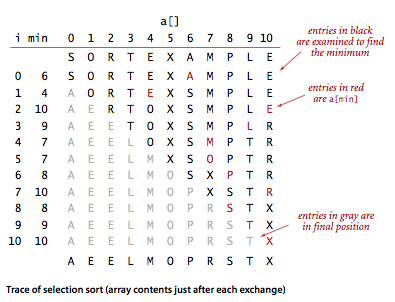

# ***初级排序算法***

- [***初级排序算法***](#初级排序算法)
  - [- 插入排序](#--插入排序)
  - [选择排序](#选择排序)
  - [插入排序](#插入排序)
----

## 选择排序

&ensp;&ensp;&ensp;&ensp;一种最简单的排序算法是这样的:首先，找到数组中最小的那个元素，其次, 将它和数组的第一个元素交换位置(如果第一个元素就是最小元素那么它就和自己交换)。再次，在剩下的元素中找到最小的元素，将它与数组的第二个元素交换位置。如此往复，直到将整个数组排序。这种方法叫做选择排序，因为它在不断地选择剩余元素之中的最小者。

> **命题A** 。对于长度为N的数组，选择排序需要大约 *$\frac{N^2}{2}$* 次比较和 *N* 次交换。
> 
> 证明。可以通过算法的排序轨迹来证明这一点。我们用一张 *N×N* 的表格来表示排序的轨迹(见算法2.1下部的表格)，其中每个非灰色字符都表示一次比较。表格中大约一半的元素不是灰色的 —— 即对角线和其上部分的元素。对角线上的每个元素都对应着一次交换。通过查看代码我们可以更精确地得到，0 到 *N-1* 的任意 i 都会进行一次交换和 *N-1-i* 次比较，因此总共有 *N* 次交换以及 *(N-1)+(N-2) +···+2+1=N(N-1)/2 ~* $\frac{N^2}{2}$次比较。

&ensp;&ensp;&ensp;&ensp;**特点：**
>1. **运行时间和输入无关。** 为了找出最小的元素而扫描一遍数组并不能为下一遍扫描提供什么信息。
>2. **数据移动是最少的。** 

```java
/**
* Rearranges the array in ascending order, using the natural order.
* @param a the array to be sorted
*/
public static void sort(Comparable[] a) {
    int n = a.length;
    for (int i = 0; i < n; i++) {
        int min = i;
        for (int j = i+1; j < n; j++) {
            if (less(a[j], a[min])) min = j;
        }
        exch(a, i, min);
    }
}
```



## 插入排序

&ensp;&ensp;&ensp;&ensp;通常人们整理桥牌的方法是一张一张的来, 将每一张牌插入到其他已经有序的牌中的适当位置。在计算机的实现中，为了给要插入的元素腾出空间，我们需要将其余所有元素在插入之前都向右移动一位。这种算法叫做插入排序，实现请见算法2.2。

&ensp;&ensp;&ensp;&ensp;与选择排序一样，当前索引左边的所有元素都是有序的，但它们的最终位置还不确定，为了给更小的元素腾出空间，它们可能会被移动。但是当索引到达数组的右端时，数组排序就完成了。和选择排序不同的是，插入排序所需的时间取决于输入中元素的初始顺序。例如，对一个很大且其中的元素已经有序(或接近有序)的数组进行排序将会比对随机顺序的数组或是逆序数组进行排序要快得多。

>**命题B** 。对于随机排列的长度为 *N* 且主键不重复的数组，平均情况下插入排序需要 ~*$\frac{N^2}{4}$* 次比较以及 ~*$\frac{N^2}{4}$* 次交换。最坏情况下需要  ~*$\frac{N^2}{2}$* 次比较和 ~*$\frac{N^2}{2}$* 次交换，最好情况下需要 *N-1* 次比较和 0 次交换。
>
>证明。和命题 A 一样，通过一个 *N×N* 的轨迹表可以很容易就得到交换和比较的次数。最坏情况下对角线之下所有的元素都需要移动位置，最好情况下都不需要。对于随机排列的数组，在平均情况下每个元素都可能向后移动半个数组的长度，因此交换总数是对角线之下的元素总数的二分之一。
>
>比较的总次数是交换的次数加上一个额外的项，该项为 *N* 减去被插入的元素正好是已知的最小元素的次数。在最坏情况下(逆序数组) ,这一项相对于总数可以忽略不计;在最好情况下(数组已经有序)，这一项等于 *N-1*。

```java
/**
* Rearranges the array in ascending order, using the natural order.
* @param a the array to be sorted
*/
public static void sort(Comparable[] a) {
    // 将a[]按照升序排列
    int n = a.length;
    for (int i = 1; i < n; i++) {
        // 将a[i]插入到 a[i-1]、a[i-2]、a[i-3]...之中
        for (int j = i; j > 0 && less(a[j], a[j-1]); j--) {
            exch(a, j, j-1);
        }
        assert isSorted(a, 0, i);
    }
    assert isSorted(a);
}

```


>**命题C** 。插入排序需要的交换操作和数组中倒置的数量相同，需要的比较次数大于等于倒置的数量，小于等于倒置的数量加上数组的大小再减一。
>
>证明。每次交换都改变了两个顺序颠倒的元素的位置，相当于减少了一对倒置，当倒置数量为 0 时，排序就完成了。每次交换都对应着一次比较，且 1 到 *N-1* 之间的每个 i 都可能需要一次额外的比较(在 `a[i]` 没有达到数组的左端时)。
>
>备注：*倒置* 指的是数组中两个顺序颠倒的元素。比如 E X A M 中存在 3 对倒置：E-A、X-A、X-M。

总的来说，插入排序对于部分有序的数组十分高效，也很适合小规模数组，事实上，当倒置的数量很少使，插入排序可能比本章其他任何算法都要快。


