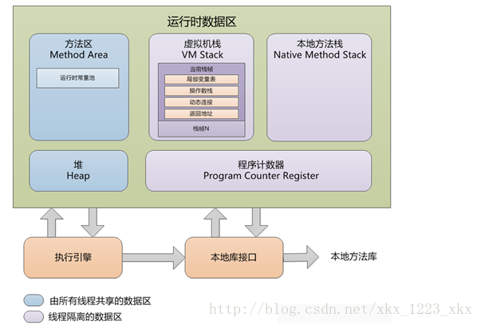
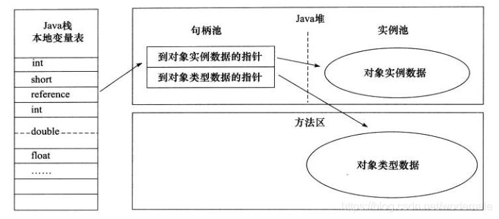
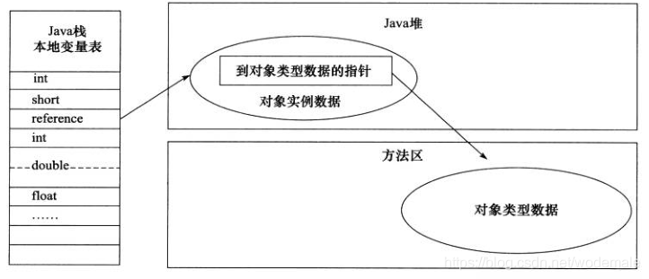

# ***Java内存区域与内存溢出异常***

## 运行时数据区域

- ## 程序计数器

**程序计数器(program counter Register)** 是一块较小的内存空间，它可以看作当是当前线程所执行的字节码的行号指示器。

字节码解释器工作时就是通过改变这个计数器的值来选取下一条需要执行的字节码指令，它是程序控制流的指示器，分支、循环、跳转、异常处理、线程恢复等基础功能都需要依赖这个计数器来完成。

每个线程都需要有一个独立的程序计数器，各条线程之间计数器互不影响，独立存储，我们称这类区域为“线程私有”的内存。

如果线程正在执行的是一个 Java 方法，这个计数器记录的是正在执行的虚拟机字节码指令的地址；如果执行的是本地(Native)方法，这个计数器值则应为空(Undefined)。

该区域是唯一一个没有 OOM(OutOfMemoryError) 情况的区域

- ## Java 虚拟机栈

**与程序计数器一样，Java 虚拟机栈(Java Virtual Machine Stack) 也是线程私有的，它的生命周期与线程相同**。

虚拟机栈描述的是 Java 方法执行的线程内存模型：每个方法被执行的时候，Java虚拟机都会同步创建一个栈帧(Stack Frame)用于存储局部变量表、操作数栈、动态链接、方法出口等信息。每一个方法被调用直至执行完毕的过程，就对应着一个栈帧在虚拟机栈中从入栈到出栈的过程。

Java 中“栈”通常就是指这里讲的虚拟机栈，或者更多的情况下只是指虚拟机栈中局部变量表部分。

局部变量表存放了编译器可知的各种 Java 虚拟机基本数据类型、对象引用(reference)和 returnAddress(字节码指令地址)类型

这些数据类型在局部变量表中的存储控件以局部变量(Slot)来表示，其中64位长度的 long 与 double 类型的数据会占用两个变量槽，其余数据类型只占用一个。

局部变量表所需的内存空间在编译期间完成分配，当进入一个方法时，这个方法需要在栈帧中分配多大的局部变量空间是完全确定的，在方法运行期间不会改变局部变量表的大小(槽的数量)。

该区域规定了两个异常   
>1. 如果线程请求的栈深度大于虚拟机所允许的深度，将抛出 StackOverflowError 异常。   
>2. 如果虚拟机容量可以动态扩展，当栈扩展时无法申请到足够的内存时会抛出 OutOfMemoryError 异常。
   
- ## 本地方法栈
  
本地方法栈(Native Memory Stacks)与虚拟机栈所发挥的作用是非常相似的，区别在于虚拟机栈为虚拟机执行 Java 方法(也就是字节码)服务，**而本地方法栈则是为了虚拟机使用的本地(Native)方法服务**。

该区域规定了两个异常:
>1. 如果线程请求的栈深度大于虚拟机所允许的深度，将抛出 StackOverflowError 异常。   
>2. 如果虚拟机容量可以动态扩展，当栈扩展时无法申请到足够的内存时会抛出 OutOfMemoryError 异常。
   
- ## Java 堆

**Java 堆(Java Heap) 是虚拟机所管理的内存中最大的一块**。Java 堆是被所有线程共享的一块内存区域，在虚拟机启动时创建。此内存区域的唯一目的就是存放内存示例，“几乎”所有的对象实例都是在这里分配内存。

Java 堆是垃圾回收器管理的内存区域，从回收内存的角度看，由于现代垃圾收集器大部分都是基于分代收集理论设计的，所以会经常出现“新生代、老年代、永久代、Eden空间、Survivor空间”

无论从什么角度，无论如何划分，都不会改变 Java 堆中存储内容的共性，无论是哪个区域，存储的都是能使对象的实例，将 Java 堆细分的目的只是为了更好的回收内存，或者更快的分配内存

- ## 方法区

**方法区(Method Area) 与 Java 堆一样，是各个线程共享的内存区域，它用于存储已被虚拟机加载的类型信息、常量、静态变量、即时编译器编译后的代码缓存等数据，别名-“非堆”**

- ## 运行时常量池

运行时常量池(Runtime Constant Pool)是方法区的一部分。

Class 文件中除了有类的版本、字段、方法、接口等描述信息，还有一项信息是常量池表(Constant Pool Table),用于存编译期生成的各种字面量与符号引用，这部分内容将在类加载后存放到方法区的运行时常量表。

不同提供商实现的虚拟机可以按照自己的需求实现这个内存区域，不过一般来讲，除了保存 Class 文件中描述的符号引用外，还会把由符号引用翻译出来的直接引用也存储在运行时常量池中。

运行时常量池相较于 Class 文件常量池的另一个重要特征是具备动态性，并非预置入 Class 文件中常量池的内容才能够进入方法区运行时常量池，运行期间也可以将新的常量放入池中。

- ## 直接内存

直接内存(Direct Memory)并不是虚拟机运行时数据区的一部分。

一般用于 NIO 中的缓冲区 Buffer,可选用 Native 函数库直接分配堆外内存。

----

## HotSpot 虚拟机对象探秘

- ## 对象的创建
- 
在语言层面，创建对象通常仅仅是一个 new 关键字而已，在 VM 遇到了一条字节码 new 指令时，首先去检查这个指令的参数是否能在常量池中定位到一个类的符号引用，并且检查这个符号引用代表的类是否已被加载、解析和初始化过，如果没有，那必须执行相对应的类加载过程。

VM 有两种分配方式：    
>1. 指针碰撞(Bump The Pointer)  
>2. 空闲列表(Free List)  
>3. 选择哪种方式由 Java 堆是否规整决定，而 Java 堆是否规整又由所采用的垃圾收集器是否带有空间压缩整理(Compant)的能力决定。
   
VM 中，创建对象是非常频繁的行为，即使仅仅修改一个指针所指向的位置，在并发情况下也并不是线程安全的，解决这个问题有两种可选方案：
>1. 对分配空间的动作进行同步处理----实际上 VM 是采用 CAS 配上失败重试的方式保证更新操作的原子性。
>2. 把内存分配的动作按照线程划分在不同的空间之中进行，既每个线程在 Java 堆中预先分配一小块内存，称为本地线程分配缓冲(Thread Local Allocation Buffer,TLAB)

内存分配完成之后，虚拟机必须将分配的内存空间(不包括对象头)都初始化为零值，如果使用 TLAB，这一项工作也可以提前到 TLAB 分配时顺便进行。接下来 VM 还需要对对象进行必要的设置，例如对象是哪个类的实例，如何寻找类的元数据，对象的哈希码，GC分代年龄等，这些信息存放在对象头中。

以上工作完成之后，在 VM 角度，一个新的对象已经诞生，但是从 Java 程序的视角来看，对象创建才刚刚开始——构造函数，即 Class 文件中的`<init>()`方法还没有执行。一般来讲(由字节码流中 new 指令后面是否跟随 invokespecial 指令所决定，Java 编译器会在遇到 new 关键字的地方同时生成这两条字节码指令，但如果直接通过其他方式产生的则不一定如此)

- ## 对象的内存布局

在 HotSpotVM 中，对象在堆内存中的储存布局可以划分为三个部分：对象头(Header)，实例数据(Instance Data)，对齐填充(Padding)。

HotSpotVM 对象的对象头部分包括两类信息:
>1. 用于存储对象自身的运行时数据，如 HashCode,GC 分代年龄，锁状态标志，线程持有的锁，偏向线程ID，偏向时间戳等，这部分称为 “Mark Word”。Mark Word 被设计称有着动态定义的数据结构，以便在极小的空间内存储尽量多的数据。
>2. 对象头的另一部分是类型指针，即对象指向它类型元数据的指针， Java 虚拟机通过这个指针来确定该对象是哪个类的实例，此外如果对象是一个 Java 数组，那么对象头中还必须有一块用于记录数组长度的数据。
>3. 第三部分是对齐填充，并不是必然存在，仅仅有着占位符的作用，HotSpot 要求对象的起始地址是8字节的整数倍，换句话说，任何对象的大小都必须是8字节的整数倍。

- ## 对象的访问定位

创建对象是为了后续使用对象，我们的 Java 程序会通过栈上的 reference 数据来操作堆上的具体数据，reference 只是一个指向对象的引用，并没有定义这个引用应该通过什么方式去定位、访问堆中对象的具体位置。

对象的访问方式由虚拟机而定，主流的访问方式主要有使用句柄和直接指针两种
>1. 句柄访问：Java 堆中将可能划分出一块内存作为句柄池，reference 中存储的就是对象的句柄地址，而句柄中包含了对象实例数据与类型数据各自具体的地址信息

>2. 直接指针访问：Java 堆中对象的内存布局就必须考虑如何放置访问类型数据的相关信息，reference 存储的直接就是对象地址，如果只是访问对象本身的话，就不需要多一次间接访问的开销

两种访问方式各有优势， 句柄访问最大好处就是 reference 中存储的是稳定句柄地址，在对象被移动的时候只会改变句柄中的实例数据指针，reference 本身不需要被修改。直接指针访问最大的好处是速度更快，节省了一次指针定位的时间开销(HotSpot 使用该种)。