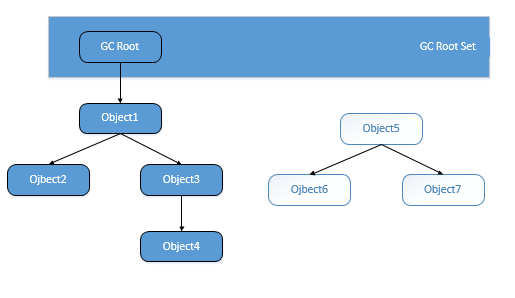
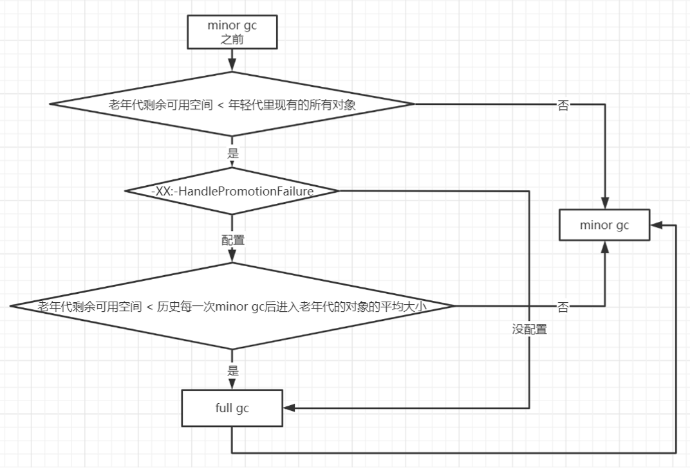
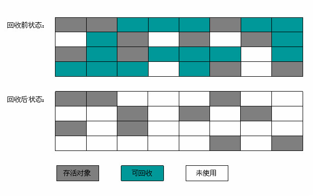

# ***垃圾收集器与内存分配策略***

- [***垃圾收集器与内存分配策略***](#垃圾收集器与内存分配策略)
  - [对象的销毁](#对象的销毁)
      - [引用计数算法](#引用计数算法)
      - [可达性分析算法](#可达性分析算法)
      - [再谈引用](#再谈引用)
      - [对象的生存与死亡](#对象的生存与死亡)
      - [回收方法区](#回收方法区)
  - [垃圾收集算法](#垃圾收集算法)
      - [分代收集理论](#分代收集理论)
        - [Minor GC 和 Full GC 的区别：](#minorgc-和-fullgc的区别)
        - [大对象直接进入老年代](#大对象直接进入老年代)
        - [长期存活的对象将进入老年代](#长期存活的对象将进入老年代)
        - [对象动态年龄判断](#对象动态年龄判断)
        - [老年代空间分配担保机制](#老年代空间分配担保机制)
      - [标记-清除算法](#标记-清除算法)
      - [标记-复制算法](#标记-复制算法)
      - [标记-整理算法](#标记-整理算法)
  - [垃圾收集器](#垃圾收集器)
      - [Serial 收集器(-XX:+UseSerialGC  -XX:+UseSerialOldGC)](#serial-收集器-xxuseserialgc-xxuseserialoldgc)
      - [Parallel Scavenge收集器(-XX:+UseParallelGC,-XX:+UseParallelOldGC)](#parallelscavenge收集器-xxuseparallelgc-xxuseparalleloldgc)
      - [ParNew 收集器(-XX:+UseParNewGC)](#parnew-收集器-xxuseparnewgc)
      - [CMS 收集器(-XX:+UseConcMarkSweepGC(Old))](#cms-收集器-xxuseconcmarksweepgcold)
  - [HotSpot 的算法细节实现](#hotspot-的算法细节实现)
      - [根节点枚举](#根节点枚举)
      - [安全点](#安全点)
      - [安全区域](#安全区域)
      - [记忆集与卡表](#记忆集与卡表)
      - [写屏障](#写屏障)
      - [并发的可达性分析](#并发的可达性分析)
----

&ensp;&ensp;&ensp;&ensp;说起 垃圾收集（Garbage Collection，GC），大部分人都把这项技术当做 Java 语言的伴生产物。事实上，GC 的历史比 Java 久远，1960 年诞生于 MIT 的 Lisp 是第一门真正使用内存动态分配和垃圾收集技术的语言。当 Lisp 还在胚胎时期时，人们就在思考 GC 需要完成的 3 件事：
- 哪些内存需要回收？
- 什么时候回收？
- 如何回收？

&ensp;&ensp;&ensp;&ensp;经过半个多世纪的发展，目前内存的动态分配与内存回收技术已经相当成熟，一切看起来都进入了 “自动化” 时代，那为什么我们还要去了解 GC 和内存分配呢？答案很简单：**当需要排查各种内存溢出、内存泄露问题时，当垃圾收集成为系统达到更高并发量的瓶颈时，我们就需要对这些 “自动化” 的技术实施必要的监控和调节**。

&ensp;&ensp;&ensp;&ensp;Java 内存运行时区域的各个部分，**其中程序计数器、虚拟机栈、本地方法栈 3 个区域随线程而生，随线程而灭**；栈中的栈帧随着方法的进入和退出而有条不紊地执行着出栈和入栈操作。每一个栈帧中分配多少内存基本上是在类结构确定下来时就已知的（尽管在运行期会由 JIT 编译器进行一些优化，但在基于概念模型的讨论中，大体上可以认为是编译期可知的），因此这几个区域的内存分配和回收都具备确定性，在这几个区域内就不需要过多考虑回收问题，因为方法结束或者线程结束时，内存自然就跟随着回收了。

&ensp;&ensp;&ensp;&ensp;而 Java 堆和方法区则不一样，**一个接口中的多个实现类需要的内存可能不一样，一个方法中的多个分支需要的内存也可能不一样，我们只有在程序处于运行期间才能知道会创建哪些对象，这部分内存的分配和回收都是动态的**。垃圾收集器所关注的是这部分内存该如何管理。


## 对象的销毁

&ensp;&ensp;&ensp;&ensp;在堆里面存放着 Java 世界中几乎所有的对象实例，垃圾收集器在对堆进行回收前，第一件事情就是要确定这些对象之中哪些还“存活”着，哪些已经“死去”（即不可能再被任何途径使用的对象）。

#### 引用计数算法

&ensp;&ensp;&ensp;&ensp;给对象中添加一个引用计数器，每当有一个地方引用它时，计数器值就加 1；当引用失效时，计数器值就减 1；任何时刻计数器为 0 的对象就是不可能再被使用的。

&ensp;&ensp;&ensp;&ensp;客观地说，引用计数算法（Reference Counting）的实现简单，判定效率也很高，在大部分情况下它都是一个不错的算法。但是，至少主流的 Java 虚拟机里面没有选用引用计数算法来管理内存，其中最主要的原因是**这个看似简单的算法很多例外情况需要考虑，必须配合大量额外处理才能保证正确地工作，譬如单纯的引用计数就很难解决对象之间相互循环引用的问题**。

```java
public class ReferenceCountingGc {  
        Object instance = null;

        public static void main(String[] args) {
                ReferenceCountingGc objA = new ReferenceCountingGc();  ReferenceCountingGc objB = new ReferenceCountingGc(); 
                objA.instance = objB;
                objB.instance = objA;
                objA = null;
                objB = null;
        } 
}
```

####  可达性分析算法

&ensp;&ensp;&ensp;&ensp;在主流的商用程序语言（Java、C#，甚至包括前面提到的古老的 Lisp）的主流实现中，都是通过 *可达性分析（Reachability Analysis）* 来判定对象是否存活的。

&ensp;&ensp;&ensp;&ensp;这个算法的基本思路就是通过一系列的称为 “GC Roots” 的根对象作为起始节点集，从这些节点开始向下搜索，根据引用关系乡下搜索，搜索过程所走过的路径称为 引用链（Reference Chain），当一个对象到 GC Roots 间没有任何引用链相连，或者用图论的话来说就是从 GC Roots 到这个对象不可达时，则证明此对象是不可能再被使用的。



&ensp;&ensp;&ensp;&ensp;在 Java 技术体系里面，可作为 GC Roots 的对象包括以下几种：

1. **虚拟机栈（栈帧中的本地变量表）中引用的对象** ,譬如各个线程被调用的方法堆栈中使用到的参数、局部变量、临时变量等。
2. **方法区中类静态属性引用的对象** ，譬如 Java 类的引用类型静态变量。
3. **方法区中常量引用的对象** ,譬如字符串常量池（String Table）里的引用。
4. **本地方法栈中 JNI（即一般说的 Native 方法）引用的对象。**
5. **Java 虚拟机内部的引用，如基本数据类型对应的 Class 对象，一些常驻的异常对象（譬如NullPointException,OutOfMemoryError）等，还有系统类加载器。**
6. **所有被同步锁（synchronzied 关键字）持有的对象。**
7. **反映 Java 虚拟机内部情况 JMXBean、JVMTI 中注册的回调，本地代码缓存等。**

#### 再谈引用

&ensp;&ensp;&ensp;&ensp;无论是通过引用计数算法判断对象的引用数量，还是通过可达性分析算法判断对象的引用链是否可达，判定对象是否存活都与 “引用” 离不开关系。

&ensp;&ensp;&ensp;&ensp;在 JDK 2 以前，Java 中的应用的定义很传统：如果 reference 类型的数据中存储的数值代表的是另外一块内存的起始地址，就称这块内存代表着一个引用。这种定义很纯粹，但是太过狭隘，一个对象在这种定义下只有被引用或者没有被引用两种状态，对于如何描述一些 “食之无味，弃之可惜” 的对象就显得无能为力。我们希望能描述这一类对象：当内存空间还足够时，则能保留在内存之中；如果内存空间在进行垃圾收集后还是非常紧张，则可以抛弃这些对象 ————  很多系统的缓存功能都符合这样的应用场景。

&ensp;&ensp;&ensp;&ensp;在 JDK 2 之后，Java 对引用的概念进行了扩充，将引用分为强引用（Strong Reference）、软引用（Soft Reference）、弱引用（Weak Reference）、虚引用（Phantom Reference）4 种，这 4 种引用强度一次逐渐减弱。

1. **强引用是最传统的 “引用” 的定义，** 指在程序代码之中普通存在的引用赋值，类似`Object obj = new Object()`这类的引用，无论任何情况下，只要强引用关系还存在，垃圾收集器永远不会回收掉被引用的对象。
2. **软引用是用来描述一些还有用但并非必需的对象。** 对于软引用关联着的对象，在系统将要发生内存溢出异常之前，将会把这些对象列进回收范围之中进行第二次回收。如果这次回收还没有足够的内存，才会抛出内存溢出异常。在 JDK 2 之后，提供了 SoftReference 类来实现软引用。
3. **弱引用也是用来描述非必需对象的。** 但是它的强度比软引用更弱一些，被弱引用关联的对象只能生存到下一次垃圾收集发生之前。当垃圾收集器工作时，无论当前内存是否足够，都会回收掉只被弱引用关联的对象。在 JDK 2 之后，提供了 WeakReference 类来实现弱引用。
4. **虚引用也称为幽灵引用或者幻影引用。** 它是最弱的一种引用关系。一个对象是否有虚引用的存在，完全不会对其生存时间构成影响，也无法通过虚引用来取得一个对象实例。**为一个对象设置虚引用管理的唯一目的就是能在这个对象被收集器回收时收到一个系统通知。** 在 JDK 2 之后，提供了 PhantomReference 类来实现虚引用。


#### 对象的生存与死亡

&ensp;&ensp;&ensp;&ensp;即使在可达性分析算法中不可达的对象，也并非是 “非死不可” 的，这时候它们暂时处于 “缓刑” 阶段，**要真正宣告一个对象死亡，至少要经历两次标记过程**：如果对象在进行可达性分析后发现没有与 GC Roots 相连接的引用链，那它将会被第一次标记并且进行一次筛选，筛选的条件是此对象是否有必要执行 `finalize()` 方法。当对象没有覆盖 `finalize()` 方法，或者 `finalize()` 方法已经被虚拟机调用过，虚拟机将这两种情况都视为 “没有必要执行” 。

&ensp;&ensp;&ensp;&ensp;如果这个对象被判定为有必要执行 `finalize()` 方法，那么这个对象将会放置在一个叫做 F-Queue 的队列之中，并在稍后由一个由虚拟机自动建立的、低优先级的 Finalizer 线程去执行它。这里所谓的 “执行” 是指虚拟机会触发这个方法，但并不承诺会等待它运行结束，这样做的原因是：如果一个对象在 `finalize()` 方法中执行缓慢，或者发生了死循环（更极端的情况），将很可能会导致 F-Queue 队列中其他对象永久处于等待，甚至导致整个内存回收系统崩溃。`finalize()` 方法是对象逃脱死亡命运的最后一次机会，稍后 GC 将对 F-Queue 中的对象进行第二次小规模的标记，如果对象要在 `finalize()` 中成功拯救自己 ———— 只要重新与引用链上的任何一个对象建立关联即可，譬如把自己（this 关键字）赋值给某个类变量或者对象的成员变量，那在第二次标记时它将被移除出 “即将回收” 的集合；如果对象这时候还没有逃脱，那基本上它就真的被回收了。

&ensp;&ensp;&ensp;&ensp;任何一个对象的 `finalize()` 方法都只会被系统自动调用一次，如果对象面临下一次回收，它的 `finalize()` 方法不会被再次执行。

#### 回收方法区

&ensp;&ensp;&ensp;&ensp;很多人认为方法区（或者 HotSpot 虚拟机中的永久代）是没有垃圾收集的，Java 虚拟机规范中确实说过可以不要求虚拟机在方法区实现垃圾收集，而且在方法区中进行垃圾收集的 “性价比” 通常也是比较低的；在堆中，尤其是在新生代中，对常规应用进行一次垃圾收集通常可以回收 70% ~ 95% 的空间，方法区回收囿于苛刻的判定条件，其区域垃圾收集的回收成果往往远低于此。

&ensp;&ensp;&ensp;&ensp;**方法区的垃圾收集主要回收两部分内容：废弃的常量和不再使用的类型**。

&ensp;&ensp;&ensp;&ensp;回收废弃常量与回收 Java 堆中的对象非常类似。以常量池中字面量的回收为例，例如一个字符串 “java” 已经进入了常量池中，但是当前系统没有任何一个 String 对象是叫 “java” 的，换句话说，就是没有任何 String 对象引用常量池中的  “java” 常量，也没有其他地方引用了这个字面量，如果这时发生内存回收，而且必要的话，这个 “java” 常量就会被系统清理出常量池。常量池中的其他类（接口）、方法、字段的符号引用也与此类似。

&ensp;&ensp;&ensp;&ensp;判定一个常量是否是 “废弃” 还是相对简单，而要判定一个类是否是 “不再被使用的类” 的条件就比较苛刻了。需要同时满足下面三个条件：
1. **该类所有的实例都已经被回收** ，也就是 Java 堆中不存在该类及其任何派生子类的实例。
2. **加载该类的 ClassLoader 已经被回收** ，这个条件除非是经过精心设计的可替换类加载器的场景，如 OSGi、JSP 的重加载等，否则通常是很难达成的。
3. **该类对应的 `java.lang.Class` 对象没有在任何地方被引用，无法在任何地方通过反射访问该类的方法。**

&ensp;&ensp;&ensp;&ensp;虚拟机可以对满足上述条件的无用类进行回收，这里说的仅仅是 “可以”，而并不是和对象一样，不使用了就必然会回收。是否对类进行回收。

&ensp;&ensp;&ensp;&ensp;在大量使用反射、动态代理、CGLib 等 ByteCode 框架、动态生成 JSP 以及 OSGI 这类频繁自定义 ClassLoader 的场景都需要虚拟机具备类卸载的能力，以保证不会对方法区造成过大的内存压力。

----

## 垃圾收集算法


&ensp;&ensp;&ensp;&ensp;从如何判定对象消亡的角度出发，垃圾收集算法可以划分为 “引用计数式垃圾收集（Reference Cointing GC）” 和 “追踪式垃圾收集（Tracing CG）” 两大类，这两类也常被称作 “直接垃圾收集” 和 “间接垃圾收集”。


#### 分代收集理论

&ensp;&ensp;&ensp;&ensp;当前商业虚拟机的垃圾收集器，大多数都遵循了 “分代收集（Generational Collection）” 的理论进行设计，分代收集名为理论，实质上是一套符合大多数程序运行实际情况的经验法则，它建立在两个分代假说之上：
1. **弱分代假说（Weak Generational Hypothesis）:** 绝大多数对象都是朝生夕灭的。
2. **强分代假说（Strong Generational Hypothesis）:** 熬过越多次垃圾收集过程的对象就越难以消亡。

&ensp;&ensp;&ensp;&ensp;这两个分代假说共同奠定了多款常用的垃圾收集器的一致的设计原则：**收集器应该将 Java 堆划分出不同的区域，然后将回收对象依据其年龄（年龄即对象熬过垃圾收集过程的次数）分配到不同的区域之中存储**。比如在新生代中，每次收集都会有大量对象(近99%)死去，所以可以选择复制算法，只需要付出少量对象的复制成本就可 以完成每次垃圾收集。而老年代的对象存活几率是比较高的，而且没有额外的空间对它进行分配担保，所以我们必须选择 “标记-清除” 或 “标记-整理” 算法进行垃圾收集。注意，“标记-清除” 或 “标记-整理” 算法会比复制算法慢10倍以上。 

&ensp;&ensp;&ensp;&ensp;分代收集并非只是简单划分一下内存区域那么容易，它至少存在一个明显的困难：**对象不是孤立的，对象之间存在跨代引用**。

3. **跨代引用假说（Intergenerational Reference Hypothesis）:** 跨代引用相对于同代引用来说仅占极少数。

&ensp;&ensp;&ensp;&ensp;这其实是可根据前两条假说逻辑推理得出的隐含推论：**存在相互引用关系的两个对象，是应该倾向于同时生存或者同时消亡的。**

&ensp;&ensp;&ensp;&ensp;依据这条假说，我们就不应在为了少量的跨代引用去扫描整个老年代，也不必浪费空间专门记录每一个对象是否存在哪些跨代引用，只需在新生代上建立一个全局的数据结构（该结构被称为 “记忆集，Remembered Set”）,这个结构把老年代划分为若干小块，标识出老年代的哪一块内存会存在跨代引用。

##### Minor GC 和 Full GC 的区别： 
- **Minor GC/Young GC：** 指发生新生代的的垃圾收集动作，Minor GC 非常频繁，回收速度一般也比较快。 
- **Major GC/Full GC：** 一般会回收老年代 ，年轻代，方法区的垃圾，Major GC 的速度一般会比 Minor GC 的慢 10 倍以上。

&ensp;&ensp;&ensp;&ensp;大多数情况下，对象在新生代中 Eden 区分配。当 Eden 区没有足够空间进行分配时，虚拟机将发起一次 Minor GC。

&ensp;&ensp;&ensp;&ensp;大量的对象被分配在 Eden 区，Eden 区满了后会触发 Minor GC，可能会有 90% 以上的对象成为垃圾被回收掉，剩余存活的对象会被挪到为空的那块 Survivor 区，下一次 Eden 区满了后又会触发 Minor GC，把 Eden 区和 Survivor 区垃圾对象回收，把剩余存活的对象一次性挪动到另外一块为空的 Survivor 区，因为新生代的对象都是朝生夕死的，存活时间很短，所以 JVM默认的 8 : 1 : 1 的比例是很合适的，**让 Eden 区尽量的大，Survivor 区够用即可** ， JVM 默认有这个参数`-XX:+UseAdaptiveSizePolicy`(默认开启)，会导致这个8:1:1比例自动变化，如果不想这个比例有变 化可以设置参数`-XX:-UseAdaptiveSizePolicy` 

```java
// 添加运行JVM参数： ‐XX:+PrintGCDetails 
public class GCTest { 
        public static void main(String[] args) throws InterruptedException { 
                byte[] allocation1, allocation2; 
                allocation1 = new byte[60000*1024];
        } 
}

output： 
        Heap 
        PSYoungGen total 76288K, used 65536K [0x000000076b400000, 0x0000000770900000, 0x00000007c0000000) 
        eden space 65536K, 100% used [0x000000076b400000,0x000000076f400000,0x000000076f400000)
        from space 10752K, 0% used [0x000000076fe80000,0x000000076fe80000,0x0000000770900000)
        to space 10752K, 0% used [0x000000076f400000,0x000000076f400000,0x000000076fe80000)
        ParOldGen total 175104K, used 0K [0x00000006c1c00000, 0x00000006cc700000, 0x000000076b400000)
        object space 175104K, 0% used [0x00000006c1c00000,0x00000006c1c00000,0x00000006cc700000)
        Metaspace used 3342K, capacity 4496K, committed 4864K, reserved 1056768K 
        class space used 361K, capacity 388K, committed 512K, reserved 1048576K

```

&ensp;&ensp;&ensp;&ensp;现在 Eden 区已经完全占满，我们继续申请内存分配：

```java
public class GCTest { 
        public static void main(String[] args) throws InterruptedException { 
                byte[] allocation1, allocation2; 
                allocation1 = new byte[60000*1024];
                allocation2 = new byte[8000*1024];
        } 
}

output： 
        [GC (Allocation Failure) [PSYoungGen: 65253K‐>936K(76288K)] 65253K‐>60944K(251392K), 0.0279083 secs] [Times: user=0.13 sys=0.02, real=0.03 secs] 
        Heap 
        PSYoungGen total 76288K, used 9591K [0x000000076b400000, 0x0000000774900000, 0x00000007c0000000)
        eden space 65536K, 13% used [0x000000076b400000,0x000000076bc73ef8,0x000000076f400000) 
        from space 10752K, 8% used [0x000000076f400000,0x000000076f4ea020,0x000000076fe80000) 
        to space 10752K, 0% used [0x0000000773e80000,0x0000000773e80000,0x0000000774900000)
        ParOldGen total 175104K, used 60008K [0x00000006c1c00000, 0x00000006cc700000, 0x000000076b400000)
        object space 175104K, 34% used [0x00000006c1c00000,0x00000006c569a010,0x00000006cc700000)
        Metaspace used 3342K, capacity 4496K, committed 4864K, reserved 1056768K 
        class space used 361K, capacity 388K, committed 512K, reserved 1048576K
```

简单解释一下为什么会出现这种情况： 因为给 allocation2 分配内存的时候 Eden 区内存几乎已经被分配完了,当 Eden 区没有足够空间进行分配时，虚拟机将发起一次 Minor GC，GC 期间虚拟机又发 现allocation1 无法存入 Survior 空间，所以只好把新生代的对象提前转移到老年代中去，老年代上的空间足够存放 allocation1，所以不会出现 Full GC。执行 Minor GC 后，后面分配的对象如果能够存在 Eden 区的话，还是会在 Eden 区分配内存。可以执行如下代码验证：

```java
public class GCTest { 
        public static void main(String[] args) throws InterruptedException { 
                byte[] allocation1, allocation2; 
                allocation1 = new byte[60000*1024];
                allocation2 = new byte[8000*1024];
                allocation3 = new byte[1000*1024]
                allocation4 = new byte[1000*1024]
                allocation5 = new byte[1000*1024]
                allocation6 = new byte[1000*1024]
        } 
}

output： 
        [GC (Allocation Failure) [PSYoungGen: 65253K‐>952K(76288K)] 65253K‐>60960K(251392K), 0.0311467 secs] [Times: user=0.08 sys=0.02, real=0.03 secs] 
        Heap 
        PSYoungGen total 76288K, used 13878K [0x000000076b400000, 0x0000000774900000, 0x00000007c0000000)
        eden space 65536K, 19% used [0x000000076b400000,0x000000076c09fb68,0x000000076f400000) 
        from space 10752K, 8% used [0x000000076f400000,0x000000076f4ee030,0x000000076fe80000) 
        to space 10752K, 0% used [0x0000000773e80000,0x0000000773e80000,0x0000000774900000)
        ParOldGen total 175104K, used 60008K [0x00000006c1c00000, 0x00000006cc700000, 0x000000076b400000)
        object space 175104K, 34% used [0x00000006c1c00000,0x00000006c569a010,0x00000006cc700000)
        Metaspace used 3343K, capacity 4496K, committed 4864K, reserved 1056768K
        class space used 361K, capacity 388K, committed 512K, reserved 1048576K
```

##### 大对象直接进入老年代

&ensp;&ensp;&ensp;&ensp;大对象就是需要大量连续内存空间的对象（比如：字符串、数组）。JVM 参数 `-XX:PretenureSizeThreshold` 可以设置大对象的大小，如果对象超过设置大小会直接进入老年代，不会进入年轻代，这个参数只在 Serial 和 ParNew 两个收集器下有效。

&ensp;&ensp;&ensp;&ensp;比如设置 JVM 参数：`-XX:PretenureSizeThreshold = 1000000` (单位是字节)  `-XX:+UseSerialGC`  ，再执行下上面的第一个程序会发现大对象直接进了老年代。这样可以避免为大对象分配内存时的复制操作而降低效率。

##### 长期存活的对象将进入老年代 

&ensp;&ensp;&ensp;&ensp;采用分代收集的思想来管理内存，那么内存回收时就必须能识别哪些对象应放在新生代，哪些对象应放在 老年代中。为了做到这一点，虚拟机给每个对象一个对象年龄（Age）计数器。 如果对象在 Eden 出生并经过第一次 Minor GC 后仍然能够存活，并且能被 Survivor 容纳的话，将被移动到 Survivor  空间中，并将对象年龄设为 1。对象在 Survivor 中每熬过一次 Minor GC，年龄就增加 1 岁，当它的年龄增加到一定程度（默认为 15 岁，CMS 收集器默认 6 岁，不同的垃圾收集器会略微有点不同），就会被晋升到老年代中。对象晋升到老年代的年龄阈值，可以通过参数 `-XX:MaxTenuringThreshold` 来设置。

##### 对象动态年龄判断 

&ensp;&ensp;&ensp;&ensp;当前放对象的 Survivor 区域里(其中一块区域，放对象的那块 s 区)，一批对象的总大小大于这块 Survivor 区域内存大小的 50% (`-XX:TargetSurvivorRatio`可以指定)，那么此时大于等于这批对象年龄最大值的对象，就可以直接进入老年代了， 例如 Survivor 区域里现在有一批对象，年龄1 + 年龄2 + 年龄n 的多个年龄对象总和超过了 Survivor 区域的50%，此时就会把 年龄n (含)以上的对象都放入老年代。这个规则其实是希望那些可能是长期存活的对象，尽早进入老年代。**对象动态年龄判断机制一般是在 Minor gc 之后触发的。**

##### 老年代空间分配担保机制 
&ensp;&ensp;&ensp;&ensp;年轻代每次 Minor GC 之前 JVM 都会计算下老年代剩余可用空间。

&ensp;&ensp;&ensp;&ensp;如果这个可用空间小于年轻代里现有的所有对象大小之和(包括垃圾对象)，就去判断`-XX:-HandlePromotionFailure`(JDK 8 默认设置)的参数是否设置了,如果有这个参数，就会看看老年代的可用内存大小，是否大于之前每一次 Minor GC 后进入老年代的对象的平均大小。 如果上一步结果是小于或者之前说的参数没有设置，那么就会触发一次 Full GC，对老年代和年轻代一起回收一次垃圾， 如果回收完还是没有足够空间存放新的对象就会发生 "OOM" 当然，如果 Minor GC 之后剩余存活的需要挪动到老年代的对象大小还是大于老年代可用空间，那么也会触发 Full GC，Full GC 完之后如果还是没有空间放 Minor GC 之后的存活对象，则也会发生 “OOM”。



#### 标记-清除算法

&ensp;&ensp;&ensp;&ensp;最早最基础的收集算法是 “标记-清除”（Mark-Sweep）算法。

&ensp;&ensp;&ensp;&ensp;如同它的名字一样，算法分为“标记”和“清除”两个阶段：首先标记出所有需要回收的对象，在标记完成后统一回收所有被标记的对象（也可以反过来）。

&ensp;&ensp;&ensp;&ensp;之所以说它是最基础的收集算法，是因为后续的收集算法都是基于这种思路并对其不足进行改进而得到的。

&ensp;&ensp;&ensp;&ensp;它的主要不足有两个：一个是**效率问题** ，标记和清除两个过程的效率都不高；另一个是**空间问题** ，标记清除之后会产生大量不连续的内存碎片，空间碎片太多可能会导致以后在程序运行过程中需要分配较大对象时，无法找到足够的连续内存而不得不提前触发另一次垃圾收集动作。




#### 标记-复制算法

&ensp;&ensp;&ensp;&ensp;标记-复制算法常被简称为 复制算法。为了解决 标记-清除算法 算法面对大量可回收对象时执行效率低的问题。一种名为 “半区复制（Semispace Copying）” 的垃圾收集算法出现了，它将可用内存按容量划分为大小相等的两块，每次只使用其中的一块。当这一块的内存用完了，就将还存活着的对象复制到另外一块上面，然后再把已使用过的内存空间一次清理掉。这样使得每次都是对整个半区的内存回收，内存分配时也就不用考虑内存碎片等复杂情况，只要移动堆顶指针，按顺序分配内存即可。

&ensp;&ensp;&ensp;&ensp;这种算法实现简单，运行高效。只是这种算法的代价是将内存缩小为了原来的一半，未免太高了一点。复制算法的执行过程如图所示。


&ensp;&ensp;&ensp;&ensp;现在的商用 Java 虚拟机都采用这种收集算法来回收新生代，IBM 公司进行专门研究对新生代 “朝生夕灭” 的特点做了更量化的诠释 ———— 新生代中的对象 98% 熬不过第一轮收集。所以并不需要按照 1 : 1  的比例来划分新生代的内存空间。Andrew Appel 针对具备 “朝生夕灭” 特点的对象，提出了一种更为优化的半区复制分代策略，现在称为 “Appel 式回收”。HotSpot 的虚拟机的 Serial 、 ParNew 等新生代收集器均采用了这种策略来设计新生代的内存布局。

&ensp;&ensp;&ensp;&ensp;Appel 式回收是将新生代内存分为一块较大的 Eden 空间和两块较小的 Survivor 空间，每次使用 Eden 和其中一块 Survivor。当回收时，将 Eden 和 Survivor 中还存活着的对象一次性地复制到另外一块 Survivor 空间上，最后清理掉 Eden 和刚才用过的 Survivor 空间。**HotSpot 虚拟机默认 Eden 和 Survivor 的大小比例是 8 : 1 : 1** ，也就是每次新生代中可用内存空间为整个新生代容量的 90%（80%+10%），只有 10% 的内存会被“浪费”。当然，98% 的对象可回收只是一般场景下的数据，我们没有办法保证每次回收都只是不多于 10% 的对象存活，当 Survivor 空间不足以容纳一次 Minor GC 之后存活的对象时，就需要依赖其他内存区域（实际上大多就是老年代）进行 **分配担保（Handle Promotion）**。 

#### 标记-整理算法

&ensp;&ensp;&ensp;&ensp;复制收集算法在对象存活率较高时就要进行较多的复制操作，效率将会变低。更关键的是，如果不想浪费 50% 的空间，就需要有额外的空间进行分配担保，以应对被使用的内存中所有对象都 100% 存活的极端情况，所以在老年代一般不能直接选用这种算法。

&ensp;&ensp;&ensp;&ensp;根据老年代的特点，又提出了另外一种有针对性的 “标记-整理（Mark-Compact）” 算法，标记过程仍然与 “标记-清除” 算法一样，但后续步骤不是直接对可回收对象进行清理，而是让所有存活的对象都向一端移动，然后直接清理掉端边界意外的内存，“标记-整理” 算法示意图如图：


&ensp;&ensp;&ensp;&ensp;“标记 —— 清除算法” 与 “标记 —— 整理算法” 的本质差异在于前者是一种非移动式的回收算法，而后者是移动式的。是否移动回收后的存活对象是一项优缺点并存的风险决策：

&ensp;&ensp;&ensp;&ensp;如果移动存活对象，尤其是在老年代这种每次回收都有大量的对象存活区域，移动存活对象并更新所有引用这些对象的地方将会是一种极为负重的操作，而且**这种对象移动操作必须全程暂停用户应用程序才能进行**。


----

## 垃圾收集器


&ensp;&ensp;&ensp;&ensp;**如果说收集算法是内存回收的方法理论，那么垃圾收集器就是内存回收的具体实现。** 我们对各个收集器进行比较，并非是为了挑选出一个最好的收集器。因为直到现在为止还没有最好的垃圾收集器出现，更没有万能的垃圾收集器，**我们能做的就是根据具体应用场景选择适合自己的垃圾收集器。** 试想一下：如果有一种在任何场景下都适用的完美收集器存在，那么 JVM 就不会实现那么多不同的垃圾收集器。

#### Serial 收集器(-XX:+UseSerialGC  -XX:+UseSerialOldGC) 

&ensp;&ensp;&ensp;&ensp; Serial（串行）收集器是最基本、历史最悠久的垃圾收集器了。大家看名字就知道这个收集器是一个单线程收集器了。它的 “单线程” 的意义不仅仅意味着它只会使用一条垃圾收集线程去完成垃圾收集工作，更重要的是它在进行垃圾收集工作的时候必须暂停其他所有的工作线程（"Stop The World"），直到它收集结束。 

&ensp;&ensp;&ensp;&ensp;**Serial 收集器新生代采用标记-复制算法，老年代采用标记-整理算法。**


&ensp;&ensp;&ensp;&ensp;虚拟机的设计者们当然知道 Stop The World 会带来的不良用户体验，所以在后续的垃圾收集器设计中停顿时间在不断缩短（仍然还有停顿，寻找最优秀的垃圾收集器的过程仍然在继续）。 但是 Serial 收集器也有优于其他垃圾收集器的地方，**它简单而高效** （与其他收集器的单线程相比）。Serial 收集器由于没有线程交互的开销，自然可以获得很高的单线程收集效率。

&ensp;&ensp;&ensp;&ensp;**Serial Old 收集器是 Serial 收集器的老年代版本** ，它同样是一个单线程收集器。它主要有两大用途：一种用途是在 JDK 1.5 以及以前的版本中与Parallel Scavenge 收集器搭配使用，另一种用途是作为 CMS 收集器的后备方案。

#### Parallel Scavenge收集器(-XX:+UseParallelGC,-XX:+UseParallelOldGC)

&ensp;&ensp;&ensp;&ensp;**Parallel 收集器其实就是 Serial 收集器的多线程版本** ，除了使用多线程进行垃圾收集外，其余行为（控制参数、收集算法、回收策略等等）和 Serial 收集器类似。默认的收集线程数跟 cpu 核数相同，当然也可以用参数(XX:ParallelGCThreads)指定收集线程数，但是一般不推荐修改。  

&ensp;&ensp;&ensp;&ensp;**Parallel Scavenge收集器关注点是吞吐量（高效率的利用CPU）。CMS 等垃圾收集器的关注点更多的是用户线程的停顿时间（提高用户体验）。所谓吞吐量就是 CPU 中用于运行用户代码的时间与 CPU 总消耗时间的比值。** Parallel Scavenge 收集器提供了很多参数供用户找到最合适的停顿时间或最大吞吐量，如果对于收集器运作不太了解的话，可以选择把内存管理优化交给虚拟机去完成也是一个不错的选择。 


&ensp;&ensp;&ensp;&ensp;**Parallel 收集器新生代采用复制算法，老年代采用标记-整理算法。**


&ensp;&ensp;&ensp;&ensp;**Parallel Old 收集器是 Parallel Scavenge 收集器的老年代版本。** 使用多线程和 “标记-整理” 算法。在注重吞吐量以及 CPU 资源的场合，都可以优先考虑 Parallel Scavenge 收集器和 Parallel Old 收集器(JDK8 默认的新生代和老年代收集器)。 

#### ParNew 收集器(-XX:+UseParNewGC)

&ensp;&ensp;&ensp;&ensp;**ParNew 收集器其实跟 Parallel 收集器很类似** ，区别主要在于它可以和 CMS 收集器配合使用。 


&ensp;&ensp;&ensp;&ensp;**ParNew 收集器新生代采用标记-复制算法，老年代采用标记-整理算法。** 


#### CMS 收集器(-XX:+UseConcMarkSweepGC(Old))

&ensp;&ensp;&ensp;&ensp;**CMS（Concurrent Mark Sweep）收集器是一种以获取最短回收停顿时间为目标的收集器。它非常符合在注重用户体验的应用上使用，它是 HotSpot 虚拟机第一款真正意义上的并发收集器，它第一次实现了让垃圾收集线程与用户线程（基本上）同时工作。**

&ensp;&ensp;&ensp;&ensp;从名字中的 **Mark Sweep** 这两个词可以看出，CMS 收集器是 **基于  “标记-清除” 算法** 实现的，它的运作过程相比于前面几种垃圾收集器来说更加复杂一些。整个过程分为四个步骤： 
1. **初始标记：** 暂停所有的其他线程(STW)，并记录下 **GC Roots 直接能引用的对象** ，速度很快。
2. **并发标记：** 并发标记阶段就是从 **GC Roots** 的直接关联对象开始遍历整个对象图的过程， 这个过程耗时较长但是不需要停顿用户线程，可以与垃圾收集线程一起并发运行。因为用户程序继续运行，可能会有导致已经标记过的对象状态发生改变。
3. **重新标记：** 重新标记阶段就是为了修正并发标记期间因为用户程序继续运行而导致标记产生变动的那一部分对象的标记记录，**这个阶段的停顿时间一般会比初始标记阶段的时间稍长，远远比并发标记阶段时间短。主要用到三色标记里的增量更新算法(见下面详解)做重新标记。** 
4. **并发清理：** 开启用户线程，同时 GC 线程开始对未标记的区域做清扫。这个阶段如果有新增对象会被标记为黑色不做任何处理(见下面三色标记算法详解)。 
5. **并发重置：** 重置本次GC过程中的标记数据。


&ensp;&ensp;&ensp;&ensp;CMS 垃圾收集器的主要优点：**并发收集、低停顿。** 但是它有下面几个明显的缺点： 
1. 对 CPU 资源敏感（会和服务抢资源）； 
2. 无法处理浮动垃圾(在并发标记和并发清理阶段又产生垃圾，这种浮动垃圾只能等到下一次 GC 再清理)； 
3. 它使用的 “标记-清除” 算法会导致收集结束时会有大量空间碎片产生，当然通过参数`XX:+UseCMSCompactAtFullCollection`可以让 JVM 在执行完标记清除后再做整理。
4. 执行过程中的不确定性，会存在上一次垃圾回收还没执行完，然后垃圾回收又被触发的情况，**特别是在并发标记和并发清理阶段会出现** ，系统一边运行，一边回收，也许没回收完就再次触发 full GC，也就是 **"concurrent mode failure"，此时会进入 stop the world，并使用 serial old 垃圾收集器来回收。**

&ensp;&ensp;&ensp;&ensp;**CMS 的相关核心参数:** 
1. **-XX:+UseConcMarkSweepGC:** 启用 CMS。 
2. **-XX:ConcGCThreads:** 并发的 GC 线程数。
3. **-XX:+UseCMSCompactAtFullCollection:** FullGC 之后做压缩整理（减少碎片）。
4. **-XX:CMSFullGCsBeforeCompaction:** 多少次 FullGC 之后压缩一次，默认是 0，代表每次 FullGC 后都会压缩一次   。
5. **-XX:CMSInitiatingOccupancyFraction:** 当老年代使用达到该比例时会触发 Full GC（默认是 92，这是百分比）。
6. **-XX:+UseCMSInitiatingOccupancyOnly:** 只使用设定的回收阈值。(-XX:CMSInitiatingOccupancyFraction 设定的值)，如果不指定，JVM 仅在第一次使用设定值，后续则会自动调整。 
7. **-XX:+CMSScavengeBeforeRemark:** 在 CMS GC 前启动一次 minor GC，目的在于减少老年代对年轻代的引用，降低 CMS GC 的标记阶段时的开销，一般 CMS 的 GC 耗时 80% 都在标记阶段。 
8. **-XX:+CMSParallellnitialMarkEnabled:** 表示在初始标记的时候多线程执行，缩短 STW。 
9. **-XX:+CMSParallelRemarkEnabled:** 在重新标记的时候多线程执行，缩短 STW。


----

## HotSpot 的算法细节实现

&ensp;&ensp;&ensp;&ensp;虚拟机实现这些算法（对象存活判定和垃圾收集算法）时，必须对算法的执行效率有严格的考量，才能保证虚拟机高效运行。


#### 根节点枚举

&ensp;&ensp;&ensp;&ensp;以可达性分析中从 GC Roots 节点找引用链这个操作作为介绍虚拟机高效实现的例子，固定可作为 GC Roots 的节点主要在全局性的引用（例如常量或类静态属性）与执行上下文（例如栈帧的本地变量表）中，尽管目标明确，但查找过程要做到高效并非一件容易的事情，现在很多应用仅仅是方法区就有数百上千兆，如果要逐个检查这里为起源的引用，那么必然会消耗不少时间。

&ensp;&ensp;&ensp;&ensp;迄今为止，**所有收集器在根节点枚举这一步骤时都是必须暂停用户线程的**，因此毫无疑问根节点枚举与之前提及的整理内存碎片一样会面临相似的 “Stop The World ” 的困境。

&ensp;&ensp;&ensp;&ensp;现在可达性分析算法耗时最长的查找引用链的过程已经可以做到与用户线程一起并发，但根节点枚举始终还是必须在一个能保障一致性的快照中才得以进行 ———— 这里的一致性的意思是整个枚举期间执行子系统看起来就像是被冻结在某个时间点上，不会出现分析过程中，根节点集合的对象引用关系还在不断变化的情况，若这点不能满足的话，分析的准确性也就无法保证。

&ensp;&ensp;&ensp;&ensp;由于目前的主流 Java 虚拟机使用的都是准确式 GC（准确式内存管理：虚拟机可以知道内存中某个位置的数据具体是什么类型。譬如内存中有一个 32 位的整数 123456，它到底是一个 reference 类型指向 123456 的内存地址还是一个数值为 123456 的整数，虚拟机将有能力分辨出来），所以当执行系统停顿下来后，并不需要一个不漏地检查完所有执行上下文和全局的引用位置，虚拟机应当是有办法直接得知哪些地方存放着对象引用。**在 HotSpot 的实现中，是使用一组称为 OopMap 的数据结构来达到这个目的的，在类加载完成的时候，HotSpot 就把对象内什么偏移量上是什么类型的数据计算出来，在 JIT 编译过程中，也会在特定的位置记录下栈和寄存器中哪些位置是引用。** 这样，GC 在扫描时就可以直接得知这些信息了。

#### 安全点

&ensp;&ensp;&ensp;&ensp;在 OopMap 的协助下，HotSpot 可以快速且准确地完成 GC Roots 枚举，但一个很现实的问题随之而来：可能导致引用关系变化，或者说 OopMap 内容变化的指令非常多，如果为每一条指令都生成对应的 OopMap，那将会需要大量的额外空间，这样 GC 的空间成本将会变得很高。

&ensp;&ensp;&ensp;&ensp;实际上，HotSpot 也的确没有为每条指令都生成 OopMap，前面已经提到，只是在 “特定的位置” 记录了这些信息，这些位置称为安全点（Safepoint），即程序执行时并非在所有地方都能停顿下来开始 GC，只有在到达安全点时才能暂停。Safepoint 的选定既不能太少以致于让 GC 等待时间太长，也不能过于频繁以致于过分增大运行时的负荷。所以，安全点的选定基本上是以程序 “是否具有让程序长时间执行的特征” 为标准进行选定的 ———— 因为每条指令执行的时间都非常短暂，程序不太可能因为指令流长度太长这个原因而过长时间运行，“长时间执行” 的最明显特征就是指令序列复用，例如方法调用、循环跳转、异常跳转等，所以具有这些功能的指令才会产生 Safepoint。

&ensp;&ensp;&ensp;&ensp;对于 Safepoint，另一个需要考虑的问题是如何在 GC 发生时放所有线程（这里不包括执行 JNI 调用的线程）都 “跑” 到最佳的安全点上再停顿下来。这里有两种方案可供选择：**抢先式中断（Preemptive Suspension）**和**主动式中断（Voluntary Suspension）**。

&ensp;&ensp;&ensp;&ensp;抢先式中断不需要线程的执行代码主动去配合，在 GC 发生时，首先把所有的线程全部中断，如果发现有线程中断的地方不在安全点上，就恢复线程，让它 “跑” 到安全点上。现在几乎没有虚拟机实现采用抢先式中断来暂停线程从而响应 GC 事件。

&ensp;&ensp;&ensp;&ensp;而主动式中断的思想是当 GC 需要中断线程的时候，不直接对线程操作，仅仅简单地设置一个标志，各个线程执行时主动去轮询这个标志，发现中断标志位真时就自己中断挂起。轮询标志的地方和安全点是重合的，另外再加上创建对象和其他需要在 Java 堆上分配内存的地方，这是为了检查是否即将要发生垃圾收集，避免没有足够内存分配新对象。

&ensp;&ensp;&ensp;&ensp;由于轮询操作在代码中会频繁出现，这要求它必须足够高效。**HotSpot 使用内存陷阱的方式，把轮询操作精简至只有一条汇编指令的程度。** 当需要暂停用户线程时，虚拟机把内存页设置为不可读，那线程执行到 test 指令时就会产生一个自陷异常信号，然后再预先注册的异常处理器中挂起线程实现等待，这样仅通过一条汇编指令便完成安全点和触发线程中断了。


#### 安全区域

&ensp;&ensp;&ensp;&ensp;使用 Safepoint 似乎已经完美地解决了如何进入 GC 的问题，但实际情况却并不一定。Safepoint 机制保证了程序执行时，在不太长的时间内就会遇到可进入 GC 的 Safepoint。但是，程序 “不执行” 的时候呢？所谓的程序不执行就是没有分配 CPU 时间，典型的例子就是现场处于 Sleep 状态或者 Blocked 状态，这时候现场无法响应 JVM 的中断请求，“走” 到安全的地方去中断挂起，JVM 也显然不太可能等待线程重新被分配 CPU 时间。对于这种情况，就需要**安全区域（Safe Region）** 来解决。

&ensp;&ensp;&ensp;&ensp;**安全区域是指在一段代码片段之中，引用关系不会发生变化。在这个区域中的任意地方开始 GC 都是安全的，我们也可以把 Safe Region 看做是被扩展了的 Safepoint。**

&ensp;&ensp;&ensp;&ensp;在线程执行到 Safe Region 中的代码时，首先标识自己已经进入了 Safe Region，那样，当在这段时间里 JVM 要发起 GC 时，就不用管标识自己为 Safe Region 状态的线程了。在线程要离开 Safe Region 时，它要检查系统是否已经完成了根节点枚举（或者是整个 GC 过程），如果完成了，那线程就继续执行，否则它就必须等待直至收到可以安全离开 Safe Region 的信号为止。

#### 记忆集与卡表

&ensp;&ensp;&ensp;&ensp;分代收集理论中，为了解决对象跨代引用所带来的问题，垃圾收集器在新生代中建立了名为 **记忆集（Remembered Set）** 的数据结构，用以避免把整个老年代加进 CG Roots 扫描范围。事实上不只是新生代、老年代之间才存在跨代引用的问题，所有涉及部分区域收集（Partial CG）行为的垃圾收集器都会面临相同的问题。

&ensp;&ensp;&ensp;&ensp;**记忆集是一种用于记录从非收集区域指向收集区域的指针集合的抽象数据结构**。在垃圾收集的场景中，收集器只需要通过记忆集判断出某一块非收集区域是否存在有指向收集区域的指针就可以了，并不需要了解这些跨代指针的全部细节。

&ensp;&ensp;&ensp;&ensp;设计者在实现记忆集的时候，可以选择更为粗犷的记录粒度来节省记忆集的存储和维护成本，下面列出了一些可供选择的记录精度：
1. **字长精度：** 每个记录精确到一个机器字长（就是处理器的寻址位数，如常见的 32 位或 64 位，这个精度决定了机器访问物理内存地址的指针长度），该字包含跨代指针。
2. **对象精度：** 每个记录精确到一个对象，该对象里有字段含有跨代指针。
3. **卡精度：** 每个记录精确到一块内存区域，该区域内有对象含有跨代指针。

&ensp;&ensp;&ensp;&ensp;其中，**第三种 “卡精度” 所指的是用一种称为 “卡表（Card Table）” 的方式去实现记忆集，这也是目前最常用到的一种记忆集实现形式。**

&ensp;&ensp;&ensp;&ensp;卡表就是记忆集的一种具体实现，它定义了记忆集的记录精度，与堆内存的映射关系等。

&ensp;&ensp;&ensp;&ensp;卡表最简单的形式可以只是一个字节数组，例如 HotSpot 默认的卡表标记逻辑 ： `CARD_TABLE[this addredd >>9]=0`，字节数组 CARD_TABLE 的每个元素对应着其标识的内存区域一块特定大小的内存块，称为“卡页（Card Page）”。一般来说，卡页大小都是以 2 的 N此幂的字节数，通过上面代码可以看出 HotSpot 中使用的卡页是 2 的 9 次幂，即512字节。


&ensp;&ensp;&ensp;&ensp;一个卡页的内存中通常包含不止一个对象，只要卡页内有一个或更多的对象的字段存在跨代指针，那就将对应卡表的数组元素的值标记为 1，称为这个元素变脏（Dirty），没有则标记为 0。在垃圾收集发生时，只要筛选出卡表中变脏的元素，就能轻易得出哪些卡页内存块中包含跨代指针，将它们加入 CG Roots 中一并扫描。

#### 写屏障

&ensp;&ensp;&ensp;&ensp;我们可以通过记忆集来缩减 GC Roots 扫描范围问题，但还没有解决卡表元素如何维护的问题，例如它们何时变脏，谁来把他们变脏等。

&ensp;&ensp;&ensp;&ensp;**卡表元素何时变脏的答案是很明确的 ———— 有其他分代区域中的对象引用了本区域对象时，其对应的卡表元素就应该变脏，变脏时间点原则上应该发生在引用类型字段赋值的那一刻**。

&ensp;&ensp;&ensp;&ensp;**在 HotSpot 虚拟机里是通过 写屏障（Write Barrier） 技术维护卡表状态的。** 写屏障可以看作在虚拟机层面对 “引用类型字段赋值” 这个动作的 AOP 切面，在引用对象赋值时会产生一个环形（Around ）通知，供程序执行额外的动作，也就是说赋值的前后都在写屏障的覆盖范畴内。在赋值前的部分的写屏障叫作**写前屏障（Pre-Write Barrier）** ，再赋值后的则叫作**写后屏障（Post-Write Barrier）** 。

&ensp;&ensp;&ensp;&ensp;应用写屏障后，虚拟机会为所有的赋值操作生成相应的指令，一旦收集器在写屏障中增加了更新卡表的操作，无论更新的是不是老年代对新生代对象的引用，每次只要对引用进行更新，就会产生额外的开销，不过这个开销与 Minor GC 时扫描整个老年代的代价相比还是低得多。

&ensp;&ensp;&ensp;&ensp;**卡表在高并发下面临着的伪共享（False Sharing）问题** ，现代的中央处理器的缓存系统中是以缓存行（Cache Line）为单位存储的，当多线程修改互相独立的变量时，如果这些变量刚好共享一个缓存行，就会彼此影响（写回，无效化或者同步）而导致性能降低，这就是伪共享问题。一种简单的方法是不采用无条件的写屏障，而是先检查卡表标记，只有当该卡表未被标记过时才将其标记为变脏。开启卡表更新的条件判断会增加一次额外判断的开销，能够避免伪共享问题，两者各有性能损耗。

```c
/**
* @param field 某对象的成员变量，如 a.b.d 
* @param new_value 新值，如 null
*/
void oop_field_store(oop* field, oop new_value) { 
    *field = new_value; // 赋值操作
} 

void oop_field_store(oop* field, oop new_value) {  
    pre_write_barrier(field);          // 写屏障-写前操作
    *field = new_value; 
    post_write_barrier(field, value);  // 写屏障-写后操作
}
```

#### 并发的可达性分析

&ensp;&ensp;&ensp;&ensp;当前主流编程语言的垃圾收集器基本上都是依靠可达性分析算法来判定对象是否存活的，可达性分析算法理论上要求全过程都基于一个能保障一致性的快照中才能够进行分析，这意味着必须全程冻结用户线程的运行。在根节点枚举这个步骤中，由于 GC Roots 相比起整个 Java 堆中全部的对象毕竟还算是极少数，且在各种优化技巧（如OopMap）的加持下，它带来的停顿已经是非常短暂且相对固定（不随堆容量而增长）的了。

&ensp;&ensp;&ensp;&ensp;从 CG Roots 再继续往下遍历对象图，这一步骤的停顿时间就必定会与 Java 堆容量直接成正比例关系了：堆越大，存储的对象越多，对象图结构越复杂，要标记更多的对象而产生的停顿时间自然就更长。

&ensp;&ensp;&ensp;&ensp;要知道包含 “标记” 阶段是所有追踪式垃圾收集算法的共同特征，如果这个阶段会随着堆变大而等比例增加停顿时间，其影响就会波及几乎所有的垃圾收集器，同理可知，如果能够削减这部分停顿时间的话，那收益也将会是系统性的。

&ensp;&ensp;&ensp;&ensp;想解决或者降低用户线程的停顿，就要先搞清楚为什么必须在一个能保障一致性的快照上才能进 行对象图的遍历？为了能解释清楚这个问题，我们引入**三色标记（Tri-color Marking）** 作为工具来辅助推导，把遍历对象图过程中遇到的对象，按照 “是否访问过” 这个条件标记成以下三种颜色：

1. **白色**：表示对象尚未被垃圾收集器访问过。显然在可达性分析刚刚开始的阶段，所有的对象都是白色的，若在分析结束的阶段，仍然是白色的对象，即代表不可达。
2. **黑色**：表示对象已经被垃圾收集器访问过，且这个对象的所有引用都已经扫描过。黑色的对象代表已经扫描过，它是安全存活的，如果有其他对象引用指向了黑色对象，无须重新扫描一遍。黑色对象不可能直接（不经过灰色对象）指向某个白色对象。
3. **灰色**：表示对象已经被垃圾收集器访问过，但这个对象上至少存在一个引用还没有被扫描过。

&ensp;&ensp;&ensp;&ensp;收集器在对象图上标记颜色，同时用户线程在修改引用关系 —— 即修改对象图的结构，这样可能出现两种后果。**一种是把原本消亡的对象错误标记为存活(浮动垃圾)** ，这不是好事，但其实是可以容忍的，只不过产生了一点逃过本次收集的浮动垃圾而已，下次收集清理掉就好。**另一种是把原本存活的对象错误标记为已消亡(漏标)** ，这就是非常致命的后果了，程序肯定会因此发生错误。下面图表演示了这样的致命错误具体是如何产生的：


&ensp;&ensp;&ensp;&ensp;Wilson 于 1994 年在理论上证明了，当且仅当以下两个条件同时满足时，会产生 “对象消失” 的问题，即原本应该是黑色的对象被误标为白色：

>- 赋值器插入了一条或多条从黑色对象到白色对象的新引用。
>- 赋值器删除了全部从灰色对象到该白色对象的直接或间接引用。

&ensp;&ensp;&ensp;&ensp;因此，我们要解决并发扫描时的对象消失问题，只需破坏这两个条件的任意一个即可。由此分别产生了两种解决方案：**增量更新（Incremental Update）** 和 **原始快照（Snapshot At The Beginning， SATB）**。

&ensp;&ensp;&ensp;&ensp;增量更新要破坏的是第一个条件，当黑色对象插入新的指向白色对象的引用关系时，就将这个新插入的引用记录下来，等并发扫描结束之后，再将这些记录过的引用关系中的黑色对象为根，重新扫描一次。这可以简化理解为，黑色对象一旦新插入了指向白色对象的引用之后，它就变回灰色对象了。

&ensp;&ensp;&ensp;&ensp;原始快照要破坏的是第二个条件，当灰色对象要删除指向白色对象的引用关系时，就将这个要删除的引用记录下来，在并发扫描结束之后，再将这些记录过的引用关系中的灰色对象为根，重新扫描一次。这也可以简化理解为，无论引用关系删除与否，都会按照刚刚开始扫描那一刻的对象图快照来进行搜索。

&ensp;&ensp;&ensp;&ensp;以上无论是对引用关系记录的插入还是删除，**虚拟机的记录操作都是通过写屏障实现的。** 在 HotSpot 虚拟机中，增量更新和原始快照这两种解决方案都有实际应用，譬如，**CMS 是基于增量更新来做并发标记的**，**G1、Shenandoah 则是用原始快照来实现**。

&ensp;&ensp;&ensp;&ensp;现代追踪式（可达性分析）的垃圾回收器几乎都借鉴了三色标记的算法思想，尽管实现的方式不尽相同：比如白色/黑色集合一般都不会出现（但是有其他体现颜色的地方）、灰色集合可以通过栈/队列/缓存日志等方式进行实现、遍历方式可以是广度/深度遍历等等。

&ensp;&ensp;&ensp;&ensp;对于读写屏障，以 Java HotSpot VM 为例，其并发标记时对漏标的处理方案如下：
- **CMS：写屏障 + 增量更新**
- **G1，Shenandoah：写屏障 + SATB**
- **ZGC：读屏障**

&ensp;&ensp;&ensp;&ensp;工程实现中，读写屏障还有其他功能，比如写屏障可以用于记录跨代/区引用的变化，读屏障可以用于支持移动对象的并发执行等。功能之外，还有性能的考虑，所以对于选择哪种，每款垃圾回收器都有自己的想法。

&ensp;&ensp;&ensp;&ensp;为什么 G1 用 SATB？CMS 用增量更新？
&ensp;&ensp;&ensp;&ensp;SATB 相对增量更新效率会高(当然SATB可能造成更多的浮动垃圾)，因为不需要在重新标记阶段再次深度扫描被删除引用对象，而 CMS 对增量引用的根对象会做深度扫描，G1 因为很多对象都位于不同的 region，CMS 就一块老年代区域，重新深度扫描对象的话 G1 的代价会比 CMS 高，所以 G1 选择 SATB 不深度扫描对象，只是简单标记，等到下一轮 GC 再深度扫描。