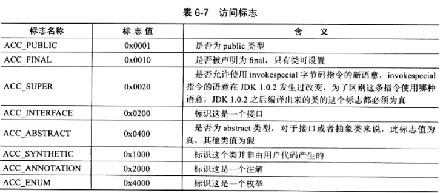

# ***Java 类文件结构***

- [***Java 类文件结构***](#java-类文件结构)
  - [Class 类文件结构](#class-类文件结构)
        - [魔数与 Class 文件的版本](#魔数与-class-文件的版本)
        - [常量池](#常量池)
        - [访问标志](#访问标志)
        - [类索引、父类索引与接口索引集合](#类索引父类索引与接口索引集合)
        - [字段表集合](#字段表集合)
        - [方法表集合](#方法表集合)
        - [属性表集合](#属性表集合)
  - [字节码指令简介](#字节码指令简介)
        - [字节码指令类型](#字节码指令类型)
        - [加载和存储指令](#加载和存储指令)
        - [运算指令](#运算指令)
        - [类型转换指令](#类型转换指令)
        - [对象创建与访问指令](#对象创建与访问指令)
        - [操作数栈管理指令](#操作数栈管理指令)
        - [控制转移指令](#控制转移指令)
        - [方法调用和返回指令](#方法调用和返回指令)

----

## Class 类文件结构

&ensp;&ensp;&ensp;&ensp;**任何一个 Class 文件都对应着唯一的一个类或接口的定义信息，但是反过来说，类或接口并不一定都得定义在文件里（例如类或接口也可以动态生成，直接送入类加载器）**

&ensp;&ensp;&ensp;&ensp;Class 文件是一组以 8 个字节为基础单位的二进制流，各个数据项目严格按照顺序紧凑的排列在文件之中，中间没有添加任何分隔符，这使得整个 Class 文件中存储的内容几乎全部是程序运行的必要数据，没有空隙存在。当遇到需要占用 8 个字节以上的空间的数据项时，则会按照高位在前的方式分割成若干个 8 个字节进行存储。

&ensp;&ensp;&ensp;&ensp;根据《Java 虚拟机规范》的规定，Class 文件格式采用一种类似于 C 语言结构体的伪结构来存储数据，这种伪结构中只有两种数据类型：“无符号数” 和 “表”。
>1. **无符号属于基本的数据类型**，以 u1、u2、u4、u8 来分别代表 1个字节、2个字节、4个字节和8个字节的无符号数，无符号数可以用来描述数字、索引引用、数据值或按照UTF-8编码构成字符串值。
>2. **表是由多个无符号数或者其他表作为数据项构成的复合数据类型**，为了便于区分，所有表的命名都习惯地以 “info” 结尾。表用于描述有层次关系的复合结构的数据，整个 Class 文件本质上也可以视为是一张表。

&ensp;&ensp;&ensp;&ensp;无论是无符号数还是表，当需要描述同一类型但数量不定的多个数据时，经常会使用一个前置的容量计数器加若干个连续的数据项的形式，这时候称这一系列的某一类型的数据为某一类型的 “集合”。

##### 魔数与 Class 文件的版本

&ensp;&ensp;&ensp;&ensp;**每个 Class 文件的头4个字节被称为魔数（Magic Number）**,它的唯一作用时确定这个文件是否为一个能够被虚拟机接受的 Class 文件。值为：`0xCAFEBABE`。

##### 常量池

&ensp;&ensp;&ensp;&ensp;常量池可以比喻为 Class 文件里的资源仓库，它是 Class 文件结构中与其他项目关联最多的数据，通常也是占用 Class 文件空间最大的数据项目之一，另外，**它还是在 Class 文件中第一个出现的表类型数据项目**。

&ensp;&ensp;&ensp;&ensp;由于常量池中常数的数量是不固定的，所以在常量池的入口需要放置一项 u2 类型的数据，代表常量池容量计数值（constant_pool_count）。

&ensp;&ensp;&ensp;&ensp;与 Java 中的语言习惯不同，这个容量计数是从 1 而不是 0 开始的，在 Class 文件格式规范制订之时，设计者将第 0 项常量空出来是有特殊考虑的，这样做的目的在于，**如果后面某些指向常量池的索引值的数据在特定情况下需要表达 “不引用任何一个常量池项目” 的含义，可以把索引值设置为 0 来表示**。

&ensp;&ensp;&ensp;&ensp;**Class 文件结构中只有常量池的容量是从1开始**，对于其他集合类型，包括接口索引集合、字段表集合、方法表集合等的容量计数都与一般习惯相同，是从0开始的。

&ensp;&ensp;&ensp;&ensp;**常量池中主要存放两大类常量：字面量（Literal）和符号引用（Symbolic References）**。

&ensp;&ensp;&ensp;&ensp;字面量比较接近于 Java 语言层面的常量概念，如文本字符串、被声明为 final 的常量值等。而符号引用则属于编译原理方面得概念，主要包括下面几类常量：
>1. 被模块导出或者开放的包（Package）
>2. 类和接口的全限定名（Fully Qualified Name）
>3. 字段的名称和描述符（Descriptor）
>4. 方法的名称和描述符
>5. 方法句柄和方法类型（Method Handle、Method Type、Invoke Dynamic）
>6. 动态调用点和动态常量（Dynamically-Computed Call Site、Dynamically-Computed Constant） 

##### 访问标志

&ensp;&ensp;&ensp;&ensp;在常量池结束之后，紧接着的 2 个字节代表访问标志（access_flags）,这个标志用于识别一些类或者接口层次的访问信息，包括：**这个 Class 是类还是接口；是否定义为 public 类型；是否是abstract;如果是类的话，是否被声明为 final。**

&ensp;&ensp;&ensp;&ensp;access_flags 中一共有16个标识符可以使用，当前只定义了 9 个，没有用到的标志位要求一律为零。

##### 类索引、父类索引与接口索引集合

**类索引（this_class）** 和 **父类索引（super_class）** 都是一个 u2 类型的数据，而**接口索引集合（interfaces）** 是一组 u2 类型的数据的集合，**Class  文件中由这三项数据来确定该类型的继承关系。类索引用于确定这个类的全限定名，父类索引用于确定这个类的父类全限定名**。

&ensp;&ensp;&ensp;&ensp;类索引、父类索引和接口索引集合都按顺序排列在访问标识之后，类索引和父类索引用两个 u2 类型的索引值表示，它们各自指向一个类型为 CONSTANT_Class_info 的类描述符常量，通过 CONSTANT_Class_info 类型的常量中的索引值可以找到定义在 CONSTANT_Utf8_info 类型的常量中的全限定名字符串。

##### 字段表集合

&ensp;&ensp;&ensp;&ensp;**字段表（filed_info）用于描述接口或者类中声明的变量**。Java 语言中的 “字段”（field）包括类级变量以及实例级变量，但**不包括在方法内部声明的局部变量** 。

&ensp;&ensp;&ensp;&ensp;字段可以包括的修饰符有字段的作用域（public、private、protected 修饰符）、是实例变量还是类变量（static 修饰符）、可变性（final）、并发可见性（volatile 修饰符，是否强制从主内存读写）、是否可被序列化（transient 修饰符）、字段数据类型（基本类型、对象、数组）、字段名称。

&ensp;&ensp;&ensp;&ensp;字段访问标志：

&ensp;&ensp;&ensp;&ensp;由于语法规则的约束，ACC_PUBLIC、ACC_PRIVATE、ACC_PROTECTED 三个标志最多只能选择其一，**ACC_FINAL、 ACC_VOLATILE 不能同时选择**。

&ensp;&ensp;&ensp;&ensp;接口之中的字段必须要有 ACC_PUBLIC 、ACC_STATIC、ACC_FINAL标志，这些都是 Java 本身的语言规则所导致的。

&ensp;&ensp;&ensp;&ensp;**在 Java 语言中字段是无法重载的**，两个字段的数据类型、修饰符不管是否相同，都必须使用不一样的名称，**但是对于 Class 文件格式来讲，只要两个字段的描述符不是完全相同，那么字段重名就是合法的**。

##### 方法表集合

&ensp;&ensp;&ensp;&ensp;Class 文件存储格式中对方法的描述与对字段的描述采用了几乎完全一致的方式、方法表结构如同字段表一样，依次包括**访问标志（access_flags）** 、**名称索引（name_index）** 、**描述符索引（descriptor_index）** 、**属性表集合（attributes）** 几项，这些数据项目的含义业余字段表中的非常相似，仅在访问标志和属性表集合的可选项中有所区别。

&ensp;&ensp;&ensp;&ensp;因为 volatile 关键字和 transient 关键字不能修饰方法，所以方法表中的访问标志中没有了 ACC_VOLATILE 标志和 ACC_TRANSIENT 标志。与之相对，synchronized、native、strictfp 和 abstract 关键字可以修饰方法，方法表中的访问标志中也相应地增加了 ACC_SYNCHRONIZED、ACC_NATIVE、ACC_STRICTFP、ACC_ABSTRACT 标志。

&ensp;&ensp;&ensp;&ensp;**方法里的 Java 代码，经过 Javac 编译器编译成字节码指令之后，存放在方法属性表集合中一个名为 “Code” 的属性里面**。

&ensp;&ensp;&ensp;&ensp;**在 Java 语言中，要重载（Overload）一个方法，除了要与原方法具有相同的简单名称之外，还要求必须拥有一个与原方法不同的特征签名**。特征签名是指一个方法中各个参数在常量池中的字段符号引用的集合，也正是因为返回值不会包含在特征签名之中，**所以 Java 语言里面是无法仅仅依靠返回值的不同来对一个已有方法进行重载的**。但是在 Class 文件格式之中，特征签名的范围明显更大一些，只要描述符不是完全一致的两个方法就就可以共存，也就是说，**如果两个方法有相同的名称和特征名称，但返回值不同，也是可以合法共存于同一个 Class 文件中的**。

##### 属性表集合
  
&ensp;&ensp;&ensp;&ensp;属性表（attributes_info）与 Class 文件中其他的数据项目要求严格的顺序、长度和内容不同，属性表集合的限制稍微宽松一些，不再要求各个属性具有严格顺序。

1. **Code 属性**： Code 属性出现在方法表的属性集合之中，但并非所有的方法表都必须存在这个属性，譬如接口或者抽象类中的方法就不存在 Code 属性。

2. **变量槽（Slot）** 是虚拟机为局部变量分配内存所使用的最小单位，对于byte、char、float、int、short、boolean 和 returnAddress 等长度不超过32位的数据类型，每个局部变量占用一个变量槽，而 double 与 long 这两种64位的数据类型则需要两个变量槽来存放。

&ensp;&ensp;&ensp;&ensp;需要注意的是：**并不是在方法中用了多少局部变量，就把这些局部变量所占变量槽数量之和作为 max_locals 的值，操作数栈和局部变量表直接决定一个该方法的栈帧所耗费的内存，不必要的操作数栈深度和变量槽数量会造成内存的浪费**。Java 虚拟机的做法是**将局部变量表中的变量槽进行重用**，当代码执行超过一个局部变量的作用域时，这个局部变量所占用的变量槽可以被其他局部变量所使用，Javac 编译器会根据变量的作用域来分配变量槽给各个变量使用，根据同时生存的最大局部变量数量和类型计算出 max_locals 的值。

&ensp;&ensp;&ensp;&ensp;Java 中的潜规则：在任何实例方法里面，都可以通过 “this” 关键字访问到此方法所属的对象。这个访问机制对 Java 程序的编写很重要，而他的实现非常简单，仅仅是通过在 Javac 编译器编译的时候把 this 关键字的访问转变为一个对普通方法参数的访问，然后在虚拟机调用实例方法时自动传入此参数而已。**因此在实例方法的局部变量表中至少会存在一个指向当前对象实例的局部变量，局部变量表中也会预留出第一个变量槽位来存放对象实例的引用，所以实例方法参数值从 1 开始计算**。

&ensp;&ensp;&ensp;&ensp;**`Exception 属性`**：列举出方法中可能抛出的受检查异常（Checked Exception），也就是方法描述时在 throws 关键字后面列举的异常。

&ensp;&ensp;&ensp;&ensp;**`LineNumberTable 属性`**：用于描述 Java 源码行号与字节码行号（字节码的偏移量）之间的对应关系。

&ensp;&ensp;&ensp;&ensp;**`LocalVariableTable 及 LocalVariableTypeTable 属性`**：LocalVariableTable 用于描述栈帧中局部变量表的变量与 Java 源码中定义的变量之间的关系。如果没有生成这项属性，最大的影响就是当其他人引用这个方法时，所有的参数名称都将会丢失。在 JDK 5 引入泛型之后，LocalVariableTable 属性增加了一个 “姐妹属性” —— LocalVariableTypeTable。这个新增的属性结构与 LocalVariableTable 非常相似，仅是把记录的字段描述符的 descriptor_index 替换成方法的特征签名（signature）。对于非泛型类型来说，描述符和特征签名能描述的信息是能吻合一致的，但是泛型引入之后，由于描述符中泛型的参数化类型被擦除掉，描述符就不能准确描述泛型类型，因此出现了 LocalVariableTypeTable 属性，使用字段的特征签名来完成泛型的描述。

&ensp;&ensp;&ensp;&ensp;**`SourceFile 及 SourceDebugExtension 属性`**:sourceFile 属性用于记录生成这个 Class 文件的源码文件名称。

&ensp;&ensp;&ensp;&ensp;**`ConstantValue 属性`**：ConstantValue 属性的作用是通知虚拟机自动为静态变量赋值。只有被 static 关键字修饰的变量（类变量）才可以使用这项属性。

&ensp;&ensp;&ensp;&ensp;对于非 static 类型的变量（也就是实例变量）的赋值是在实例构造器`<init>()`方法中进行中；而对于变量，则有两种方式可以选择：在类构造器`<clinit>()`方法中或者使用 `ConstantValue`属性。目前 Oracle 公司实现的 javac 编译器的选择是，如果同时使用 final 和 static 来修饰一个变量，并且这个变量的数据类型时基本类型或者 `java.lang.String` 的话，就将会生成 ConstantValue 属性来进行初始化；如果这个变量没有被 final 修饰，或者并非基本类型及字符串，则将会选择在`<clinit>()`方法中进行初始化。

&ensp;&ensp;&ensp;&ensp;**`InnerClasses 属性`**：InnerClasses 属性用于记录内部类与宿主类之间的关联。如果一个类中定义了内部类，那编译器将会为它以及它所包含的内部类生成InnerClass属性。

&ensp;&ensp;&ensp;&ensp;**`Deprecated 及 Synthetic 属性`**：两个属性都属于标志类型的布尔属性，只存在有和没有的区别，没有属性值的概念。
>- **`Deprecated`** 属性用于表示某个类、字段或者方法，已经被程序作者定为不再推荐使用，它可以通过代码中使用`@Deprecate`注解进行设置。
>- **`Synthetic`** 属性代表此字段或者方法并不是由 Java 源码直接产生的，而是由编译器自行添加的，在 JDK 5 之后，表示一个类、字段或者方法是编译器自动产生的，也可以设置它们访问标识中的 `ACC_SYNTHETIC 标志位`。编译器通过生成一些在源代码中不存在的 Synthetic 方法、字段甚至是整个类的方式，实现了越权访问（越过 private 修饰器）或其他绕开了语言限制的功能。

&ensp;&ensp;&ensp;&ensp;**`StackMapTable 属性`**：它是一个相当复杂的变长属性，位于 Code 属性的属性表中。这个属性会在虚拟机加载的字节码中验证阶段被 **新类型检查验证器 (Type Checker)** 使用，目的在于代替以前比较消耗性能的基于数据流分析的类型推导验证器。

&ensp;&ensp;&ensp;&ensp;**`Signature 属性`**：该属性在 JDK 5 增加到 Class 文件规范之中，它是一个可选的定长属性，可以出现于 类、字段表和方法表结构的属性表中。在JDK 5 里面大幅增强了 Java 语言的语法，在此之后，任何类、接口、初始化方法或成员的泛型签名如果包含了 **类型变量（Type Variable）** 或者 **参数化类型 （Parameterized Type）**, 则 Signature 属性会为它记录泛型签名信息。之所以要专门使用这样一个属性去记录泛型类型，是**因为 Java 语言的泛型采用的是擦除法实现的伪泛型，字节码（Code 属性）中所有的泛型信息编译（类型变量、参数化类型）在编译之后都通通被擦除掉。** 使用擦除法的好处是实现简单（主要修改 Java 编译器，虚拟机内部制作了很少的改动）、非常容易实现 BackPort, 运行期也能够节省一些类型所占用的内存空间。但坏处就是在运行期无法像 C# 等有真泛型支持的语言那样，将泛型类型与用户定义的普通类型同等对待，例如运行期做反射时无法获得泛型信息。Signature 属性就是为了弥补这个缺陷设置的，现在 Java 反射的 API 能够获取的泛型类型，最终的数据来源也是这个属性。

&ensp;&ensp;&ensp;&ensp;**`BootstrapMethods 属性`**：变长属性，位于类文件的属性表中。这个属性用于保存 invokeDynamic 指令引用的引导方法限定符。

&ensp;&ensp;&ensp;&ensp;**`MethodParameters 属性`**: JDK 8 加入，变长属性，作用是用来记录方法的各个形参名称和信息。

&ensp;&ensp;&ensp;&ensp;**`模块化相关属性`**：JDK 9 加入，因为模块描述文件（module-info.java）最终是要编译成一个独立的 Class 文件来存储的，所以，Class 文件格式也扩展了 Module、ModulePackages 和 ModulesMainClass 三个属性用于支持 Java 模块化的相关功能。

&ensp;&ensp;&ensp;&ensp;**`运行时注解相关属性`**：JDK 5 加入，提供对 **注解（Annotation）** 的支持.为了存储源码中的注解信息，Class 文件同步增加了 `RuntimeVisibleAnnotations`、`RuntimeInVisibleAnnotations`、`RuntimeVisibleParameterAnnotations` 和 `RuntimeInvisibleParameter-Annotations`四个属性。到了 JDK 8 时期，进一步加强了 Java 语言注解使用范围，又新增类型注解（JSR 308）,所以 Class 文件中也同步增加了 `RuntimeVisibleTypeAnnotations` 和 `RuntimeInvisibleTypeAnnotation`两个属性。

     
----
   
## 字节码指令简介

&ensp;&ensp;&ensp;&ensp;Java 虚拟机的指令由一个字节长度、代表着某种特定操作含义的数字（称为操作码，Opcode）以及跟随其后的零至多个代表此操作所需的参数（称为操作数，Operand）构成。**由于 Java 虚拟机采用面向操作数栈而不是面向寄存器的架构，所以大多数指令都不包含操作数，只有一个操作码，指令参数都存放在操作数栈中**。

&ensp;&ensp;&ensp;&ensp;字节码指令集是一种具有鲜明特点、优势和劣势均很突出的指令集架构，由于限制了 Java 虚拟机操作码的长度为一个字节（0~255），这意味着指令集的操作码总数不能超过 256 条；又由于 Class 文件格式放弃了编译后代码的操作数长度对齐，这就意味着虚拟机在处理那些超过一个字节的数据时，不得不在运行时从字节中重建出具体数据的结构，譬如要将一个 16 位长度的无符号整数使用两个无符号字节存储起来（假如将他们命名 byte1 与 byte2）,那它们的值应该是这样的：  
 `(byte1 << 8) | byte2`.

&ensp;&ensp;&ensp;&ensp;这种操作在某种程度上会导致解释执行字节码时将损失一些性能，但这样做的优势也同样明显：**放弃了操作数长度对齐，就意味着可以省略掉大量的的填充和间隔符号；用一个字节来代替操作码，也是为了尽可能获得短小精干的编译代码。**

##### 字节码指令类型

&ensp;&ensp;&ensp;&ensp;**`字节码指令类型`**：在 Java 虚拟机的指令集中，大多数指令都包含其操作所对应的数据类型信息。

##### 加载和存储指令

&ensp;&ensp;&ensp;&ensp;**`加载和存储指令`**：加载和存储指令用于将数据在堆帧中的局部变量表和操作数栈之间来回传输。

##### 运算指令

&ensp;&ensp;&ensp;&ensp;**`运算指令`**：算术指令用于对操作数栈上的两个值进行某种特定运算，并把结果重新存入到操作数栈顶。大体分为两种：**对整型数据进行运算的指令与对浮点型数据进行运算的指令。**

##### 类型转换指令

&ensp;&ensp;&ensp;&ensp;**`类型转换指令`**：类型转换指令可以将两种不同的数值类型相互转换，这些转换操作一般用于实现用户代码中的显式类型转换操作，或者用来处理字节码指令集中数据类型相关指令无法与数据类型一一对应的问题。

&ensp;&ensp;&ensp;&ensp;Java 虚拟机直接支持以下数值类型的**宽化类型转换（Widening Numeric Coversion ,即小范围类型向大范围类型的安全转换）**
>- int -> long, float, double
>- long -> float, double
>- float -> double

&ensp;&ensp;&ensp;&ensp;与之相对的，**处理窄化类型转换（Narrawing Numeric Conversion）时，就必须显式地使用转换指令来完成**。窄化类型转换可能会导致转换结果产生不同的正负号、不同数量级的情况，转换过程可能会导致数值的精度丢失。

&ensp;&ensp;&ensp;&ensp;**JVM 规范中明确规定数值类型的窄化转换指令永远不可能导致虚拟机抛出运行时异常**。

##### 对象创建与访问指令

&ensp;&ensp;&ensp;&ensp;**`对象创建与访问指令`**：虽然类实例和数组都是对象，但Java虚拟机对类实例和数组的创建与操作使用了不同的字节码指令。对象创建后，就可以通过对象访问指令获取对象实例或者数组实例中的字段或者数组元素，这些指令如下。创建类实例的指令：`new`。
>- **创建数组的指令**：`newarray`、`anewarray`、`multianewarray`。
>- **访问类字段（static字段，或者称为类变量）和实例字段（非static字段，或者称为实例变量）的指令**：`getfield`、`putfield`、`getstatic`、`putstatic`。
>- **把一个数组元素加载到操作数栈的指令**：`baload`、`caload`、`saload`、`iaload`、`laload`、 `faload`、`daload`、`aaload`。
>- **将一个操作数栈的值存储到数组元素中的指令**：`bastore`、`castore`、`sastore`、`iastore`、 `fastore`、`dastore`、`aastore`。
>- **取数组长度的指令**：`arraylength`。检查类实例类型的指令：`instanceof`、`checkcast`。

##### 操作数栈管理指令

&ensp;&ensp;&ensp;&ensp;**`操作数栈管理指令`**:
>- **将操作数栈的栈顶一个或两个元素出栈：** `pop`、`pop2`。
>- **复制栈顶一个或者两个数值并将复制值或双份的复制值重新压入栈顶：** `dup`、 `dup2`、 `dup_x1`、 `dup2_x1`、 `dup_x2`、 `dup2_x2`。
>- **将栈最顶端的两个数值互换:** `swap`。

##### 控制转移指令

&ensp;&ensp;&ensp;&ensp;**`控制转移指令`**:可以让Java虚拟机有条件或无条件地从指定的位置指令而不是控制转移指令的下一条指令继续执行程序，从概念模型上理解，可以认为控制转移指令就是在有条件或无条件地修改 PC 寄存器的值。控制转移指令如下。
>- **条件分支：** `ifeq`、`iflt`、`ifle`、`ifne`、`ifgt`、`ifge`、`ifnull`、`ifnonnull`、`if_icmpeq`、 `if_icmpne`、`if_icmplt`、`if_icmpgt`、`if_icmple`、`if_icmpge`、`if_acmpeq`和`if_acmpne`。
>- **复合条件分支：** `tableswitch`、`lookupswitch`。无条件分支：`goto`、`goto_w`、`jsr`、`jsr_w`、`ret`。

##### 方法调用和返回指令

&ensp;&ensp;&ensp;&ensp;**`方法调用和返回指令`**: **invokevirtual指令用于调用对象的实例方法，根据对象的实际类型进行分派（虚方法分派），这也是 Java 语言中最常见的方法分派方式**。
>- **`invokeinterface`** 指令用于调用接口方法，它会在运行时搜索一个实现了这个接口方法的对象，找出适合的方法进行调用。
>- **`invokespecial`** 指令用于调用一些需要特殊处理的实例方法，包括实例初始化方法、私有方法和父类方法。
>- **`invokestatic`** 指令用于调用类方法（static 方法）。
>- **`invokedynamic`** 指令用于在运行时动态解析出调用点限定符所引用的方法，并执行该方法，前面 4 条调用指令的分派逻辑都固化在 Java 虚拟机内部，而 invokedynamic 指令的分派逻辑是由用户所设定的引导方法决定的。