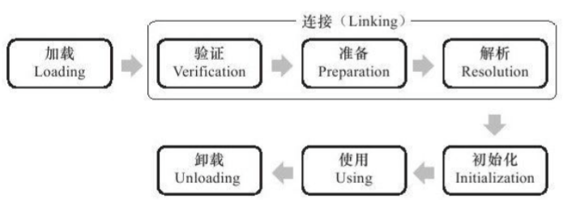
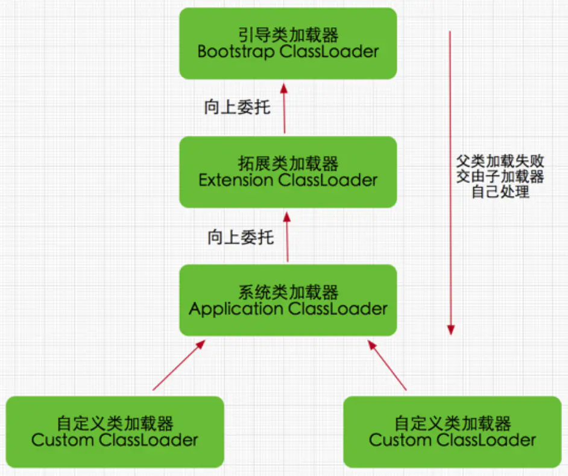
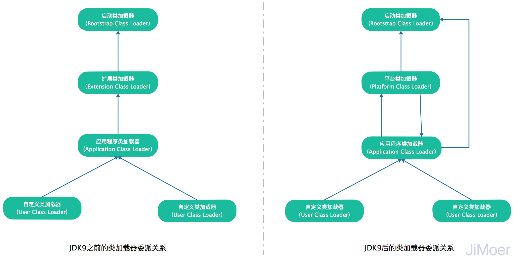

# ***虚拟机加载机制***

Java 虚拟机把描述类的数据从 Class 文件加载到内存，并对数据进行校验、转换解析和初始化，最终形成可以被虚拟机直接使用的 Java 类型，这个过程被称为虚拟机的类加载机制。

----

## 类加载的时机

一个类型从被加载到虚拟机内存中开始，到卸载出内存为止，它的整个生命周期将会经历以下阶段。

加载、验证、准备、初始化和卸载这五个阶段的顺序是确定的，类型的加载过程必须按照这种顺序**按部就班的开始**，而解析阶段则不一定：它在某些情况下可以在初始化阶段之后再开始，这是为了支持 Java 语言的运行时绑定特性（也称为动态绑定或晚期绑定）。

这些阶段通常都是互相交叉地混合进行的，会在一个阶段执行的过程中调用，激活另一个阶段。

java虚拟机规范中对类加载过程中的第一个阶段并没有进行强制约束，这点可以交给虚拟机的具体实现来自由把握。但是对于初始化阶段，虚拟机规范则是严格规定了有且只有六种情况必须立即对类进行“初始化“（而加载、验证、准备自然需要在此之前开始）：
>1. 遇到new、getstatic、putstatic或invokestatic这4条字节码指令时，如果类没有进行过初始化，则需要先触发其初始化。生成这4条指令最常见的java代码场景是：使用new关键字实例化对象的时候、读取或设置一个类的静态字段（被final修饰、已在编译期把结果放入常量池的静态字段除外）的时候，以及调用一个类的静态方法的时候。
>2. 使用java.lang.reflect包的方法对类进行反射调用的时候，如果类没有进行过初始化，则需要先触发其初始化。
>3. 当初始化一个类的时候，如果发型其父类还没有进行初始化，则需要先触发其父类的初始化。
>4. 当虚拟机启动时，用户指定一个要执行的主类（包含main()方法的那个类），虚拟机会先初始化这个主类。
>5. 当使用 JDK 7的动态语言支持时，如果一个java.lang.invoke.MethodHandle实例最后的解析结果REF_getStatic、REF_putStatic、REF_invokeStatic的方法句柄，并且这个方法句柄所对应的类没有进行过初始化，则需要先触发其初始化。
>6. 当一个接口中定义了 JDK 8 新加入的默认方法（被 default 关键字修饰的接口方法）时，如果有这个接口的实现类进行了初始化，那该接口在其之前被初始化。

对于这六种会触发类型进行初始化的场景，《Java 虚拟机规范》中使用了一个非常强烈的限定语——“有且只有”，这六种场景中的行为称为对一个类进行主动引用。除此之外，所有引用类的方式都不会触发初始化，称为被动引用。
>- 通过子类引用父类的静态字段，不会导致子类初始化。
>- 通过数组定义来引用类，不会触发此类的初始化。
>- 常量在编译阶段会存入调用类的常量池中，本质上没有直接引用到定义常量的类，因此不会触发定义类的初始化。

接口的加载过程和类加载过程稍有一些不同：接口也有初始化过程，这点与类是一致的，都是用静态代码块 `static｛｝`来输出初始化信息的，而接口中不能使用`static｛｝`语句块，但编译器仍然会为接口生成`clinit()`类构造器，用于初始化接口中所定义的成员变量。接口与类真正有所区别的是前面讲述的六种“有且只有”需要触发初始化场景的第三种：当一个类在初始化时，要求其父类全部都已经初始化过了，但是一个接口在初始化时，并不要求其父接口全部都完成了初始化，只有在真正使用到父接口的时候（如引用接口中定义的常量）才会初始化。

----

## 类加载的过程
java虚拟机中类加载的全过程：加载、验证、准备、解析和初始化这5个阶段，注意区别于类的生命周期。

- #### 加载
在加载阶段，虚拟机需要完成以下3件事情：
>1. 通过一个类的全限定名来获取定义此类的二进制字节流。
>2. 将这个字节流所代表的静态存储结构转化为方法区的运行时数据结构。
>3. 在内存中生成一个代表这个类的java.lang.Class对象，作为方法区这个类的各种数据的访问入口。

通过一个类的全限定名来获取定义此类的二进制字节流这条，它没有指明二进制字节流要从一个Class文件中获取，准确地说是根本没有明确要从哪里获取、怎样获取。

非数组类的加载阶段（准确地说，是加载阶段中获取类的二进制字节流的动作）是开发人员可控性最强的，因为加载阶段既可以使用系统提供的引导类加载器来完成，也可以由用户自定义的类加载器去完成，开发人员可以通过定义自己的类加载器去控制字节流的获取方式（即重写一个类加载器的loadClass()方法）。

数组类本身不通过类加载器创建，它是由java虚拟机直接创建的。但数组类与类加载器仍然有密切的关系，因为数组类的元素类型（Element Type，指的是数组去掉所有维度的类型）最终是要靠类加载器去创建，一个数组类（下面简称C）创建过程遵循以下规则：

>1. 如果数组的组件类型（Component Type，指的是数组去掉一个维度的类型）是引用类型，那就递归采用本节定义的加载过程去加载这个组件类型，数组C将在加载该组件类型的类加载器的类名称空间上被标识（一个类必须与类加载器一起确定唯一性）。
>2. 如果数组的组件类型不是引用类型（例如int[]数组），java虚拟机将会把数组C标记为与引导类加载器关联。
>3. 数组类的可见性与它的组建类型的可见性一致，如果组件类型不是引用类型，那数组类的可见性将默认为public。

加载阶段与连接阶段的部分内容（如一部分字节码文件格式验证动作）是交叉进行的，加载阶段尚未完成，连接阶段可能已经开始，但这些夹在加载阶段之中进行的动作，仍然属于连接阶段的内容，这两个阶段的开始时间仍然保持着固定的先后顺序。

- #### 验证
验证是连接阶段（连接阶段包括验证、准备、解析）的第一步，这一阶段的目的是为了确保Class文件的字节流中包含的信息符合当前虚拟机的要求，并且不会危害虚拟机自身的安全。

验证阶段大致上会完成下面4个阶段的检验动作：文件格式验证、元数据验证、字节码验证、符号引用验证。

>1. 文件格式验证：
>>- 验证Class文件魔数、主次版本、常量池、类文件本身等等。
>>- 这阶段的验证是基于二进制字节流进行的，只有通过了这个阶段的验证之后，这段字节流才被允许进入 Java 虚拟机内存的方法区中存储，后面的三个验证阶段全部是基于方法区的存储结构上进行的，不会直接读取、操作字节流了。
>2. 元数据验证：
>>- 主要是对字节码描述的信息进行语义分析，包括是否有父类、是否是抽象类、是否是接口、是否继承了不允许被继承的类(final类)、是否实现了父类或者接口的方法等等。
>>- 主要目的是对类的元数据信息进行语义校验，保证不存在与《Java 语言规范》定义相悖的元数据信息。
>3. 字节码验证：
>>- 是整个验证过程中最复杂的，主要进行数据流和控制流分析，如保证跳转指令不会跳转到方法体之外的字节码指令、数据类型转换安全有效等。
>>- 如果一个类型种有方法体的字节码没有通过字节码验证，那它肯定是有问题的。
>>- 如果一个方法通过了字节码验证，也仍然不能保证它一定是安全的。
>4. 符号引用验证：
>>- 发生在虚拟机将符号引用转化为直接引用的时候(连接第三阶段-解析阶段进行符号引用转换为直接引用)，符号引用验证的目的是确保解析动作能正常执行，如果无法通过符号引用验证，则会抛出java.lang.IncompatibleClassChangeError异常的子类异常，如java.lang.IllegalAccessError、java.lang.NoSuchFieldError、java.lang.NoSuchMethodError等。
>>- 验证阶段对于虚拟机的类加载机制来说，是一个非常重要、但却不是必须要执行的阶段，因为验证阶段只有通过或者不通过的差别，只要通过了验证，其后对程序运行期没有任何影响了。

- #### 准备
准备阶段是正式为类变量分配内存并设置类变量初始值的阶段，这些变量所使用的内存都将在方法区中进行分配。这个阶段中有两个容易产生混淆的概念需要强调一下，首先，这时候进行内存分配的仅包括类变量（被static修饰的变量），而不包括实例变量，实例变量将会在对象实例化时随着对象一起分配在java堆中。其次，这里所说的初始值“通常情况下“是数据类型的零值，假设一个类变量的定义为：

`public static int value=123;`

变量value在准备阶段过后的初始值为0而不是123，因为这时候尚未开始执行任何java方法，而把value赋值为123的putstatic指令是程序被编译后，存放于类构造器`<clinit>()`方法之中，所以把value赋值为123的动作将在初始化阶段才会执行。

  上面提到，在“通常情况”下初始值是零值，那相对的会有一些“特殊情况”：如果类字段的字段属性表中存在ConstantValue属性，那在准备阶段变量value就会被初始化为ConstantValue属性所指定的值，假设上面类变量value的定义变为：

`public static final int value=123;`

编译时javac将会为value生成ConstantValue属性，在准备阶段虚拟机就会根据ConstantValue的设置讲value赋值为123。
- #### 解析
解析阶段时虚拟机将常量池内的符号引用替换为直接引用的过程。
>- 符号引用：符号引用以一组符号来描述所引用的目标，符号可以是任何形式的字面量，只要使用时能无歧义地定位到目标即可。符号引用与虚拟机实现的内存布局无关，引用的目标并不一定已经加载到内存中。各种虚拟机实现的内存布局可以各不相同，但是它们能接受的符号引用必须都是一致的，因为符号引用的字面量形式明确定义在java虚拟机规范的Class文件格式中。
>- 直接引用：直接引用可以是直接指向目标的指针、相对偏移量或是一个能间接定位到目标的句柄。直接引用是和虚拟机实现的内存布局相关的，同一个符号引用在不同虚拟机实例上翻译出来的直接引用一般不会相同。如果有了直接引用，那直接引用的目标必定已经在内存中存在。

对同一个符号引用进行多次解析请求是很常见的事情，除了 invokedynamic 指令以外，虚拟机实现可以对第一次解析的结果进行缓存，譬如在运行时直接引用常量池的记录，并把常量标识为已解析状态，从而避免解析动作重复进行。

无论是否真正执行了多次解析动作，Java 虚拟机都需要保证的是在同一个实体中，如果一个符号引用之前已经被成功解析过，那么后续的引用解析请求就应当一直能够成功；同样地，如果第一次解析失败了，其他指令对这个符号的解析请求也应该收到相同的异常，哪怕这个请求的符号再后来已成功加载进 Java 虚拟机内存。

不过对于 invokedynamic 指令，上面的规则就不成立了。

解析包括一下部分：
>1. 类或接口的解析
>2. 字段解析
>3. 方法解析
>4. 接口方法解析

- #### 初始化
类的初始化阶段是类加载过程的最后一个步骤，直到初始化阶段，Java 虚拟机才真正开始执行类中编写的 Java 程序代码，将主导权移交给应用程序。

在准备阶段，变量已经赋过一次系统要求的初始值，而在初始化阶段，则根据程序员制定的主观计划去初始化类变量和其他资源，或者从另一个角度来表达：初始化阶段是执行类构造器 `<clinit>()` 方法的过程。

>- `<clinit>()`方法是由编译器自动收集类中的所有类变量的赋值动作和静态语句块（`static{}`块）中的语句合并产生的，编译器收集的顺序是由语句在源文件中出现的顺序所决定的，静态语句块中只能访问到定义在静态语句块之前的变量，定义在它之后的变量，在前面的静态语句块能赋值，但是不能访问.
>- `<clinit>()`方法与类的构造函数(或者说实例构造器`<init>()方法`) 不同，它不需要显式地调用父类构造器，虚拟机会保证子类的`<clinit>()`方法执行之前，父类的`<clinit>()`方法已经执行完毕。因此在虚拟机中第一个被执行的`<clinit>()`方法的类肯定是java.lang.Object。
>- `<clinit>()`方法对于类或接口来说并不是必需的，如果一个类中没有静态语句块，也没有对变量的赋值操作，那么编译器可以不为这个类生成`<clinit>()`方法。
>- 接口中不能使用静态语句块，但仍然有变量初始化的赋值操作，因此接口与类一样都会生成`<clinit>()`方法。但接口与类不同的是，执行接口的`<clinit>()`方法不需要先执行父接口的`<clinit>()`方法。只有当父接口中定义的变量使用时，父接口才会初始化。另外，接口的实现类在初始化时也一样不会执行接口的`<clinit>()`方法。
>- Java 虚拟机会保证一个类的`<clinit>()`方法在多线程环境中被正确地加锁、同步，如果多个线程同时去初始化一个类，那么只有一个线程去执行这个类的`<clinit>()`方法，其他线程都需要阻塞等待，直到活动线程执行`<clinit>()`方法完毕。如果在一个类的`<clinit>()`方法中有耗时很长的操作，就可能造成多个进程阻塞，在实际应用中这种阻塞往往是很隐蔽的。
----

## 类加载器
“通过一个类的全限定名来获取该类的二级制字节流” 这个动作放到虚拟机外部去实现，以便让应用程序自己决定如何去获取所需的类。实现这个动作的代码被称为 “类加载器（Class  Loader）”。

- #### 类与类加载器
类加载器虽然只用于实现类的加载动作，但它在 Java 程序中起到的作用却远超类加载阶段。对于任意一个类，都必须由加载它的类加载器和这个类本身一起共同确立其在 Java 虚拟机中的唯一性，每一个类加载器，都拥有一个独立的类名称空间。

比较两个类是否“相等”，只有在这两个类是由一个类加载器加载的前提下才有意义，否则，即使两个类来源于同一个 Class 文件，被同一个 Java 虚拟机加载，只要加载他们的类加载器不同，那这两个类就必定不相等。
- #### 双亲委派模型

站在 Java 虚拟机的角度来看，只存在两种不同的类加载器：一种是启动类加载器（BootStrap ClassLoader）,这个类加载器使用 C++ 语言实现，是虚拟机的一部分；另外一种就是其他所有的类加载器，这些类由 Java 语言实现，独立于虚拟机外部，并且全部继承自抽象类 Java.lang.ClassLoader。

三个系统提供的类加载器（三层类加载器）
>- 启动类加载器（Bootstrap Class Loader）: 加载存放在 `<JAVA_HOME>\lib`目录下（等）存放的类库。
>- 扩展类加载器（Extension Class Loader）:该类加载器是在类 sun.misc.Launcher$ExtClassLoader 中以 Java 代码实现的，JDK9 后被取缔。
>- 应用程序类加载器(Application Class Loader):该类加载器由 sun.misc.Launcher$AppClassLoader 来实现。由于应用程序加载器是 ClassLoader 类中 `getSystem-ClassLoader()` 方法的返回值，所以有些场合也称它为“系统类加载器”。如果应用程序中没有定义过自己的类加载器，一般情况下这个就是程序中默认的累加载器。

JDK 9 之前的 Java 应用都是由这三种类加载器互相配合来完成加载的。

各种类加载器之间的层次关系被称为类加载器的“双亲委派模型（Parents Delegations Model）”。双亲委派模型要求除了顶层的启动类加载器外，其他的类加载器都应有自己的父类加载器。不过这里类加载器之间的父子关系一般不是以继承（inheritance）的关系来实现的，而是通常使用组合（Composition）关系来复用父加载器的代码。

双亲委派模式是在Java 2后引入的，并广泛应用于此后几乎所有的 Java 程序中，当年它并不是一个具有强制性约束力的模型，而是 Java 设计者们推荐给开发者的一种类加载器实现的最佳实践。

双亲委派的工作过程是：如果一个类加载器收到了类加载请求，它并不会自己先去加载，而是把这个请求委托给父类的加载器去完成，没一个层次的类加载器都是如此，因此所有的加载请求最终都应该传送到最顶层的启动类加载器中，只有当父加载器反馈自己无法完成这个请求（它的搜索范围中没有找到所需的类）时，子加载器才会尝试自己去完成加载。

- #### 破坏双亲委派模型

例如 JNDI 服务提供者接口（Service Provider Interface,SPI）、OSGi 等都破坏了双亲委派模型，但这里“被破坏”并不一定是带有贬义的，只要有明确的目的和充分的理由，突破旧有原则无疑是一种创新。

----

## Java 模块化系统

在 JDK 9 中引入的 Java 模块化系统（Java Platform Module System,JPMS）是对 Java 技术的一次重要升级，为了能够实现模块化的关键目标————可配置的封装隔离机制。

Java 模块定义包括以下内容：
>- 依赖其他模块的列表
>- 导出的包列表，即其他模块可以使用的列表
>- 开放的包列表，及其他模块可反射访问模块的列表
>- 使用的服务列表
>- 提供服务的实现列表

可配置的封装隔离机制首先要解决 JDK9 之前基于类路径（ClassPath）来查找依赖的可靠性问题。此前，如果类路径中缺失了运行时依赖的类型，那就只能等程序运行到发生该类型的加载、链接时才会报出运行的异常。在 JDK9 之后，如果启用了模块化进行封装，模块就可以声明对其他模块的显式依赖，这样 Java 虚拟机就能够在启动时验证应用程序开发阶段设定好的依赖关系在运行期是否完备，如有缺失那就直接启动失败。

JDK9 中的 public 类型不在意味着程序的所有地方的代码都可以随意访问到他们，模块提供了更精细的可访问性控制，必须明确声明其中哪一些 public 的类型可以被其他哪一些模块访问，这种访问控制也主要是在类加载过程中完成的。

为了使可配置的封装隔离机制能够兼容传统的类路径查找机制，JDK9提出了与“类路径”（ClassPath）相对应的“模块路径”（ModulePath）的概念。只要放在类路径上的JAR文件，都会被当作传统的JAR包来对待；相应地，只要放在模块路径上的JAR文件，即使没有使用JMOD后缀，甚至不包含module-info.class文件，也仍然会被当作一个模块来对待。

为了保证Java应用升级到JDK9之后依然使用传统的类路径，不会受到影响，制定了三条规则来保证兼容性。
>- JAR文件在类路径的访问规则：所有类路径下的JAR文件及其他资源文件，都被视为自动打包在一个匿名模块（Unnamed Module）里，这个匿名模块几乎是没有任何隔离的，它可以看到和使用 类路径上所有的包、JDK模块中所有的导出包，以及模块路径上所有模块中导出的包。
>- 模块在模块路径的访问规则：模块路径下的具名模块（Named Module）只能访问到她依赖定义中列明依赖的模块和包，匿名模块里所有的内容对具名模块来说都是不可见的，即具名模块看不见传统JAR包的内容。
>- JAR文件在模块路径的访问规则：如果把一个传统的、不包含模块定义的JAR文件放置到模块路径中，它就会变成一个自动模块（Automatic Module）。

**严格执行新引入的访问级别的一个示例是 JDK 本身：Java 类库中未导出的包在其模块之外确实是不可见的。**

- #### 模块下的类加载器
为了保证兼容性，JDK9 依然保留了三层类加载器架构以及双亲委派模型。但是为了模块化系统的顺利施行，模块化下的类加载器仍然发生了一些变动。
>- 扩展类加载器（Extension Class Loader）被平台类加载器（Platform Class Loader）取代。因为 JDK 基于模块化进行构建，其中的 java 类库就已天然地满足了可扩展的需求。
>- 平台类加载器和应用类加载器都不再派生自`java.net.URLClassLoader`，如果有程序直接依赖了这种继承关系，或者依赖了URLClassLoader类特定方法，那代码很可能会在JDK9及更高版本的JDK中崩溃。现在启动类加载器、平台类加载器、应用程序类加载器全都继承于 `jdk.internal.loader.BuiltinClassLoader`,在 BuiltinClassLoader 中实现了新的模块化架构下类如何从模块中加载的逻辑，以及模块中资源可访问性的处理。
>- JDK9中虽然仍然维持着三层类加载器和双亲委派架构，但类加载的委派关系也发生了变动。当平台及应用程序类加载器收到类加载请求，在委派给父加载器加载前，要先判断该类是否能够归属到某一个系统模块中，如果可以找到这样的归属关系，就要优先委派给负责哪个模块的加载器完成加载，这可以算是对双亲委派的第四次破坏。
