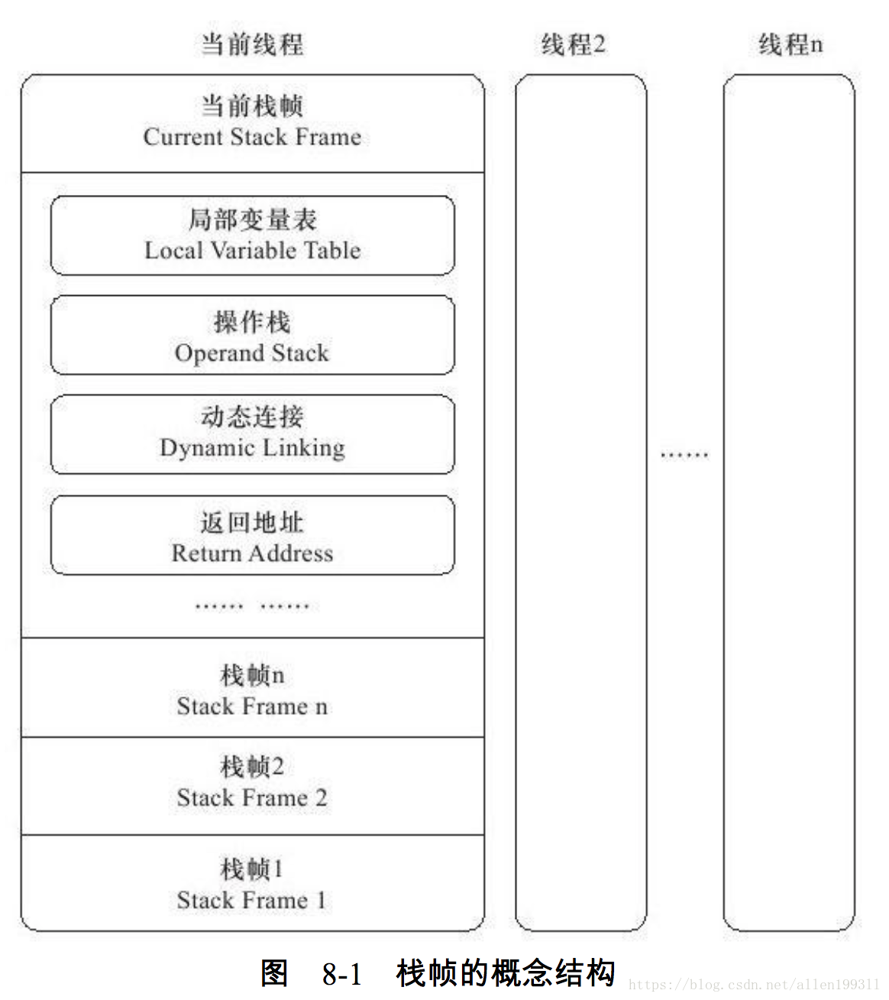
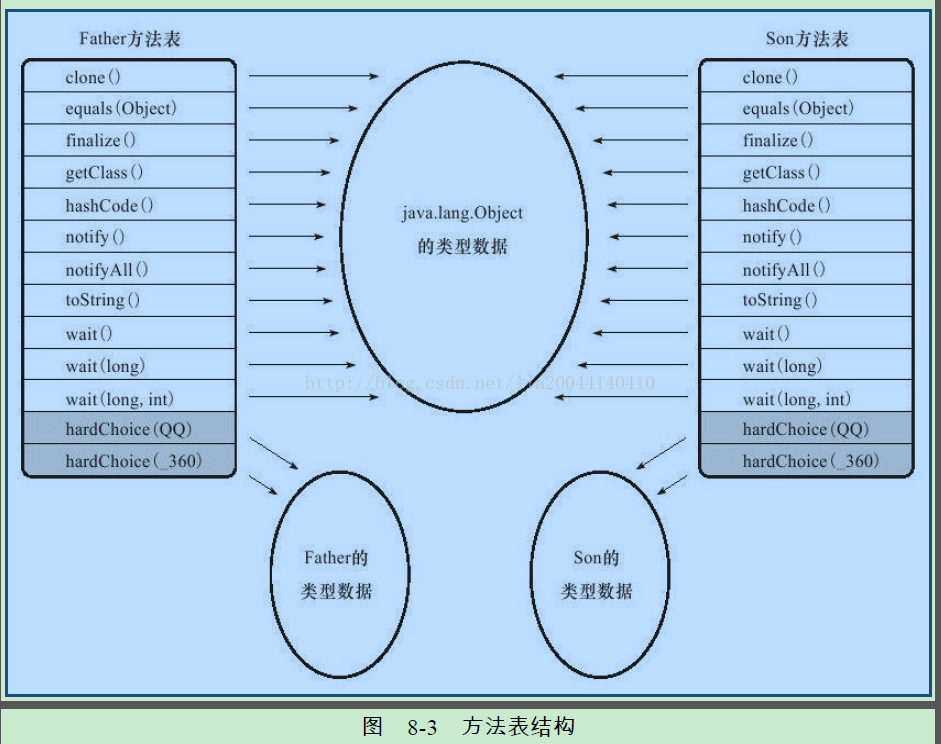
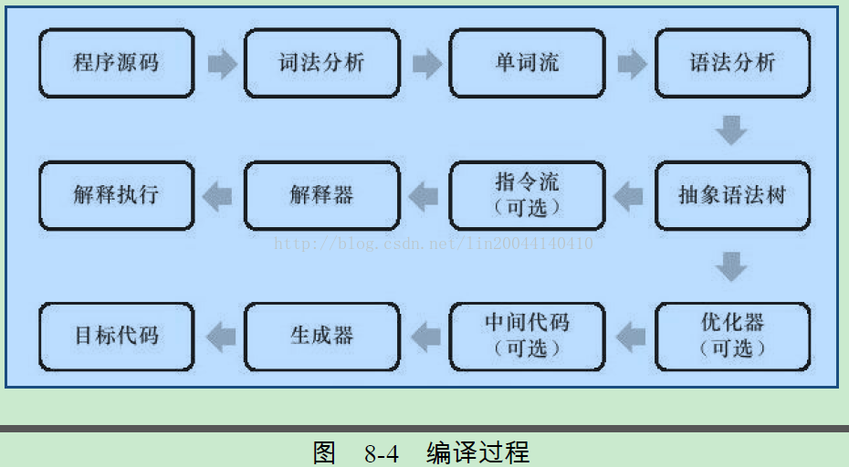

# ***虚拟机字节码执行引擎***

执行引擎是 Java 虚拟机最核心的组成部件之一。“虚拟机”是一个相对于“物理机”的概念，这两种机器都有代码执行能力，其区别是物理机的执行引擎是直接建立在处理器、缓存、指令集和操作系统层面上的，而虚拟机的执行引擎由软件自行实现，因此可以不受物理条件制约地定制指令集与执行引擎的结构体系，能够执行那些不被硬件直接支持的指令集格式。

在不同的虚拟机实现中，执行引擎再执行字节码的时候，通常会有解释执行（通过解释器执行）和编译执行（通过即时编译器产生本地代码执行）两种选择，也可能两者皆备，还可能回有同时包含几个不同级别的即时编译器一起工作的执行引擎。但从外观上来看，所有的Java虚拟机的执行引擎输入、输出都是一致的：输入的是字节码二进制流，处理过程是字节码解析执行的等效过程，输出的是执行结果。

----

## 运行时栈帧结构

Java 虚拟机以方法作为最基本的执行单元，“栈帧(Stack Frame)”则是用于支持虚拟机进行方法调用和方法执行背后的数据结构，它也是虚拟机运行时数据区中的虚拟机栈（Virtual Machine Stack）的栈元素。栈帧存储了方法的局部变量表、操作数栈、动态连接和方法返回地址等信息。每一个方法从调用开始到执行完成的过程，都对应着一个栈帧在虚拟机栈里面从入栈到出栈的过程。

对于执行引擎来讲，在活动线程中，只有位于栈顶的方法才是在运行的，只有位于栈顶的栈帧才是生效的，其被称为“当前栈帧（Current Stack Frame）”,与这个栈帧所关联的方法被称为“当前方法（Current Method）”。执行引擎所运行的所有字节码指令都只针对当前栈帧进行操作。


- #### 局部变量表
局部变量表（Local Variable table）是一组变量值存储空间，用于存放方法参数和方法内部定义的局部变量。

局部变量表的容量以变量槽（Variable Slot）为最小单位。

由于局部变量表是建立在线程堆栈中的，属于线程私有的数据，无论读写两个连续的变量槽是否为原子操作，都不会引起数据竞争和线程安全问题。

对于两个相邻的共同存放一个64位数据的两个变量槽，虚拟机不允许采用任何方式单独访问其中的某一个。

当一个方法被调用时， Java 虚拟机会使用局部变量表来完成参数值到参数变量列表的传递过程，即实参到形参的传递。

局部变量表不存在“准备阶段”，也就是说，如果一个局部变量定义了但没有赋值，那他是完全不能使用的（不存在默认值）。

- #### 操作数栈
操作数栈（Operand Stack）也常称为操作栈，它是一个后入先出（Last In First Out,LIFO）栈。

操作数栈的每一个元素都可以是包括 long 和 double 在内的任意 Java 数据类型。32位数据类型所占的栈容量为 1，64位数据所占的栈容量是 2。Javac 编译器的数据流分析工作保证了在方法执行的任何时候，操作数栈的深度都不会超过在 max_stacks 数据项中设定的最大值。

当一个方法刚刚开始执行的时候，这个方法的操作数栈是空的，在方法的执行过程中，会有各种字节码指令往操作数栈中写入和提取内容，也就是出栈和入栈操作。

操作数栈中元素的数据类型必须与字节码指令的序列严格匹配，在编译程序代码的时候，编译器必须要严格保证这一点，在类校验阶段的数据流分析中还要再次验证这一点。

在概念模型中，两个不同的栈帧作为不同方法的虚拟机栈的元素，是完全相互独立的。但是在大多数虚拟机的实现里都会进行一些优化处理，另两个栈帧出现一部分重叠，这样做不仅节约了一部分空间，更重要的是在进行方法调用的时候可以直接共用一部分数据，无需进行额外的参数复制传递了。

Java 虚拟机的解释执行引擎被称为“基于栈的执行引擎”，里面的“栈”就是操作数栈。
- #### 动态连接
 每个栈帧都包含一个指向运行时常量池中该栈帧所属方法的引用，持有这个引用是为了支持方法调用过程中的动态连接（Dynamic Linking）。

 Class文件的常量池中存有大量的符号引用，字节码中的方法调用指令就以常量池中指向方法的符号引用作为参数。这些符号引用一部分会在类加载阶段或者第一次使用的时候就转化为直接引用，这种转换称为静态解析。另外一部分将在每一次运行期间转化为直接引用，这部分称为动态链接。

 - #### 方法返回地址
当一个方法开始执行后，只有两种方式可以退出这个方法。第一种方式是执行引擎遇到任意一个方法返回的字节码指令，这时候可能会有返回值传递给上层的方法调用者（调用当前方法的方法称为调用者），是否有返回值和返回值的类型将根据遇到何种方法返回指令来决定，这种退出方法的方式称为正常完成出口（Normal Method Invocation Completion）。

另外一种退出方式是，在方法执行过程中遇到了异常，并且这个异常没有在方法体内得到处理，无论是Java虚拟机内部产生的异常，还是代码中使用athrow字节码指令产生的异常，只要在本方法的异常表中没有搜索到匹配的异常处理器，就会导致方法退出，这种退出方法的方式称为异常完成出口（Abrupt Method Invocation Completion）。一个方法使用异常完成出口的方式退出，是不会给它的上层调用者产生任何返回值的。

无论采用何种退出方式，在方法退出之后，都必须返回到最初方法被调用的位置，程序才能继续执行，方法返回时可能需要在栈帧中保存一些信息，用来帮助恢复它的上层主调方法的执行状态。方法异常退出时，返回地址是要通过异常处理器表来确定的，栈帧中就一般不会保存这部分信息。

方法退出的过程实际上等同于把当前栈帧出栈。

----

## 方法调用
方法调用并不等同于方法执行，方法调用阶段唯一的任务就是确定被调用方法的版本（即调用哪一个方法），暂时还不涉及方法内部的具体运行过程。

- #### 解析
在类加载的解析阶段，会将其中的一部分符号引用转化为直接引用，这种解析能够成立的前提是：方法在程序真正运行之前就有一个可确定的调用版本，并且这个方法的调用版本在运行期是不可改变的。换句话说，调用目标在程序代码写好、编译器进行编译时就必须确定下来。这类方法的调用称为解析（Resolution）。  

在Java语言中符合“编译期可知，运行期不可变”这个要求的方法，主要包括静态方法和私有方法两大类，前者与类型直接关联，后者在外部不可被访问，这两种方法各自的特点决定了它们都不可能通过继承或别的方式重写其他版本，因此它们都适合在类加载阶段进行解析。

在 Java 虚拟机支持以下 5 条方法调用字节码指令，分别是：
>- `invokestatic`：调用静态方法。
>- `invokespecial`：调用实例构造器`<init>`方法、私有方法和父类方法。
>- `invokevirtual`：调用所有的虚方法。
>- `invokeinterface`：调用接口方法，会在运行时再确定一个实现此接口的对象。
>- `invokedynamic`：先在运行时动态解析出调用点限定符所引用的方法，然后再执行该方法，在此之前的4条调用指令，分派逻辑是固化在Java虚拟机内部的，而`invokedynamic`指令的分派逻辑是由用户所设定的引导方法决定的。

只要能被`invokestatic`和`invokespecial`指令调用的方法，都可以在解析阶段中确定唯一的调用版本，符合这个条件的有静态方法、私有方法、实例构造器、父类方法4类，再加上被`final`修饰的方法（尽管它使用`invokevirtual`指令调用），这5种方法调用会在类加载的时候就可以把符号引用解析为该方法的直接引用。这些方法统称为“非虚方法（Non-Virtual Method）”，与之相反，其他方法称为“虚方法（Virtual Method）”。

Java 中的非虚方法除了使用`invokestatic`、`invokespecial`调用的方法之外还有一种，就是被`final`修饰的方法。

解析调用一定是个静态的过程，在编译期间就完全确定，在类加载的解析阶段就会把涉及的符号引用全部转变为明确的直接引用，不必延迟到运行期再去完成。而另一种主要的方法调用形式：分派（Dispatch）调用则复杂许多，它可能是静态的也可能是动态的，按照分派依据的宗量数可分为单分派和多分派。这两类分派方式两两组合就构成了静态单分派、静态多分派、动态单分派、动态多分派 4 种分派组合情况。

- #### 分派

1. ##### 静态分派
```java 
public class StaticDispatch {
    static abstract class Human{ }

    static class Man extends Human{ }

    static class Woman extends Human{ }
	
    public void sayHello(Human guy){
        System.out.println("hello guy");
    }

    public void sayHello(Man guy){
        System.out.println("hello gentleman");
    }

    public void sayHello(Woman guy){
        System.out.println("hello lady");
    }

    public static void main(String[] args) {
        Human man = new Man();
        Human woman = new Woman();
        StaticDispatch sr = new StaticDispatch();
        sr.sayHello(man);
        sr.sayHello(woman);
    }
}

output:
    hello,guy!
    hello,guy!
```

`Human man= new Man();`

“Human” 称为变量的 “静态类型（Static Type）” 或者叫 “外观类型（Apparent Type）”，后面的Man成为变量的 “实际类型（Actual Type）”或者叫“运行时类型（Runtime Type）”。静态类型和实际类型在程序中都可能会发生变化，区别是静态类型的变化仅仅在使用时发生，变量本身的静态类型不会改变，并且最终的静态类型是编译器可知的；实际类型变化的结果要在运行期才可确定，编译器在编译程序时并不知道一个对象的实际类型是什么。

代码中故意定义了两个静态类型相同，而实际类型不同的变量，但虚拟机（或者准确来讲是编译器）在重载时是通过参数的静态类型而不是实际类型作为判定依据的。

所有依赖静态类型来定位方法执行版本的分派动作称为静态分派。静态分派的典型应用是方法重载。静态分派发生在编译阶段，因此确定静态分派的动作实际上不是由虚拟机来执行的，这点也是为何一些资料选择把它归入“解析”而不是“分派”的原因。

编译器虽然能确定出方法的重载版本，但在很多情况下这个重载版本并不是“唯一”的，往往只能确定一个更加合适的版本。产生这种模糊结论的主要原因是字面量不需要定义，所以字面量没有显示的静态类型，它的静态类型只能通过语言上的规则去理解和推断。

````java
public class OverridePriority {
 
    public static void sayHello(char arg){
        System.out.println("hello char");
    }

    public static void sayHello(int arg){
        System.out.println("hello int");
    }
    
    public static void sayHello(long arg){
        System.out.println("hello long");
    }	
    
    //发生了一次自动装箱。
    public static void sayHello(Character arg){
        System.out.println("hello Character");
    }	
    
    public static void sayHello(Serializable arg){
        System.out.println("hello Character");
    }	
    
    public static void sayHello(Object arg){
        System.out.println("hello Character");
    }		
    
    //可变长参数。
    public static void sayHello(char...arg){
        System.out.println("hello Character");
    }	

    public static void main(String[] args) {
        sayHello('a');
    }
}

output:
char -> int -> long > Character -> Serializable -> Object -> char... 
````

可变参数的重载优先级是最低的。

解析与分派这两者之间的关系并不是二选一的排他关系，他们是在不同层次上去筛选、确定目标方法的过程。

2. ##### 动态分派

```java
package org.fenixsoft.jvm.chapter8;

/**
 * 方法动态分派演示
 * @author zzm
 */
public class DynamicDispatch {

    static abstract class Human {
        protected abstract void sayHello();
    }

    static class Man extends Human {
        @Override
        protected void sayHello() {
            System.out.println("man say hello");
        }
    }

    static class Woman extends Human {
        @Override
        protected void sayHello() {
            System.out.println("woman say hello");
        }
    }

    public static void main(String[] args) {
        Human man = new Man();
        Human woman = new Woman();
        man.sayHello();
        woman.sayHello();
        man = new Woman();
        man.sayHello();
    }
}

output:
    
    man say hello
    woman say hello
    woman say hello

```

`invokevirtual`指令的运行时解析过程大致分为以下几个步骤：
>1. 找到操作数栈顶的第一个元素所指向的对象的 实际类型，记作C。
>2. 如果在类型C中找到与常量中的描述符和简单名称都相符的方法，则进行访问权限校验,如果通过则返回这个方法的直接引用，查找结束；如果不通过，则返回`java.lang.IllegalAccessError`异常。
>3. 否则，按继承关系从下往上一次对C的个父类进行第2步的搜索和验证过程。
>4.  如果始终没有找到合适的方法，则抛出`java.lang.AbstractMethodError`异常。

正是因为由于`invokevirtual`指令执行的第一步就是在运行期确定接收者的实际类型，所以两次调用中的`invokevirtual`指令把常量池中的类方法符号引用解析到了不同的直接引用上就结束了，这个过程是java语言中方法重写的本质。这种在运行期根据实际类型确定方法执行版本的分派过程称为动态分派。

字段永远不参加多态。
```java
package org.fenixsoft.jvm.chapter8;

/**
 * 字段不参与多态
 * @author zzm
 */
public class FieldHasNoPolymorphic {

    static class Father {
        public int money = 1;

        public Father() {
            money = 2;
            showMeTheMoney();
        }

        public void showMeTheMoney() {
            System.out.println("I am Father, i have $" + money);
        }
    }

    static class Son extends Father {
        public int money = 3;

        public Son() {
            money = 4;
            showMeTheMoney();
        }

        public void showMeTheMoney() {
            System.out.println("I am Son,  i have $" + money);
        }
    }

    public static void main(String[] args) {
        Father gay = new Son();
        System.out.println("This gay has $" + gay.money);
    }
}

output:

    I am Son, i have $0
    I am Son, i have $4
    This gay has $2
```
3. ##### 单分派与多分派
```java
package org.fenixsoft.jvm.chapter8;

/**
 * 单分派、多分派演示
 * @author zzm
 */
public class Dispatch {

    static class QQ {}

    static class _360 {}

    public static class Father {
        public void hardChoice(QQ arg) {
            System.out.println("father choose qq");
        }

        public void hardChoice(_360 arg) {
            System.out.println("father choose 360");
        }
    }

    public static class Son extends Father {
        public void hardChoice(QQ arg) {
            System.out.println("son choose qq");
        }

        public void hardChoice(_360 arg) {
            System.out.println("son choose 360");
        }
    }

    public static void main(String[] args) {
        Father father = new Father();
        Father son = new Son();
        father.hardChoice(new _360());
        son.hardChoice(new QQ());
    }
}
output:
    father choose 360
    son choose qq
```

我们关注的首先是编译阶段中编译器的选择过程，也就是静态分派的过程。这时候选择目标方法的依据有两点：一是静态类型是 Father 还是 Son，二是方法参数是 QQ 还是 360。这次选择结果的最终产物是产生了两条 `invokevirtual` 指令，两条指令的参数分别为常量池中指向 `Father::hardChoise(360)` 及`Father::hardChoise(QQ)` 方法的符号引用。因为是根据两个宗量进行选择，所以 Java 语言的静态分派属于多分派类型。

再看看运行阶段中虚拟机的选择，也就是动态分派的过程。 在执行 `son.hardChoise(new QQ())`这行代码时，更准确地说，是在执行这行代码所对用的 `invokevirtual` 指令时，由于编译期已经决定目标方法的签名必须是 `hardChoise(QQ)` ,虚拟机此时不会关心传递过来的参数的 “QQ” 究竟是什么类型，因为这时候参数的静态类型、实际类型都对方法的选择不会构成影响，唯一可以影响虚拟机选择的因素只有该方法的接受者的实际类型是 Father 还是 Son。因为只有一个宗量作为选择依据，所以 Java 语言的动态分派属于单分派类型。

如今（直至 Java 12 和预览版的 Java 13）的 Java 语言是一门静态多分派、动态单分派的语言。

JDK 10 时 Java 语法中出现了 var 关键字，它与 dynamic 有着本质的区别：var 是在编译时根据声明语句中赋值符右侧的表达式类型来静态的推断类型，这本质上是一种语法糖，而 dynamic 在编译器完全不关心类型是什么，等到运行的时候再进行类型判断。

4. ##### 虚拟机动态分派的实现
   
由于动态分派是非常频繁的动作，而且动态分派的方法版本选择过程需要运行时在类的方法元数据中搜索合适的目标方法，因此在虚拟机的实际实现中基于性能的考虑，大部分实现都不会真正地进行如此频繁的搜索。面对这种情况，最常用的“稳定优化”手段就是为类在方法区中建立一个虚方法表（Vritual Method Table，也称为 vtable，与此对应的，在invokeinterface执行时也会用到接口方法表 —— Inteface MethodTable，简称itable），使用虚方法表索引来代替元数据查找以提高性能。



虚方法表中存放着各个方法的实际入口地址。如果某个方法在子类中没有被重写，那子类的虚方法表里面的地址入口和父类相同方法的地址入口是一致的，都指向父类的实现入口。如果子类中重写了这个方法，子类方法表中的地址将会替换为指向子类实现版本的入口地址。

为了程序实现方便，具有相同签名的方法，在父类、子类的虚方法表中都应该具有一样的索引序号，这样当类型变换时，仅需要变更查找到的虚方法表，就可以从不同的虚方法表中按索引转换出所需的入口地址。虚方法表一般在类加载的连接阶段进行初始化，准备了类的变量初始值后，虚拟机会把该类的虚方法表也一同初始化完毕。

----

## 动态类型语言支持

Java 虚拟机的字节码指令集在二十多年来只新增过一条指令，它就是随着 JDK7 的发布的字节码首位新成员——`invokedynamic`指令。

这条新增加的指令是 JDK 7 的项目目标：实现动态类型语言（Dynamically Typed Language）。

- #### 动态类型语言

何谓动态类型语言？动态类型语言的关键特征是它的类型检查的主体过程是在运行期而不是编译期进行的。

“变量无类型而变量值才有类型” 这个特点也是动态类型语言的一个核心特征。

静态类型语言能够在编译期确定变量类型，最显著的好处是编译器可以提供全面严谨的类型检查，这样与数据类型相关的潜在问题就能在编码时被及时发现，利于稳定性及让项目容易达到更大的规模。而动态类型语言在运行期才确定类型，这可以为开发人员提供极大的灵活性，某些在静态类型语言中需用大量臃肿代码来实现的功能，由动态类型语言去做可能会很清晰简洁，清晰简洁通常也就意味着开发效率的提升。

- #### java.lang.invoke 包

JDK 7 时新加入的 java.lang.invoke 包时 JSR 292 的一个重要组成部分，这个包的主要目的是在之前单纯依靠符号引用来确定调用的目标方法这条路之外，提供一种新的动态确定目标方法的机制，称为“方法句柄（Method Handle）”。

```java 

import java.lang.invoke.MethodHandle;
import java.lang.invoke.MethodType;

import static java.lang.invoke.MethodHandles.lookup;

/**
 * JSR 292 MethodHandle基础用法演示
 * @author zzm
 */
public class MethodHandleTest {

    static class ClassA {
        public void println(String s) {
            System.out.println(s);
        }
    }

    public static void main(String[] args) throws Throwable {
        Object obj = System.currentTimeMillis() % 2 == 0 ? System.out : new ClassA();
        // 无论obj最终是哪个实现类，下面这句都能正确调用到println方法。
        getPrintlnMH(obj).invokeExact("icyfenix");
    }

    private static MethodHandle getPrintlnMH(Object reveiver) throws Throwable {
        // MethodType：代表“方法类型”，包含了方法的返回值（methodType()的第一个参数）和具体参数（methodType()第二个及以后的参数）。
        MethodType mt = MethodType.methodType(void.class, String.class);
        // lookup()方法来自于MethodHandles.lookup，这句的作用是在指定类中查找符合给定的方法名称、方法类型，并且符合调用权限的方法句柄。
        // 因为这里调用的是一个虚方法，按照Java语言的规则，方法第一个参数是隐式的，代表该方法的接收者，也即是this指向的对象，这个参数以前是放在参数列表中进行传递，现在提供了bindTo()方法来完成这件事情。
        return lookup().findVirtual(reveiver.getClass(), "println", mt).bindTo(reveiver);
    }
}

```

方法 `getPrintlnMH()` 中模拟了`invokevirtual`指令的执行过程，只不过它的分派逻辑并非固化在Class文件的字节码上，而是通过一个由用户设计的 Java 方法来实现。而这个方法本身的返回值（MethodHandle对象），可以视为对最终调用方法的一个“引用”。

`MethodHandle` 与 `Reflection` 有众多相似之处，不过也有如下区别：

>- `Reflection`和`MethodHandle`机制都是在模拟方法调用，但`Reflection`是在模拟 Java 代码层次的方法调用，而`MethodHandle`是在模拟字节码层次的方法调用。在`MethodHandles.lookup`中的3个方法——`findStatic()`、`findVirtual()`、`findSpecial()`正是为了对应于`invokestatic`、`invokevirtual`＆`invokeinterface`和`invokespecial`这几条字节码指令的执行权限校验行为，而这些底层细节在使用`ReflectionAPI`时是不需要关心的。
>- `Reflection`中的`java.lang.reflect.Method`对象远比`MethodHandle`机制中的`java.lang.invoke.MethodHandle`对象所包含的信息多。前者是方法在Java 端的全面映像，包含了方法的签名、描述符以及方法属性表中各种属性的 Java 端表示方式，还包含执行权限等的运行期信息。而后者仅仅包含与执行该方法相关的信息。用通俗的话来讲，`Reflection`是重量级，而`MethodHandle`是轻量级。
>- 由于`MethodHandle`是对字节码的方法指令调用的模拟，所以理论上虚拟机在这方面做的各种优化（如方法内联），在`MethodHandle`上也应当可以采用类似思路去支持（但目前实现还不完善）。而通过反射去调用方法则不行。

`MethodHandle`与`Reflection`除了上面列举的区别外，最关键的一点还在于去掉前面讨论施加的前提“仅站在Java语言的角度来看”：`ReflectionAPI`的设计目标是只为Java语言服务的，而`MethodHandle`则设计成可服务于所有Java虚拟机之上的语言，其中也包括Java语言。

- #### invokeDynamic 指令

在某种程度上可以说`invokedynamic`指令与`MethodHandle`机制的作用是一样的，都是为了解决原有4条 “invoke*” 指令方法分派规则固化在虚拟机之中的问题，把如何查找目标方法的决定权从虚拟机转嫁到具体用户代码之中，让用户（广义的用户，包含其他语言的设计者）有更高的自由度。
```java
import java.lang.invoke.*;
import static java.lang.invoke.MethodHandles.lookup;

public class InvokeDynamicTest {

    public static void main(String[] args) throws Throwable {
        INDY_BootstrapMethod().invokeExact("icyfenix");
    }

    public static void testMethod(String s) {
        System.out.println("hello String:" + s);
    }

    public static CallSite BootstrapMethod(MethodHandles.Lookup lookup, String name, MethodType mt) throws Throwable {
        return new ConstantCallSite(lookup.findStatic(InvokeDynamicTest.class, name, mt));
    }

    private static MethodType MT_BootstrapMethod() {
        return MethodType
                .fromMethodDescriptorString(
                        "(Ljava/lang/invoke/MethodHandles$Lookup;Ljava/lang/String;Ljava/lang/invoke/MethodType;)Ljava/lang/invoke/CallSite;",
                        null);
    }

    private static MethodHandle MH_BootstrapMethod() throws Throwable {
        return lookup().findStatic(InvokeDynamicTest.class, "BootstrapMethod", MT_BootstrapMethod());
    }

    private static MethodHandle INDY_BootstrapMethod() throws Throwable {
        CallSite cs = (CallSite) MH_BootstrapMethod().invokeWithArguments(lookup(), "testMethod",
                MethodType.fromMethodDescriptorString("(Ljava/lang/String;)V", null));
        return cs.dynamicInvoker();
    }
}

```
- #### 掌控方法分派规则

可以使用 invokedynamic 指令来获取被当前类覆盖的祖类的方法。

----

## 基于栈的字节码解释执行引擎
许多Java虚拟机的执行引擎在执行Java代码的时候都有解释执行（通过解释器执行）和编译执行（通过即时编译器产生本地代码执行）两种选择。

- #### 解释执行
Java 语言经常被人们定位为“解释执行”的语言，这种说法十分笼统，“解释执行” 对于整个Java语言来说就成了几乎是没有意义的概念，只有确定了谈论对象是某种具体的Java实现版本和执行引擎运行模式时，谈解释执行还是编译执行才会比较确切。

无论是解释还是编译，也无论是物理机还是虚拟机，对于应用程序，机器都不可能如人那样阅读、理解，然后获得执行能力。


在 Java 语言中，Javac 编译器完成了程序代码经过词法分析、语法分析到抽象语法树，在遍历语法树生成线性的字节码指令流的过程。因为这一部分动作是在 Java 虚拟机之外进行的，而解释器在虚拟机的内部，所以 Java 程序的编译就是半独立的实现。

- #### 基于栈的指令集与基于寄存器的指令集

Java c 编译器输出的字节码指令流，基本上是一种基于栈的指令集架构（Instruction Set Architecture,ISA）,字节码指令流里面的指令大部分都是零地址指令，他们依赖操作数栈进行工作。与之相对的另外一套常用的指令集架构是基于寄存器的指令集，最典型的就是 X86 的二地址指令集。

基于栈的指令集主要优点是可移植，因为寄存器由硬件直接提供，程序直接依赖这些硬件寄存器则不可避免地要受到硬件的约束。

栈架构指令集的主要缺点是理论上执行速度相对来说会稍慢一些，不过这里的执行速度是要局限在解释执行的状态下，如果经过即时编译器输出成物理机上的汇编指令集，那就与虚拟机采用哪种指令集架构没有什么关系了。

在解释执行时，栈架构指令集的代码虽然紧凑，但是完成相同功能所需的指令数量一般会比寄存器架构来得更多，因为出栈、入栈操作本身就会产生了相当大量的指令。更重要的是栈实现在内存中，频繁的栈访问也就意味着频繁的内存访问。因此由于指令数量和内存访问的原因，导致了栈指令集的执行速度会相对慢上一点。