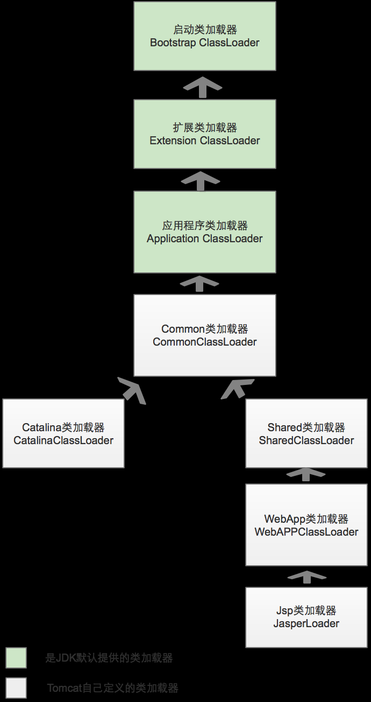
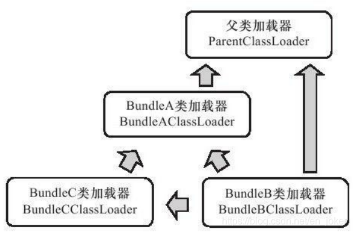

# ***类加载及执行子系统的案例***

---

## Tomcat

一个功能健全的 Web 服务器，都要解决如下的这些问题：
>-  部署在同一个服务器上的两个 Web 应用程序所使用的 Java 类库可以实现相互隔离，这是最基本的需求，两个不同的应用程序可能会依赖同一个第三方类库的不同版本，不能要求每个类库在一个服务器中只能有一份，服务器应当能够保证两个独立应用程序的类库可以互相独立使用。
>- 部署在同一个服务器上的两个 Web 应用程序所使用的 Java 类库可以相互共享，类库在使用时都要被加载到服务器内存，如果类库不能共享，虚拟机的方法区就会很容易出现过度膨胀的风险。
>- 服务器需要尽可能地保证自身的安全不受部署的Web应用程序影响。基于安全考虑，服务器所使用的类库应该与应用程序的类库互相独立。
>- 支持JSP应用的Web服务器，大多数需要支持HotSwap功能。我们知道，JSP文件最终要编译成Java Class 才能由虚拟机执行，但JSP文件由于其纯文本存储的特性，运行时修改的概率远远大于第三方类库或程序自身Class文件。

由于存在上述问题，在部署Web应用时，单独的一个ClassPath就无法满足需求了，所以各种Web服务器都“不约而同”地提供了好几个ClassPath路径供用户存放第三方类库，这些路径一般都以“lib”或“classes”命名。不同路径的类库，具备不同的访问范围和服务对象。

在Tomcat目录结构中，有3组目录（“`/common/*`”、“`/server/*`”和“`/shared/*`”）可以存放Java类库，另外加上Web应用程序自身目录“`WEB-INF/*`”，一共4组，把Java类库放置在这些目录中的含义分别是：
>- 放置在`/common`目录中： 类库可被 Tomcat 和所有的 Web 应用程序共同使用。
>- 放置在`/server`目录中： 类库可被 Tomcat 使用，对所有 Web 应用程序都不可见。
>- 放置在`/shared`目录中： 类库可被所有的 Web 应用程序共同使用，但对 Tomcat 不可见。
>- 放置在`/WebApp/WEB-INF`目录中： 类库仅仅可以被此 Web 应用程序使用，对 Tomcat 和 其他Web应用程序 都不可见。

为了支持这套目录结构，并对目录里面的类库进行加载和隔离，Tomcat 自定义了多个类加载器，这些类加载器按照经典的双亲委派模型来实现。



WebApp 类加载器和 JSP 类加载器通常还会存在多个实例，每一个 Web 应用程序对应一个 WebApp 类加载器，每一个 JSP 文件对应一个 JasperLoader 类加载器。

Common 类加载器能加载的类都可以被 Catelina 类加载器和Shared 类加载器使用，而 Catelina 类加载器和 Shared 类加载器自己能加载的类则与对方相互隔离。WebApp 类加载器可以使用 Shared 类加载器加载到的类，但各个WebApp 类加载器实例之间相互隔离。而 JasperLoader 的加载范围则仅仅是这个 JSP文 件所编译出来的哪一个 Class 文件，它出现的目的就是为了被抛弃：当服务器检测到 JSP 文件被修改时，会替换掉目前的 JasperLoader 的实例，并通过再建立一个新的 Jsp 类加载器来实现 JSP 文件的 HotSwap 功能。


注意：对于 Tomcat 6.X+的版本，只有指定了 `tomcat/conf/catalina.properties` 配置文件的 `server.loader` 和 `share.loader` 项后才会真正建立 Catelina 类加载器和 Shared 类加载器的实例，否则会用到这两个类加载器的地方使用 Common 类加载器的实例来代替，默认配置中没有设置这两个loader 项。

----

## OSGI：灵活的类加载器架构

OSGi 中的每个模块（称为Bundle）与普通的 Java 类库区别并不太大，两者一般都以 JAR 格式进行封装，并且内部存储的都是 Java Package 和Class 。但是一个 Bundle 可以声明他所依赖的 Java Package（通过Import-Package描述），也可以声明他允许导出发布的 java Package（通过Export-Package描述）。在 OSGi 里面，Bundle 之间的依赖关系从传统的上层模块依赖底层模块转变为平级模块之间的依赖（至少外观上如此），而且类库的可见性能得到非常精确的控制，一个模块里只有被 Export 过的 package 才可能由外界访问，其他的 package 和 class 将会被隐藏起来。

OSGi 之所以能有上述“诱人”的特点，要归功于他灵活的类加载器架构。OSGi 的 Bundle 类加载器之间只有规则，没有固定的委派关系。

例如，某个 Bundle 声明了一个他依赖的 Package，如果有其他 Bundle 声明发布了这个 Package ，那么所有对这个 Package 的类加载动作都会委派给发布他的 Bundle 类加载器去完成。不涉及某个具体的 Package 时，各个 Bundle 加载器都是平级关系，只有具体使用某个 Package 和 Class 的时候，才会根据 Package 导入导出定义来构造 Bundle 间的委派和依赖。

另外，一个 Bundle 类加载器为其他的 Bundle 提供服务时，会根据 Export-Package 列表严格控制访问范围。如果一个类存在于 Bundle 的类库中但没有被 Export，那么这个 Bundle 的类加载器能找到这个类，但不会提供给其他 Bundle 使用，而且 OSGi 平台也不会把其他 Bundle 的类加载请求分配给这个 Bundle 来处理。

我们可以举一个更具体一些的简单例子，假设存在Bundle A、Bundle B、Bundle C三个模块，并且这三个Bundle定义的依赖关系如下。

>- Bundle A：声明发布了packageA，依赖了java.*的包。
>- Bundle B：声明依赖了packageA和packageC，同时也依赖了java.*的包。
>- Bundle C：声明发布了packageC，依赖了packageA。


在OSGi中，加载一个类可能发生的查找行为和委派关系会比上图显示的复杂得多，类加载时可能进行的查找规则如下：
>- 以`java.*`开头的类，委派给父类加载器加载。
>- 否则，委派列表名单内的类，委派给父类加载器加载。
>- 否则，Import 列表中的类，委派给 Export 这个类的 Bundle 的类加载器加载。
>- 否则，查找当前 Bundle 的 Classpath，使用自己的了加载器加载。
>- 否则，查找是否在自己的 Fragment Bundle 中，如果是，则委派给Fragment Bundle 的类加载器加载。
>- 否则，查找 Dynamic Import 列表的 Bundle，委派给对应 Bundle 的类加载器加载。
>- 否则，类查找失败。

在OSGi里面，加载器之间的关系不再是双亲委派模型的树形结构，而是已经进一步发展成了一种更为复杂的、运行时才能确定的网状结构。这种网状的类加载器架构在带来更好的灵活性的同时，也可能会产生许多新的隐患。

----

## 字节码生成技术与动态代理的实现

在 Java 世界里面除了 javac 和字节码类库外，使用字节码生成的例子还有很多，如 Web 服务器中的 JSP 编译器，编译时植入的 AOP 框架，还有很常用的动态代理技术，甚至在使用反射的时候虚拟机都有可能会在运行时生成字节码来提高执行速度。我们选择其中相对简单的动态代理来看看字节码生成技术是如何影响程序运作的。

相信许多 Java 开发人员都是用过动态代理，即使没有直接使用过`java.lang.reflect.Proxy`或实现过`java.lang.reflect.InvocationHandler`接口，应该也用过 Spring 来做过 Bean 的组织管理。如果使用过 Spring，那大多数情况都会用过动态代理，因为如果 Bean 是面向接口编程，那么在 Spring 内部都是通过动态代理的方式来对 Bean 进行增强的。

动态代理中所谓的“动态”，是针对使用Java代码实际编写了代理类的“静态”代理而言的，他的优势不在于省去了编写代码类那一点工作量，而是实现了可以在原始类和接口还未知的时候，就确定代理类的代理行为，当代理类与原始类脱离直接联系后，就可以很灵活的重用于不同的应用场景之中。

- 动态代理的简单示范
```java
public class DynamicProxyTest {

    interface IHello {
        void sayHello();
    }

    static class Hello implements IHello {
        @Override
        public void sayHello() {
            System.out.println("hello world");
        }
    }

    static class DynamicProxy implements InvocationHandler {

        Object originalObj;

        Object bind(Object originalObj) {
            this.originalObj = originalObj;
            return Proxy.newProxyInstance(originalObj.getClass().getClassLoader(), originalObj.getClass().getInterfaces(), this);
        }

        @Override
        public Object invoke(Object proxy, Method method, Object[] args) throws Throwable {
            System.out.println("welcome");
            return method.invoke(originalObj, args);
        }

    }

    public static void main(String[] args) {
        IHello hello = (IHello) new DynamicProxy().bind(new Hello());
        hello.sayHello();
    }
}

output:
    welcome
    hello world
```

上述代码里，唯一的“黑匣子”就是`Proxy.newProxyInstance()`方法，除此之外再没有任何特殊之处。

- 反编译的动态代理类的代码

```java 
final class $Proxy0 extends Proxy implements DynamicProxyTest.IHello{
    private static Method m1;
    private static Method m3;
    private static Method m2;
    private static Method m0;
 
    public $Proxy0(InvocationHandler paramInvocationHandler) throws {
        super(paramInvocationHandler);
    }
 
    public final boolean equals(Object paramObject) throws {
        try {
            return ((Boolean)this.h.invoke(this, m1, new Object[] { paramObject })).booleanValue();
        } catch (Error|RuntimeException localError) {
            throw localError;
        } catch (Throwable localThrowable) {
            throw new UndeclaredThrowableException(localThrowable);
        }
    }
 
  public final void sayHello() throws {
    try {
      this.h.invoke(this, m3, null);
      return;
    } catch (Error|RuntimeException localError) {
      throw localError;
    } catch (Throwable localThrowable) {
      throw new UndeclaredThrowableException(localThrowable);
    }
  }

 
  static {
    try {
      m1 = Class.forName("java.lang.Object").getMethod("equals", new Class[] { Class.forName("java.lang.Object") });
      m3 = Class.forName("org.fenixsoft.bytecode.DynamicProxyTest$IHello").getMethod("sayHello", new Class[0]);
      m2 = Class.forName("java.lang.Object").getMethod("toString", new Class[0]);
      m0 = Class.forName("java.lang.Object").getMethod("hashCode", new Class[0]);
      return;
    } catch (NoSuchMethodException localNoSuchMethodException) {
      throw new NoSuchMethodError(localNoSuchMethodException.getMessage());
    } catch (ClassNotFoundException localClassNotFoundException) {
      throw new NoClassDefFoundError(localClassNotFoundException.getMessage());
    }
  }
}
```

这个代理类的实现代码也很简单，它为传入接口中的每一个方法，以及从`java.lang.Object`中继承来的`equals()`、`hashCode()`、`toString()`方法都生成了对应的实现，并且统一调用了`InvocationHandler`对象的`invoke()`方法（代码中的“`this.h`”就是父类`Proxy`中保存的`InvocationHandler`实例变量）来实现这些方法的内容，各个方法的区别不过是传入的参数和`Method`对象有所不同而已，所以无论调用动态代理的哪一个方法，实际上都是在执行`InvocationHandler.invoke()`中的代理逻辑。


