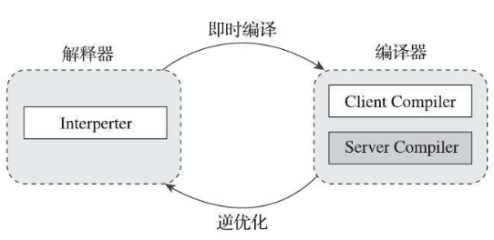
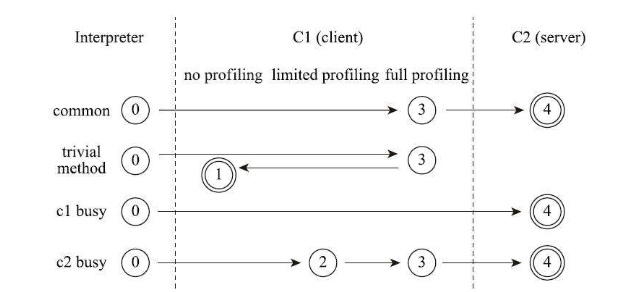
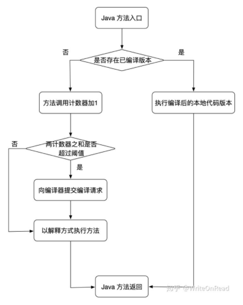
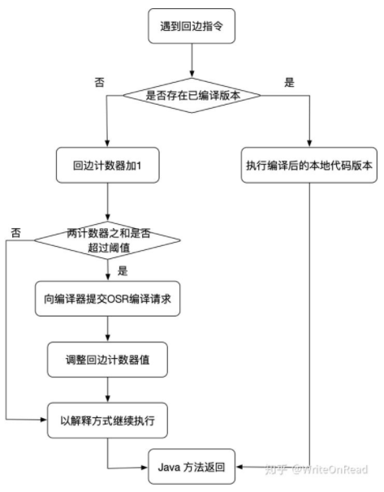
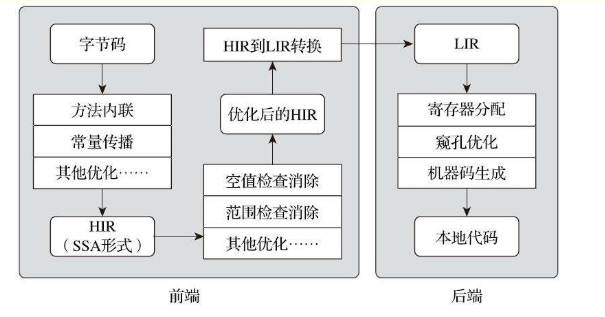

# ***后端编译与优化***

- [***后端编译与优化***](#后端编译与优化)
  - [即时编译器](#即时编译器)
      - [解释器与编译器](#解释器与编译器)
      - [编译对象与触发条件](#编译对象与触发条件)
      - [编译过程](#编译过程)
  - [提前编译器](#提前编译器)
      - [提前编译的优劣得失](#提前编译的优劣得失)
  - [编译器优化技术](#编译器优化技术)
      - [方法内联](#方法内联)
      - [逃逸分析](#逃逸分析)
      - [公共子表达式消除](#公共子表达式消除)
      - [数组边界检查消除](#数组边界检查消除)
---

&ensp;&ensp;&ensp;&ensp;如果我们把字节码看作是程序语言的一种中间表示形式（Intermediate Representation,IR）的话，那**编译器无论在何时、在何种情况下把 Class 文件转换成与本地基础设施（硬件指令集、操作系统）相关的二进制机器码，它都可以视为整个编译过程的后端。**

&ensp;&ensp;&ensp;&ensp;在 2012 年的 Java 世界里，虽然提前编译（Ahead of Time,AOT）早已有所应用，但相对而言，**即时编译（Just In Time,JIT）才是占绝对主流的编译形式。**

&ensp;&ensp;&ensp;&ensp;无论是提前编译器亦或即时编译器，都不是 Java 虚拟机必需的组成部分，但后端编译器性能的好坏、代码优化质量的高低却是衡量一款商用虚拟机优秀与否的关键指标之一，它们也是商业 Java 虚拟机中的核心，是最能体现技术水平与价值的功能。

---

## 即时编译器

&ensp;&ensp;&ensp;&ensp;Java 程序最初都是通过解释器（Interprepter）进行解释执行的，当虚拟机发现某个方法或代码块的运行特别频繁，就会把这些代码认定为 “热点代码（Hot Spot Code）”, 为了提高热点代码的执行效率，在运行时，虚拟机将会把这些代码编译成本地机器码，并以各种手段尽可能地进行代码优化，运行时完成这个任务的后端编译器被称为即时编译器。

#### 解释器与编译器

&ensp;&ensp;&ensp;&ensp;尽管并不是所有的 Java 虚拟机都采用解释器与编译器并存的运行架构，但目前主流的商用 Java 虚拟机内部都同时包含解释器与编译器，解释器与编译器两者各有优势：

&ensp;&ensp;&ensp;&ensp;当程序需要迅速启动和执行时，解释器可以首先发挥作用，省去编译的时间，立即运行。当程序启动后，随着时间的推移，编译器逐渐发挥作用，把越来越多的代码编译成本地代码，这样可以减少解释器的中间损耗，获得更高的执行效率。**当程序运行环境中内存资源限制较大，可以使用解释执行节约内存，反之可以通过编译执行来提升效率。** 同时，**解释器可以作为编译器激进优化时后备的 “逃生门”** ，让编译器根据概率选择一些不能保证所有情况都正确，但大多数都能提升运行速度的优化手段，当激进优化的假设不成立，如加载了新类以后，类型继承结构出现变化，出现 “罕见陷阱（Uncommon Trap）” 时可以通过 **逆优化（Deoptimization）** 退回到解释状态继续执行，因此**在整个 Java 虚拟机执行架构里，解释器与编译器经常时相辅相成地配合工作。**




&ensp;&ensp;&ensp;&ensp;HotSpot 虚拟机中内置了两个（或三个）即时编译器，其中两个编译器存在已久，分别被称为 “客户端编译器（Client Compiler）” 和 “服务端编译器（Server Compiler）”,或者简称为 C1 编译器和 C2 编译器，第三个是 JDK 10 时才出现的、长期目标是替代 C2 的 Graal 编译器。

&ensp;&ensp;&ensp;&ensp;在**分层编译（Tiered Compilation）** 的工作模式出现以前，HotSpot 虚拟机通常是采用解释器与其中一个编译器直接搭配的方式工作，程序使用哪个编译器，只取决于虚拟机运行的模式。

&ensp;&ensp;&ensp;&ensp;无论采用的编译器是客户端编译器还是服务端编译器，**解释器与编译器搭配使用的方式在虚拟机中被称为 “混合模式（Mixed Mode）”。**

&ensp;&ensp;&ensp;&ensp;用户可以强制虚拟机运行于 “解释模式（Interpreted）”，这时候编译器完全不介入工作，代码全部都是用解释方式执行。另外也可以强制虚拟机运行于 “编译模式（Compiled Mode）”,这时候将优先用编译方式执行程序，但是解释器仍然要在编译无法进行的情况下介入执行过程。

&ensp;&ensp;&ensp;&ensp;由于即时编译器编译本地代码需要占用程序运行时间，通常要编译出优化程度越高的代码，所花费的时间便越长；而且想要编译出优化程度更高的代码，解释器可能还要替编译器收集性能监控信息，这对解释执行阶段的速度也有所影响。为了在程序启动响应速度与运行效率之间达到最佳平衡，HotSpot 虚拟机在编译子系统中加入了分层编译的功能。

&ensp;&ensp;&ensp;&ensp;**分层编译根据编译器编译、优化的规模与耗时，划分出不同的编译层级：**

&ensp;&ensp;&ensp;&ensp;0. **程序纯解释执行，且解释器不开启性能监控功能。**
&ensp;&ensp;&ensp;&ensp;1. **使用 C1 编译器将字节码编译为本地代码来执行，进行简单可靠的稳定优化，不开启性能监控功能。**
&ensp;&ensp;&ensp;&ensp;2. **使用 C1 编译器执行，仅开启一部分性能监控功能（方法及回边次数统计等）。**
&ensp;&ensp;&ensp;&ensp;3. **使用 C1 编译器执行，开启全部性能监控（在第二层之外，还会收集如分支跳转、虚方法调用版本等全部的统计信息）。**
&ensp;&ensp;&ensp;&ensp;4. **使用 C2 编译器将字节码编译为本地代码（相比 C1 编译器，C2 编译器会启用更多编译耗时更长的优化，还会根据性能监控信息进行一些不可靠的激进优化）。**

&ensp;&ensp;&ensp;&ensp;以上层次并不是固定不变的，根据不同的运行参数和版本，虚拟机可以调整分层的数量。



&ensp;&ensp;&ensp;&ensp;**实施分层编译后，解释器、客户端编译器和服务端编译器会同时工作，热点代码都可能被多次编译，用客户端编译器获取更高的编译速度，用服务端编译器来获取更好的编译质量。**

#### 编译对象与触发条件

&ensp;&ensp;&ensp;&ensp;被即时编译器编译的目标是 “热点代码”，这里的热点代码主要有两类，包括：
>- 被多次调用的方法。
>- 被多次执行的循环体。

&ensp;&ensp;&ensp;&ensp;**对于这两种情况，编译的目标对象都是整个方法体，而不会是单独的循环体。**

&ensp;&ensp;&ensp;&ensp;第一种情况，由于是依赖方法调用触发的编译，那编译器理所当然地会以整个方法作为编译对象，这种编译也是虚拟机中标准的即时编译方式。

&ensp;&ensp;&ensp;&ensp;后一种情况，**尽管编译动作是由循环体所触发的，热点只是方法的一部分，但编译器依然必须以整个方法作为编译对象** ，只是执行入口（从方法第几条字节码指令开始执行）会稍有不同，**编译时会传入执行入口点字节码序号（Byte Code Index,BCI）。这种编译方式因为编译发生在方法执行的过程中，因此被很形象地称为 “栈上替换（On Stack Replacement,OSR）”,即方法的栈帧还在栈上，方法就被替换了。**

&ensp;&ensp;&ensp;&ensp;要知道某段代码是不是热点代码，是不是需要触发即时编译，这个行为称为 **“热点探测（Hot Spot Code Detection）”** ,目前主流的热点探测判定方式有两种：
>- **基于采样的热点探测（Sample Based Hot Spot Code Detection）:** 周期性地检查各个现成的调用栈顶（简单，不准确）。
>- **基于计数器的热点探测（Counter Based Hot Spot Code Detection）:** 为每个方法（甚至是代码块）建立计数器，统计方法的执行次数（复杂，但准确）。

&ensp;&ensp;&ensp;&ensp;这两种探测手段在商用 Java 虚拟机中都有使用过，譬如 J9 使用过第一种采样热点探测，而在 **HotSpot 虚拟机中使用的是第二种基于计数器的热点探测方法。**

&ensp;&ensp;&ensp;&ensp;为了实现热点计数，HotSpot 为每个方法准备了两类计数器：**方法调用计数器（Invocation Counter）** 和 **回边计数器（Back Edge Counter,"回边"的意思就是指在循环边界往回跳转）** 。当虚拟机运行参数确定的前提下，这两个计数器都有一个明确的阈值，计数器阈值一旦溢出，就会触发即时编译。

&ensp;&ensp;&ensp;&ensp;如果没有做过任何设置，执行引擎默认不会同步等待编译请求完成，而是继续进入解释器按照解释防止执行字节码，直到提交的请求被即时编译器编译完成。**当编译工作完成后，这个方法的调用入口地址就会被系统自动改写成新值，下一次调用该方法时就会使用已编译的版本了。**

&ensp;&ensp;&ensp;&ensp;**在默认设置下，方法调用计数器统计的并不是方法被调用的绝对次数，而是一个相对的执行频率，即一段时间之内方法被调用的次数。** 当超过一定的时间限度，如果方法的调用次数仍然不足以让它提交给即时编译器编译，那么方法的调用计数器就会被减少一半，这个过程被称为**方法调用计数器热度的衰减（Counter Decay）,而这段时间就被称为此方法统计的半衰周期（Counter Half Life Time），进行热度衰减的动作是在虚拟机进行垃圾收集时顺便进行的。** 



&ensp;&ensp;&ensp;&ensp;另一个计数器 —— 回边计数器，它的作用是统计一个方法中循环体代码执行的次数，**在字节码中遇到控制流向后跳转的指令就称为 “回边（Back Edge）”** ,很显然建立回边计数器统计的目的是为了触发栈上的替换编译。

&ensp;&ensp;&ensp;&ensp;当解释器遇到一条回边指令时，会先查找将要执行的代码片段是否有已经编译好的版本，如果有的话，它将会优先执行已编译的代码，否则就把回边计数器的值加一，然后判断方法调用计数器与回边计数器的值之和是否超过回边计数器的阈值。**当超过阈值时，将会提交一个栈上替换编译请求，并且把汇编计数器的值稍微降低一些，以便继续在解释器中执行循环，等待编译器输出编译结果。**



&ensp;&ensp;&ensp;&ensp;**与方法计数器不同，回边计数器没有计数热度衰减的过程，因此这个计数器统计的也就是该方法循环执行的绝对次数。当计数器溢出的时候，他还会把方法计数器的值也调整到溢出状态，这样下次再进入该方法的时候就会执行标准编译过程。**

#### 编译过程

&ensp;&ensp;&ensp;&ensp;在默认条件下，无论是方法调用产生的标准编译请求，还是栈上替换编译请求，虚拟机在编译器还未完成编译之前，都仍然将按照解释方式继续执行代码，而编译动作则在后台的编译线程中进行。

&ensp;&ensp;&ensp;&ensp;**服务端编译器和客户端编译器的编译过程是有所差别的，对于客户端编译器来说，它是一个相对简单快速的三段式编译器，主要的关注点在于局部性的优化，而放弃了许多耗时较长的全局优化手段。**

1. **高级中间代码表示（High-Level Intermediate Representation,HIR,即与目标机器指令集无关的中间表示）** 。HIR 使用静态单分配（Static Single Assignment,SSA）的形式来表示代码值，这可以使得一些在 HIR 的构造过程之中和之后进行的优化动作更容易实现。在此之前编译器已经会在字节码上完成一部分基础优化，如方法内联、常量传播等优化将会在字节码被构建成 HIR 之前完成。

2. **低级语言代码表示（Low-Level Intermidiate Representation，LIR，即与目标机器指令集相关的中间表示）**，而在此之前会在 HIR 上完成另外的一些优化，例如控制检查、范围检查消除等，以便让 HIR 达到更高效的代码表示形式。
   
3. **线性扫描算法（Liner Scan Register Allocation）** ,在 LIR 上分配寄存器，并在 LIR 上做窥孔（Peephole）优化，然后产生机器码。
   



---

## 提前编译器

#### 提前编译的优劣得失
&ensp;&ensp;&ensp;&ensp;现在提前编译产品和其研究有着两条明显的分支：
- 一条分支是做与传统 C、C++ 编译器类似的，在程序运行之前就把程序代码编译成机器码的静态翻译工作。
- 另一条是把原本即时编译器在运行时要做的编译工作提前做好并保存下来，下次运行到这些代码（譬如公共库代码被同一台机器其他 Java 进程使用）时直接把它加载进来使用。

&ensp;&ensp;&ensp;&ensp;第一条，这是传统的提前编译应用形式，它在 Java 中存在的价值直指即时编译器的最大弱点：**即时编译要占用程序运行时间和运算资源。**

&ensp;&ensp;&ensp;&ensp;即使现在先进的即时编译器已经足够快，即使现在先进的即时编译器架构有了分层编译的支持，可以先用快速但低质量的即时编译器为高质量的即时编译器争取出更多的编译时间，但是无论如何，**即时编译消耗的时间都是原本可以用于程序运行的时间，消耗的运算资源都是原本可用于程序运行的资源，这个约束从未减弱，更不会消失。**

&ensp;&ensp;&ensp;&ensp;譬如在编译过程中最耗时的优化措施之一是通过 “ **过程间分析（Inter-Procedural Analysis,IPA,也经常被称为全程序分析，即 Whole Program Analysis）** ” 来获得诸如某个程序点上某个变量的值是否只能有单一版本等的分析结论。这些信息对生成高质量的优化代码有着极为巨大的价值，但是要精确（譬如对流敏感、对路径敏感，对上下文敏感，对字段敏感）得到这些信息，必须在全程序范围内做大量极耗时得计算工作。

&ensp;&ensp;&ensp;&ensp;提前编译的第二条路径，本质是给即时编译器做缓存加速，去改善 Java 程序的启动时间，以及需要一段时间预热后才能达到最高性能的问题。**这种提前编译被称为动态提前编译（Dynamic AOT）或者索性就大大方方地直接叫即时编译缓存（JIT Caching）**

&ensp;&ensp;&ensp;&ensp;问题：提前编译的代码输出质量，一定会比即时编译更高吗？

&ensp;&ensp;&ensp;&ensp;三种即时编译器相对于提前编译器的天然优势：

&ensp;&ensp;&ensp;&ensp;**性能分析制导优化（Profile-Guided Optimization,PGO）：** HotSpot 的即时编译器需要解释器或者客户端编译器在运行过程中，不断地收集性能监控信息。条件分支判断、方法调用、循环次数等数据一般在静态分析时无法得到的，但在动态运行时却能看出它们具有非常明显的偏好性。

&ensp;&ensp;&ensp;&ensp;**激进预测性优化(Aggressive Speculation Optimization):** 这也已经成为很多即时编译优化措施的基础。静态优化无论如何都必须保证优化后所有的程序外部可见影响（不仅仅是执行结果）与优化前是等效的。相对于提前编译来说，即时编译的策略就不需要如此保守，如果性能监控信息能够支持它做出一些正确的可能性很大但无法保证绝对正确的预测判断，就已经可以大胆地按照高概率的假设进行优化，万一真的走到罕见分支上，大不了就退回到低级编译器甚至解释器上去执行，并不会出现无法挽救的后果。只要出错的概率足够低，这样的优化往往能够大幅度较低目标程序的复杂度，输出运行速度非常高的代码。

&ensp;&ensp;&ensp;&ensp;**链接时优化（Link-Time Optimization,LTO）：** 链接时优化是链接期间的程序优化，多个中间文件通过链接器合并在一起，并将它们组合为一个程序，缩减代码体积，因此链接时优化是对整个程序的分析和跨模块的优化。

---

## 编译器优化技术

&ensp;&ensp;&ensp;&ensp;编译器的目标虽然是做由程序代码翻译为本地机器码的工作，但其实难点并不在于能不能成功翻译出机器码，**输出代码优化质量的高低才是决定编译器优秀与否的关键。**

>- 语言无关的经典优化技术之一：公共子表达式消除。
>- 语言相关的经典优化技术之一：数组范围检查消除。
>- 最重要的优化技术之一：方法内联。
>- 最前沿的优化技术之一：逃逸分析。


#### 方法内联

&ensp;&ensp;&ensp;&ensp;**内联被称为优化之母，因为除了消除方法调用成本之外，它的更重要的意义是为其他优化手段建立良好的基础：没有内联，多数其他优化都无法有效进行。**

&ensp;&ensp;&ensp;&ensp;方法内联的优化行为理解起来是没有任何问题的，不过就是把目标方法的代码原封不动地 “复制” 到发起调用的方法之中，避免发生真实的方法调用而已。但实际上 Java 虚拟机中的内联过程却远没有想象中容易，甚至如果不是即时编译器做了一些特殊的努力，按照经典编译原理的优化理论，大多数 Java 方法都无法进行内联。

&ensp;&ensp;&ensp;&ensp;**内联与虚方法之间会产生矛盾** ，为了解决虚方法的内联问题，Java 虚拟机首先引入了一种名为 **类型继承关系分析（Class Hierarchy Analysis,CHA）** 的技术，这是整个应用程序范围内的类型分析技术，用于确定在目前已加载的类中，某个接口是否有多于一种的实现、某个类是否存在子类、某个子类是否覆盖了父类的某个虚方法等信息。这样编译器在进行内联时就会分不同情况采取不同的处理：
>1. 如果是非虚方法，那么直接内联就可以了，这种内联是由百分百安全保障的。
>2. 如果遇到虚方法，则会向 CHA 查询此方法在当前程序状态下是否真的有多个目标版本可以选择，如果查询到只有一个版本，那就可以假设 “应用程序的全貌就是现在运行的这个样子”来进行内联，这种内联被称为 **守护内联（Guarded Inlining）** 。不过由于 Java 程序时动态连接的，说不准什么时候就会加载到新的类型从而改变 CHA 结论，因此这种内联属于激进预测性优化，必须预留好“逃生门”，即当假设条件不成立时的 “退路（Slow Path）”。
>3. 假如向 CHA 查询出来的结果是该方法确实存在多个版本的目标方法可供选择，那即时编译器还将进行最后一次努力，使用 **内联缓存（Inline Cache）** 的方式来缩减方法调用的开销。这种状态下方法调用是真正发生了的，但是比起直接查虚方法表还是要快一些。内联缓存是一个建立在目标方法正常入口之前的缓存，它的工作原理大致为：在未发生方法调用之前，内联缓存为空，当第一次调用发生后，缓存记录下方法接收者的版本信息，并且每次进行方法调用时都比较接收者的版本。如果以后进来的每次调用方法接收者版本都是一样的，那么它就是一种 **单态内联缓存（Monomorphic Inline Cache）**。通过该缓存来调用，比用不内联的废墟方法调用仅多了一次类型判断的开销而已。但如果真的出现方法接收者不一致的情况，就说明程序用到了虚方法的多态特性，这时候会退化成 **超多态内联缓存（Megamorphic Inline Cache）** ,其开销相当于真正查找虚方法表来进行方法分派。


#### 逃逸分析

&ensp;&ensp;&ensp;&ensp;逃逸分析（Escape Analysis） 是目前 Java 虚拟机中比较前沿的优化技术，它与类型继承关系分析一样，并不是直接优化代码的手段，而是为其他优化措施提供依据的分析技术。

&ensp;&ensp;&ensp;&ensp;逃逸分析的基本原理是：**分析对象动态作用域，当一个对象在方法里面被定义后，它可能被外部方法所引用，例如作为调用参数传递到其他方法中，这种称为方法逃逸；** 甚至还有可能被外部线程访问到，譬如赋值给可以在其他线程中访问的实例变量，这种称谓线程逃逸；**从不逃逸、方法逃逸到线程逃逸，称为对象由低到高的不同逃逸程度。**

&ensp;&ensp;&ensp;&ensp;如果能证明一个对象不会逃逸到方法或线程之外(也就是别的方法或线程无法通过任何途径访问到这个对象)，或者逃逸程度比较低（只逃逸出方法而不会逃逸出线程），则可能为这个对象实例采取不同程度的优化，如：
1. **栈上分配（Stack Allocation）:** 在 Java虚拟机中，在 Java 堆上分配创建对象的内存空间几乎是 Java 程序员都清楚的常识了，Java 堆中的对象对于各个线程都是共享和可见的，只要持有这个对象的引用，就可以访问堆中存储的对象数据。虚拟机的垃圾收集系统可以回收堆中不再使用的对象，但回收动作无论是筛选可回收对象，还是回收和整理内存都需要耗费时间。**如果确定一个对象不会逃逸出方法之外，那让这个对象在栈上分配内存将会是一个很不错的主意，对象所占用的内存空间就可以随栈帧出栈而销毁。** 在一般应用中，不会逃逸的局部对象所占的比例很大，如果能使用栈上分配，那大量的对象就会随着方法的结束而自动销毁了，垃圾收集系统的压力将会小很多。

2. **标量替换（Scalar Replacement）：** 标量（Scalar）是指一个数据已经无法再分解成更小的数据来表示了，**Java 虚拟机中的原始数据类型（int、long 等数值类型以及 reference 类型等）都不能再进一步分解，它们就可以称为标量。** 相对的，如果一个数据可以继续分解，那它就称作**聚合量（Aggregate）** ，Java中的对象就是最典型的聚合量。如果把一个 Java 对象拆散，根据程序访问的情况，将其使用到的成员变量恢复原始类型来访问就叫做标量替换。如果逃逸分析证明一个对象不会被外部访问，并且这个对象可以被拆散的话，那程序真正执行的时候将可能不创建这个对象，而改为直接创建它的若干个被这个方法使用到的成员变量来代替。将对象拆分后，除了可以让对象的成员变量在栈上（栈上存储的数据，有很大的概率会被虚拟机分配至物理机器的高速寄存器中存储）分配和读写之外，还可以为后续进一步的优化手段创建条件。标量替换可以视为栈上分配的一种特例，实现更简单，但对逃逸程度的要求更高，它不允许对象逃逸出方法范围内。

3. **同步消除（Synchronization Elimination）：** 线程同步本身是一个相对耗时的过程，如果逃逸分析能够确定一个变量不会逃逸出线程，无法被其他线程访问，那这个变量的读写肯定就不会有竞争，对这个变量实施的同步措施也就可以消除掉。


&ensp;&ensp;&ensp;&ensp;栈上分配示例： 
```java
/** 
* 栈上分配，标量替换 
* 代码调用了1亿次alloc()，如果是分配到堆上，大概需要1GB以上堆空间，如果堆空间小于该值，必然会触发GC。 
* 
* 使用如下参数不会发生GC 
* ‐Xmx15m ‐Xms15m ‐XX:+DoEscapeAnalysis ‐XX:+PrintGC ‐XX:+EliminateAllocations 
* 使用如下参数都会发生大量GC 
* ‐Xmx15m ‐Xms15m ‐XX:‐DoEscapeAnalysis ‐XX:+PrintGC ‐XX:+EliminateAllocations 
* ‐Xmx15m ‐Xms15m ‐XX:+DoEscapeAnalysis ‐XX:+PrintGC ‐XX:‐EliminateAllocations 
*/

//结论：栈上分配依赖于逃逸分析和标量替换
public class AllotOnStack {
      public static void main(String[] args) { 
            long start = System.currentTimeMillis(); 
            for (int i = 0; i < 100000000; i++) { 
                  alloc(); 
            } 
            long end = System.currentTimeMillis(); 
            System.out.println(end ‐ start); 
      }
      private static void alloc() { 
            User user = new User(); 
            user.setId(1); 
            user.setName("zzz");
      }
}
```

#### 公共子表达式消除

&ensp;&ensp;&ensp;&ensp;**公共子表达式消除是一项非常经典、普遍应用于各种编译器的优化技术** ，它的含义是：如果一个表达式 E 已经计算过了，并且从先前的计算到现在 E 中所有变量的值都没有发生变化，那么 E 的这次出现就成为了公共子表达式。对于这种表达式，没有必要花时间再对它重新进行计算，只需要直接用前面计算过的表达式结果代替 E 就可以了。如果这种优化仅限于程序的基本块内，便称为 **局部公共子表达式消除（Local Common Subexpression Elimination）** ，如果这种优化的范围涵盖了多个基本块，那就称为 **全局公共子表达式消除（Global CommonSubexpression Elimination）** 。

```java
int d = (c * b) * 12 + a + (a + b * c);

int d = E * 12 + a + (a + E);
```
&ensp;&ensp;&ensp;&ensp;这时候编译器可能进行另外一种优化 ———— **代数化简（Algebraic Simplification）**

```java
int d = E * 13 + a + a;
```

#### 数组边界检查消除

&ensp;&ensp;&ensp;&ensp;**数组边界检查消除（Array Bounds Checking Elimination）是即时编译器中的一项语言相关的经典优化技术。**

&ensp;&ensp;&ensp;&ensp;在 Java 语言中访问数组元素的时候系统将会自动进行上下界的范围检查，但是对于虚拟机的执行子系统来说，每次数组元素的读写都带有一次隐含的条件判定操作，对于拥有大量数组访问的程序代码，这必定是一种性能负担。

&ensp;&ensp;&ensp;&ensp;无论如何为了安全，数组边界检查肯定是要做的，但数组边界检查是不是必须在运行期间一次不漏地进行则是可以 “商量” 的事情。