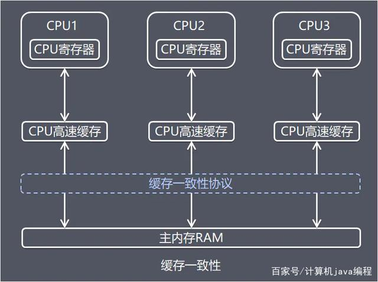
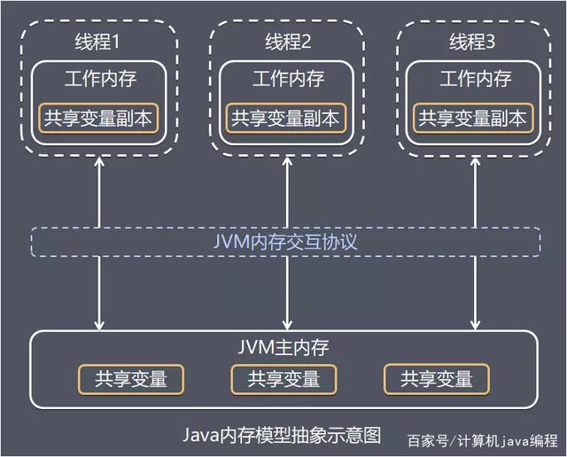
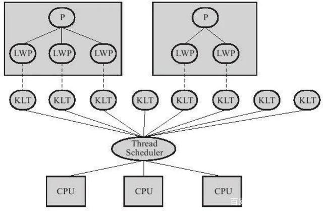
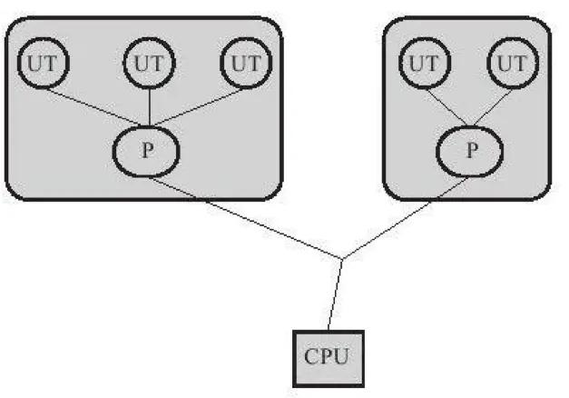
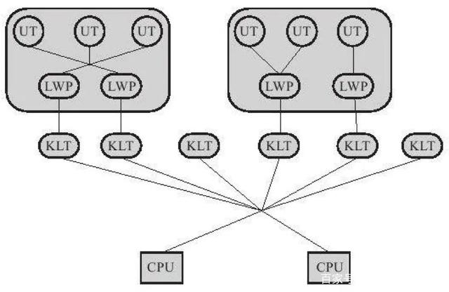

# ***Java 内存模型与线程***


- [***Java 内存模型与线程***](#java-内存模型与线程)
  - [硬件的效率与一致性](#硬件的效率与一致性)
  - [Java 内存模型](#java-内存模型)
        - [主内存与工作内存](#主内存与工作内存)
        - [内存间交互操作](#内存间交互操作)
        - [对于volatile型变量的特殊规则](#对于volatile型变量的特殊规则)
        - [针对 long 和 double 型变量的特殊规则](#针对-long-和-double-型变量的特殊规则)
        - [原子性、 可见性与有序性](#原子性-可见性与有序性)
          - [原子性（Atomicity）](#原子性atomicity)
          - [可见性（Visibility）](#可见性visibility)
          - [有序性（Ordering）](#有序性ordering)
        - [先行发生原则](#先行发生原则)
  - [Java 与线程](#java-与线程)
        - [线程的实现](#线程的实现)
          - [内核线程实现](#内核线程实现)
          - [用户线程实现](#用户线程实现)
          - [混合实现](#混合实现)
        - [Java 线程的实现](#java-线程的实现)
        - [Java线程调度](#java线程调度)
        - [状态转换](#状态转换)
---
&ensp;&ensp;&ensp;&ensp;**衡量一个服务性能的好坏，每秒事务处理数（Transactions Per Second,TPS）是最重要的指标之一** ，它代表着一秒内服务端平均能响应的请求总数，而 TPS 值与并发度密切相关。

## 硬件的效率与一致性

&ensp;&ensp;&ensp;&ensp;处理器要和内存交互(取运算数据、存储运算结果…)，这个 I/O 操作是很难消除的（无法仅靠寄存器来完成所有运算任务）。由于计算机的存储设备与处理器的运算速度有几个数量级的差距，所以现代计算机系统都不得不加入一层读写速度尽可能接近处理器运算速度的高速缓存（Cache）来作为内存与处理器之间的缓冲：**将运算需要使用到的数据复制到缓存中，让运算能快速进行，当运算结束后再从缓存同步回内存之中，这样处理器就无须等待缓慢的内存读写了。**

&ensp;&ensp;&ensp;&ensp;高速缓存的存储交互很好地解决了处理器与内存的速度矛盾，但是它引入了一个新的问题：**缓存一致性（Cache Coherence）**。

&ensp;&ensp;&ensp;&ensp;在多处理器系统中，每个处理器都有自己的高速缓存，而它们又共享同一 **主内存（Main Memory）** ，当多个处理器的运算任务都涉及同一块主内存区域时，将可能导致各自的缓存数据不一致，如果真的发生这种情况，那同步回到主内存时以谁的缓存数据为准呢？为了解决一致性的问题，需要各个处理器访问缓存时都遵循一些协议，在读写时要根据协议来进行操作，这类协议有 MSI、 MESI（Illinois Protocol）、 MOSI、 Synapse、 Firefly 及 Dragon Protocol 等。

&ensp;&ensp;&ensp;&ensp;除了增加高速缓存之外，为了使得处理器内部的运算单元能尽量被充分利用，处理器可能会对输入代码进行 **乱序执行（Out-Of-Order Execution）优化** ；与处理器的乱序执行优化类似，Java 虚拟机的即时编译器中也有类似的 **指令重排序（Instruction Reorder）优化** 。



----

## Java 内存模型

&ensp;&ensp;&ensp;&ensp;Java虚拟机规范中试图定义一种 **Java内存模型（Java Memory Model,JMM）** 来屏蔽掉各种硬件和操作系统的内存访问差异，以实现让 Java 程序在各种平台下都能达到一致的内存访问效果。 C/C++ 等则直接使用物理硬件和操作系统的内存模型，因此，会由于不同平台上内存模型的差异而导致程序的移植性比较差。

&ensp;&ensp;&ensp;&ensp;Java 内存模型必须定义得足够严谨，才能让 Java 的并发内存访问操作不会产生歧义；但是，也必须定义得足够宽松，使得虚拟机的实现有足够的自由空间去利用硬件的各种特性（寄存器、高速缓存和指令集中某些特有的指令）来获取更好的执行速度。

##### 主内存与工作内存

&ensp;&ensp;&ensp;&ensp;Java 内存模型的主要目标是定义程序中各个变量的访问规则，即 **关注在虚拟机中将变量值存储到内存和从内存中取出变量值这样的底层细节。** 此处的变量（Variables）与 Java 编程中的变量有所区别，它包括了实例字段、静态字段和构成数组对象的元素，但不包括局部变量与方法参数，因为后者是线程私有的，不会被共享，自然就不会存在竞争问题。

&ensp;&ensp;&ensp;&ensp;Java 内存模型并没有限制执行引擎使用处理器的特定寄存器或缓存来和主内存进行交互，也没有限制即时编译器进行调整代码执行顺序这类优化措施。

&ensp;&ensp;&ensp;&ensp;Java 内存模型规定了所有的变量都存储在 **主内存（Main Memory，类比物理内存）** 。每条线程还有自己的 **工作内存（Working Memory，类比处理器高速缓存）** ，线程的工作内存中保存了被该线程使用到的变量的主内存副本拷贝。**线程对变量的所有操作（读取、赋值等）都必须在工作内存中进行，而不能直接读写主内存中的变量。不同的线程之间也无法直接访问对方工作内存中的变量，线程间变量值的传递均需要通过主内存来完成。**



&ensp;&ensp;&ensp;&ensp;粗略来看，主内存主要对应于 Java 堆中的对象实例数据部分，而工作内存则对应于虚拟机栈中的部分区域。 从更低层次上说，主内存就直接对应于物理硬件的内存，而为了获取更好的运行速度，虚拟机（甚至是硬件系统本身的优化措施）可能会让工作内存优先存储于寄存器和高速缓存中，因为程序运行时主要访问读写的是工作内存。

##### 内存间交互操作

&ensp;&ensp;&ensp;&ensp;关于主内存与工作内存之间具体的交互协议，即一个变量如何从主内存拷贝到工作内存、如何从工作内存同步回主内存之类的实现细节，Java 内存模型中定义了以下 8 种操作来完成，虚拟机实现时必须保证下面提及的每一种操作都是原子的、 不可再分的。

>- **lock（锁定）**：作用于主内存的变量，它把一个变量标识为一条线程独占的状态。
>- **unlock（解锁）**：作用于主内存的变量，它把一个处于锁定状态的变量释放出来，释放后的变量才可以被其他线程锁定。
>- **read（读取）**：作用于主内存的变量，它把一个变量的值从主内存传输到线程的工作内存中，以便随后的`load`动作使用。
>- **write（写入）**：作用于主内存的变量，它把`store`操作从工作内存中得到的变量的值放入主内存的变量中。
>- **store（存储）**：作用于工作内存的变量，它把工作内存中一个变量的值传送到主内存中，以便随后的`write`操作使用。(`store`后`write`)
>- **load（载入）**：作用于工作内存的变量，它把`read`操作从主内存中得到的变量值放入工作内存的变量副本中。(`read`以后`load`)
>- **use（使用）**：作用于工作内存的变量，它把工作内存中一个变量的值传递给执行引擎，每当虚拟机遇到一个需要使用到变量的值的字节码指令时将会执行这个操作。
>- **assign（赋值）**：作用于工作内存的变量，它把一个从执行引擎接收到的值赋给工作内存的变量，每当虚拟机遇到一个给变量赋值的字节码指令时执行这个操作。

&ensp;&ensp;&ensp;&ensp;如果要把一个变量从主内存复制到工作内存，那就要顺序地执行`read`和`load`操作，如果要把变量从工作内存同步回主内存，就要顺序地执行`store`和`write`操作。注意，**Java内存模型只要求上述两个操作必须按顺序执行，而没有保证是连续执行**。

&ensp;&ensp;&ensp;&ensp;Java 内存模型还规定了在执行上述 8 种基本操作时必须满足如下规则:
1. 不允许`read`和`load`、`store`和`write`操作之一单独出现，即不允许一个变量从主内存读取了但工作内存不接受，或者从工作内存发起回写了但主内存不接受的情况出现。
2. 不允许一个线程丢弃它的最近的`assign`操作，即变量在工作内存中改变了之后必须把该变化同步回主内存。
3. 不允许一个线程无原因地（没有发生过任何`assign`操作）把数据从线程的工作内存同步回主内存中。
4. 一个新的变量只能在主内存中 “诞生”，不允许在工作内存中直接使用一个未被初始化（`load`或`assign`）的变量，换句话说，就是对一个变量实施`use`、`store`操作之前，必须先执行过了`load`和`assign`操作。
5. 一个变量在同一个时刻只允许一条线程对其进行`lock`操作，但`lock`操作可以被同一条线程重复执行多次，多次执行`lock`后，只有执行相同次数的`unlock`操作，变量才会被解锁。
6. 如果对一个变量执行`lock`操作，那将会清空工作内存中此变量的值，在执行引擎使用这个变量前，需要重新执行`load`或`assign`操作初始化变量的值。
7. 如果一个变量事先没有被`lock`操作锁定，那就不允许对它执行`unlock`操作，也不允许去`unlock`一个被其他线程锁定住的变量。
8. 对一个变量执行`unlock`操作之前，必须先把此变量同步回主内存中（执行`store`、 `write`操作）。

&ensp;&ensp;&ensp;&ensp;这 8 种内存访问操作以及上述规则限定，再加上对 volatile 的一些特殊规定，就可以完全确定了 Java 程序中哪些内存访问操作在并发下是安全的。

##### 对于volatile型变量的特殊规则

&ensp;&ensp;&ensp;&ensp;关键字 volatile 可以说是 Java 虚拟机提供的最轻量级的同步机制。

&ensp;&ensp;&ensp;&ensp;**当一个变量被定义成 volatile 之后，它将具备两项特性：可见性以及禁止指令重排序优化。**这里的 “可见性” 是指当一条线程修改了这个变量的值，新值对于其他线程来说是可以立即得知的。

&ensp;&ensp;&ensp;&ensp;关于 volatile 变量的可见性的误解 : “ volatile 变量对所有线程是立即可见的，对 volatile 变量所有的写操作都能立刻反应到其他线程之中，换句话说，volatile 变量在各个线程中是一致的，所以基于 volatile 变量的运算在并发下是安全的”。这句话的论据部分并没有错，但是并不能得出 “基于 volatile 变量的运算在并发下是安全的” 这个结论。**volatile 变量在各个线程的工作内存中不存在一致性问题（在各个线程的工作内存中，volatile 变量也可以存在不一致的情况，但由于每次使用之前都要先刷新，执行引擎看不到不一致的情况，因此可以认为不存在一致性问题），但是 Java 里面的运算并非原子操作，导致 volatile 变量的运算在并发下一样是不安全的。**

&ensp;&ensp;&ensp;&ensp;由于 volatile 变量只能保证可见性，在不符合以下两条规则的运算场景中，我们仍然要通过加锁（使用 synchronized 或 `java.util.concurrent` 中的原子类）来保证原子性。
1. 运算结果并不依赖变量的当前值，或者能够确保只有单一的线程修改变量的值。
2. 变量不需要与其他的状态变量共同参与不变约束。

```java
// volatile 变量使用场景
volatile boolean shutdownRequested;

public void shutdown(){
    shutdownRequested = true;
}

public void doWork() {
    while (!shutdownRequested){
        //do stuff
    }
}
```

&ensp;&ensp;&ensp;&ensp;使用 volatile 变量的第二个语义是禁止指令重排序优化，普通的变量仅会保证在该方法的执行过程中所有依赖赋值结果的地方都能获取到正确的结果，而不能保证变量赋值操作的顺序与程序代码中的执行顺序一致。因为在一个线程的方法执行过程中无法感知到这点，这也就是 Java 内存模型中描述的所谓的“ **线程内表现为串行的语义（Within-Thread As-If-Serial Semantics）** ”。 


```java
// A 线程

// 此变量必须定义为volatile
volatile boolean initialized = false；
// 假设以下代码在线程A中执行
// 模拟读取配置信息，当读取完成后将 initialized 设置为 true 以通知其他线程配置可用
configOptions=new HashMap();
configText=readConfigFile(fileName);
processConfigOptions(configText,configOptions);
initialized = true;


// B 线程

// 等待initialized为 true，代表线程A已经把配置信息初始化完成
while(!initialized){
sleep();
}// 使用线程A中初始化好的配置信息
doSomethingWithConfig（）；
```

&ensp;&ensp;&ensp;&ensp;如果定义 initialized 变量时没有使用 volatile 修饰，就可能会由于指令重排序的优化，导致位于线程 A 中最后一句的代码`initialized = true`被提前执行（提前执行是指这句话对应的汇编代码被提前执行），这样在线程 B 中使用配置信息的代码就可能出现错误，而 volatile 关键字则可以避免此类情况的发生。


```java 
public class Singleton {
    private volatile static Singleton instance;

    public static Singleton getInstance() {
        if (instance == null) {
            synchronized (Singleton.class) {
                if (instance == null) {
                    instance = new Singleton();
                }
            }
        }
        return instance;
    }

    public static void main(String[] args) {
        Singleton.getInstance();
    }
}
```

&ensp;&ensp;&ensp;&ensp;`lock addl $0x0,(%esp) ;`

&ensp;&ensp;&ensp;&ensp;这个操作的作用相当于一个`内存屏障（Memory Barrier 或 Memory Fence，指重排序时不能把后面的指令重排序到内存屏障之前的位置）`，只有一个处理器访问内存时，并不需要内存屏障；但如果有两个或更多 CPU 访问同一块内存，且其中有一个在观测另一个，就需要内存屏障来保证一致性了。

&ensp;&ensp;&ensp;&ensp;这句指令中的`addl ＄ 0x0，（%esp）`（把 ESP 寄存器的值加 0）显然是一个空操作（采用这个空操作而不是空操作指令 `nop` 是因为 IA32 手册规定 `lock` 前缀不允许配合 `nop` 指令使用），关键在于`lock`前缀，查询 IA32 手册，它的作用是使得本 CPU 的 Cache 写入了内存，该写入动作也会引起别的 CPU 或者别的内核无效化（Invalidate）其 Cache，这种操作相当于对 Cache 中的变量做了一次前面介绍 Java 内存模式中所说的 “`store`和`write`” 操作。所以通过这样一个空操作，可让前面 volatile 变量的修改对其他 CPU 立即可见。

&ensp;&ensp;&ensp;&ensp;指令重排序是指 CPU 采用了允许将多条指令不按程序规定的顺序分开发送给各相应电路单元处理。但并不是说指令任意重排，CPU 需要能正确处理指令依赖情况以保障程序能得出正确的执行结果。譬如指令 1 把地址 A 中的值加 10，指令 2 把地址 A 中的值乘以 2，指令 3 把地址 B 中的值减去 3，这时指令 1 和指令 2 是有依赖的，它们之间的顺序不能重排 —— `（A+10）*2`与`A*2+10`显然不相等，但指令 3 可以重排到指令 1、2 之前或者中间，只要保证 CPU 执行后面依赖到 A、B 值的操作时能获取到正确的 A 和 B 值即可。所以在本 CPU 中，重排序看起来依然是有序的。 因此，`lock addl＄0x0，（%esp）`指令把修改同步到内存时，意味着所有之前的操作都已经执行完成，这样便形成了“ **指令重排序无法越过内存屏障** ”的效果。

&ensp;&ensp;&ensp;&ensp;某些情况下，volatile 的同步机制的性能确实要优于锁，但是由于虚拟机对锁实行的许多消除和优化，使得我们很难量化地认为 volatile 就会比 synchronized 快多少。 如果让 volatile 自己与自己比较，那可以确定一个原则： **volatile变量读操作的性能消耗与普通变量几乎没有什么差别，但是写操作则可能会慢一些，因为它需要在本地代码中插入许多内存屏障指令来保证处理器不发生乱序执行** 。不过即便如此，大多数场景下 volatile 的总开销仍然要比锁低，我们在 volatile 与锁之中选择的唯一依据仅仅是 volatile 的语义能否满足使用场景的需求。

&ensp;&ensp;&ensp;&ensp;Java 内存模型中对 volatile 变量定义的特殊规则的定义：
1. 只有当线程 T 对变量 V 执行的前一个动作是`load`的时候，线程 T 才能对变量 V 执行`use`动作；并且，只有当线程 T 对变量 V 执行的后一个动作是`use`的时候，线程 T 才能对变量 V 执行`load`动作。线程 T 对变量 V 的 `use` 动作可以认为是和线程 T 对变量 V 的`load`、`read`动作相关联，必须连续一起出现（ **这条规则要求在工作内存中，每次使用V前都必须先从主内存刷新最新的值，用于保证能看见其他线程对变量V所做的修改后的值** ）。
2. 只有当线程 T 对变量 V 执行的前一个动作是 `assign` 的时候，线程 T 才能对变量 V 执行`store`动作；并且，只有当线程 T 对变量 V 执行的后一个动作是`store`的时候，线程 T 才能对变量 V 执行`assign`动作。线程 T 对变量 V 的`assign`动作可以认为是和线程 T 对变量 V 的`store`、`write`动作相关联，必须连续一起出现（ **这条规则要求在工作内存中，每次修改V后都必须立刻同步回主内存中，用于保证其他线程可以看到自己对变量V所做的修改** ）。
3. 假定动作 A 是线程 T 对变量 V 实施的`use`或`assign`动作，假定动作 F 是和动作 A 相关联的`load`或`store`动作，假定动作 P 是和动作 F 相应的对变量 V 的`read`或`write`动作；类似的，假定动作 B 是线程 T 对变量 W 实施的 `use` 或 `assign` 动作，假定动作 G 是和动作 B 相关联的`load`或`store`动作，假定动作 Q 是和动作 G 相应的对变量 W 的`read`或`write`动作。如果 A 先于 B ，那么 P 先于 Q（ **这条规则要求 volatile 修饰的变量不会被指令重排序优化，保证代码的执行顺序与程序的顺序相同** ）。

##### 针对 long 和 double 型变量的特殊规则

&ensp;&ensp;&ensp;&ensp;Java 内存模型要求 `lock`、`unlock`、`read`、`load`、`assign`、`use`、`store`、`write`这 8 个操作都具有原子性，但是对于 64 位的数据类型（long 和 double），在模型中特别定义了一条相对宽松的规定：**允许虚拟机将没有被 volatile 修饰的 64 位数据的读写操作划分为两次 32 位的操作来进行，即允许虚拟机实现选择可以不保证 64 位数据类型的`load`、`store`、`read`和`write`这 4 个操作的原子性，这点就是所谓的`long`和`double`的非原子性协定（Non-Atomic Treatment of double and long Variables）。**

&ensp;&ensp;&ensp;&ensp;如果有多个线程共享一个并未声明为 volatile 的 long 或 double 类型的变量，并且同时对它们进行读取和修改操作，那么某些线程可能会读取到一个既非原值，也不是其他线程修改值的代表了 “半个变量” 的数值。但是这种情况基本不可能。

&ensp;&ensp;&ensp;&ensp;实际开发中，除非该数据有明确可知的线程竞争，否则我们在编写代码时一般不需要因为这个原因刻意把用到的 long 和 double 变量专门声明为 volatile。

##### 原子性、 可见性与有序性

##### 原子性（Atomicity）

&ensp;&ensp;&ensp;&ensp;由 Java 内存模型来直接保证的原子性变量操作包括`read`、`load`、`assign`、`use`、`store`和`write`，我们大致可以认为基本数据类型的访问读写是具备原子性的。（例外就是 float 和 double 的非原子性协定）

&ensp;&ensp;&ensp;&ensp;如果应用场景需要一个更大范围的原子性保证，Java 内存模型还提供了 `lock` 和 `unlock` 操作来满足这种需求，尽管虚拟机未把 `lock` 和 `unlock` 操作直接开放给用户使用，但是却提供了更高层次的字节码指令 `monitorenter` 和 `monitorexit` 来隐式地使用这两个操作，这两个字节码指令反映到 Java 代码中就是同步块 —— synchronized 关键字，因此在 synchronized 块之间的操作也具备原子性。

##### 可见性（Visibility）

&ensp;&ensp;&ensp;&ensp;**可见性是指当一个线程修改了共享变量的值，其他线程能够立即得知这个修改。**

&ensp;&ensp;&ensp;&ensp;**Java 内存模型是通过在变量修改后将新值同步回主内存，在变量读取前从主内存刷新变量值这种依赖主内存作为传递媒介的方式来实现可见性的** ，无论是普通变量还是 volatile 变量都是如此，普通变量与 volatile 变量的区别是，volatile 的特殊规则保证了新值能立即同步到主内存，以及每次使用前立即从主内存刷新。因此，可以说 volatile 保证了多线程操作时变量的可见性，而普通变量则不能保证这一点。

&ensp;&ensp;&ensp;&ensp;除了 volatile 之外，Java 还有两个关键字能实现可见性，即`synchronized`和`final`。
1. 同步块的可见性是由 “对一个变量执行`unlock`操作之前，必须先把此变量同步回主内存中（执行store、write操作）” 这条规则获得的。
2. 而 final 关键字的可见性是指：被 final 修饰的字段在构造器中一旦初始化完成，并且构造器没有把 “this” 的引用传递出去（this 引用逃逸是一件很危险的事情，其他线程有可能通过这个引用访问到 “初始化了一半” 的对象），那在其他线程中就能看见 final 字段的值。

##### 有序性（Ordering）

&ensp;&ensp;&ensp;&ensp;Java 程序中天然的有序性可以总结为一句话：**如果在本线程内观察，所有的操作都是有序的；如果在一个线程中观察另一个线程，所有的操作都是无序的。** 前半句是指 **“线程内表现为串行的语义（Within-Thread As-If-Serial Semantics）”** ，后半句是指“ **指令重排序** ”现象和“ **工作内存与主内存同步延迟** ”现象。

&ensp;&ensp;&ensp;&ensp;Java 语言提供了 volatile 和 synchronized 两个关键字来保证线程之间操作的有序性，volatile 关键字本身就包含了禁止指令重排序的语义，而 synchronized 则是由“ **一个变量在同一个时刻只允许一条线程对其进行`lock`操作** ”这条规则获得的，这条规则决定了持有同一个锁的两个同步块只能串行地进入。


##### 先行发生原则

&ensp;&ensp;&ensp;&ensp;Java 语言中有一个 “**先行发生（happens-before）**”原则，这个原则非常重要，依靠这个原则，我们可以通过几条规则解决并发环境下两个操作之间是否可能存在冲突的所有问题。

&ensp;&ensp;&ensp;&ensp;先行发生是 Java 内存模型中定义的两项操作之间的偏序关系，如果说操作 A 先行发生于操作 B，其实就是说在发生操作 B 之前，操作 A 产生的影响能被操作 B 观察到，“影响” 包括修改了内存中共享变量的值、 发送了消息、 调用了方法等。

&ensp;&ensp;&ensp;&ensp;Java 内存模型下一些 “天然的” 先行发生关系，这些先行发生关系无须任何同步器协助就已经存在，可以在编码中直接使用。 如果两个操作之间的关系不在此列，并且无法从下列规则推导出来的话，它们就没有顺序性保障，虚拟机可以对它们随意地进行重排序。

>- **程序次序规则（Program Order Rule）：** 在一个线程内，按照程序代码顺序，书写在前面的操作先行发生于书写在后面的操作。准确地说，应该是控制流顺序而不是程序代码顺序，因为要考虑分支、 循环等结构。
>- **管程锁定规则（Monitor Lock Rule）：** 一个`unlock`操作先行发生于后面对同一个锁的`lock`操作。 这里必须强调的是同一个锁，而 “后面” 是指时间上的先后顺序。
>- **volatile 变量规则（Volatile Variable Rule）：** 对一个 volatile 变量的写操作先行发生于后面对这个变量的读操作，这里的 “后面” 同样是指时间上的先后顺序。
>- **线程启动规则（Thread Start Rule）：** Thread 对象的`start()`方法先行发生于此线程的每一个动作。
>- **线程终止规则（Thread Termination Rule）：** 线程中的所有操作都先行发生于对此线程的终止检测，我们可以通过`Thread.join()`方法结束、 `Thread.isAlive()`的返回值等手段检测到线程已经终止执行。
>- **线程中断规则（Thread Interruption Rule）：** 对线程`interrupt()`方法的调用先行发生于被中断线程的代码检测到中断事件的发生，可以通过`Thread.interrupted()`方法检测到是否有中断发生。
>- **对象终结规则（Finalizer Rule）：** 一个对象的初始化完成（构造函数执行结束）先行发生于它的`finalize()`方法的开始。
>- **传递性（Transitivity）：** 如果操作 A 先行发生于操作 B，操作 B 先行发生于操作 C，那就可以得出操作 A先 行发生于操作 C 的结论。

&ensp;&ensp;&ensp;&ensp;**时间上的先后顺序与先行发生原则之间基本没有因果关系，所以我们衡量并发安全问题的时候不要受到时间顺序的干扰，一切必须以先行发生原则为准。**

----

## Java 与线程

##### 线程的实现

&ensp;&ensp;&ensp;&ensp;线程是比进程更轻量级的调度执行单位，线程的引入，可以把一个进程的资源分配和执行调度分开，各个线程既可以共享进程资源（内存地址、文件 I/O 等），又可以独立调度（线程是 CPU 调度的基本单位）。

Java 中每个已经执行`start()`且还未结束的`java.lang.Thread`类的实例就代表了一个线程。Thread 类的所有关键方法都是声明为 Native 的(没法使用平台无关的方式实现)。

&ensp;&ensp;&ensp;&ensp;实现线程主要有 3 种方式：
1. 使用内核线程实现。
2. 使用用户线程实现。
3. 使用用户线程加轻量级进程混合实现。


##### 内核线程实现

&ensp;&ensp;&ensp;&ensp;**内核线程（Kernel-Level Thread,KLT,1:1 实现）就是直接由操作系统内核（Kernel，下称内核）支持的线程，这种线程由内核来完成线程切换，内核通过操纵调度器（Scheduler）对线程进行调度，并负责将线程的任务映射到各个处理器上。**

&ensp;&ensp;&ensp;&ensp;程序一般使用**内核线程的一种高级接口 —— 轻量级进程（Light Weight Process,LWP）** ，轻量级进程就是我们通常意义上所讲的线程，**每个轻量级进程都由一个内核线程支持。** 

&ensp;&ensp;&ensp;&ensp;轻量级进程具有它的局限性：首先，由于是基于内核线程实现的，所以各种线程操作，如创建、析构及同步，都需要进行系统调用。 而系统调用的代价相对较高，需要在 **用户态（User Mode）** 和 **内核态（KernelMode）** 中来回切换。其次，每个轻量级进程都需要有一个内核线程的支持，因此轻量级进程要消耗一定的内核资源（如内核线程的栈空间），因此一个系统支持轻量级进程的数量有限。


##### 用户线程实现
&ensp;&ensp;&ensp;&ensp;广义上讲，一个线程只要不是内核线程，都可以认为是用户线程（User Thread, UT, 1:N 实现），因此从这个定义上看，轻量级进程也属于用户线程。

&ensp;&ensp;&ensp;&ensp;**用户线程的优势在于不需要系统内核支援，劣势也在于没有系统内核的支援，所有的线程操作都需要用户程序自己处理。**  线程的创建、切换和调度都是需要考虑的问题，而且由于操作系统只把处理器资源分配到进程，那诸如 “阻塞如何处理”、“多处理器系统中如何将线程映射到其他处理器上” 这类问题解决起来将会异常困难，甚至不可能完成。Java、Ruby 等语言都曾经使用过用户线程，最终又都放弃使用它。



##### 混合实现

&ensp;&ensp;&ensp;&ensp;线程除了以来内核线程实现和完全由用户程序自己实现之外，还有一种将内核线程与用户线程一起使用的实现方式，被称为 ***N:M*** 实现。

&ensp;&ensp;&ensp;&ensp;在这种混合实现下，既存在用户线程，也存在轻量级进程。 用户线程还是完全建立在用户空间中，因此用户线程的创建、切换、析构等操作依然廉价，并且可以支持大规模的用户线程并发。而操作系统提供支持的轻量级进程则作为用户线程和内核线程之间的桥梁，这样可以使用内核提供的线程调度功能及处理器映射，并且用户线程的系统调用要通过轻量级线程来完成，大大降低了整个进程被完全阻塞的风险。在这种混合模式中，用户线程与轻量级进程的数量比是不定的，即为 N：M 的关系。



##### Java 线程的实现

&ensp;&ensp;&ensp;&ensp;Java 线程在 JDK 1.2 之前，是基于称为 **“绿色线程”（Green Threads）** 的用户线程实现的，而在 JDK1.2 中，线程模型替换为基于操作系统原生线程模型来实现。

&ensp;&ensp;&ensp;&ensp;目前的 JDK 版本中，操作系统支持怎样的线程模型取决于 Java 虚拟机的线程是怎样映射。线程模型只对线程的并发规模和操作成本产生影响，对 Java 程序的编码和运行过程来说，这些差异都是透明的。

##### Java线程调度

&ensp;&ensp;&ensp;&ensp;线程调度是指系统为线程分配处理器使用权的过程，主要调度方式有两种，分别是**协同式线程调度（Cooperative Threads-Scheduling）**和**抢占式线程调度（Preemptive ThreadsScheduling）**。

&ensp;&ensp;&ensp;&ensp;**协同式调度: 线程的执行时间由线程本身来控制** ，**线程把自己的工作执行完了之后，要主动通知系统切换到另外一个线程上。优点是实现简单，而且由于线程要把自己的事情干完后才会进行线程切换，切换操作对线程自己是可知的，所以没有什么线程同步的问题。缺点：线程执行时间不可控制，甚至如果一个线程编写有问题，一直不告知系统进行线程切换，那么程序就会一直阻塞在那里。**

&ensp;&ensp;&ensp;&ensp;**抢占式调度:线程将由系统来分配执行时间** ，**线程的切换不由线程本身来决定（在 Java 中，`Thread.yield()`可以让出执行时间，但是要获取执行时间的话，线程本身是没有什么办法的）。在这种实现线程调度的方式下，线程的执行时间是系统可控的，也不会有一个线程导致整个进程阻塞的问题，Java 使用的线程调度方式就是抢占式调度。**

&ensp;&ensp;&ensp;&ensp;Java 语言一共设置了 10 个级别的线程优先级（`Thread.MIN_PRIORITY`至`Thread.MAX_PRIORITY`），在两个线程同时处于 Ready 状态时，优先级越高的线程越容易被系统选择执行。Java 的线程是通过映射到系统的原生线程上来实现的，所以 **线程调度最终还是取决于操作系统** ，即系统线程优先级跟 Java 线程的优先级一般对不上。

&ensp;&ensp;&ensp;&ensp;**优先级可能会被系统自行改变**

##### 状态转换

&ensp;&ensp;&ensp;&ensp;Java 语言定义了 6 种线程状态，在任意一个时间点，一个线程只能有且只有其中的一种状态，并且可以通过特定的方法在不同状态之间转换。

1. **新建（New）：** 创建后尚未启动的线程处于这种状态。
2. **运行（Runable）：** `Runable`包括了操作系统线程状态中的`Running`和`Ready`，也就是处于此状态的线程有可能正在执行，也有可能正在等待着 CPU 为它分配执行时间。
3. **无限期等待（Waiting）：** 处于这种状态的线程不会被分配 CPU 执行时间，它们要等待被其他线程显式地唤醒。 以下方法会让线程陷入无限期的等待状态
>- 没有设置 Timeout 参数的`Object.wait()`方法。
>- 没有设置 Timeout 参数的`Thread.join()`方法。
>- `LockSupport.park()`方法。
4.  **限期等待（Timed Waiting）：** 处于这种状态的线程也不会被分配 CPU 执行时间，不过无须等待被其他线程显式地唤醒，在一定时间之后它们会由系统自动唤醒。以下方法会让线程进入限期等待状态：
>- `Thread.sleep()`方法。
>- 设置了 Timeout 参数的`Object.wait()`方法。
>- 设置了 Timeout 参数的`Thread.join()`方法。
>- `LockSupport.parkNanos()`方法。
>- `LockSupport.parkUntil()`方法。
5. **阻塞（Blocked）：** 线程被阻塞了，“阻塞状态” 与 “等待状态” 的区别是：“阻塞状态” 在等待着获取到一个排他锁，这个事件将在另外一个线程放弃这个锁的时候发生；而 “等待状态” 则是在等待一段时间，或者唤醒动作的发生。 在程序等待进入同步区域的时候，线程将进入这种状态。
6. **结束（Terminated）：** 已终止线程的线程状态，线程已经结束执行。

