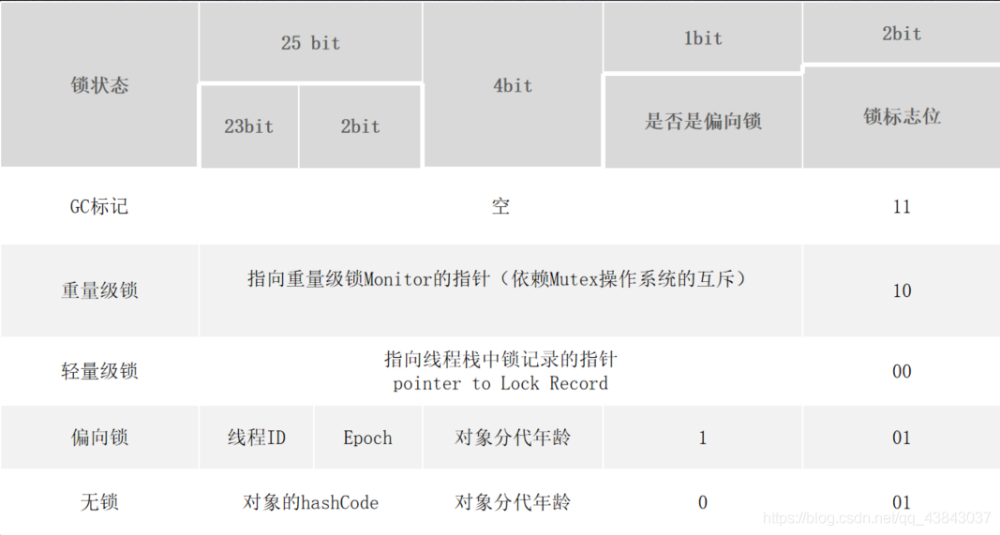
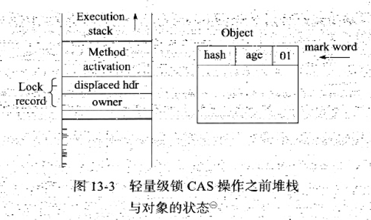
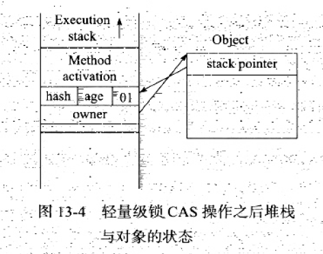
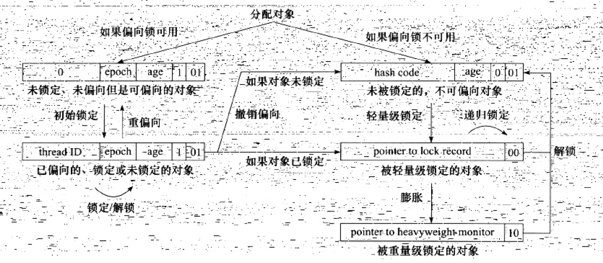
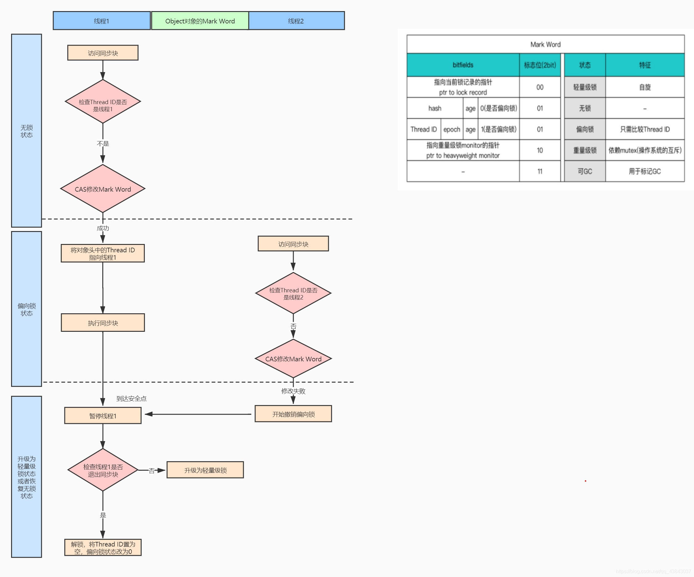
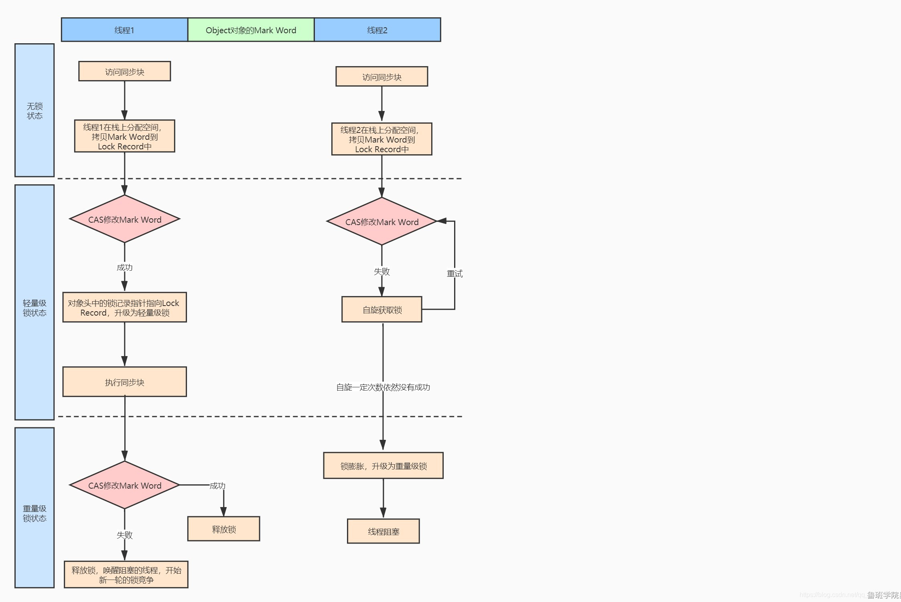

# ***线程安全与锁优化***

---
线程安全的严谨定义：

当多个线程同时访问一个对象时，如果不用考虑这些线程在运行时环境下的调度和交题执行，也不需要进行额外的同步，或者在调用方法进行任何其他的协调操作，调用这个对象的行为都可以获得正确的结果，那么就称这个对象是线程安全的。

## Java 语言中的线程安全

按照线程安全的 “安全程度” 由强至弱来排序，我们可以将 Java 语言中各个操作共享的数据分为以下 5 类：不可变、绝对线程安全、相对线程安全、线程兼容和线程对立。

1. ######  不可变

    在 Java 语言中（特指 JDK 5 以后，即 Java 内存模型被修正之后的 Java 语言），不可变（Immutable）的对象一定是线程安全的，无论是对象的方法实现还是方法的调用者，都不需要采取任何的线程安全保障措施，在前面我们谈到 final 关键字带来的可见性时曾经提到过这一点，只要一个不可变的对象被正确地构建出来（没有发生 this 引用逃逸的情况），那其外部的可见状态永远也不会改变，永远也不会看到它在多个线程之中处于不一致的状态。“不可变” 带来的安全性是最简单和最纯粹的。

2. ######  绝对线程安全

    绝对的线程安全完全满足 Brian Goetz 给出的线程安全的定义，这个定义其实是很严格的，一个类要达到 “不管运行是环境如何，调用者都不需要任何额外的同步措施” 通常需要付出很大的，甚至有时候是不切实际的代价。在 Java API 中标注自己是线程安全的类，大多数都不是绝对的线程安全。我们可以通过 Java API 中一个不是 “绝对线程安全” 的线程安全类来看看这里的 “绝对” 是什么意思。
    ```java
    private static Vector<Integer> vector = new Vector<Integer>();
 
    public static void main(String[] args) {
        while (true) {
            for (int i = 0; i < 10; i++) {
                vector.add(i);
            }
            
            Thread removeThread = new Thread(new Runnable() {
                @Override
                public void run() {
                    for (int i = 0; i < vector.size(); i++) {
                        vector.remove(i);
                    }
                }
            });
            
            Thread printThread = new Thread(new Runnable() {
                @Override
                public void run() {
                    for (int i = 0; i < vector.size(); i++) {
                        System.out.println(vector.get(i));
                    }
                }
            });
            
            removeThread.start();
            printThread.start();
            
            // 不要同时产生过多的线程，否则会导致操作系统假死
            while (Thread.activeCount() > 20);
        }
    }

    output:
        Exception in thread "Thread-10865" java.lang.ArrayIndexOutOfBoundsException: Array index out of range: 11
    ```

    尽管这里使用到的 Vector 的 `get()`、`remove()` 和 `size()` 方法都是同步的，但是在多线程的环境中，如果不在方法调用端做额外的同步措施的话，使用这段代码仍然是不安全的，因为如果另一个线程恰好在错误的时间里删除了一个元素，导致序号 i 已经不再可用的话，再用 i 访问数组就会抛出一个 `ArrayIndexOutOfBoundsException`。
3. ######  相对线程安全

    相对的线程安全就是我们通常意义上所讲的线程安全，它需要保证对这个对象单独的操作是线程安全，我们在调用的时候不需要做额外的保障措施，但是对于一些特定顺序的连续调用，就可能需要在调用端使用额外的同步手段来保证调用的正确性。

4. ######  线程兼容

    线程兼容是指对象本身并不是线程安全的，但是可以通过在调用端正确地使用同步手段来保证对象在并发环境中可以安全地使用，我们平常说一个类不是线程安全的，绝大多数时候指的是这一种情况。Java API 中大部分的类都是属于线程兼容的，如与前面的 Vector 和 HashTable 相对应的集合类 ArrayList 和 HashMap 等。
5. ######  线程对立

    线程对立是指无论调用端是否采取了同步措施，都无法在多线程环境中并发使用的代码。由于 Java 语言天生就具备多线程特性，线程对立这种排斥多线程的代码是很少出现的，而且通常都是有害的，应当尽量避免。

    一个线程对立的例子是 Thread 类的 `suspend()` 和 `resume()` 方法，如果有两个线程同时持有一个线程对象，一个尝试去中断线程，另一个尝试去恢复线程，如果并发进行的话，无论调用时是否进行了同步，目标线程都是存在死锁风险的，如果 `suspend()` 中断的线程就是即将要执行 `resume()` 的那个线程，那就肯定要产生死锁了。也正是由于这个原因，`suspend()` 和 `resume()` 方法已经被 JDK 声明废弃（`@Deprecated`）了。

## 线程安全的实现方法

1. ######  互斥同步

    **互斥同步（Mutual Exclusion & Synchronization）** 是常见的一种并发正确性保障手段。同步是指在多个线程并发访问共享数据时，保证共享数据在同一个时刻只被一个（或者是一些，使用信号量的时候）线程使用。而互斥是实现同步的一种手段，**临界区（Critical Section）** 、**互斥量（Mutex）** 和 **信号量（Semaphore）** 都是主要的互斥实现方式。因此，在这 4 个字里面，**互斥是因，同步是果；互斥是方法，同步是目的** 。

    在 Java 中，最基本的互斥同步手段就是 synchronized 关键字，synchronized 关键字经过编译之后，会在同步块的前后分别形成 monitorenter 和 monitorexit 这两个字节码指令，这两个字节码都需要一个 reference 类型的参数来指明要锁定和解锁的对象。如果 Java 程序中的 synchronized 明确指定了对象参数，那就是这个对象的 reference；如果没有明确指定，那就根据 synchronized 修饰的是实例方法还是类方法，去取对应的对象实例或 Class 对象来作为锁对象。

    根据虚拟机规范的要求，在执行 monitorenter 指令时，首先要尝试获取对象的锁。如果这个对象没被锁定，或者当前线程已经拥有了那个对象的锁，把锁的计数器加 1，相应的，在执行 monitorexit 指令时将锁计数器减 1，当计数器为 0 时，锁就被释放。如果获取对象锁失败，那当前线程就要阻塞等待，知道对象锁被另外一个线程释放为止。

    在虚拟机规范对 monitorenter 和 monitorexit 的行为描述中，有两点是需要特别注意的。首先，synchronized 同步块对同一条线程来说是可重入的，不会出现自己把自己锁死的问题。其次，同步块在已进入的线程执行完之前，会阻塞后面其他线程的进入。

    在前面讲过，Java 的线程是映射到操作系统的原生线程之上的，如果要阻塞或唤醒一个线程，都需要操作系统来帮忙完成，这就需要从用户态转换到核心态中，因此状态转换需要耗费很多的处理器时间。对于代码简单的同步块（如被 synchronized 修饰的 `getter()` 或 `setter()` 方法），状态转换消耗的时间有可能比用户代码执行的时间还要长。所以 synchronized 是 Java 语言中一个`重量级（Heavyweight）`的操作。

    除了 synchronized 之外，我们还可以使用 `java.util.concurrent`（下文成 J.U.C）包中的**重入锁（ReentrantLock）** 来实现同步，在基本用法上，ReentrantLock 与 synchronized 很相似，他们都具备一样的线程重入特性，只是代码写法上有点区别，一个表现为 API 层面的互斥锁（`lock()` 和 `unlock()` 方法配合 `try/finally` 语句块来完成），另一个表现为原生语法层面的互斥锁。不过，相比 synchronized，ReentrantLock 增加了一些高级功能，主要有以下 3 项：等待可中断、可实现公平锁，以及锁可以绑定多个条件。

    >- 等待可中断是指当持有锁的线程长期不释放锁的时候，正在等待的线程可以选择放弃等待，改为处理其他事情，可中断特性对处理执行时间非常长的同步块很有帮助。
    >- 公平锁是指多个线程在等待同一个锁时，必须按照申请锁的时间顺序来依次获得锁；而非公平锁则不保证这一点，在锁被释放时，任何一个等待锁的线程都有机会获得锁。synchronized 中的锁是非公平的，ReentrantLock 默认情况下也是非公平的，但可以通过带布尔值的构造函数要求使用公平锁(性能急剧下降，明显影响吞吐量)。
    >- 锁绑定多个条件是指一个 ReentrantLock 对象可以同时绑定多个 Condition 对象，而在 synchronized 中，锁对象的 `wait()` 和 `notify()` 或 `notifyAll()` 方法可以实现一个隐含的条件，如果要和多于一个的条件关联的时候，就不得不额外添加一个锁，而 ReentrantLock 则无须这样做，只需要多次调用 `newCondition()` 方法即可。

    **在 synchronized 能实现需求的情况下，优先考虑使用 synchronized 来进行同步。**

2. ######  非阻塞同步

    互斥同步面临的主要的问题就是进行线程阻塞和唤醒所带来的性能问题，因此这种同步也称为**阻塞同步（Blocking Synchronization）**。

    从处理问题的方式上来说，互斥同步属于一种悲观的并发策略，总是认为只要不去做正确的同步措施（例如加锁），那就肯定会出现问题，无论共享数据是否真的会出现竞争，它都要进行加锁（这里讨论的是概念模型，实际上虚拟机会优化掉很大一部分不必要的加锁）、用户 态核心态转换、维护锁计数器和检查是否有被阻塞的线程需要唤醒等操作。随着硬件指令集的发展，我们有了另外一个选择：基于冲突检测的乐观并发策略，通俗地说，就是先进行操作，如果没有其他线程争用共享数据，那操作就成功了；如果共享数据有争用，产生了冲突，那就再采取其他的补偿措施（最常见的补偿措施就是不断地重试，知道成功为止），这种乐观的并发策略的许多实现都不需要把线程挂起，因此这种同步操作称为**非阻塞同步（Non-Blocking Synchronization）**。

    使用乐观并发策略需要 “硬件指令集的发展” 才能进行，因为我们需要操作和冲突检测这两个步骤具备原子性，这需要靠硬件来完成这件事情，硬件保证一个从语法上看起来需要多次操作的行为只通过一条处理器指令就能完成，这类指令常用的有：
    >- 测试并设置（Test-and-Set）。
    >- 获取并增加（Fetch-and-Increment）。
    >- 交换（Swap）。
    >- **比较并交换（Compare-and Swap，下文成 CAS）**。
    >- 加载连接 / 条件存储（Load-Linked / Store-Conditional，下文称 LL/SC）。

    其中，前面的 3 条是 20 世纪就已经存在于大多数指令集之中的处理器指令，后面的两条是现代处理器新增的，而且这两条指令的目的和功能是类似的。

    **CAS 指令需要有 3 个操作数**，分别是**内存位置**（在 Java 中可以简单理解为变量的内存地址，用 V 表示）、**旧的预期值**（用 A 表示）和**新值**（用 B 表示）。CAS 指令执行时，当且仅当 V 符合旧值预期值 A 时，处理器用新值 B 更新 V 的值，否则它就不执行更新，但是无论是否更新了 V 的值，都会返回 V 的旧值，上述的处理过程是一个原子操作。

    在 JDK 5 之后，Java 程序中才可以使用 CAS 操作，该操作由 sun.misc.Unsafe 类里面的 `compareAndSwapInt()` 和 `compareAndSwapLong()` 等几个方法包装提供，虚拟机在内部对这些方法做了特殊处理，即时编译出来的结果就是一条平台相关的处理器 CAS 指令，没有方法调用的过程，或者可以认为是无条件内联进去了。

    尽管 CAS 看起来很美，但显然这种操作无法涵盖互斥同步的所有使用场景，并且 CAS 从语义上来说并不是完美的，**存在这样的一个逻辑漏洞：如果一个变量 V 初次读取的时候是 A 值，并且在准备赋值的时候检查到它仍然为 A 值，那我们就能说它没有被其他线程改变过了吗？如果在这段期间它的值曾经被改成了 B，后来又被改回 A，那 CAS 操作就会误认为它从来没有被改变过。这个漏洞称为 CAS 操作的 “ABA” 问题**。J.U.C 包为了解决这个问题，提供了一个带有标记的原子引用类 “AtomicStampedReference”，它可以通过控制变量值的版本来保证 CAS 的正确性。不过目前来说这个类比较 “鸡肋”，大部分情况下 ABA 问题不会影响程序并发的正确性，如果需要解决 ABA 问题，改用传统的互斥同步可能会比原子类更高效。

3. ######  无同步方案

    要保证线程安全，并不是一定就要进行同步，两者没有因果关系。同步只是保证共享数据争用时的正确性的手段，如果一个方法本来就不涉及共享数据，那它自然就无须任何同步措施去保证正确性，因此会有一些代码天生就是线程安全的，

    **可重入代码（Reentrant Code）**：这种代码也叫做**纯代码（Pure Code）**，可以在代码执行的任何时刻中断它，转而去执行另外一段代码（包括递归调用它本身），而在控制权返回后，原来的程序不会出现任何错误。相对线程安全来说，可重入性是更基本的特性，它可以保证线程安全，即所有的可重入的代码都是线程安全的，但是并非所有的线程安全的代码都是可重入的。

    可重入代码有一些共同的特征，例如不依赖存储在堆上的数据和公用的系统资源、用到的状态量都由参数中传入、不调用非可重入的方法等。我们可以通过一个简单的原则来判断代码是否具备可重入性：如果一个方法，它的返回结果是可以预测的，只要输入了相同的数据，就都能返回相同的结果，那它就满足可重入性的要求，当然也就是线程安全的。

    **线程本地存储（Thread Local Storage）**：如果一段代码中所需要的数据必须与其他代码共享，那就看看这些共享数据的代码是否能保证在同一个线程中执行？如果能保证，我们就可以把共享数据的可见范围限制在同一个线程之内，这样，无须同步也能保证线程之间不出现数据争用的问题。

    符合这种特点的应用并不少见，大部分使用消费队列的架构模式（如 “生产者 - 消费者” 模式）都会将产品的消费过程尽量在一个线程中消费完，其中最重要的一个应用实例就是经典 Web 交互模型中的 “一个请求对应一个服务器线程”（Thread-per-Request）的处理方式，这种处理方式的广泛应用使得很多 Web 服务端应用都可以使用线程本地存储来解决线程安全问题。

----

## 锁优化

高效并发是从 JDK 5 到 JDK 6 的一个重要改进，HotSpot 虚拟机开发团队在这个版本上花费了大量的精力去实现各种锁优化技术，如**适应性自旋（Adaptive Spinning）**、**锁消除（Lock Elimination）**、**锁粗化（Lock Coarsening）**、**轻量级锁（Lightweight Locking）** 和**偏向锁（Biased Locking）** 等。这些技术都是为了在线程之间更高效地共享数据，以及解决竞争问题，从而提高程序的执行效率。

1. ######  自旋锁与自适应自旋

 前面我们讨论互斥同步的时候，提到了互斥同步对性能最大的营销阻塞的实现，挂起线程和恢复线程的操作都需要转入内核态完成，这些操作给系统的并发性能带来了很大的压力。同时，虚拟机的开发团队也注意到在许多应用上，共享数据的锁定状态只会持续很短的一段时间，为了这段时间去挂起和恢复线程并不值得。

 如果物理机器有一个以上的处理器，能让两个或以上的线程同时并行执行，我们就可以让后面请求锁的那个线程 “稍等一下”，但不放弃处理器的执行时间，看看持有锁的线程是否很快就会释放锁。为了让线程等待，我们只需让线程执行一个忙循环（自旋），这项技术就是所谓的自旋锁。

 自旋次数的默认值是 10 次，用户可以使用参数 `-XX:PreBlockSpin` 来更改。

 在 JDK 6 中引入了自适应的自旋锁。自适应意味着自旋的时间不再固定了，而是由前一次在同一个锁上的自旋时间及锁的拥有者的状态来决定。如果在同一个锁对象上，自旋等待刚刚成功获得过锁，并且持有锁的线程正在运行中，那么虚拟机就会认为这次自旋也很有可能再次成功，进而它将允许自旋等待持续相对更长的时间，比如 100 个循环。另外，如果对于某个锁，自旋很少成功获得过，那在以后要获取这个锁时将可能省略掉自旋过程，以避免浪费处理器资源。

2. ######  锁消除

 锁消除是指虚拟机即时编译器在运行时，对一些代码上要求同步，但是被检测到不可能存在共享数据竞争的锁进行消除。锁消除的主要判定依据来源于逃逸分析的数据支持，如果判定在一段代码中，堆上的所有数据都不会逃逸出去从而被其他线程访问到，那就可以把他们当做栈上数据对待，认为它们是线程私有的，同步加锁自然就无须进行。

 一段看起来没有同步的代码
 ```java
    public static String concatString(String s1, String s2, String s3) {
        return s1 + s2 + s3;
    }
 ```
 Javac 转化后的字符串连接操作
 ```java
 public static String concatString(String s1, String s2, String s3) {
	StringBuffer sb = new StringBuffer();
	sb.append(s1);
	sb.append(s2);
	sb.append(s3);
	return sb.toString();
 }
 ```
 每个 StringBuffer.append() 方法中都有一个同步块，锁就是 sb 对象。虚拟机观察变量 sb，很快就会发现它的动态作用域被限制在 concatString() 方法内部。也就是说，sb 的所有引用永远不会 “逃逸” 道 concatString() 方法之外，其他线程无法访问到它，因此，虽然这里有锁，但是可以被安全地消除掉，在即时编译之后，这段代码就会忽略掉所有的同步而直接执行了。

3. ######  锁粗化
 原则上，我们在编写代码的时候，总是推荐将同步块的作用范围限制得尽量小——只在共享数据的实际作用域中才进行同步，这样是为了使得需要同步的操作数量尽可能变小，如果存在锁竞争，那等待锁的线程也能尽快拿到锁。

 大部分情况下，上面的原则都是正确的，但是如果一系列的连续操作都对同一个对象反复加锁和解锁，甚至加锁操作是出现在循环体中，那即使没有线程竞争，频繁地进行互斥同步操作也会导致不必要的性能损耗。

 上面的 append() 方法就属于这类情况。如果虚拟机探测到由这样的一串零碎的操作都对同一个对象加锁，将会把加锁同步的范围扩展（粗化）到整个操作序列的外部，就是扩展到第一个 append() 操作之前直至最后一个 append() 操作之后，这样只需要加锁一次就可以了。

4. ######  轻量级锁
 轻量级锁是 JDK 6 之中加入的新型锁机制，它名字中的 “轻量级” 是相对于使用操作系统互斥量来实现的传统锁而言的，因此传统的锁机制就称为 “重量级” 锁。首先需要强调一点的是，**轻量级锁并不是用来代替重要级锁的，它的本意是在没有多线程竞争的前提下，减少传统的重量级锁使用操作系统互斥量产生的性能消耗**。

 要理解轻量级锁，以及后面会讲到的偏向锁的原理和运作过程，必须从 HotSpot 虚拟机的对象（对象头部分）的内存布局开始介绍。HotSpot 虚拟机的对象头（Object Header）分为两部分信息，第一部分用于存储对象自身的运行时数据，如哈希码（HashCode）、GC 分代年龄（Generational GC Age）等，这部分数据是长度在 32 位和 64 位的虚拟机中分别为 32 bit 和 64 bit，官方称它为 “Mark Word”，它是实现轻量级锁和偏向锁的关键。另外一部分用于存储指向方法区对象类型数据的指针，如果是数组对象的话，还会有一个额外的部分用于存储数组长度。

 由于对象头信息是与对象自身定义的数据无关的额外存储成本，考虑到 Java 虚拟机的空间使用效率，Mark Work 被设计成一个非固定的数据结构，以便在极小的空间内存储尽量多的信息，它会根据对象的状态复用自己的存储空间。例如，在 32 位的 HotSpot 虚拟机中对象未被锁定的状态下，Mark Word 的 32bit 空间中的 25bit 用于存储对象哈希码（HashCode），4bit 用于存储对象分代年龄，2bit 用于存储锁标志位，1bit 固定为 0，在其他状态（轻量级锁定、重量级锁定、GC 标记、可偏向）下对象的存储内容见表
 
 

 简单地介绍了对象的内存布局后，我们把话题返回到轻量级锁的执行过程上。在代码进入同步块的时候，如果此同步对象没有被锁定（锁标志位为 “01” 状态）虚拟机首先将在当前线程的栈帧中建立一个名为锁记录（Lock Record）的空间，用于存储锁对象目前的 Mark Word 的拷贝（官方把这份拷贝加上了一个 Displaced 前缀，即 Displaced Mark Word），这时候线程堆栈与对象头的状态如图

 

 然后，虚拟机将使用 CAS 操作尝试将对象的 Mark Word 更新为指向 Lock Record 的指针。如果这个更新动作成功了，那么这个线程就拥有了该对象的锁，并且对象 Mark Word 的锁标志位 （Mark Word 的最后 2bit）将转变为 “00”，即表示此对象处于轻量级锁定状态，这时候线程堆栈与对象头的状态如图

 

 如果这个更新操作失败了，虚拟机首先会检查对象的 Mark Word 是否指向当前线程的栈帧，如果只说明当前线程已经拥有了这个对象的锁，那就可以直接进入同步块继续执行，否则说明这个锁对象以及被其他线程线程抢占了。如果有两条以上的线程争用同一个锁，那轻量级锁就不再有效，要膨胀为重量级锁，所标志的状态变为 “10”，Mark Word 中存储的就是指向重量级锁（互斥量）的指针，后面等待锁的线程也要进入阻塞状态。

 上面描述的是轻量级锁的加锁过程，它的解锁过程也是通过 CAS 操作来进行的，如果对象的 Mark Word 仍然指向着线程的锁记录，那就用 CAS 操作把对象当前的 Mark Word 和线程中复制的 Displaced Mark Word 替换回来，如果替换成功，整个同步过程就完成了。如果替换失败，说明有其他线程尝试过获取该锁，那就要释放锁的同时，唤醒被挂起的线程。

 轻量级锁能提升程序同步性能的依据是 “对于绝大部分的锁，在整个同步周期内都是不存在竞争的”，这是一个经验数据。如果没有竞争，轻量级锁使用 CAS 操作避免了使用互斥量的开销，但如果存在锁竞争，除了互斥量的开销外，还额外发生了 CAS 操作，因此在有竞争的情况下，轻量级锁会比传统的重量级锁更慢。

4. ######  偏向锁
  偏向锁也是 JDK 6 中引入的一项锁优化，它的目的是消除数据在无竞争情况下的同步原语，进一步提高程序的运行性能。如果说轻量级锁是在无竞争的情况下使用 CAS 操作去消除同步使用的互斥量，那偏向锁就是在无竞争的情况下把整个同步都消除掉，连 CAS 操作都不做了。

 偏向锁的 “偏”，就是偏心的 “偏”、偏袒的 “偏”，它的意思是这个锁会偏向于第一个获得它的线程，如果在接下来的执行过程中，该锁没有被其他的线程获取，则持有偏向锁的线程将永远不需要再进行同步。

 如果读者读懂了前面轻量级锁中关于对象头 Mark Word 与线程之间的操作过程，那偏向锁的原理理解起来就会很简单。假设当前虚拟机启用了偏向锁（启用参数 -XX:+UseBiasedLocking，这是 JDK 6 起 HotSpot 的默认值），那么，当锁对象第一次被线程获取的时候，虚拟机将会把对象头中的标志位设为 “01”，即偏向模式。同时使用 CAS 操作把获取到这个锁的线程 ID 记录在对象的 Mark Word 之中，如果 CAS 操作成功，持有偏向锁的线程以后每次进入这个锁相关的同步块时，虚拟机都可以不再进行如何同步操作（例如 Locking、Unlocking 及对 Mark Word 的 Update 等）。

 当有另外一个线程去尝试获取这个锁时，偏向模式就宣告结束。根据锁对象目前是否处于被锁定的状态，撤销偏向（Revoke Bias）后恢复到未锁定（标志位为 “01”）或轻量级锁定（标志位为 “00”）的状态，后续的同步操作就如上面介绍的轻量级锁那样执行。偏向锁、轻量级锁的状态转换及对象 Mark Word 的关系如图

 

 **当对象进入偏向状态的时候，Mark Word 大部分的空间 （23个bit）都用于存储持有锁的线程 ID 了，这部分空间占用了原有存储对象 Hash 码的位置，那原来对象的 Hash 码怎么办？**

 在 Java 语言里面一个对象如果计算过 Hash 码，就应该一直保持该值不变，否则很多依赖对象 Hash Code 的 API 都可能出现出错风险。而作为绝大多数对象 Hash Code 来源的 `Object::hashCode()`方法，返回的是对象的一致性 Hash Code (Identity Hash Code),这个值是能强制保证不变的，它通过在对象头中存储计算结果来保证第一次计算后，再次调用该方法取到的 Hash Code 值永远不会再发生变化。

 **因此，当一个对象已经计算过一致性 Hash Code 后，它就再也无法进入偏向锁状态了；而当一个对象当前正处于偏向锁状态，又收到需要计算其一致性哈希码请求时，它的偏向状态会被立即撤销，并且锁会膨胀为重量级锁**。

 

 偏向锁可以提高带有同步但无竞争的程序性能。它同样是一个带有效益权衡（Trade Off）性质的优化，也就是说，它并不一定总是对程序运行有利，如果程序中大多数的锁总是被多个不同的线程访问，那偏向模式就是多余的。在具体问题具体分析的前提下，有时候使用参数 -XX:-UseBiasedLocking 来禁止偏向锁优化反而可以提升性能。 

 

**比较**
 


