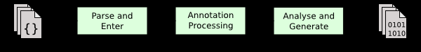

# ***前端编译与优化***

---

在 Java 技术下谈“编译期”而没有具体上下文语境的话，其实是一句很含糊的表述，因为它可能是指一个前端编译器（叫“编译期的前端”更准确一些）把 *.java 文件转变成 *.class 文件的过程；也可能是指 Java 虚拟机的即时编译器（常称 JIT 编译器，Just In Time Compiler）运行期把字节码转变成本地机器码的过程；还可能是指使用静态的提前编译器（常称 AOT 编译器，Ahead Of Time Compiler）直接把程序编译成和目标机器指令集相关的二进制代码的过程。

>- 前端编译器：代表性的产品有JDK的Javac、Eclipse JDT中的增量式编译器。
>- 即时编译器：HotSpot虚拟机中的C1、C2编译器，Graal编译器。
>- 提前编译器：JDK的Jaotc、GNU Compiler for thr Java（GCJ）、Excelsior JET。

在 Javac 这类前端编译器对代码的运行效率几乎没有任何的优化措施可言，哪怕是编译器真的采取了优化措施也不会产生什么实质性的效果。因为 Java 虚拟机设计团队选择把对性能的优化全部集中到运行期的即时编译器中，这样可以让那些不是由 javac 产生的 Class 文件也同样能享受到编译器优化措施所带来的性能红利。

需要注意：相当多新生的 Java 语法特性，都是靠编译器的“语法糖”来实现，而不是依赖字节码或者 Java 虚拟机的底层改进来的支持。

---

## Javac 编译器

- #### Javac 的源码与调优
从 Javac 代码的总体结构来看，编译过程大致可以分为 1 个准备过程和 3 个处理过程：
>- 准备过程：初始化插入式注解处理器。
>- 解析与填充符号表过程，包括
>>1. 词法、语法分析：将源码中的字符流转变为标记集合，构造抽象语法树。
>>2. 填充符号表：产生符号地址和符号信息。
>- 插入式注解处理器的注解处理过程:插入式注解处理器的执行阶段。
>- 分析与字节码生成过程，包括：
>>1. 标注检查：对语法的静态信息进行检查。
>>2. 数据流及控制流分析：对程序的动态运行过程进行检查。
>>3. 解语法糖：将简化代码编写的语法糖还原为原来的样子。
>>4. 字节码生成：将前面各个步骤所生成的信息转化为字节码。


上述三个处理过程里，执行插入式注解时有可能会产生新的符号，如果有新的符号产生，就必须转回到之前的解析、填充符号表的过程中又重新处理这些新符号，从总体来看，三者之间的关系与交互顺序如图所示



- #### 解析与填充符号表

- ###### 词法、语法分析
  
词法分析是将源代码的字符流转变为标记（Token）集合的过程，单个字符是程序编写时的最小元素，但标记才是编译时的最小元素。关键字、变量名、字面量、运算符都可以成为标记，如`int a = b + 2`这句代码包含了6个标记，分别是int、a、=、b、+、2，虽然关键字 int 由3个字符构成，但是它只是一个 Token，不可再拆分。在 Javac 的源码中，词法分析过程com.sun.tools.javac.parser.Scanner类来实现。

语法分析是根据 Token 序列构造抽象语法树的过程，抽象语法树（Abstract Syntax Tree，AST）是一种用来描述程序代码语法结构的树形表示方式，抽象语法树的每一个节点都代表着程序代码中的一个语法结构（Syntax Construct），例如包、类型、修饰符、运算符、接口、返回值甚至代码注释等都可以是一个语法结构。

经过词法和语法分析生成语法树以后，编译器就不会再对源码字符流进行操作了，后续的操作都建立在抽象语法树之上。

- ###### 填充符号表

符号表（Symbol Table）是由一组符号地址和符号信息构成的表格，可以把它想象成哈希表中键值对值的存储形式（实际上符号表不一定是哈希表实现，可以是有序号表、树状符号表、栈结构符号表等各种形式）。符号表中所登记的信息在编译的不同阶段都要用到。譬如在语义分析的过程中，符号表所登记的内容将用于语义检查（如检查一个名字的使用和原先的说明是否一致）和产生中间代码。在目标代码生成阶段，当对符号名进行地址分配时，符号表是地址分配的直接依据。

- #### 注解处理器

在 JDK 5 之后，Java 语言提供了对注解（Annotation）的支持，这些注解与普通的 Java 代码一样，是在运行期间发挥作用的。

在 JDK 6 中又提出并通过了 JSR-269 规范，该提案设计了一组被称为“插入式注解处理器”的标准API，可以提前至编译期对代码中的特定注解进行处理，从而影响到前端编译器的工作过程。

我们可以把插入式注解处理器看做是一组编译器的插件，当这些插件工作时，可以读取、修改、添加抽象语法树中的任意元素。如果这些插件在处理注解期间对语法树进行了修改，编译器将回到解析及填充符号表的过程重新处理，直到所有插入式注解处理器都没有再对语法树进行修改为止，每一次循环称为一个Round。

- #### 语义分析与字节码生成

语法分析之后，编译器获得了程序代码的抽象语法树表示，语法树能表示一个结构正确的源程序，但无法保证源程序的语义是符合逻辑的。而语义分析的主要任务是对结构上正确的源程序进行上下文有关性质的检查，譬如进行类型检查、控制流检查、数据流检查，等等。举个简单的例子，假设有如下的3个变量定义语句：

```java 
int a = 1;
boolean b = false;
char c = 2;
```

后续可能会出现的赋值运算

```java
int d = a + c;
int d = b + c;
char d = a + c;
```

后续代码中如果出现了以上3种赋值运算的话，那它们都能构成结构正确的语法树，但是只有第一种的写法在语义上是没有问题的，能够通过编译，其余两种在Java语言中是不合逻辑的，无法编译（是否合乎语义逻辑必须限定在具体的语言与具体的上下文环境之中才有意义。如在C语言中，a、b、c的上下文定义不变，第2、3种写法都是可以正确编译）。

- ###### 1. 标注检查

Javac 在编译过程中，语义分析过程分为标注检查以及数据及控制流分析两个步骤。

标注检查步骤检查的内容包括诸如变量使用前是否已被声明、变量与赋值之间的数据类型是否能够匹配等等。

在标注检查步骤中，还有一个重要的动作称为常量折叠。

```java
int a = 1 + 2;
```
折叠后
```java
int a = 3;
```
- ###### 2.  数据及控制流分析
  
数据及控制流分析是对程序上下文逻辑更进一步的验证，它可以检查出诸如程序局部变量在使用前是否有赋值、方法的每条路径是否都有返回值、是否所有的受查异常都被正确处理了等问题。

编译时期的数据及控制流分析与类加载时的数据及控制流分析的目的基本上可以看做是一致的，但校验范围有所区别，有一些校验项只有在编译期或运行期才能进行。

比如：
```java
final int var = 0;

int var = 0;
```
变量的不变性仅仅由 javac 编译器在编译期间来保障，这就是一个只能在编译器而不能在运行期中检查的例子。（局部变量与类的字段<实例变量、类变量>的存储是有显著差别的，局部变量在常量池中并没有 CONSTANT_Fieldref_info 的符号引用，自然也不可能存储有访问标志（access_flags）的信息，甚至连变量名都不一定会保存下来，自然在 Class 文件中就不可能知道一个局部变量是不是被声明为 final 了）

- ###### 3.  解语法糖

语法糖（System Sugar），也称糖衣语法，是由英国计算机科学家Peter J.Landin 发明的一个术语，指在计算机语言中添加的某种语法，这种语法对语言的编译结果和功能并没有实际影响，但是却能更方便程序员使用该语言。通常来说使用语法糖能够减少代码量、增加程序的可读性，从而减少程序代码出错的机会。

Java 虚拟机运行时并不直接支持这些语法，它们在编译阶段被还原回原始的基础语法结构，这个过程称为解语法糖。

在 Javac 的源码中，解语法糖的过程由 `desugar()` 方法触发。

- ###### 4.  字节码生成

字节码生成是Javac编译过程的最后一个阶段，在 Javac 源码里面由`com.sun.tools.javac.jvm.Gen`类来完成。字节码生成阶段不仅仅是把前面各个步骤所生成的信息（语法树、符号表）转化成字节码指令写到磁盘中，编译器还进行了少量的代码添加和转换工作。

例如 实例构造器`<init>()` 方法和类构造器`<clinit>()`方法就是在这个阶段被添加到语法树之中的。

无论源码中出现的顺序如何，都一定是按先执行父类的实例构造器，然后初始化变量，最后执行语句块的顺序进行。

---

## Java 语法糖

语法糖可以看作是前端编译器实现的一些 “小把戏”，这些 “小把戏” 可能会使效率得到 “大提升”，但我们也应该去了解这些 “小把戏” 背后的真实面貌，那样才能利用好它们，而不是被它们所迷惑。

- #### 泛型

泛型的本质是参数化类型（Parameterized Type）或者参数化多态（Parametric Polymorphism）的应用，既可以将操作的数据类型指定为方法签名中的一种特殊参数，这种参数类型能够用在 类、接口和方法的创建中，分别构成泛型类、泛型接口和泛型方法。泛型让程序员能够针对泛化的数据类型编写相同的算法，这极大地增强了编程语言的类型系统及抽象能力。

- ###### 1.  Java 与 C# 的泛型

Java 选择的泛型实现方式叫做 “类型擦除式泛型（Type Erasure Generics）”,而 C# 选择的泛型实现方式是 “具现化式泛型（Reified Generics）”

而 Java 语言中的泛型只在程序源码中存在，在编译后的字节码文件中，全部泛型都被替换为原来的裸类型（Raw Type）,并且在相应的地方插入了强制转型代码。

Java 中不支持的泛型用法
```java
public class TypeErasureGenerics<E> {
    public void doSomething(Object item) {
        if (item instanceof E) { // 不合法，无法对泛型进行实例判断
            ...
        }
        E newItem = new E(); // 不合法，无法使用泛型创建对象
        E[] itemArray = new E[10]; // 不合法，无法使用泛型创建数组
    }
}
```

Java 的类型擦除式泛型无论在使用效果上还是在运行效率上，几乎是全面落后于 C# 的具显化式泛型，而它的唯一优势是在于实现这种泛型的影响范围上：擦除式泛型的实现几乎只需要在 Javac 编译器上做改进即可，不需要改动字节码、不需要改动 Java 虚拟机。

- ###### 2.  泛型的历史背景
为了保证这些编译出来的 Class 文件可以在 Java 5.0 引入泛型之后继续运行，设计者面前大体上有两条路可以选择：
>1. 需要泛型化的类型（主要是容器类型），以前有的就保持不变，然后平行地加一套泛型化版本的新类型。（C#）
>2. 直接把已有的类型泛型化，既让所有需要泛型化的已有类型都原地泛滥化，不添加任何平行于已有类型的泛型化。（Java）
- ###### 3.  类型擦除
裸类型（Raw Type） 是所有该类型泛型化实例的共同父类型（Super Type）。

如何实现裸类型有两种选择：
>1. 在运行期由 Java 虚拟机来自动地、真实地构造出 ArrayList<Integer> 这样的类型，并且自动实现从 ArrayList<Integer> 派生自 ArrayList 的继承关系来满足裸类型的定义。
>2. 索性简单粗暴地直接在编译时把 ArrayList<Integer> 还原成 ArrayList,只在元素访问、修改时自动插入一些强制类型转换和检查指令。

擦除法的主要缺陷：

1.  使用擦除法实现泛型直接导致了对原始类型（Primitive Types）数据的支持又成了新的麻烦。
```java
Array<int> ilist = new ArrayList<int>();
Array<long> llist = new ArrayList<long>();

ArrayList list;
list = ilist;
list = llist;
```
这种情况下一旦把泛型信息擦除后，到要插入强制转型代码的地方就没办法往下做了，因为不支持 int、long 与 Object 之间的强制转型。当时 Java 给出的解决方案一如既往的简单粗暴：既然没法转换那就索性别支持原生类型的泛型，都使用 Integer、Long ,反正都做了自动的强制类型转换，遇到原生类型时把装箱、拆箱也自动做了得了，这个决定也导致了无数构造包装类和装箱、拆箱的开销，成为 Java 泛型慢的重要原因。

2. 运行期间无法取到泛型类型信息，会让一些代码变得相当啰嗦。

3. 通过擦除法实现泛型，还丧失了一些面向对象思想应有的优雅，带来了一些摸棱两可的模糊状况。

重载问题1：
```java 
//这段代码无法编译，因为参数List<String> list和List<Integer> list 编译之后都被擦除了
public static void method(List<String> list) {
    System.out.println("invoke method(List<String> list)");
}

public static void method(List<Integer> list) {
    System.out.println("invoke method(List<Integer> list)");
}
```
重载问题2：
```java
//这段代码可以正确编译，因为两个method()方法添加了不同的返回值:JDK6
public static void method(List<String> list) {
    System.out.println("invoke method(List<String> list)");
}
public static void method(List<Integer> list) {
    System.out.println("invoke method(List<Integer> list)");
}
```

由于 Java 泛型的引入，各种场景（虚拟机解析、反射等）下的方法调用都可能对原有的基础产生影响并带来新的需求，如在泛型类中如何获取传入的参数化类型等。所以 JCP 组织对 《Java 虚拟机规范》做出了相应的修改，引入了 Signature 、 LocalVariableTypeTable 等新属性用于解决伴随泛型而来的参数类型的识别问题。

Signature 是其中最重要的一项属性，它的作用就是存储一个方法在字节码层面的特征签名，这个属性中保存的参数类型并不是原生类型，而是包括了参数化类型的信息。修改后的虚拟机规范要求所有能识别 49.0 以上版本的 Class 文件的虚拟机都要能正确地识别 Signature 参数。

擦除法所谓的擦除，仅仅是对方法的 Code 属性中的字节码进行擦除，实际上元数据中还是保留了泛型信息，这也是我们在编码时能够通过反射手段取得参数化类型的根本依据。

- ###### 4.  值类型与未来的泛型
  
在 Valhalla 项目中规划了几种不同的新泛型实现方案，被称为 Model 1 到 Model 3，在这些新的泛型设计中，泛型类型有可能被具现化，也有可能维持类型擦除以保持兼容，即使是采用类型擦除的方案，泛型的参数化类型也可以选择不被完全地擦除掉，而是相对完整地记录在 Class 文件中，能够在运行期被使用，也可以指定编译器默认要擦除哪些类型。相对于是用不同方式实现泛型，目前比较明确的是未来的 Java 应该会提供 “值类型（Value Type）”的语言层面支持。

值类型可以与引用类型一样，具有构造函数、方法或是属性字段等等，而它与引用类型的区别在于它在复制的时候通常是整体复制，而不是像引用类型那样传递引用。更为关键的是：值类型很容桂实现分配在方法的调用栈上，这意味着值类型会随着当前方法的退出而自动释放，不会给垃圾收集子系统带来任何压力。

- #### 自动装箱、拆箱与遍历循环

自动装箱、自动拆箱与遍历循环（for-each循环）这些语法糖，无论是实现复杂度上还是其中蕴含的思想上都不能和泛型相提并论，两者涉及的难度和深度都有很大差距。

```java
    public static void main(String []args){ 
        List<Integer> list = Arrays.asList(1, 2, 3, 4);
        int sum = 0;
        for(int i : list){
            sum += i;
        }
        System.out.println(sum);
    }
```

编译之后

```java
  public static void main(String[] args) {
        List list = Arrays.asList(new Integer[]{
            Integer.valueOf(1),
            Integer.valueOf(2),
            Integer.valueOf(3),
            Integer.valueOf(4)
        });
        int sum = 0;
        for(Iterator localIterator = list.iterator(); localIterator.hasNext();){
            int i = ((Integer) localIterator.next()).intValue();
            sum += i;
        }
        System.out.println(sum);
    }
```


自动装箱的陷阱：

```java
public class AutoBoxing {
    public static void main(String[] args) {
        Integer a = 1;
        Integer b = 2;
        Integer c = 3;
        Integer d = 3;
        Integer e = 321;
        Integer f = 321;
        Long g = 3L;
        System.out.println(c == d); true
        System.out.println(e == f); false
        System.out.println(c == (a + b)); true
        System.out.println(c.equals(a + b)); true
        System.out.println(g == (a + b)); true
        System.out.println(g.equals(a + b)); false
    }
}
```

- #### 条件编译

Java语言中条件编译的实现，也是Java语言的一颗语法糖，根据布尔常量值的真假，编译器将会把分支中不成立的代码块消除掉，这一工作将在编译器解除语法糖阶段（`com.sun.tools.javac.comp.Lower`类中）完成。由于这种条件编译的实现方式使用了`if`语句，所以它必须遵循最基本的 Java 语法，只能写在方法体内部，因此它只能实现语句基本块（ Block ）级别的条件编译，而没有办法实现根据条件调整整个 Java 类的结构。