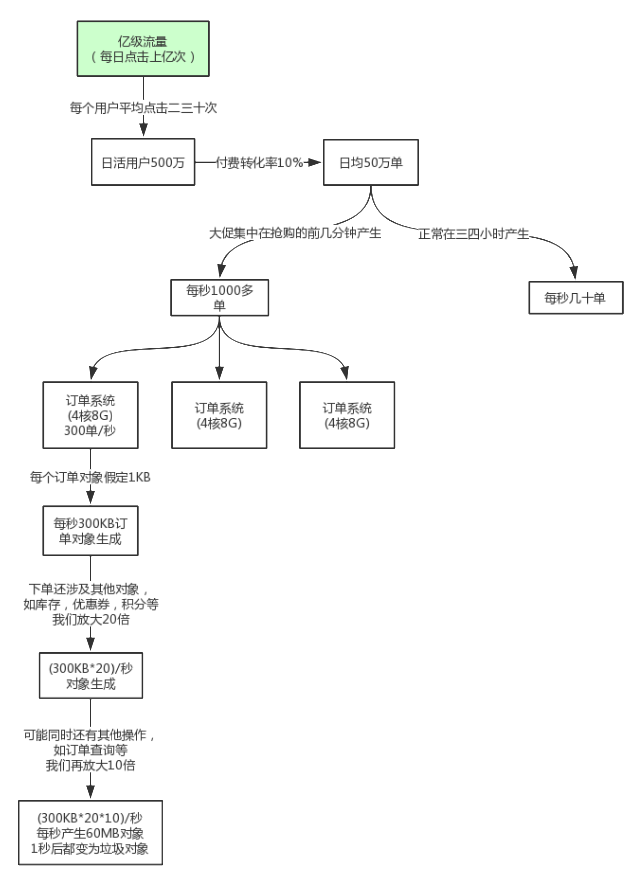
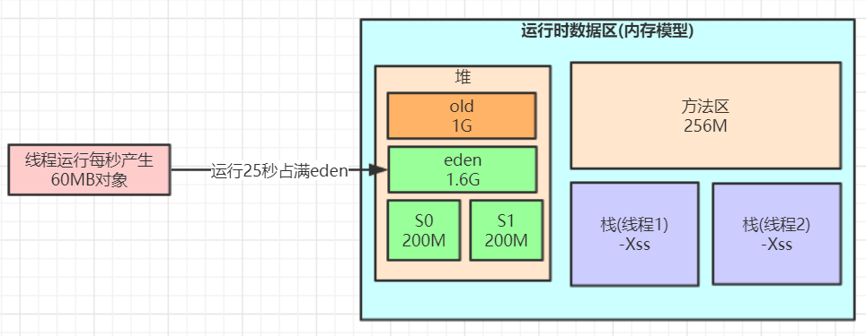

# ***扩展点***

---

## 对象大小与指针压缩 

&ensp;&ensp;&ensp;&ensp;JDK 1.6 update14开始，在 64bit 操作系统中，JVM 开始支持指针压缩。

&ensp;&ensp;&ensp;&ensp;JVM 配置参数:`UseCompressedOops­­`，compressed -- 压缩、oop(ordinary object pointer) -- ­­对象指针。

&ensp;&ensp;&ensp;&ensp;启用指针压缩:`­XX:+UseCompressedOops`(默认开启)，禁止指针压缩:­`XX:­UseCompressedOops`。

&ensp;&ensp;&ensp;&ensp;为什么要进行指针压缩？ 
1. 在 64 位平台的 HotSpot 中使用 32 位指针，内存使用会多出 1.5 倍左右，使用较大指针在主内存和缓存之间移动数据， 占用较大宽带，同时 GC 也会承受较大压力。 
2. 为了减少 64 位平台下内存的消耗，启用指针压缩功能。
3. 在 JVM 中，32 位地址最大支持 4G 内存( 2 的 32 次方)，可以通过对象指针的压缩编码、解码方式进行优化，使得 JVM 只用 32 位地址就可以支持更大的内存配置(小于等于 32G ) 
4. 堆内存小于 4G 时，不需要启用指针压缩，JVM 会直接去除高 32 位地址，即使用低虚拟地址空间 \
5. 堆内存大于 32G 时，压缩指针会失效，会强制使用 64 位(即 8 字节)来对 java 对象寻址，这就会出现 1 的问题，所以堆内存不要大于 32G 为好。

&ensp;&ensp;&ensp;&ensp;对象大小可以用`jol­-core`包查看，引入依赖:

```java
<dependency>
    <groupId>org.openjdk.jol</groupId> 
    <artifactId>jol‐core</artifactId>
    <version>0.9</version> 
</dependency>
```

```java
public class JOLSample {

public static void main(String[] args) {
    ClassLayout layout = ClassLayout.parseInstance(new Object()); 
    System.out.println(layout.toPrintable());

    ClassLayout layout1 = ClassLayout.parseInstance(new int[]{}); 
    System.out.println(layout1.toPrintable());

    ClassLayout layout2 = ClassLayout.parseInstance(new A()); 
    System.out.println(layout2.toPrintable());
}


// ‐XX:+UseCompressedOops 默认开启的压缩所有指针 
// ‐XX:+UseCompressedClassPointers 默认开启的压缩对象头里的类型指针Klass Pointer 
// Oops : Ordinary Object Pointers 
public static class A { 
    //8B mark word 
    //4B Klass Pointer 如果关闭压缩 ‐XX:‐UseCompressedClassPointers或‐XX:‐UseCompressedOops，则占用 8B 
    int id; //4B 
    String name; //4B 如果关闭压缩‐XX:‐UseCompressedOops，则占用8B 
    byte b; //1B 
    Object o; //4B 如果关闭压缩‐XX:‐UseCompressedOops，则占用8B 
    } 
}


output:
    java.lang.Object object internals: 
    OFFSET SIZE TYPE DESCRIPTION VALUE 
    0 4 (object header) 01 00 00 00 (00000001 00000000 00000000 00000000) (1) //mark word 
    4 4 (object header) 00 00 00 00 (00000000 00000000 00000000 00000000) (0) //mark word 
    8 4 (object header) e5 01 00 f8 (11100101 00000001 00000000 11111000) (‐134217243) //Klass Pointer
    12 4 (loss due to the next object alignment) 
    Instance size: 16 bytes 
    Space losses: 0 bytes internal + 4 bytes external = 4 bytes total


    [I object internals: 
    OFFSET SIZE TYPE DESCRIPTION VALUE 
    0 4 (object header) 01 00 00 00 (00000001 00000000 00000000 00000000) (1)  
    4 4 (object header) 00 00 00 00 (00000000 00000000 00000000 00000000) (0)  
    8 4 (object header) 6d 01 00 f8 (01101101 00000001 00000000 11111000)(‐134217363) 
    12 4 (object header) 00 00 00 00 (00000000 00000000 00000000 00000000) (0)
    16 0 int [I.<elements> N/A 
    Instance size: 16 bytes 
    Space losses: 0 bytes internal + 0 bytes external = 0 bytes total

    com.tuling.jvm.JOLSample$A object internals: 
    OFFSET SIZE TYPE DESCRIPTION VALUE
    0 4 (object header) 01 00 00 00 (00000001 00000000 00000000 00000000) (1)
    4 4 (object header) 00 00 00 00 (00000000 00000000 00000000 00000000) (0) 
    8 4 (object header) 61 cc 00 f8 (01100001 11001100 00000000 11111000) (‐134165407) 
    12 4 int A.id 0 
    16 1 byte A.b 0 
        17 3 (alignment/padding gap) 
    20 4 java.lang.String A.name null 
    24 4 java.lang.Object A.o null 
    28 4 (loss due to the next object alignment) 
    Instance size: 32 bytes 
    Space losses: 3 bytes internal + 4 bytes external = 7 bytes total

```


## 亿级流量电商系统如何优化JVM参数设置(ParNew + CMS)

&ensp;&ensp;&ensp;&ensp;大型电商系统后端现在一般都是拆分为多个子系统部署的，比如，商品系统，库存系统，订单系统，促销系统，会员系 统等等。我们这里以比较核心的订单系统为例:



&ensp;&ensp;&ensp;&ensp;**对于8G内存，我们一般是分配4G内存给JVM，正常的JVM参数配置如下：**
```java
-Xms3072M -Xmx3072M -Xss1M -XX:MetaspaceSize=256M -XX:MaxMetaspaceSize=256M  -XX:SurvivorRatio=8
```

&ensp;&ensp;&ensp;&ensp;这样设置可能会由于动态对象年龄判断原则导致频繁 full gc。我们可以将 JVM 参数设置为如下：
```java
-Xms3072M -Xmx3072M -Xmn2048M -Xss1M -XX:MetaspaceSize=256M -XX:MaxMetaspaceSize=256M  -XX:SurvivorRatio=8 
```


&ensp;&ensp;&ensp;&ensp;这样就降低了因为对象动态年龄判断原则导致的对象频繁进入老年代的问题，其实很多优化无非就是让短期存活的对象尽量都留在 survivor 里，不要进入老年代，这样在 minor gc 的时候这些对象都会被回收，不会进到老年代从而导致 full gc。

&ensp;&ensp;&ensp;&ensp;对于对象年龄应该为多少才移动到老年代比较合适，本例中一次minor gc 要间隔二三十秒，大多数对象一般在几秒内就会变为垃圾，完全可以将默认的 15 岁改小一点，比如改为 5，那么意味着对象要经过 5 次 minor gc 才会进入老年代，整个时间也有一两分钟了，如果对象这么长时间都没被回收，完全可以认为这些对象是会存活的比较长的对象，可以移动到老年代，而不是继续一直占用 survivor 区空间。
&ensp;&ensp;&ensp;&ensp;对于多大的对象直接进入老年代(参数`-XX:PretenureSizeThreshold`)，这个一般可以结合你自己系统看下有没有什么大对象生成，预估下大对象的大小，一般来说设置为 1M 就差不多了，很少有超过 1M 的大对象，这些对象一般就是你系统初始化分配的缓存对象，比如大的缓存 List，Map 之类的对象。
&ensp;&ensp;&ensp;&ensp;可以适当调整 JVM 参数如下：

```java
-Xms3072M -Xmx3072M -Xmn2048M -Xss1M  -XX:MetaspaceSize=256M -XX:MaxMetaspaceSize=256M  -XX:SurvivorRatio=8 
-XX:MaxTenuringThreshold=5 -XX:PretenureSizeThreshold=1M 
```

&ensp;&ensp;&ensp;&ensp;对于 JDK8 默认的垃圾回收器是 `-XX:+UseParallelGC`(年轻代)和`-XX:+UseParallelOldGC`(老年代)，如果内存较大(超过 4 个G，只是经验值)，系统对停顿时间比较敏感，我们可以使用 ParNew + CMS(-XX:+UseParNewGC -XX:+UseConcMarkSweepGC)。

&ensp;&ensp;&ensp;&ensp;对于老年代 CMS 的参数如何设置我们可以思考下，首先我们想下当前这个系统有哪些对象可能会长期存活躲过 5 次以上 minor gc 最终进入老年代。

&ensp;&ensp;&ensp;&ensp;无非就是那些 Spring 容器里的 Bean，线程池对象，一些初始化缓存数据对象等，这些加起来充其量也就几十 MB。

&ensp;&ensp;&ensp;&ensp;还有就是某次 minor gc 完了之后还有超过一两百M的对象存活，那么就会直接进入老年代，比如突然某一秒瞬间要处理五六百单，那么每秒生成的对象可能有一百多M，再加上整个系统可能压力剧增，一个订单要好几秒才能处理完，下一秒可能又有很多订单过来。

&ensp;&ensp;&ensp;&ensp;我们可以估算下大概每隔五六分钟出现一次这样的情况，那么大概半小时到一小时之间就可能因为老年代满了触发一次 Full GC，Full GC 的触发条件还有我们之前说过的老年代空间分配担保机制，历次的 minor gc 挪动到老年代的对象大小肯定是非常小的，所以几乎不会在 minor gc 触发之前由于老年代空间分配担保失败而产生 full gc，其实在半小时后发生 full gc，这时候已经过了抢购的最高峰期，后续可能几小时才做一次 FullGC。

&ensp;&ensp;&ensp;&ensp;对于碎片整理，因为都是1小时或几小时才做一次 FullGC，是可以每做完一次就开始碎片整理，或者两到三次之后再做一次也行。

&ensp;&ensp;&ensp;&ensp;综上，只要年轻代参数设置合理，老年代 CMS 的参数设置基本都可以用默认值，如下所示：

```java
Xms3072M -Xmx3072M -Xmn2048M -Xss1M  -XX:MetaspaceSize=256M -XX:MaxMetaspaceSize=256M  -XX:SurvivorRatio=8 
-XX:MaxTenuringThreshold=5 -XX:PretenureSizeThreshold=1M -XX:+UseParNewGC -XX:+UseConcMarkSweepGC 
-XX:CMSInitiatingOccupancyFraction=92 -XX:+UseCMSCompactAtFullCollection -XX:CMSFullGCsBeforeCompaction=3
```
