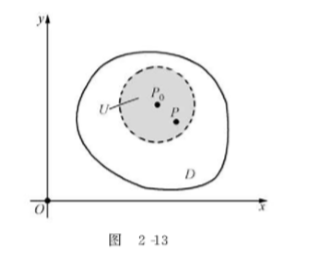

# ***多元函数的微分学***

- [***多元函数的微分学***](#多元函数的微分学)
  - [多元函数的基本概念](#多元函数的基本概念)
      - [一、平面点集](#一平面点集)
      - [二、二元函数](#二二元函数)
      - [三、多元函数的构造](#三多元函数的构造)
      - [四、多元函数的极限](#四多元函数的极限)
      - [四、多元函数的连续性](#四多元函数的连续性)
  - [偏导数与全微分](#偏导数与全微分)
      - [偏导数的概念](#偏导数的概念)
      - [高阶偏导数](#高阶偏导数)
      - [全微分](#全微分)
  - [复合函数与隐函数的偏导数](#复合函数与隐函数的偏导数)
      - [复合函数的偏导数](#复合函数的偏导数)
      - [隐函数的偏导数](#隐函数的偏导数)
  - [偏导数的应用](#偏导数的应用)
      - [多元函数的极值与最值](#多元函数的极值与最值)
        - [多元函数的极值](#多元函数的极值)
        - [多元函数的最值](#多元函数的最值)
        - [条件极值](#条件极值)
      - [偏导数的几何应用](#偏导数的几何应用)
        - [1.空间曲线的切线与法平面](#1空间曲线的切线与法平面)
---

## 多元函数的基本概念

#### 一、平面点集

&ensp;&ensp;&ensp;&ensp;**平面点集：** 平面中某些点的集合称为平面点集。

&ensp;&ensp;&ensp;&ensp;建立平面直角坐标系之后，平面点集可以用坐标的二元不等式或方程来表示，如到原点距离小于1的点的集合可表示为 $D = \{(x,y)|\sqrt{x^2+y^2}<1\}$，或简记为 $D : \sqrt{x^2+y^2}<1$。 

&ensp;&ensp;&ensp;&ensp;**平面上所有点的集合记为 $R^2$，或 $-∞<x<+∞,-∞<y<+∞$。**

&ensp;&ensp;&ensp;&ensp;**邻域：** 给定点 $P_{0}(x_{0},y_{0})$，点集 $\{(x,y)|\sqrt{(x-x_{0})^2+(y-y_{0})^2}<\delta\},\delta为常数$，称为点$P_{0}$ 的 $\delta$ 邻域，记作 $U_{\delta}(P_{0})$，称点集 $U_{\delta}(P_{0})-\{P_{0}\}$ 为点 $P_{0}$ 的 **去心邻域**，记作 ${U_{\delta}}^0(P_{0})$。

&ensp;&ensp;&ensp;&ensp;**区域与边界：** 平面上由一条或几条曲线围成并且连成一片的点集称为 **区域** ，这些曲线被称为该区域的 **边界** ，边界上的每一点称为 **边界点**。
>- 如果区域含有它的所有边界，则称该区域是闭区域。
>- 如果区域不包含它的所有边界，则称该区域为开区域。
>- 如果平面点集$D$包含在以原点为圆心的某个圆中，则称点集$D$是 **有界** 的，否则称为是 **无界** 的。

#### 二、二元函数

&ensp;&ensp;&ensp;&ensp;**定义1：** 设 $x、y、z$ 是三个变量，如果 $x、y$ 在一定范围内变化时，对于 $x、y$ 的每一组取值，变量 $z$ 按照某个法则 $f$ 总有唯一确定的值与 $x、y$ 对应，则称变量 $z$ 是变量 $x、y$ 的 **二元函数(单值)** ，记作
$$z=f(x,y) 或 z=z(x,y)$$      
并称 $x、y$ 为二元函数的 **自变量**，称变量 $z$ 为 **因变量**。

&ensp;&ensp;&ensp;&ensp;$x、y$ 的变化范围称为二元函数 $z=f(x,y)$ 的 **定义域**，记为 $D_{f}$，它是平面上的点集。

&ensp;&ensp;&ensp;&ensp;$z_{0}=f(x_{0},y_{0})$ 称为二元函数 $z=f(x,y)$ 在 $x_{0},y_{0}$ 处的 **函数值**。所有函数值的集合称为二元函数的 **值域**，记作$R_{f}$。

&ensp;&ensp;&ensp;&ensp;单值二元函数就是平面点集到实数集的映射。

&ensp;&ensp;&ensp;&ensp;二元函数 $z=f(x,y)$ 的 **图形** 是定义域当中的点$(x,y)$和它所对应的函数值$z=f(x,y)$放在一起构成的空间点$M(x,y,z)$的集合，它通常表示空间中的曲线$\Sigma$,如图所示。

&ensp;&ensp;&ensp;&ensp;这时空间曲面$\Sigma$在$xOy$面上的**投影**就是函数$z=f(x,y)$的定义域$D_{f}$。

&ensp;&ensp;&ensp;&ensp;三元函数或更多元函数的定义与二元函数的定义类似，比如三元函数$u=f(x,y,z)$定义域是空间中的点集。

#### 三、多元函数的构造

&ensp;&ensp;&ensp;&ensp;很多复杂的多元函数是由几个简单的函数经过四则运算或符合得到的，还有些函数是由多元方程确定的隐函数。

&ensp;&ensp;&ensp;&ensp;**初等函数：** 设有若干个不同的变量，由它们各自的一元初等函数经过有限次四则运算，有限次复合得到的函数称为初等函数。初等函数的定义域往往被默认为使初等函数有意义的点的集合。 

&ensp;&ensp;&ensp;&ensp;**隐函数：** 
>- 给定二元方程 $F(x,y) = 0$，如果该方程有解，则可以确定一元函数 $y=y(x)$，称为由方程 $F(x,y) = 0$ 确定的 **一元隐函数**。
>- 给定三元方程 $F(x,y,z) = 0$，如果该方程有解，则可以确定二元函数 $z=z(x,y)$，称为由方程 $F(x,y,z) = 0$ 确定的 **二元隐函数**。

#### 四、多元函数的极限

&ensp;&ensp;&ensp;&ensp;**定义2：** 设函数 $z=f(x,y)$ 在点 $P_{0}(x_{0},y_{0})$ 的某个去心邻域 $U^0(P_{0})$ 有定义，若当点 $P(x,y)$ 无限接近点 $P_{0}$ 时，函数在点 $P_{0}$ 的函数值与某个实数$A$也无限接近，则称$A$是函数$f(x,y)$在点$P_{0}$处的 **二重极限**，简称 **极限**，记为：
$$\lim\limits_{x \rightarrow x_{0},y \rightarrow y_{0}}f(x,y) = A 或  \lim\limits_{(x,y) \rightarrow (x_{0},y_{0})} f(x,y)= A$$

&ensp;&ensp;&ensp;&ensp;注意：
>1. 定义中要求函数$z=f(x,y)$在$U^0(P_{0})$有定义，即在点$P_{0}$可以没有定义，极限$A$与函数在$(x_{0},y_{0})$是否有定义无关。
>2. 二重极限也具有和一元函数极限有类似的性质，如极限的四则运算公式，复合函数的极限运算公式等，有的二重极限可以转化为一元函数的极限。

&ensp;&ensp;&ensp;&ensp;**定理1：** 设函数 $z=f(x,y)$ 在点 $P_{0}(x_{0},y_{0})$的二重极限存在的充分必要条件是：点$P(x,y)$以 **任何方式** 趋近于点$P_{0}$时，函数$f(x,y)$的极限都存在且相等。

&ensp;&ensp;&ensp;&ensp;如果点$P(x,y)$沿两条不同的路径趋近于点$P_{0}$时，函数$f(x,y)$的极限不同，则$\lim\limits_{x \rightarrow x_{0},y \rightarrow y_{0}}f(x,y)$不存在。

#### 四、多元函数的连续性

&ensp;&ensp;&ensp;&ensp;**定义3：** 设函数 $z=f(x,y)$ 在点 $P_{0}(x_{0},y_{0})$ 的某个邻域有定义，如果 $\lim\limits_{x \rightarrow x_{0},y \rightarrow y_{0}} f(x,y)= f(x_{0},y_{0})$，则称函数$f(x,y)$在点$P_{0}(x_{0},y_{0})$ **连续**，否则称为 **间断**。

&ensp;&ensp;&ensp;&ensp;若设 $\Delta z=f(x_{0}+\Delta x,y_{0}+\Delta y) - f(x_{0},y_{0}),\rho=\sqrt{\Delta x^2+\Delta y^2}$ ,则该公式等价于$\lim\limits_{\rho \rightarrow 0}\Delta z=0$ 

&ensp;&ensp;&ensp;&ensp;如果函数$z=f(x,y)$在区域$D$上每一点都连续，则称函数在**区域$D$上连续**，那么它的图形就是一个“无空隙，无裂隙”的曲面。

&ensp;&ensp;&ensp;&ensp;关于连续函数的结论
>1. 连续函数经过加减乘除(除式不为零)的运算得到的函数依旧是连续函数。
>2. 连续函数与连续函数的复合函数依旧是连续函数。
>3. **初等函数在其定义的区域内连续（并非是定义域）。**

&ensp;&ensp;&ensp;&ensp;**定理2（最值定理）：** 如果函数 $f(x,y)$ 在有界闭区域 $D$ 上连续，则 $f(x,y)$ 在$D$上一定有最大值和最小值。

&ensp;&ensp;&ensp;&ensp;**定理3（介值定理）：** 如果函数 $f(x,y)$ 在有界闭区域 $D$ 上连续，$M,m$ 分别是 $f(x,y)$ 在$D$上的最大值和最小值，则对于任何实数$c$，只要满足$m\le c\le M$，则至少存在一点$(\bar{x},\bar{y})∈D$，使得$f(x,y)=c$。

## 偏导数与全微分

#### 偏导数的概念

一元函数的导数是函数对自变量的变化率，对于多元函数也要研究变化率问题，多元函数的的变化量不止一个，首先要研究函数对其中一个自变量的变化率问题，这就引入了偏导数的概念。

&ensp;&ensp;&ensp;&ensp;**定义1：** 设函数 $z=f(x,y)$ 在点 $(x_{0},y_{0})$ 的某个邻域有定义，固定$y=y_{0}$，对于一元函数 $F(x)=f(x,y_{0})$的自变量在$x_{0}$处给出增量$\Delta x$，则有增量
$$\Delta F =F(x_{0}+\Delta x) - F(x_{0}) = f(x_{0}+\Delta x,y_{0})-f(x_{0},y_{0})$$ 
称为 $z= f(x,y)$ 在点 $(x_{0},y_{0})$ 处关于x的偏增量，记为$\Delta z$ 

若下式极限存在：
$$\lim\limits_{\Delta x \rightarrow 0}\frac{\Delta F}{\Delta x} = \lim\limits_{\Delta x \rightarrow 0}\frac{\Delta_{x}z}{\Delta x} = \lim\limits_{\Delta x \rightarrow 0}\frac{f(x_{0}+\Delta x,y_{0})-f(x_{0},y_{0})}{\Delta x}$$
则称此极限值为函数$z=f(x,y)$在点$(x_{0},y_{0})$处**对$x$的偏导数**，记作(对$y$的偏导数相同)：
$$\frac{\partial z}{\partial x}|_{x=x_{0},y=y_{0}},\frac{\partial f}{\partial x}|_{x=x_{0},y=y_{0}},f_{x}(x_{0},y_{0}),z_{x}(x_{0},y_{0}),z_{x}|_{x=x_{0},y=y_{0}},z_{x}|_{(x_{0},y_{0})}$$

由定义可得：
$$f_{x}(x_{0},y_{0}) = \frac{d}{dx}f(x,y_{0})|_{x=x_{0}}$$
$$f_{y}(x_{0},y_{0}) = \frac{d}{dy}f(x_{0},y)|_{y=y_{0}}$$

注：
>1. $f_{x}(x_{0},y_{0})$和$f_{y}(x_{0},y_{0})$的意义仅表示$f(x,y)$在$(x_{0},y_{0})$处沿$x$轴和沿$y$轴方向上的变化率，这两个方向上的变化率并不能反映函数在其他方向上的变化率。
>2. 一元函数中 “可导必连续” 得性质在多元函数中不再成立，即在多元函数中，偏导数存在$≠$连续。

**偏导函数：** 若函数在区域$D$的每一点对$x$的偏导数都存在，那么这些偏导函数构成$x,y$的二元函数，称为$z=f(x,y)$对$x$的偏导函数（偏导数），记为
$$\frac{\partial z}{\partial x},\frac{\partial f}{\partial x},f_{x}(x,y),f_{x},f_{1},z_{x}$$
类似可定义$z=f(x,y)$对$y$的偏导函数（偏导数），记为：
$$\frac{\partial z}{\partial y},\frac{\partial f}{\partial y},f_{y}(x,y),f_{y},f_{2},z_{y}$$
偏导数的概念可以推广到二元以上的多元函数。

结论：
>1. 多元函数对某个自变量求偏导,就是先将其余的变量都看作常数，对这个变量所确定的一元函数求导数，因此可运用一元函数的求导公式和求导法则.
>2. $\left|{\begin{array}{cc} 
f_{x}(x_{0},y_{0})=f_{x}(x,y)|_{x=x_{0},y=y_{0}} \\\\
f_{y}(x_{0},y_{0})=f_{y}(x,y)|_{x=x_{0},y=y_{0}}
\end{array}}\right.$

#### 高阶偏导数

**二阶偏导数:** 设函数$z = f(x, y)$在区域$D$内具有偏导数
$$\frac{\partial z}{\partial x}=f_{x}(x,y),\frac{\partial z}{\partial y}=f_{y}(x,y)$$
如果这两个偏导函数在$D$内仍有偏导数,则称它们的偏导数为$f (x, y)$的二阶偏导数，记作：
>1. $$\frac{\partial^2 z}{\partial x^2}=\frac{\partial}{\partial x}(\frac{\partial z}{\partial x}),或记作:f_{xx}(x,y),f_{11}(x,y),z_{xx}$$
>2. $$\frac{\partial^2 z}{\partial y^2}=\frac{\partial}{\partial y}(\frac{\partial z}{\partial y}),或记作:f_{yy}(x,y),f_{22}(x,y),z_{yy}$$
>3. $$\frac{\partial^2 z}{\partial x \partial y}=\frac{\partial}{\partial y}(\frac{\partial z}{\partial x}),或记作:f_{xy}(x,y),f_{12}(x,y),z_{xy}$$
>4. $$\frac{\partial^2 z}{\partial y \partial x}=\frac{\partial}{\partial x}(\frac{\partial z}{\partial y}),或记作:f_{yx}(x,y),f_{21}(x,y),z_{yx}$$

**定理1:** 如果函数$z = f(x, y)$的两个二阶混合偏导数$\frac{\partial^2 z}{\partial x \partial y},\frac{\partial^2 z}{\partial y \partial x}$ 在区域$D$内连续，则在该区域内必有
$$\frac{\partial^2 z}{\partial x \partial y}=\frac{\partial^2 z}{\partial y \partial x}$$

#### 全微分

**可微:** 对于一元函数$y= f(x)$,若$\Delta y= f(x+ \Delta x)- f(x)= A\Delta x + o(\Delta x)$, 则称函数在点$x$处可微, 
$$微分:dy= A\Delta x= f'(x)\Delta x$$
二元函数的全微分与二元函数的全增量有关。
$$\Delta z= f(x + \Delta x,y+ \Delta y)- f(x,y)$$

**定义2:** 设二元函数$z = f(x, y)$在点$(x,y)$的某邻域中有定义，如果全增量$\Delta z$可以表示为
$$\Delta z= A\Delta x+ B\Delta y + o(ρ)$$
其中$ρ=\sqrt{\Delta x^2 + \Delta y^2}，o(ρ)$是$ρ$的高阶无穷小$(ρ→0)$。
则称函数$f(x, y)$在点$(x, y)$可微，并称$A\Delta x + B\Delta y$为此函数在点$(x, y)$的全微分，记为$dz$，即
$$dz=A\Delta x + B\Delta y$$

由$\Delta z= A\Delta x+ B\Delta y + o(ρ)$可知，$\lim\limits_{\Delta z} = 0$，所以二元函数$z = f(x, y)$满足：
$$可微 \Rightarrow 连续$$

**定理2 (可微的必要条件):** 如果$z = f(x, y)$在点$(x,y)$处可微，则$z = f(x, y)$在点$(x, y)$处的两个偏导数都存在，且
$$A= f_{x}(x,y),B = f_{y}(x,y)$$
注:一元函数中 “可微必可导,可导必可微”,但在多元函数中,可微必可导，但可导不一定可微
$$可微 \Rightarrow 偏导数存在$$

由定理2，如果$z = f(x, y)$在点$(x,y)$处可微，则
$$dz=f_{x}(x,y)\Delta x + f_{y}(x,y)\Delta y$$
记$Delta x ,\Delta y$处分别为$dx,dy$，称自变量$x,y$的微分，则
$$dz=f_{x}(x,y)dx + f_{y}(x,y)dy$$

**定理3 (可微的充分条件):** 如果$z = f(x, y)$的两个偏导数在点$(x, y)$处连续,则函数$f(x, y)$在点$(x, y)$处可微
$$偏导数连续 \Rightarrow 可微$$

## 复合函数与隐函数的偏导数

#### 复合函数的偏导数

**一元函数的求导法则:** 对于可导的一元函数$y = f(u)$和$u = \varphi(x)$，它们的复合函数$y = f[\varphi(x)]$也可导，且
$$\frac{dy}{dx}=\frac{dy}{du}·\frac{du}{dx}$$
变量之间的关系可以用图示表示为
$$y \Rightarrow u \Rightarrow x$$

**定理1(一元函数的求导法则):** 如果函数$u = \varphi(x)$及$\nu = \psi(x)$都在点$x$处可微，函数$z = f(u, \psi)$在对应点的$(u, \psi)$处也可微，则复合函数$z = f[\varphi(x), \psi(x)]$在点$x$处可导，而且有
$$(全导数)\frac{dz}{dx}=\frac{\partial z}{\partial u}·\frac{du}{dx}+\frac{\partial z}{\partial \nu}·\frac{d\nu}{dx}$$

变量之间的复合关系为 **(同径相乘，异径相加)**
$$\left. z \Rightarrow {\begin{array}{cc} 
u \\\\
\nu
\end{array}}\right. \Rightarrow x $$ 

**定理2:** 如果函数$u = \varphi(x,y)$及$\nu = \partial(x, y)$都在点$(x, y)$处可微，函数$z = f(u, \nu)$在对应点的$(u, \nu)$处也可微，则复合函数$z = f[\varphi(x), \psi(x)]$在点$(x, y)$的两个偏导数都存在,而且有
$$\frac{\partial z}{\partial x}=\frac{\partial z}{\partial u}·\frac{\partial u}{\partial x}+\frac{\partial z}{\partial \nu}·\frac{\partial \nu}{\partial x} , \frac{\partial z}{\partial y}=\frac{\partial z}{\partial u}·\frac{\partial u}{\partial y}+\frac{\partial z}{\partial \nu}·\frac{\partial \nu}{\partial y}$$

变量之间的复合关系为 
$$\left. z \Rightarrow {\begin{array}{cc} 
u \\\\
\nu
\end{array}}\right. \Rightarrow× {\begin{array}{cc} 
x \\\\
y
\end{array}} $$ 

**定理3:** 如果函数$u = \varphi(x,y)$在点$(x, y)$处可微，函数$z = f(u)$在对应点的$u$处也可微，则复合函数$z = f[\varphi(x,y)]$在点$(x, y)$的两个偏导数都存在,而且有
$$\frac{\partial z}{\partial x}=\frac{dz}{du}·\frac{\partial u}{\partial x} , \frac{\partial z}{\partial y}=\frac{dz}{du}·\frac{\partial u}{\partial y}$$

#### 隐函数的偏导数

变量之间的复合关系为 
$$\left. z \Rightarrow u \Rightarrow {\begin{array}{cc} 
x \\\\
y
\end{array}}\right. $$ 

**注::** 定理1~定理3 中复合函数求偏导数的公式，称之为链式法则。求导时可先画出变量之间的复合关系图，按照 “同径相乘,异径相加” 的原则，写出复合函数的求导公式按照这个法则也可以写出其他多元复合函数的偏导数。

**定理4 (隐函数的导数和偏导数):** 
1. 设 **二元函数** $F(x, y)$在$(x_{0}, y_{0})$点的某邻域中有连续的偏导数，且
$$F_{y}(x_{0}, y_{0})≠0, F(x_{0}, y_{0})= 0,$$
> 则方程$F(x,y) = 0$在点$(x_{0}, y_{0})$的某邻域中可唯一确定具有连续导数的隐函数$y = f(x)$,使得$y_{0}= f(x_{0})$，并有
$$∵F_{x}+F_{y}\frac{dy}{dx}=0, ∴\frac{dy}{dx}=-\frac{F_{x}}{F_{y}}$$

2. 设 **三元函数** $F(x, y, z)$在$(x_{0}, y_{0}, z_{0})$点的某邻域中有连续的偏导数，且
$$F_{z}(x_{0}, y_{0}, z_{0}) ≠ 0, F(x_{0}, y_{0}, z_{0}) = 0, $$
> 则方程$F(x,y,z) = 0$在点$(x_{0}, y_{0}, z_{0})$的某邻域中可唯一确定具有连续导数的隐函数$z = f(x,y)$,使得$z_{0}= f(x_{0}, y_{0})$ 并有
$$\frac{\partial z}{\partial x}=-\frac{F_{x}}{F_{z}}, \frac{\partial z}{\partial y}=-\frac{F_{y}}{F_{z}}$$

## 偏导数的应用

#### 多元函数的极值与最值

##### 多元函数的极值
二元函数的极值在几何上表现为曲面的峰顶和谷底处的函数值。

定义1：设函数$z = f(x, y)$在区域$D$上有定义，点$P_{0}(x_{0},y_{0})$的某个邻域$U \subset D$(如图) 

>1. 如果对于$U$中异于$P_{0}(x_{0},y_{0})$的任何点$P(x,y)$，总有不等式$f(x,y)< f(x_{0},y_{0})$成立，则称$f(x_{0},y_{0})$为函数$f(x, y)$的一个 **极大值** ， $P_{0}(x_{0},y_{0})$称为极大值点。
>2. 如果对于$U$中异于$P_{0}(x_{0},y_{0})$的任何点$P(x,y)$，总有不等式$f(x,y)> f(x_{0},y_{0})$成立，则称$f(x_{0},y_{0})$为函数$f(x, y)$的一个极小值，$P_{0}(x_{0},y_{0})$称为极小值点。

**极大值和极小值统称为极值，极大值点和极小值点统称为极值点**。
注:
>1. **极值是局部范围内的最值，是可能的最值** 。
>2. 极值点是定义域的内点，**不能是边界点** 。

**定理1(极值的必要条件)：** 设函数$z = f(x,y)$在点$P_{0}(x_{0},y_{0})$的两个偏导数都存在,且函数在该点取得极值，则
$$f_{x}(x_{0},y_{0}) = 0,f_{y}(x_{0},y_{0}) = 0$$
注:使得$f_{x}(x_{0},y_{0}) = 0,f_{y}(x_{0},y_{0}) = 0$的点称为函数$z = f(x,y)$的驻点于是定理1可表述为
$$可导的极值点  \Rightarrow 驻点$$

反之,则不成立，如$z = xy$在$(0,0)$点
$$可导的极值点 \nLeftarrow  驻点$$

**定理2(极值的充分条件):** 设函数$z = f(x,y)$在其驻点$(x_{0},y_{0})$的某个邻域内有二阶的连续偏导数，令
$$A = f_{xx}(x_{0},y_{0}); \\\\
B = f_{xy}(x_{0},y_{0}); \\\\
C = f_{yy}(x_{0},y_{0}); \\\\
\Delta = B^2-AC$$

则有
>- 如果$\Delta < 0$,则点$(x_{0},y_{0})$是函数的极值点，且当$A < 0$时，$f(x_{0},y_{0})$是极大值，当$A > 0$时，$f(x_{0},y_{0})$是极小值.
>- 如果$\Delta > 0$,则点$(x_{0},y_{0})$不是函数的极值点
>- 如果$\Delta = 0$,则函数$z = f(x,y)$在点$(x_{0},y_{0})$有无极值不能确定，需用其他方法判别.

注：偏导数不存在的点也可能是极值点，如$z=\sqrt{x^2+y^2}$在点$(0,0)$的两个偏导数都不存在，但它在$(0,0)$取得极小值。
$$二元函数可能的极值点\left \lbrace{\begin{array}{cc} 驻点 \\\\
偏导数不存在的点
\end{array}}\right.$$ 

求二元函数$z= f(x,y)$极值的步骤:
>1. $解方程组\left \lbrace{\begin{array}{cc} 
f_{x}(x,y) = 0 \\\\
f_{y}(x,y) = 0 
\end{array}}\right.,求出全部的驻点。$
>2. 对每个驻点$(x_{0},y_{0})$ ,计算$A, B, C, \Delta$的值。
>3. 根据定理2判断函数在驻点$(x_{0},y_{0})$处极值情况。

注：若有$s =0$的点和偏导数不存在的点,需用其他方判别。

##### 多元函数的最值

函数的最大值和最小值问题统称为 **最值问题。**;

$$可能的最值点\left \lbrace{\begin{array}{cc} 
区域内部:驻点，不可导点 \\\\
边界上的点
\end{array}}\right.$$

如果根据实际情况认定可微函数在区域D的内部有最大值或最小值，并且在D内求得了唯一驻点，则该点处函数值即为所求最值

##### 条件极值

前面讨论的极值问题，对于自变量除了定义域的限制之外，别无其它限制条件，一般称为 **无条件极值问题** 。但在实际问题中会遇到对函数的自变量还有附加条件的极值问题，称为 **条件极值问题** 。

例如,求函数$z = f(x,y)$的极大值或极小值,其中$x, y$满足条件$φ(x,y) = 0$。
$$z= f(x,y) —— 目标函数;$$
$$φ(x,y) = 0 —— 约束条件;$$

**定理3(拉格朗日(Lagrange)乘数法):** 设 **二元函数** $f(x,y)$和$φ(x, y)$在所考虑的区域内有连续的偏导数，且$φ_{x}(x, y),φ_{y}(x,y)$不同时为零，令
$$L(x,y)= f(x,y) + \lambda φ(x,y)$$

其中常数$\lambda$称为 **拉格朗日常数** ，称为 **拉格朗日函数** 。

求 $L$ 的两个偏导数并建立方程组
$$\left\lbrace{\begin{array}{cc} 
\frac{\partial L}{\partial x} = f_{x}(x,y) + \lambda φ_{x}(x,y) = 0\\\\
\frac{\partial L}{\partial y} = f_{y}(x,y) + \lambda φ_{y}(x,y) = 0\\\\
φ(x,y) = 0
\end{array}}\right. $$ 

如果函数$z = f(x, y)$在约束条件$φ(x,y) = 0$下的极值点是$(x_{0},y_{0})$,则存在$\lambda_{0}$,使得$\lambda_{0},x_{0},y_{0}$是方程组的解。

**定理4：** 设 **三元函数** $f(x,y,z)$ 和 $φ(x, y, z)$ 在所考虑的区域内有连续的偏导数，且$φ_{x}(x,y,z), φ_{y}(x,y,z),φ_{z}(x,y,z)$不同时为零，令
$$L(x,y,z)= f(x,y,z) + \lambda φ(x,y,z)$$
求 $L$ 的两个偏导数并建立方程组
$$\left\lbrace{\begin{array}{cc} 
\frac{\partial L}{\partial x} = f_{x}(x,y,z) + \lambda φ_{x}(x,y,z) = 0\\\\
\frac{\partial L}{\partial y} = f_{y}(x,y,z) + \lambda φ_{y}(x,y,z) = 0\\\\
\frac{\partial L}{\partial z} = f_{z}(x,y,z) + \lambda φ_{z}(x,y,z) = 0\\\\
φ(x,y,z) = 0
\end{array}}\right. $$ 

如果函数$z = f(x, y, z)$在约束条件$φ(x,y,z) = 0$下的极值点是$(x_{0},y_{0},z_{0})$,则存在$\lambda_{0}$,使得$\lambda_{0},x_{0},y_{0},z_{0}$是方程组的解。

注:
> 定理3和定理4只给出了在点$(x_{0},y_{0})$或$(x_{0},y_{0},z_{0})$取得极值的必要条件，即拉格朗方程组的解点$(x_{0},y_{0})$或$(x_{0},y_{0},z_{0})$只是可能的极值点，而是否真的是极值点还需具体分析。
> 实际问题中还会遇到多个约束条件的极值问题，也可建立相应的拉格朗日函数来求解。

#### 偏导数的几何应用

##### 1.空间曲线的切线与法平面
**定义2:** 给定空间中的曲线L，点$P_{0}$是L上的一个定点,设点P是L.上异于$P_{0}$的点，当点P沿曲线L无限接近点$P_{0}$时,割线$P_{0}P$的极限位置$P_{0}T$称为曲线$L$在点$P$的 **切线**。
经过点$P_{0}$并垂直于切线的平面$\pi$称为曲线在点$P_{0}$的 **法平面**。

$$给定空间曲线L: \left\lbrace{\begin{array}{cc} 
x=x(t)\\\\
y=y(t)\\\\
z=z(t)
\end{array}}\right. $$ 
其中的三个函数都有连续的导数且导数不同时为零。 $L$上的点$P_{0}(x_{0},y_{0},z_{0})$对应的参数为$t_{0}$。
设异于$P_{0}$的点$P(x_{0} + \Delta x,y_{0} + \Delta y,z_{0} + \Delta z)$，对应的参数为$t_{0} + \Delta t$，则割线$P_{0}P$的方程为
$$\frac{x-x_{0}}{\Delta x} = \frac{y-y_{0}}{\Delta y} = \frac{z-z_{0}}{\Delta z}$$

> 切线的方向向量称为曲线$L$在点$P_{0}$的 **切向量**。
> $$s={x'(t_{0}),y'(t_{0}),z'(t_{0})}$$
> 因此曲线$L$在
 

