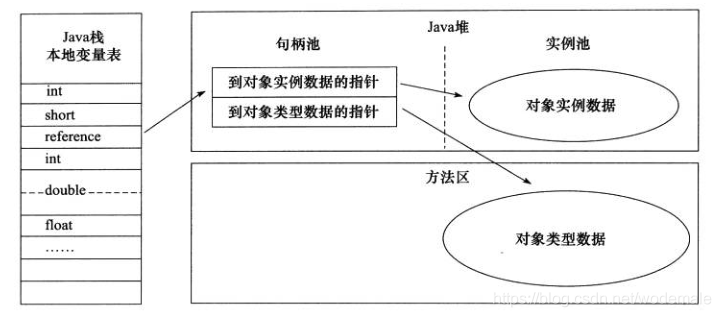
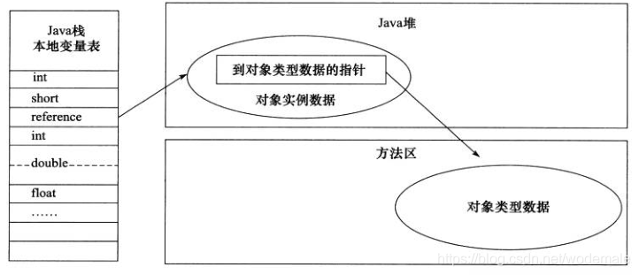

# ***空间解析几何与向量代数***

- [***空间解析几何与向量代数***](#空间解析几何与向量代数)
  - [空间直角坐标系](#空间直角坐标系)
      - [空间直角坐标系的建立](#空间直角坐标系的建立)
      - [空间两点的距离公式](#空间两点的距离公式)
  - [向量代数](#向量代数)
      - [向量的概念](#向量的概念)
      - [向量的加法](#向量的加法)
      - [向量与数的乘法](#向量与数的乘法)
      - [向量的投影](#向量的投影)
      - [向量的坐标](#向量的坐标)
  - [数量积与向量积](#数量积与向量积)
      - [数量积](#数量积)
          - [数量积的概念与性质](#数量积的概念与性质)
        - [数量积的坐标表示](#数量积的坐标表示)
      - [向量积](#向量积)
          - [向量积的概念与性质](#向量积的概念与性质)
        - [向量积的坐标表示](#向量积的坐标表示)
  - [空间的曲面和曲线](#空间的曲面和曲线)
      - [曲面方程的概念](#曲面方程的概念)
        - [旋转曲面](#旋转曲面)
        - [母线平行于坐标轴的柱面](#母线平行于坐标轴的柱面)
      - [空间中的曲线方程](#空间中的曲线方程)
        - [空间曲线的一般方程](#空间曲线的一般方程)
        - [空间曲线的参数方程](#空间曲线的参数方程)
        - [空间曲线在坐标面上的投影](#空间曲线在坐标面上的投影)
  - [空间的平面和曲线](#空间的平面和曲线)
  - [二次曲面](#二次曲面)
      - [程序计数器](#程序计数器)
      - [Java 虚拟机栈](#java-虚拟机栈)
      - [本地方法栈](#本地方法栈)
      - [Java 堆](#java-堆)
      - [方法区](#方法区)
      - [运行时常量池](#运行时常量池)
      - [直接内存](#直接内存)
  - [HotSpot 虚拟机对象探秘](#hotspot-虚拟机对象探秘)
      - [对象的创建](#对象的创建)
      - [对象的内存布局](#对象的内存布局)
      - [对象的访问定位](#对象的访问定位)
---

## 空间直角坐标系

#### 空间直角坐标系的建立
&ensp;&ensp;&ensp;&ensp;过空间定点 *O* 作三条互相垂直的数轴，它们都以 *O* 为原点，具有相同的单位长度，这三条数轴分别称为 x轴（横轴）、y轴（纵轴）、z轴（竖轴），统称 **坐标轴**。三条坐标轴中的每两条可确定一个平面为 **坐标面**：*xOy*、*yOz*、*zOx*，它们把空间分成了八个 **卦限**。


#### 空间两点的距离公式

&ensp;&ensp;&ensp;&ensp;设 M$_{1}$(x$_{1}$,y$_{1}$,z$_{1}$),M$_{2}$(x$_{2}$,y$_{2}$,z$_{2}$) 为空间两个点，通过 M$_{1}$，M$_{2}$ 各作三个分别垂直三条坐标轴的平面，这六个平面组成的一个以 M$_{1}$,M$_{2}$ 为对角线的长方体，则 M$_{1}$,M$_{2}$ 两点的距离:

> **$|M_{1},M_{2}| = \sqrt{(x_{1} - x_{2})^{2}+(y_{1} - y_{2})^{2}+(z_{1} - z_{2})^{2}}$**

## 向量代数

#### 向量的概念

&ensp;&ensp;&ensp;&ensp;既有大小又有方向的量称为 **向量**，记作 $\alpha,\beta,\gamma...$，几何上用有向线段来表示，例如以 *A* 为起点，以 *B* 为终点的有向线段即代表一个向量，记作 $\overrightarrow{AB}$，有向线段的长度代表向量的大小，方向代表向量的方向。

> 向量的大小称为 **向量的模**，记作$|\vec a|$ 或$|\overrightarrow{AB}|$。  
> 模为 0 的向量称为 **零向量**，记作 0，零向量的方向任意。  
> 模长为 1 的向量称为 **单位向量**。

&ensp;&ensp;&ensp;&ensp;**定义1：** 如果两个向量 $\alpha,\beta$ 的长度相等且方向相同，则称这两个向量是相等的向量，记作  $\alpha=\beta$。也就是说经过平移得到的向量与原向量相等，这样的向量称为 **自有向量**。

> 将非零向量 $\alpha,\beta$ 的起点放在一起，它们之间的夹角 $\varphi$ 称为 向量$\alpha,\beta$ 的夹角，记为 ($\widehat{\alpha,\beta}$)，且 $0\le\widehat{\alpha,\beta}\le\pi$。
>
>如果两个向量 $\alpha,\beta$ 的方向相同或相反，即 ($\widehat{\alpha,\beta}$) = 0 或 $\pi$，则称 **$\alpha,\beta$ 平行**(或共线)，记作 $\alpha\parallel\beta$。
>
>若非零向量 $\alpha,\beta$ 的夹角 $(\widehat{\alpha,\beta}) = \frac{\pi}{2}$，则称 $\alpha,\beta$ **垂直**，记为 $\alpha\perp\beta$。

#### 向量的加法

向量 $\alpha,\beta$ 的和记为 $\alpha+\beta$，它与$\alpha,\beta$ 的关系符合**平行四边形法则**和**三角形法则**，如图所示：


对于任意向量 $\alpha$，都有$\alpha+0=\alpha$。

向量加法符合以下运算律：
> 交换律：$\alpha+\beta=\beta+\alpha$  
> 结合律：$(\alpha+\beta)+\gamma =\alpha+(\beta+\gamma)$

#### 向量与数的乘法

&ensp;&ensp;&ensp;&ensp;**定义2：** 给定实数 $\lambda$ 及向量 $\alpha$，规定$\lambda$ 与 $\alpha$ 的数量乘法(简称为数乘) $\lambda\alpha$ 是一个向量：
> 它的大小规定：$|\lambda\alpha|=|\lambda||\alpha|$;  
> 它的方向规定为：  
> 1. 当 $\lambda>0$ 时，$\lambda\alpha$ 的方向与 $\alpha$ 的方向相同；
> 2. 当 $\lambda<0$ 时，$\lambda\alpha$ 的方向与 $\alpha$ 的方向相反；
> 3. 当 $\lambda=0$ 时，$\lambda\alpha=0$ ；
> 综上 $\lambda\alpha \parallel \alpha$

数量乘法的运算律：
> 结合律：$\lambda(\mu\alpha) =\mu(\lambda\alpha)=(\lambda\mu)\alpha$(其中$\lambda,\mu$ 为数);  
> 对于数量加法的分配律：$(\lambda+\mu)\alpha =\lambda\alpha+\mu\alpha$;   
> 对于向量加法的分配律：$\lambda(\alpha+\beta) =\lambda\alpha+\lambda\beta$;  

向量的加法和数量的乘法统称为 **向量的线性运算**。

&ensp;&ensp;&ensp;&ensp;**定理1：** 设向量 $\alpha \ne 0$，则向量 $\beta$ 平行于向量 $\alpha$ 的充要条件是：存在数量 $\lambda$，使得 $\beta = \lambda\alpha$.
> **证 充分性：** 设 $\beta = \lambda\alpha$ ，由数量乘法的定义，$\beta$ 平行于 $\alpha$。   
> **必要性：** 设 $\beta$ 与 $\alpha$ 平行，则 $\beta$ 与 $\alpha$ 要么同向要么反向，可取 $\lambda = \pm\frac{|\beta|}{|\alpha|}$，当 $\beta$ 与 $\alpha$ 同向时取正，当$\beta$ 与 $\alpha$ 反向时取负，既有 $\beta = \lambda\alpha$。

如果向量 $\alpha \ne 0$ ，向量 $\frac{1}{|\alpha|}\alpha$ 是一个模为 1 且方向与 $\alpha$ 同向的单位向量，称之为**$\alpha$的单位化向量**，记为 $\alpha^0$,即：
> $\alpha^0 = \frac{1}{|\alpha|}\alpha$ 或 $\alpha = |\alpha|\alpha^0$

#### 向量的投影

给定向量 $\alpha = \overrightarrow{AB}$ 及数轴 $\mu$，过点 *A,B* 向数轴 $\mu$ 作垂线，设垂足分别为 $A^{'},B^{'}$ ,这两个点在数轴$\mu$上的坐标分别为 $\mu_{A},\mu_{B}$。
> 分别称 $A^{'},B^{'}$ 为点 *A,B* 在数轴$\mu$上的**投影点**；   
> 称向量 $\overrightarrow{A^{'},B^{'}}$ 为向量 $\overrightarrow{AB}$ 在数轴$\mu$上的**投影向量**  
> 记 $Prj_{\mu}\overrightarrow{AB} = \mu_{B}-\mu_{A}$，称为向量 $\overrightarrow{AB}$ 在数轴$\mu$上的**投影**

注：向量在轴上的投影向量和投影具有**平移不变性**。


&ensp;&ensp;&ensp;&ensp;**定理2（投影定理）：** 对于任意非零向量 $\alpha$，有 
> $Prj_{\mu}\alpha = |\alpha|\cos\varphi$
其中 $\varphi$ 是向量 $\alpha$ 与数轴 $\mu$ 的夹角

&ensp;&ensp;&ensp;&ensp;**定理3（投影的线性性质）：**
>1. $Prj_{\mu}(\alpha\pm\beta) = Prj_{\mu}\alpha\pm Prj_{\mu}\beta)$
>2. 设$\lambda$是数量，则 $Prj_{\mu}(\lambda\alpha) = \lambda Prj_{\mu}\alpha$

#### 向量的坐标

**基本单位向量:** 与 x轴、y轴、z轴 同向的单位向量分别记为 *i,j,k*，称为**基本单位向量**。

给定空间中的点 M(a,b,c),向量$\overrightarrow{OM}$称为**向径**，显然 
> $Prj_{x}\overrightarrow{OM} = a , Prj_{y}\overrightarrow{OM} = b,Prj_{z}\overrightarrow{OM} = c$

$\overrightarrow{OM}$ 在 x轴、y轴、z轴上的投影向量 $\overrightarrow{OA}$ 、$\overrightarrow{OB}$、$\overrightarrow{OC}$，显然 
> $\overrightarrow{OA}=ai$ 、$\overrightarrow{OB}=bj$、$\overrightarrow{OC}=ck$
称之为向量 $\overrightarrow{OC}$ 在三个坐标轴上的**分向量**。

> $\overrightarrow{OM} = ai+bj+ck$

可以证明，上式用 i、j、k 表示形式是唯一的，称之为向量 $\overrightarrow{OM}$ 的 **分解式**。

对于空间中任意两点 $M_{1}(x_{1},y_{1},z_{1}),M_{2}(x_{2},y_{2},z_{2})$ 设向量 $\overrightarrow{M_{1}M_{2}}$ 可平移为向径 $\overrightarrow{OM}$ ,由向量投影的平移不变性，它们在三个坐标轴上具有相同的投影向量（**分向量**）
> $(x_{2}-x_{1})i,(y_{2}-y_{1})j,(z_{2}-z_{1})k$
因为向径 $\overrightarrow{OM}$ 可以唯一分解为三个分向量之和，且 $\overrightarrow{M_{1}M_{2}} = \overrightarrow{OM}$，所以有
> $\overrightarrow{M_{1}M_{2}} = (x_{2}-x_{1})i,(y_{2}-y_{1})j,(z_{2}-z_{1})k$
上式称为向量 $\overrightarrow{M_{1}M_{2}}$ 的**分解式**。


**向量线性运算的坐标表示：** 设向量 $\alpha = {a_{x},a_{y},a_{z}},\beta={b_{x},b_{y},b_{z}}$,则
> 1. $\alpha \pm \beta = \{ a_{x}\pm b_{x},a_{y}\pm b_{y},a_{z}\pm b_{z} \}$
> 2. $\lambda\alpha = \{ \lambda a_{x},\lambda a_{y},\lambda a_{z} \}$

**推论：** 给定两个非零向量 $\alpha,\beta$ ，坐标分别为 $\alpha = {a_{x},a_{y},a_{z}},\beta={b_{x},b_{y},b_{z}}$，则 $\alpha \parallel \beta$ 的充要条件是它们对应的坐标成比例，即
>$\alpha \parallel \beta \Leftrightarrow \frac{a_{x}}{b_{x}} = \frac{a_{y}}{b_{y}} = \frac{a_{z}}{b_{z}}$

注：在比例式中若某个分母为零，则规定相对应的分子也为零。

**向量的模：** 设向量 $\alpha = \overrightarrow{M_{1}M_{2}} = = \{a_{x},a_{y},a_{z}\}$,其中$M_{1}，M_{2}$ 的坐标为 $M_{1}(x_{1},y_{1},z_{1}),M_{2}(x_{2},y_{2},z_{2})$，则有
> $|\alpha| = |\overrightarrow{M_{1}，M_{2}}| = |M_{1}，M_{2}|  = \sqrt{(x_{2} - x_{1})^{2}+(y_{2} - y_{1})^{2}+(z_{2} - z_{1})^{2}}$ 

即

> $|\alpha| = \sqrt{{a_{x}}^2+{a_{y}}^2+{a_{z}}^2}$

**向量的方向角与方向余弦：** 非零向量 $\nu$ 与 x轴、y轴、z轴正向的夹角 $\alpha、\beta、\gamma$ 称为  $\nu$ 的**方向角** ， $\cos{\alpha},\cos{\beta},\cos{\gamma}$ 称为 $\nu$ 的**方向余弦**。

设 $\nu=\{ a_{x},a_{y},a_{z} \}$，由投影定理

> $\cos{\alpha} = \frac{a_{x}}{|\nu|},\cos{\beta} = \frac{a_{y}}{|\nu|},\cos{\gamma} = \frac{a_{z}}{|\nu|}$

易证：
> 1. $(cos{\alpha})^2 + (cos{\beta})^2 + (cos{\gamma})^2 = 1$
> 2. $cos{\alpha} + cos{\beta} + cos{\gamma} = \nu^0$


## 数量积与向量积

#### 数量积

###### 数量积的概念与性质

定义1：给定两个向量 $\alpha,\beta$，定义它们的数量积为
> $\alpha · \beta = |\alpha||\beta|\cos \varphi$
其中 $\varphi$ 是 $\alpha$ 与 $\beta$ 的夹角，数量积也称**点积**。
> 注：
> 1. 两个向量的数量积是一个数量
> 2. $\alpha·\alpha = |\alpha||\alpha|\cos0 = |\alpha|^2$

定理1：数量积的运算律
> 1. 交换律: $\alpha·\beta = \beta·\alpha$
> 2. 结合律: $\lambda(\alpha·\beta) = (\lambda\alpha)·\beta = \alpha·(\lambda\beta)$
> 3. 分配律: $(\alpha+\beta)·\gamma = \alpha·\gamma + \beta·\gamma$

定理2: （向量垂直与数量积的关系）向量 $\alpha$ 与 $\beta$ 相互垂直的充要条件是它们的数量积等于0，即：
> $\alpha \bot \beta \Leftrightarrow \alpha · \beta = 0$

##### 数量积的坐标表示

设向量 $\alpha = \{ a_{x},a_{y},a_{z} \},\beta= \{ b_{x},b_{y},b_{z} \}$ 
>则 $\alpha·\beta = (a_{x}i + a_{y}j + a_{z}k)·(b_{x}i + b_{y}j + b_{z}k) = a_{x}b_{x} + a_{y}b_{y} + a_{z}b_{z}$   

由此可见：$\alpha \bot \beta \Leftrightarrow a_{x}b_{x} + a_{y}b_{y} + a_{z}b_{z} = 0$ 

由数量积的坐标表示和数量积的定义可得，若
> $\alpha = \{ a_{x},a_{y},a_{z} \} ,\beta= \{ b_{x},b_{y},b_{z} \}$

则两向量夹角的余弦可表示为：

> $\cos\varphi = \frac{\alpha·\beta}{|\alpha||\beta|} = \frac{a_{x}b_{x} + a_{y}b_{y} + a_{z}b_{z}}{\sqrt{a_{x}^2+a_{y}^2+a_{z}^2}\sqrt{b_{x}^2+b_{y}^2+b_{z}^2}}$

#### 向量积

###### 向量积的概念与性质

定义2： 给定两个向量 $\alpha$ 与 $\beta$ ，定义它们的**向量积** 为一个向量 $\gamma$ ,记 $\gamma = \alpha · \beta$，也称为**叉积** ,它的大小和方向规定为:
> 1. $|\gamma|=|\alpha||\beta|\sin \varphi$ ,其中 $\varphi$ 为 $\alpha$ 和 $\beta$ 的夹角。
> 2. $\gamma$ 的方向垂直与 $\alpha$ 与 $\beta$ 所确定的平面(即 $\gamma$ 即垂直于 $\alpha$ 又垂直于 $\beta$)，$\gamma$ 的指向按照右手法则由 $\alpha$ 转向 $\beta$ 来确定。

注：
> 1. 两个向量的向量积是一个与这两个向量都垂直的向量。
> 2. $|\alpha × \beta| = |\alpha||\beta|\sin \varphi$ 的几何意义为，以向量  $\alpha$ 与 $\beta$ 为邻边的平行四边形的面积。

定理3：向量积的运算律
> 1. 反交换律： $\alpha × \beta = -(\alpha × \beta)$
> 2. 结合律： $\lambda(\alpha×\beta) = (\lambda\alpha)×\beta = \alpha×(\lambda\beta)$ 
> 3. 分配律： $(\alpha+\beta)·\gamma = \alpha·\gamma + \beta·\gamma$

定理4：（向量积与向量平行的关系） 向量 $\alpha$ 与 $\beta$ 相互平行的充要条件是他们的向量积等于零向量，即
>  $\alpha // \beta \Leftrightarrow \alpha × \beta = 0$ 

##### 向量积的坐标表示

设向量 $\alpha = \{ a_{x},a_{y},a_{z} \},\beta= \{ b_{x},b_{y},b_{z} \}$ 
>则 $\alpha×\beta = (a_{x}i + a_{y}j + a_{z}k)×(b_{x}i + b_{y}j + b_{z}k) = (a_{y}b_{z}-a_{z}b_{y})i -(a_{x}b_{z}-a_{z}b_{x})j + (a_{x}b_{y}-a_{y}b_{x})k$   


## 空间的曲面和曲线

#### 曲面方程的概念

定义1:给定曲面 S 与三元方程  $F(x,y,z)=0$，已知方程的解集非空，若曲面 S 与方程有下述关系：
>1. 曲面 S 上的点都满足方程，即 S 上任何点的坐标都是方程的解。
>2. 方程的解都在 S 上，即方程的任何解 $x,y,z$ 所对应的点 $P(x,y,z)$ 都在 S 上。

则称该方程为**曲面方程**，S 称为**方程所表示的曲面**。

**球面的标准方程： $(x-x_{0})^2 + (y-y_{0})^2 + (z-z_{0})^2 = R^2$**

定理1:给定方程 $F(x,y,z)=0$ 和 $G(x,y,z)=0$，它们的解集非空，分别设为 $\Omega_{F},\Omega_{G}$
>1. 这两个方程表示同一曲面的充分必要条件是它们为同解方程，即 $\Omega_{F} = \Omega_{G}$。
>2. 如果 $\Omega_{F} \subset \Omega_{G}$ ,即 $\Omega_{G}$ 的解集包括了 $\Omega_{F}$ 的解集，则方程 $F(x,y,z)=0$ 表示的曲面是 $G(x,y,z)=0$ 表示的曲面的一部分。

例如：方程 $z=\sqrt{1-x^2-y^2}$ 表示的曲面为球面 $x^2 + y^2 + z^2 = 1$ 的上半部分。

定理2：设曲面 S 的方程为 $F(x,y,z)=0$，则曲面 S 关于 $xOz$ 面对称的充要条件是：如果点 $P(x,y,z)$ 满足方程即 $F(x,y,z)=0$，那么必有点 $P'(x,y,z)=0$ 也满足方程，即 $F(x,y,z)=F(x,y,-z)$
同理，曲面 S 关于 $yOz$ 面对称的充分必要条件也是如此。
 
##### 旋转曲面

定义2：一条 **平面曲线C** 绕它所在平面的一条 **直线L** 旋转一周所生成的曲面称为 **旋转曲面（旋转面）** ，其中 **曲线C** 称为旋转曲面的 **母线** ，直线L称为旋转曲面的**旋转轴** 。

结论：
> $f(y,z) = 0$ 绕 y 轴旋转： $f(y,\pm \sqrt{x^2+z^2})=0$   
> $f(y,z) = 0$ 绕 z 轴旋转： $f(\pm \sqrt{x^2+z^2},z)=0$   
> $f(x,y) = 0$ 绕 x 轴旋转： $f(x,\pm \sqrt{y^2+z^2})=0$   


##### 母线平行于坐标轴的柱面

定义3：平行于定 *直线L* 并沿定 *曲线C* 移动的 *直线l* 所生成的曲面称为 **柱面**，*动直线l* 在移动中的每一个位置称为柱面的 **母线** ，曲线称为 **准线**。 

柱面方程特征： 
> $F(x,y) = 0$ ：准线为 $F(x,y) = 0$，母线与 z 轴平行。  
> $G(x,z) = 0$ ：准线为 $G(x,z) = 0$，母线与 y 轴平行。  
> $H(y,z) = 0$ ：准线为 $H(y,z) = 0$，母线与 x 轴平行。  

#### 空间中的曲线方程

##### 空间曲线的一般方程
空间中的曲线可以看作两个曲线的交线，给定空间中的两个曲面 $S_{1}:F(x,y,z) = 0 , S_{2}:G(x,y,z) = 0 $，设它们的交线为 C，则曲线 C 的方程为
$$\left\{\begin{array}{cc} 
		F(x,y,z) = 0\\ 
		G(x,y,z) = 0
\end{array}\right.$$
称方程组为空间曲线 C 的 **一般方程** 。

##### 空间曲线的参数方程

空间中的曲线$C$也可以使用参数方程来表达，只要将$C$上的动点$x,y,z$的坐标表示为参数$t$的函数：
$$\left\{\begin{array}{cc} 
		x=x(t)\\ 
		y=y(t)\\ 
        z=z(t)
\end{array}\right.$$
当给定 $t=t_{1}$时就得到$C$上的一个点$(x_{1},y_{1},z_{1})$,随着 $t$ 的变动便可得$C$上的全部点，称方程组为空间的**参数方程**。

##### 空间曲线在坐标面上的投影

给定曲线$C$：
$$\left \{C：\begin{array}{cc}
		F(x,y,z) = 0\\ 
		G(x,y,z) = 0
\end{array}\right.$$

使方程组中消去$z$，得到方程$H(x,y) = 0$，方程组$C$的解集包含在$H(x,y) = 0$的解集之中，因此曲线$C$包含在曲面$H(x,y) = 0$当中，由于$H(x,y) = 0$表示的是母线平行于$z$轴的柱面，因此它与$xOy$面的交线
$$\left \{C：\begin{array}{cc}
		H(x,y) = 0\\ 
		z = 0
\end{array}\right.$$

就是曲线$C$在$xOy$面内的**投影曲线**，曲面$H(x,y) = 0$称为曲线$C$关于$xOy$面的**投影柱面**。

求投影柱面和投影曲线的方法：
$$\left \{曲线C：\begin{array}{cc}
		F(x,y,z) = 0\\ 
		G(x,y,z) = 0
\end{array}\right.$$

消去 $z$:
> 曲线$C$关于$xOy$面的投影柱面：$H(x,y) = 0$   
> 曲线$C$关于$xOy$面的投影曲线：
$$\left \{\begin{array}{cc}
		H(x,y) = 0\\ 
		z = 0
\end{array}\right.$$


## 空间的平面和曲线

## 二次曲面


####  程序计数器


&ensp;&ensp;&ensp;&ensp;**程序计数器(program counter Register)** 是一块较小的内存空间，它可以看作当是当前线程所执行的字节码的行号指示器。

&ensp;&ensp;&ensp;&ensp;字节码解释器工作时就是通过改变这个计数器的值来选取下一条需要执行的字节码指令，它是程序控制流的指示器，分支、循环、跳转、异常处理、线程恢复等基础功能都需要依赖这个计数器来完成。

&ensp;&ensp;&ensp;&ensp;每个线程都需要有一个独立的程序计数器，各条线程之间计数器互不影响，独立存储，我们称这类区域为 “线程私有” 的内存。

&ensp;&ensp;&ensp;&ensp;如果线程正在执行的是一个 Java 方法，这个计数器记录的是正在执行的虚拟机字节码指令的地址；如果执行的是本地(Native)方法，这个计数器值则应为空 (Undefined)。

&ensp;&ensp;&ensp;&ensp;该区域是唯一一个没有 OOM(OutOfMemoryError) 情况的区域


####  Java 虚拟机栈

&ensp;&ensp;&ensp;&ensp;**与程序计数器一样，Java 虚拟机栈(Java Virtual Machine Stack) 也是线程私有的，它的生命周期与线程相同**。

&ensp;&ensp;&ensp;&ensp;虚拟机栈描述的是 Java 方法执行的线程内存模型：每个方法被执行的时候，Java 虚拟机都会同步创建一个 *栈帧(Stack Frame)* 用于存储局部变量表、操作数栈、动态链接、方法出口等信息。每一个方法被调用直至执行完毕的过程，就对应着一个栈帧在虚拟机栈中从入栈到出栈的过程。

&ensp;&ensp;&ensp;&ensp;Java 中 “栈” 通常就是指这里讲的虚拟机栈，或者更多的情况下只是指虚拟机栈中局部变量表部分。

&ensp;&ensp;&ensp;&ensp;局部变量表存放了编译器可知的各种 Java 虚拟机基本数据类型、对象引用(reference) 和 returnAddress(字节码指令地址)类型

&ensp;&ensp;&ensp;&ensp;这些数据类型在局部变量表中的存储控件以局部变量(Slot)来表示，其中 64 位长度的 long 与 double 类型的数据会占用两个变量槽，其余数据类型只占用一个。

&ensp;&ensp;&ensp;&ensp;局部变量表所需的内存空间在编译期间完成分配，当进入一个方法时，这个方法需要在栈帧中分配多大的局部变量空间是完全确定的，在方法运行期间不会改变局部变量表的大小(槽的数量)。

&ensp;&ensp;&ensp;&ensp;该区域规定了两个异常   
1. 如果线程请求的栈深度大于虚拟机所允许的深度，将抛出 StackOverflowError 异常。   
2. 如果虚拟机容量可以动态扩展，当栈扩展时无法申请到足够的内存时会抛出 OutOfMemoryError 异常。
   
####  本地方法栈
  
&ensp;&ensp;&ensp;&ensp;*本地方法栈(Native Memory Stacks)* 与虚拟机栈所发挥的作用是非常相似的，区别在于虚拟机栈为虚拟机执行 Java 方法(也就是字节码)服务，**而本地方法栈则是为了虚拟机使用的本地(Native)方法服务**。

&ensp;&ensp;&ensp;&ensp;该区域规定了两个异常:
1. 如果线程请求的栈深度大于虚拟机所允许的深度，将抛出 StackOverflowError 异常。   
2. 如果虚拟机容量可以动态扩展，当栈扩展时无法申请到足够的内存时会抛出 OutOfMemoryError 异常。
   
#### Java 堆

&ensp;&ensp;&ensp;&ensp;**Java 堆(Java Heap) 是虚拟机所管理的内存中最大的一块**。Java 堆是被所有线程共享的一块内存区域，在虚拟机启动时创建。此内存区域的唯一目的就是存放内存示例，“几乎” 所有的对象实例都是在这里分配内存。

&ensp;&ensp;&ensp;&ensp;Java 堆是垃圾回收器管理的内存区域，从回收内存的角度看，由于现代垃圾收集器大部分都是基于分代收集理论设计的，所以会经常出现 “新生代、老年代、永久代、Eden空间、Survivor空间”

&ensp;&ensp;&ensp;&ensp;无论从什么角度，无论如何划分，都不会改变 Java 堆中存储内容的共性，无论是哪个区域，存储的都是能使对象的实例，将 Java 堆细分的目的只是为了更好的回收内存，或者更快的分配内存


####  方法区

&ensp;&ensp;&ensp;&ensp;**方法区(Method Area) 与 Java 堆一样，是各个线程共享的内存区域，它用于存储已被虚拟机加载的类型信息、常量、静态变量、即时编译器编译后的代码缓存等数据，别名 “非堆”。**


####  运行时常量池


&ensp;&ensp;&ensp;&ensp;运行时常量池(Runtime Constant Pool)是方法区的一部分。

&ensp;&ensp;&ensp;&ensp;Class 文件中除了有类的版本、字段、方法、接口等描述信息，还有一项信息是 *常量池表(Constant Pool Table)*, **用于存放编译期生成的各种字面量与符号引用，这部分内容将在类加载后存放到方法区的运行时常量表。**

&ensp;&ensp;&ensp;&ensp;不同提供商实现的虚拟机可以按照自己的需求实现这个内存区域，不过一般来讲，**除了保存 Class 文件中描述的符号引用外，还会把由符号引用翻译出来的直接引用也存储在运行时常量池中。**

&ensp;&ensp;&ensp;&ensp;运行时常量池相较于 Class 文件常量池的另一个重要特征是具备动态性，并非预置入 Class 文件中常量池的内容才能够进入方法区运行时常量池，运行期间也可以将新的常量放入池中。

>注：
JDK1.6 Before： 运行时常量池在永久代，运行时常量池包含字符串常量池。
JDK1.7： 逐渐去永久代，字符串常量池分离至堆中。
JDK1.8 After： 无永久代，运行时常量池在元空间，字符串常量池依旧在堆中。


#### 直接内存


&ensp;&ensp;&ensp;&ensp;*直接内存(Direct Memory)* 并不是虚拟机运行时数据区的一部分。

&ensp;&ensp;&ensp;&ensp;一般用于 NIO 中的缓冲区 Buffer,可选用 Native 函数库直接分配堆外内存。

----

## HotSpot 虚拟机对象探秘

#### 对象的创建


  
&ensp;&ensp;&ensp;&ensp;**类加载检查：** 在语言层面，创建对象通常仅仅是一个 new 关键字而已，**在 VM 遇到了一条字节码 new 指令时，首先去检查这个指令的参数是否能在常量池中定位到一个类的符号引用，并且检查这个符号引用代表的类是否已被加载、解析和初始化过，如果没有，那必须执行相对应的类加载过程。**

&ensp;&ensp;&ensp;&ensp;**分配内存：** 在类加载检查通过后，接下来虚拟机将为新生对象分配内存。对象所需内存的大小在类 加载完成后便可完全确定，为对象分配空间的任务等同于把一块确定大小的内存从 Java 堆中划分出来。  VM 有两种分配方式：    
1. **指针碰撞(Bump The Pointer) ：** 默认方式，如果 Java 堆中内存是绝对规整的，所有用过的内存都放在一边，空闲的内存放在另一边，中间放着一个指针作为分界点的指示器，那所分配内存就仅仅是把那个指针向空闲空间那边挪动一段与对象大小相等的距离。 
2. **空闲列表(Free List) ：** 如果 Java 堆中的内存并不是规整的，已使用的内存和空闲的内存相互交错，那就没有办法简单地进行指针碰撞了，虚拟机就必须维护一个列表，记录哪些内存块是可用的，在分配的时候从列表中找到一块足够大的空间划分给对象实例，并更新列表上的记录。 

&ensp;&ensp;&ensp;&ensp;选择哪种方式由 Java 堆是否规整决定，而 Java 堆是否规整又由所采用的垃圾收集器是否带有空间压缩整理(Compant) 的能力决定。
   
&ensp;&ensp;&ensp;&ensp;在 VM 中，创建对象是非常频繁的行为，即使仅仅修改一个指针所指向的位置，在并发情况下也并不是线程安全的，解决这个问题有两种可选方案：
1. **对分配空间的动作进行同步处理：** 实际上 VM 是采用 CAS 配上失败重试的方式保证更新操作的原子性。
2. **把内存分配的动作按照线程划分在不同的空间之中进行：** 既每个线程在 Java 堆中预先分配一小块内存，称为 *本地线程分配缓冲(Thread Local Allocation Buffer,TLAB)* 。通过`­XX:+/UseTLAB`参数来设定虚拟机是否使用 TLAB(JVM 会默认开启`­XX:+UseTLAB`)，­`XX:TLABSize` 指定 TLAB 大小。

&ensp;&ensp;&ensp;&ensp;**初始化和设置对象头:** 内存分配完成之后，虚拟机必须将分配的内存空间(不包括对象头)都初始化为零值，如果使用 TLAB，这一项工作也可以提前到 TLAB 分配时顺便进行。接下来 VM 还需要对对象进行必要的设置，例如对象是哪个类的实例，如何寻找类的元数据，对象的哈希码，GC 分代年龄等，这些信息存放在对象头中。


&ensp;&ensp;&ensp;&ensp;**执行 `<init>` 方法：** 以上工作完成之后，在 VM 角度，一个新的对象已经诞生，但是从 Java 程序的视角来看，对象创建才刚刚开始 ———— 构造函数，即 Class 文件中的`<init>()`方法还没有执行。一般来讲(由字节码流中 new 指令后面是否跟随 invokespecial 指令所决定，Java 编译器会在遇到 new 关键字的地方同时生成这两条字节码指令，但如果直接通过其他方式产生的则不一定如此)。

#### 对象的内存布局

&ensp;&ensp;&ensp;&ensp;在 HotSpot VM 中，对象在堆内存中的储存布局可以划分为三个部分：**对象头(Header)** ，**实例数据(Instance Data)** ，**对齐填充(Padding)** 。

&ensp;&ensp;&ensp;&ensp;HotSpot VM 对象的对象头部分包括两类信息:
1. 用于存储对象自身的运行时数据，如 HashCode, GC 分代年龄，锁状态标志，线程持有的锁，偏向线程ID，偏向时间戳等，这部分称为 “Mark Word”。Mark Word 被设计称有着动态定义的数据结构，以便在极小的空间内存储尽量多的数据。
2. 对象头的另一部分是**类型指针** ，即对象指向它类型元数据的指针， Java 虚拟机通过这个指针来确定该对象是哪个类的实例，此外如果对象是一个 Java 数组，那么对象头中还必须有一块用于记录数组长度的数据。
3. 第三部分是 **对齐填充** ，并不是必然存在，仅仅有着占位符的作用，HotSpot 要求对象的起始地址是 8 字节的整数倍，换句话说，任何对象的大小都必须是 8 字节的整数倍。


&ensp;&ensp;&ensp;&ensp;对象头在hotspot的C++源码里的注释如下： 
```c++
Bit‐format of an object header (most significant first, big endian layout below): 
// 
// 32 bits: 
// ‐‐‐‐‐‐‐
// hash:25 ‐‐‐‐‐‐‐‐‐‐‐‐>| age:4 biased_lock:1 lock:2 (normal object) 
// JavaThread*:23 epoch:2 age:4 biased_lock:1 lock:2 (biased object) 
// size:32 ‐‐‐‐‐‐‐‐‐‐‐‐‐‐‐‐‐‐‐‐‐‐‐‐‐‐‐‐‐‐‐‐‐‐‐‐‐‐‐‐‐‐>| (CMS free block) 
// PromotedObject*:29 ‐‐‐‐‐‐‐‐‐‐>| promo_bits:3 ‐‐‐‐‐>| (CMS promoted object) 
// 
// 64 bits: 
// ‐‐‐‐‐‐‐
// unused:25 hash:31 ‐‐>| unused:1 age:4 biased_lock:1 lock:2 (normal object) 
// JavaThread*:54 epoch:2 unused:1 age:4 biased_lock:1 lock:2 (biased object) 
// PromotedObject*:61 ‐‐‐‐‐‐‐‐‐‐‐‐‐‐‐‐‐‐‐‐‐>| promo_bits:3 ‐‐‐‐‐>| (CMS promoted object) 
// size:64 ‐‐‐‐‐‐‐‐‐‐‐‐‐‐‐‐‐‐‐‐‐‐‐‐‐‐‐‐‐‐‐‐‐‐‐‐‐‐‐‐‐‐‐‐‐‐‐‐‐‐‐‐‐>| (CMS free block) 
// 
// unused:25 hash:31 ‐‐>| cms_free:1 age:4 biased_lock:1 lock:2 (COOPs && normal object) 
// JavaThread*:54 epoch:2 cms_free:1 age:4 biased_lock:1 lock:2 (COOPs && biased object) 
// narrowOop:32 unused:24 cms_free:1 unused:4 promo_bits:3 ‐‐‐‐‐>| (COOPs && CMS promoted object) 
// unused:21 size:35 ‐‐>| cms_free:1 unused:7 ‐‐‐‐‐‐‐‐‐‐‐‐‐‐‐‐‐‐>| (COOPs && CMS free block) 
```

#### 对象的访问定位

&ensp;&ensp;&ensp;&ensp;创建对象是为了后续使用对象，我们的 Java 程序会通过栈上的 reference 数据来操作堆上的具体数据，reference 只是一个指向对象的引用，并没有定义这个引用应该通过什么方式去定位、访问堆中对象的具体位置。

&ensp;&ensp;&ensp;&ensp;**对象的访问方式由虚拟机而定，主流的访问方式主要有使用句柄和直接指针两种：**
1. **句柄访问：** Java 堆中将可能划分出一块内存作为句柄池，reference 中存储的就是对象的句柄地址，而句柄中包含了**对象实例数据** 与**对象类型数据** 各自具体的地址信息。



2. **直接指针访问：** Java 堆中对象的内存布局就必须考虑如何放置访问类型数据的相关信息，reference 存储的直接就是对象地址，如果只是访问对象本身的话，就不需要多一次间接访问的开销



&ensp;&ensp;&ensp;&ensp;两种访问方式各有优势，**句柄访问最大好处就是 reference 中存储的是稳定句柄地址，在对象被移动的时候只会改变句柄中的实例数据指针，reference 本身不需要被修改。直接指针访问最大的好处是速度更快，节省了一次指针定位的时间开销(HotSpot 使用该种)。**