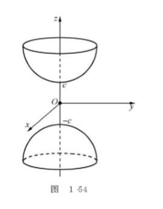

# ***空间解析几何与向量代数***

- [***空间解析几何与向量代数***](#空间解析几何与向量代数)
  - [空间直角坐标系](#空间直角坐标系)
      - [空间直角坐标系的建立](#空间直角坐标系的建立)
      - [空间两点的距离公式](#空间两点的距离公式)
  - [向量代数](#向量代数)
      - [向量的概念](#向量的概念)
      - [向量的加法](#向量的加法)
      - [向量与数的乘法](#向量与数的乘法)
      - [向量的投影](#向量的投影)
      - [向量的坐标](#向量的坐标)
  - [数量积与向量积](#数量积与向量积)
      - [数量积](#数量积)
          - [数量积的概念与性质](#数量积的概念与性质)
        - [数量积的坐标表示](#数量积的坐标表示)
      - [向量积](#向量积)
          - [向量积的概念与性质](#向量积的概念与性质)
        - [向量积的坐标表示](#向量积的坐标表示)
  - [空间的曲面和曲线](#空间的曲面和曲线)
      - [曲面方程的概念](#曲面方程的概念)
        - [旋转曲面](#旋转曲面)
        - [母线平行于坐标轴的柱面](#母线平行于坐标轴的柱面)
      - [空间中的曲线方程](#空间中的曲线方程)
        - [空间曲线的一般方程](#空间曲线的一般方程)
        - [空间曲线的参数方程](#空间曲线的参数方程)
        - [空间曲线在坐标面上的投影](#空间曲线在坐标面上的投影)
  - [空间的平面和曲线](#空间的平面和曲线)
      - [平面方程](#平面方程)
          - [平面的点法式方程](#平面的点法式方程)
          - [特殊位置的平面方程](#特殊位置的平面方程)
          - [两个平面的夹角](#两个平面的夹角)
      - [直线方程](#直线方程)
        - [直线方程的三种形式](#直线方程的三种形式)
        - [两条直线的夹角](#两条直线的夹角)
        - [直线与平面的夹角](#直线与平面的夹角)
  - [二次曲面](#二次曲面)
      - [椭球面](#椭球面)
      - [椭圆抛物面](#椭圆抛物面)
      - [椭圆锥面](#椭圆锥面)
---

## 空间直角坐标系

#### 空间直角坐标系的建立
&ensp;&ensp;&ensp;&ensp;过空间定点 *O* 作三条互相垂直的数轴，它们都以 *O* 为原点，具有相同的单位长度，这三条数轴分别称为 x轴（横轴）、y轴（纵轴）、z轴（竖轴），统称 **坐标轴**。三条坐标轴中的每两条可确定一个平面为 **坐标面**：*xOy*、*yOz*、*zOx*，它们把空间分成了八个 **卦限**。

#### 空间两点的距离公式

&ensp;&ensp;&ensp;&ensp;设 M$_{1}$(x$_{1}$,y$_{1}$,z$_{1}$),M$_{2}$(x$_{2}$,y$_{2}$,z$_{2}$) 为空间两个点，通过 M$_{1}$，M$_{2}$ 各作三个分别垂直三条坐标轴的平面，这六个平面组成的一个以 M$_{1}$,M$_{2}$ 为对角线的长方体，则 M$_{1}$,M$_{2}$ 两点的距离:

> **$|M_{1},M_{2}| = \sqrt{(x_{1} - x_{2})^{2}+(y_{1} - y_{2})^{2}+(z_{1} - z_{2})^{2}}$**

## 向量代数

#### 向量的概念

&ensp;&ensp;&ensp;&ensp;既有大小又有方向的量称为 **向量**，记作 $\alpha,\beta,\gamma...$，几何上用有向线段来表示，例如以 *A* 为起点，以 *B* 为终点的有向线段即代表一个向量，记作 $\overrightarrow{AB}$，有向线段的长度代表向量的大小，方向代表向量的方向。

> 向量的大小称为 **向量的模**，记作$|\vec a|$ 或$|\overrightarrow{AB}|$。  
> 模为 0 的向量称为 **零向量**，记作 0，零向量的方向任意。  
> 模长为 1 的向量称为 **单位向量**。

&ensp;&ensp;&ensp;&ensp;**定义1：** 如果两个向量 $\alpha,\beta$ 的长度相等且方向相同，则称这两个向量是相等的向量，记作  $\alpha=\beta$。也就是说经过平移得到的向量与原向量相等，这样的向量称为 **自有向量**。

> 将非零向量 $\alpha,\beta$ 的起点放在一起，它们之间的夹角 $\varphi$ 称为 向量$\alpha,\beta$ 的夹角，记为 ($\widehat{\alpha,\beta}$)，且 $0\le\widehat{\alpha,\beta}\le\pi$。
>
>如果两个向量 $\alpha,\beta$ 的方向相同或相反，即 ($\widehat{\alpha,\beta}$) = 0 或 $\pi$，则称 **$\alpha,\beta$ 平行**(或共线)，记作 $\alpha\parallel\beta$。
>
>若非零向量 $\alpha,\beta$ 的夹角 $(\widehat{\alpha,\beta}) = \frac{\pi}{2}$，则称 $\alpha,\beta$ **垂直**，记为 $\alpha\perp\beta$。

#### 向量的加法

&ensp;&ensp;&ensp;&ensp;向量 $\alpha,\beta$ 的和记为 $\alpha+\beta$，它与$\alpha,\beta$ 的关系符合**平行四边形法则**和**三角形法则**，如图所示：

&ensp;&ensp;&ensp;&ensp;对于任意向量 $\alpha$，都有$\alpha+0=\alpha$。

&ensp;&ensp;&ensp;&ensp;向量加法符合以下运算律：
> 交换律：$\alpha+\beta=\beta+\alpha$  
> 结合律：$(\alpha+\beta)+\gamma =\alpha+(\beta+\gamma)$

#### 向量与数的乘法

&ensp;&ensp;&ensp;&ensp;**定义2：** 给定实数 $\lambda$ 及向量 $\alpha$，规定$\lambda$ 与 $\alpha$ 的数量乘法(简称为数乘) $\lambda\alpha$ 是一个向量：
> 它的大小规定：$|\lambda\alpha|=|\lambda||\alpha|$;  
> 它的方向规定为：  
> 1. 当 $\lambda>0$ 时，$\lambda\alpha$ 的方向与 $\alpha$ 的方向相同；
> 2. 当 $\lambda<0$ 时，$\lambda\alpha$ 的方向与 $\alpha$ 的方向相反；
> 3. 当 $\lambda=0$ 时，$\lambda\alpha=0$ ；
> 综上 $\lambda\alpha \parallel \alpha$

&ensp;&ensp;&ensp;&ensp;数量乘法的运算律：
> 结合律：$\lambda(\mu\alpha) =\mu(\lambda\alpha)=(\lambda\mu)\alpha$(其中$\lambda,\mu$ 为数);  
> 对于数量加法的分配律：$(\lambda+\mu)\alpha =\lambda\alpha+\mu\alpha$;   
> 对于向量加法的分配律：$\lambda(\alpha+\beta) =\lambda\alpha+\lambda\beta$;  

&ensp;&ensp;&ensp;&ensp;向量的加法和数量的乘法统称为 **向量的线性运算**。

&ensp;&ensp;&ensp;&ensp;**定理1：** 设向量 $\alpha \ne 0$，则向量 $\beta$ 平行于向量 $\alpha$ 的充要条件是：存在数量 $\lambda$，使得 $\beta = \lambda\alpha$.
> **证 充分性：** 设 $\beta = \lambda\alpha$ ，由数量乘法的定义，$\beta$ 平行于 $\alpha$。   
> **必要性：** 设 $\beta$ 与 $\alpha$ 平行，则 $\beta$ 与 $\alpha$ 要么同向要么反向，可取 $\lambda = \pm\frac{|\beta|}{|\alpha|}$，当 $\beta$ 与 $\alpha$ 同向时取正，当$\beta$ 与 $\alpha$ 反向时取负，既有 $\beta = \lambda\alpha$。

&ensp;&ensp;&ensp;&ensp;如果向量 $\alpha \ne 0$ ，向量 $\frac{1}{|\alpha|}\alpha$ 是一个模为 1 且方向与 $\alpha$ 同向的单位向量，称之为**$\alpha$的单位化向量**，记为 $\alpha^0$,即：
> $\alpha^0 = \frac{1}{|\alpha|}\alpha$ 或 $\alpha = |\alpha|\alpha^0$

#### 向量的投影

&ensp;&ensp;&ensp;&ensp;给定向量 $\alpha = \overrightarrow{AB}$ 及数轴 $\mu$，过点 *A,B* 向数轴 $\mu$ 作垂线，设垂足分别为 $A^{'},B^{'}$ ,这两个点在数轴$\mu$上的坐标分别为 $\mu_{A},\mu_{B}$。
> 分别称 $A^{'},B^{'}$ 为点 *A,B* 在数轴$\mu$上的**投影点**；   
> 称向量 $\overrightarrow{A^{'},B^{'}}$ 为向量 $\overrightarrow{AB}$ 在数轴$\mu$上的**投影向量**  
> 记 $Prj_{\mu}\overrightarrow{AB} = \mu_{B}-\mu_{A}$，称为向量 $\overrightarrow{AB}$ 在数轴$\mu$上的**投影**

&ensp;&ensp;&ensp;&ensp;注：向量在轴上的投影向量和投影具有**平移不变性**。

&ensp;&ensp;&ensp;&ensp;**定理2（投影定理）：** 对于任意非零向量 $\alpha$，有 
> $Prj_{\mu}\alpha = |\alpha|\cos\varphi$
其中 $\varphi$ 是向量 $\alpha$ 与数轴 $\mu$ 的夹角

&ensp;&ensp;&ensp;&ensp;**定理3（投影的线性性质）：**
>1. $Prj_{\mu}(\alpha\pm\beta) = Prj_{\mu}\alpha\pm Prj_{\mu}\beta)$
>2. 设$\lambda$是数量，则 $Prj_{\mu}(\lambda\alpha) = \lambda Prj_{\mu}\alpha$

#### 向量的坐标

**基本单位向量:** 与 x轴、y轴、z轴 同向的单位向量分别记为 *i,j,k*，称为**基本单位向量**。

&ensp;&ensp;&ensp;&ensp;给定空间中的点 M(a,b,c),向量$\overrightarrow{OM}$称为**向径**，显然 
> $Prj_{x}\overrightarrow{OM} = a , Prj_{y}\overrightarrow{OM} = b,Prj_{z}\overrightarrow{OM} = c$

&ensp;&ensp;&ensp;&ensp; $\overrightarrow{OM}$ 在 x轴、y轴、z轴上的投影向量 $\overrightarrow{OA}$ 、$\overrightarrow{OB}$、$\overrightarrow{OC}$，显然 
> $\overrightarrow{OA}=ai$ 、$\overrightarrow{OB}=bj$、$\overrightarrow{OC}=ck$
称之为向量 $\overrightarrow{OC}$ 在三个坐标轴上的**分向量**。

> $\overrightarrow{OM} = ai+bj+ck$

&ensp;&ensp;&ensp;&ensp;可以证明，上式用 $i、j、k$ 表示形式是唯一的，称之为向量 $\overrightarrow{OM}$ 的 **分解式**。

&ensp;&ensp;&ensp;&ensp;对于空间中任意两点 $M_{1}(x_{1},y_{1},z_{1}),M_{2}(x_{2},y_{2},z_{2})$ 设向量 $\overrightarrow{M_{1}M_{2}}$ 可平移为向径 $\overrightarrow{OM}$ ,由向量投影的平移不变性，它们在三个坐标轴上具有相同的投影向量（**分向量**）
> $(x_{2}-x_{1})i,(y_{2}-y_{1})j,(z_{2}-z_{1})k$
&ensp;&ensp;&ensp;&ensp;因为向径 $\overrightarrow{OM}$ 可以唯一分解为三个分向量之和，且 $\overrightarrow{M_{1}M_{2}} = \overrightarrow{OM}$，所以有
> $\overrightarrow{M_{1}M_{2}} = (x_{2}-x_{1})i,(y_{2}-y_{1})j,(z_{2}-z_{1})k$
上式称为向量 $\overrightarrow{M_{1}M_{2}}$ 的**分解式**。

**向量线性运算的坐标表示：** 设向量 $\alpha = {a_{x},a_{y},a_{z}},\beta={b_{x},b_{y},b_{z}}$,则
> 1. $\alpha \pm \beta = \{ a_{x}\pm b_{x},a_{y}\pm b_{y},a_{z}\pm b_{z} \}$
> 2. $\lambda\alpha = \{ \lambda a_{x},\lambda a_{y},\lambda a_{z} \}$

**推论：** 给定两个非零向量 $\alpha,\beta$ ，坐标分别为 $\alpha = {a_{x},a_{y},a_{z}},\beta={b_{x},b_{y},b_{z}}$，则 $\alpha \parallel \beta$ 的充要条件是它们对应的坐标成比例，即
>$\alpha \parallel \beta \Leftrightarrow \frac{a_{x}}{b_{x}} = \frac{a_{y}}{b_{y}} = \frac{a_{z}}{b_{z}}$

&ensp;&ensp;&ensp;&ensp;注：在比例式中若某个分母为零，则规定相对应的分子也为零。

**向量的模：** 设向量 $\alpha = \overrightarrow{M_{1}M_{2}} = = \{a_{x},a_{y},a_{z}\}$,其中$M_{1}，M_{2}$ 的坐标为 $M_{1}(x_{1},y_{1},z_{1}),M_{2}(x_{2},y_{2},z_{2})$，则有
> $|\alpha| = |\overrightarrow{M_{1}，M_{2}}| = |M_{1}，M_{2}|  = \sqrt{(x_{2} - x_{1})^{2}+(y_{2} - y_{1})^{2}+(z_{2} - z_{1})^{2}}$ 

&ensp;&ensp;&ensp;&ensp;即

> $|\alpha| = \sqrt{{a_{x}}^2+{a_{y}}^2+{a_{z}}^2}$

&ensp;&ensp;&ensp;&ensp; **向量的方向角与方向余弦：** 非零向量 $\nu$ 与 x轴、y轴、z轴正向的夹角 $\alpha、\beta、\gamma$ 称为  $\nu$ 的**方向角** ， $\cos{\alpha},\cos{\beta},\cos{\gamma}$ 称为 $\nu$ 的**方向余弦**。

&ensp;&ensp;&ensp;&ensp; 设 $\nu=\{ a_{x},a_{y},a_{z} \}$，由投影定理

> $\cos{\alpha} = \frac{a_{x}}{|\nu|},\cos{\beta} = \frac{a_{y}}{|\nu|},\cos{\gamma} = \frac{a_{z}}{|\nu|}$

&ensp;&ensp;&ensp;&ensp; 易证：
> 1. $(cos{\alpha})^2 + (cos{\beta})^2 + (cos{\gamma})^2 = 1$
> 2. $cos{\alpha} + cos{\beta} + cos{\gamma} = \nu^0$

## 数量积与向量积

#### 数量积

###### 数量积的概念与性质

&ensp;&ensp;&ensp;&ensp; **定义1：** 给定两个向量 $\alpha,\beta$，定义它们的数量积为
> $\alpha · \beta = |\alpha||\beta|\cos \varphi$
&ensp;&ensp;&ensp;&ensp; 其中 $\varphi$ 是 $\alpha$ 与 $\beta$ 的夹角，数量积也称**点积**。
> 注：
> 1. 两个向量的数量积是一个数量
> 2. $\alpha·\alpha = |\alpha||\alpha|\cos0 = |\alpha|^2$

&ensp;&ensp;&ensp;&ensp; **定理1：** 数量积的运算律
> 1. 交换律: $\alpha·\beta = \beta·\alpha$
> 2. 结合律: $\lambda(\alpha·\beta) = (\lambda\alpha)·\beta = \alpha·(\lambda\beta)$
> 3. 分配律: $(\alpha+\beta)·\gamma = \alpha·\gamma + \beta·\gamma$

&ensp;&ensp;&ensp;&ensp; **定理2:** （向量垂直与数量积的关系）向量 $\alpha$ 与 $\beta$ 相互垂直的充要条件是它们的数量积等于0，即：
> $\alpha \bot \beta \Leftrightarrow \alpha · \beta = 0$

##### 数量积的坐标表示

&ensp;&ensp;&ensp;&ensp;  设向量 $\alpha = \{ a_{x},a_{y},a_{z} \},\beta= \{ b_{x},b_{y},b_{z} \}$ 
>则 $\alpha·\beta = (a_{x}i + a_{y}j + a_{z}k)·(b_{x}i + b_{y}j + b_{z}k) = a_{x}b_{x} + a_{y}b_{y} + a_{z}b_{z}$   

&ensp;&ensp;&ensp;&ensp;  由此可见：$\alpha \bot \beta \Leftrightarrow a_{x}b_{x} + a_{y}b_{y} + a_{z}b_{z} = 0$ 

&ensp;&ensp;&ensp;&ensp;  由数量积的坐标表示和数量积的定义可得，若
> $\alpha = \{ a_{x},a_{y},a_{z} \} ,\beta= \{ b_{x},b_{y},b_{z} \}$

&ensp;&ensp;&ensp;&ensp;  则两向量夹角的余弦可表示为：

> $\cos\varphi = \frac{\alpha·\beta}{|\alpha||\beta|} = \frac{a_{x}b_{x} + a_{y}b_{y} + a_{z}b_{z}}{\sqrt{a_{x}^2+a_{y}^2+a_{z}^2}\sqrt{b_{x}^2+b_{y}^2+b_{z}^2}}$

#### 向量积

###### 向量积的概念与性质

&ensp;&ensp;&ensp;&ensp;  **定义2：** 给定两个向量 $\alpha$ 与 $\beta$ ，定义它们的**向量积** 为一个向量 $\gamma$ ,记 $\gamma = \alpha · \beta$，也称为**叉积** ,它的大小和方向规定为:
> 1. $|\gamma|=|\alpha||\beta|\sin \varphi$ ,其中 $\varphi$ 为 $\alpha$ 和 $\beta$ 的夹角。
> 2. $\gamma$ 的方向垂直与 $\alpha$ 与 $\beta$ 所确定的平面(即 $\gamma$ 即垂直于 $\alpha$ 又垂直于 $\beta$)，$\gamma$ 的指向按照右手法则由 $\alpha$ 转向 $\beta$ 来确定。

&ensp;&ensp;&ensp;&ensp; 注：
> 1. 两个向量的向量积是一个与这两个向量都垂直的向量。
> 2. $|\alpha × \beta| = |\alpha||\beta|\sin \varphi$ 的几何意义为，以向量  $\alpha$ 与 $\beta$ 为邻边的平行四边形的面积。

&ensp;&ensp;&ensp;&ensp;  **定理3：** 向量积的运算律
> 1. 反交换律： $\alpha × \beta = -(\alpha × \beta)$
> 2. 结合律： $\lambda(\alpha×\beta) = (\lambda\alpha)×\beta = \alpha×(\lambda\beta)$ 
> 3. 分配律： $(\alpha+\beta)·\gamma = \alpha·\gamma + \beta·\gamma$

&ensp;&ensp;&ensp;&ensp;  **定理4：** （向量积与向量平行的关系） 向量 $\alpha$ 与 $\beta$ 相互平行的充要条件是他们的向量积等于零向量，即
>  $\alpha // \beta \Leftrightarrow \alpha × \beta = 0$ 

##### 向量积的坐标表示

&ensp;&ensp;&ensp;&ensp;设向量 $\alpha = \{ a_{x},a_{y},a_{z} \},\beta= \{ b_{x},b_{y},b_{z} \}$ 
>则 $\alpha×\beta = (a_{x}i + a_{y}j + a_{z}k)×(b_{x}i + b_{y}j + b_{z}k) = (a_{y}b_{z}-a_{z}b_{y})i -(a_{x}b_{z}-a_{z}b_{x})j + (a_{x}b_{y}-a_{y}b_{x})k$   

## 空间的曲面和曲线

#### 曲面方程的概念

&ensp;&ensp;&ensp;&ensp; **定义1:** 给定曲面 S 与三元方程  $F(x,y,z)=0$，已知方程的解集非空，若曲面 S 与方程有下述关系：
>1. 曲面 S 上的点都满足方程，即 S 上任何点的坐标都是方程的解。
>2. 方程的解都在 S 上，即方程的任何解 $x,y,z$ 所对应的点 $P(x,y,z)$ 都在 S 上。

&ensp;&ensp;&ensp;&ensp; 则称该方程为**曲面方程**，S 称为**方程所表示的曲面**。

&ensp;&ensp;&ensp;&ensp; **球面的标准方程： $(x-x_{0})^2 + (y-y_{0})^2 + (z-z_{0})^2 = R^2$**

&ensp;&ensp;&ensp;&ensp; **定理1:** 给定方程 $F(x,y,z)=0$ 和 $G(x,y,z)=0$，它们的解集非空，分别设为 $\Omega_{F},\Omega_{G}$
>1. 这两个方程表示同一曲面的充分必要条件是它们为同解方程，即 $\Omega_{F} = \Omega_{G}$。
>2. 如果 $\Omega_{F} \subset \Omega_{G}$ ,即 $\Omega_{G}$ 的解集包括了 $\Omega_{F}$ 的解集，则方程 $F(x,y,z)=0$ 表示的曲面是 $G(x,y,z)=0$ 表示的曲面的一部分。

&ensp;&ensp;&ensp;&ensp; 例如：方程 $z=\sqrt{1-x^2-y^2}$ 表示的曲面为球面 $x^2 + y^2 + z^2 = 1$ 的上半部分。

&ensp;&ensp;&ensp;&ensp; **定理2：** 设曲面 S 的方程为 $F(x,y,z)=0$，则曲面 S 关于 $xOz$ 面对称的充要条件是：如果点 $P(x,y,z)$ 满足方程即 $F(x,y,z)=0$，那么必有点 $P'(x,y,z)=0$ 也满足方程，即 $F(x,y,z)=F(x,y,-z)$
同理，曲面 S 关于 $yOz$ 面对称的充分必要条件也是如此。
 
##### 旋转曲面

&ensp;&ensp;&ensp;&ensp; **定义2：** 一条 **平面曲线C** 绕它所在平面的一条 **直线L** 旋转一周所生成的曲面称为 **旋转曲面（旋转面）** ，其中 **曲线C** 称为旋转曲面的 **母线** ，直线L称为旋转曲面的**旋转轴** 。

&ensp;&ensp;&ensp;&ensp; **结论：**
> $f(y,z) = 0$ 绕 y 轴旋转： $f(y,\pm \sqrt{x^2+z^2})=0$   
> $f(y,z) = 0$ 绕 z 轴旋转： $f(\pm \sqrt{x^2+z^2},z)=0$   
> $f(x,y) = 0$ 绕 x 轴旋转： $f(x,\pm \sqrt{y^2+z^2})=0$   

##### 母线平行于坐标轴的柱面

&ensp;&ensp;&ensp;&ensp; **定义3：** 平行于定 *直线L* 并沿定 *曲线C* 移动的 *直线l* 所生成的曲面称为 **柱面**，*动直线l* 在移动中的每一个位置称为柱面的 **母线** ，曲线称为 **准线**。 

&ensp;&ensp;&ensp;&ensp; 柱面方程特征： 
> $F(x,y) = 0$ ：准线为 $F(x,y) = 0$，母线与 z 轴平行。  
> $G(x,z) = 0$ ：准线为 $G(x,z) = 0$，母线与 y 轴平行。  
> $H(y,z) = 0$ ：准线为 $H(y,z) = 0$，母线与 x 轴平行。  

#### 空间中的曲线方程

##### 空间曲线的一般方程
&ensp;&ensp;&ensp;&ensp; 空间中的曲线可以看作两个曲线的交线，给定空间中的两个曲面 $S_{1}:F(x,y,z) = 0 , S_{2}:G(x,y,z) = 0 $，设它们的交线为 C，则曲线 C 的方程为
$$\left\lbrace\begin{array}{cc} 
		F(x,y,z) = 0\\ 
		G(x,y,z) = 0
\end{array}\right.$$
&ensp;&ensp;&ensp;&ensp; 称方程组为空间曲线 C 的 **一般方程** 。

##### 空间曲线的参数方程

&ensp;&ensp;&ensp;&ensp; 空间中的曲线$C$也可以使用参数方程来表达，只要将$C$上的动点$x,y,z$的坐标表示为参数$t$的函数：
$$\left\lbrace\begin{array}{cc} 
		x=x(t)\\ 
		y=y(t)\\ 
        z=z(t)
\end{array}\right.$$
&ensp;&ensp;&ensp;&ensp; 当给定 $t=t_{1}$时就得到$C$上的一个点$(x_{1},y_{1},z_{1})$,随着 $t$ 的变动便可得$C$上的全部点，称方程组为空间的**参数方程**。

##### 空间曲线在坐标面上的投影

&ensp;&ensp;&ensp;&ensp; 给定曲线 $C$：
$$ C： \left \lbrace\begin{array}{cc}
		F(x,y,z) = 0\\ 
		G(x,y,z) = 0
\end{array}\right.$$

&ensp;&ensp;&ensp;&ensp; 使方程组中消去$z$，得到方程$H(x,y) = 0$，方程组$C$的解集包含在$H(x,y) = 0$的解集之中，因此曲线$C$包含在曲面$H(x,y) = 0$当中，由于$H(x,y) = 0$表示的是母线平行于$z$轴的柱面，因此它与$xOy$面的交线
$$ C： \left \lbrace
\begin{array}{cc}
		H(x,y) = 0\\
		z = 0
\end{array}\right.$$

&ensp;&ensp;&ensp;&ensp; 就是曲线$C$在$xOy$面内的**投影曲线**，曲面$H(x,y) = 0$称为曲线$C$关于$xOy$面的**投影柱面**。

&ensp;&ensp;&ensp;&ensp; 求投影柱面和投影曲线的方法：
$$ 曲线C： \left \lbrace\begin{array}{cc}
		F(x,y,z) = 0\\ 
		G(x,y,z) = 0
\end{array}\right.$$

&ensp;&ensp;&ensp;&ensp; 消去 $z$:
&ensp;&ensp;&ensp;&ensp; 曲线$C$关于$xOy$面的投影柱面：$H(x,y) = 0$  
 
$$ 曲线C关于xOy面的投影曲线： \left \lbrace\begin{array}{cc}
		H(x,y) = 0\\ 
		z = 0
\end{array}\right.$$

## 空间的平面和曲线

#### 平面方程

###### 平面的点法式方程

&ensp;&ensp;&ensp;&ensp; 给定平面 $\pi$ 上一点 $P_{0}(x_{0},y_{0},z_{0})$ 及一个 **法向量(与平面垂直的非零向量)** $n=\{A,B,C\}$，确定平面 $\pi$ 的方程。

&ensp;&ensp;&ensp;&ensp; 设  $P(x,y,z)$ 是 $\pi$ 上一点，则向量 $\overrightarrow{P_{0}P}$ 总于 $n$ 垂直，从而 $n·\overrightarrow{P_{0}P} = 0$，用坐标表示为：
$$A(x-x_{0}) + B(y-y_{0}) + C(z-z_{0}) = 0$$
&ensp;&ensp;&ensp;&ensp; 将平面的点法式方程展开得到
$$ Ax + By + Cz +(-Ax_{0} - By_{0} - Cz_{0}) = 0 $$
&ensp;&ensp;&ensp;&ensp; 即三元一次方程 $Ax + By + Cz + D = 0$ 称 **平面的一般式方程** 。

&ensp;&ensp;&ensp;&ensp; 反之，任给三元一次方程，其中 $A,B,C$ 不全为零，则它必是某个平面的方程，从中我们可以直接写出平面的法向量 $n=\{A,B,C\}$

###### 特殊位置的平面方程

&ensp;&ensp;&ensp;&ensp; 在平面的一般方程 $Ax + By + Cz + D = 0$ 中，根据各项系数可以判断出平面相对于坐标系的特殊位置。
>1. 当 $D = 0$ 时，平面过原点。
>2. 当 $A = 0$ 时，法向量 $\{0,B,C\}$ 与基本向量单位 $i$ 垂直，从而与 $x$ 垂直，因此平面与 $x$ 轴平行。  
> 当 $B = 0$ 时，平面与 $y$ 轴平行。     
> 当 $C = 0$ 时，平面与 $z$ 轴平行。  

&ensp;&ensp;&ensp;&ensp; 由 $1,2$ 结论可得，当系数中有两个或三个零时平面的特殊位置：
> 当 $A=D=0$ 时，平面通过 $x$ 轴；
> 当 $A=B=0$ 时，平面平行于 $xOy$ 面，此时方程可以化简为 $z=h$ 的形式，特别地，$z=0$ 就是 $xOy$ 面。

&ensp;&ensp;&ensp;&ensp; 设平面 $\pi$ 的一般方程 $Ax + By + Cz + D = 0$，其中 $\pi$ 不过原点，且不与任何坐标轴平行(不过原点)，因此该平面必与三个坐标轴各有一个交点，这时 $\pi$ 可化为：
$$\frac{x}{a}+\frac{y}{b}+\frac{z}{c} = 1$$
&ensp;&ensp;&ensp;&ensp; 称该方程为平面 $\pi$ 的 **截距式方程** ,$a,b,c$ 分别称为平面$\pi$在 $x、y、z$ 轴上的 **截距**。

###### 两个平面的夹角

&ensp;&ensp;&ensp;&ensp; 给定两个平面 $\pi_{1}、\pi_{2}$,规定  $\pi_{1}、\pi_{2}$ 的夹角 $\theta$ 为它们的法向量的夹角中的锐角。
&ensp;&ensp;&ensp;&ensp; 已知 $\pi_{1}、\pi_{2}$ 分别有法向量 $n_{1}(A_{1},B_{1},C_{1}),n_{2}(A_{2},B_{2},C_{2})$,如果$\widehat{(n_{1},n_{2})}$ 为锐角，则 $\theta = \widehat{(n_{1},n_{2})}$ ，如果 $\widehat{(n_{1},n_{2})}$ 为钝角，则 $\theta = \widehat{(-n_{1},n_{2})} = \pi - \widehat{(n_{1},n_{2})}$，总之：
$$\cos\theta = |\cos\widehat{(n_{1},n_{2})}|$$ 
即
$$\cos\theta = \frac{|n_{1}·n_{2}|}{|n_{1}||n_{2}|} = \frac{|A_{1}A_{2}+B_{1}B_{2}+C_{1}C_{2}|}{\sqrt{A_{1}^2+B_{1}^2+C_{1}^2}·\sqrt{A_{2}^2+B_{2}^2+C_{2}^2}}$$

&ensp;&ensp;&ensp;&ensp; 由于两个平面垂直就是它们的法向量垂直，两个平面平行就是它们的法向量平行，因此有以下结论。
>1. $\pi_{1} \bot \pi_{2} \Leftrightarrow A_{1}A_{2}+B_{1}B_{2}+C_{1}C_{2} = 0$
>2. $\pi_{1} // \pi_{2} \Leftrightarrow \frac{A_{1}}{A_{2}} = \frac{B_{1}}{B_{2}} = \frac{C_{1}}{C_{2}}$

#### 直线方程

##### 直线方程的三种形式

1. **直线的对称式方程：** 给定直线 $l$ 上的一点 $P_{0}(x_{0},y_{0},z_{0})$ 及直线的一个 **方向向量(与直线平行的非零向量)** $\nu=\{l,m,n\}$ ,确定直线 $L$ 的方程。

&ensp;&ensp;&ensp;&ensp; 设点 $P(x,y,z)$ 是$L$上一点，则向量 $\overleftrightarrow{P_{0}P}$ 总与 $\nu$ 平行，则它们对应的坐标成比例，从而
$$\frac{x-x_{0}}{l} = \frac{y-y_{0}}{m} = \frac{z-z_{0}}{n}$$
反之，不在直线 $L$ 上的一点一定不满足该方程，该方程被称为直线 $L$ 的 **对称式(点向式)** 方程。

2. **直线的参数式方程：** 在直线的对称式方程中，若
$$\frac{x-x_{0}}{l} = \frac{y-y_{0}}{m} = \frac{z-z_{0}}{n} = t$$
&ensp;&ensp;&ensp;&ensp; 则直线 $L$ 的 **参数式方程：**
$$\left\lbrace{\begin{array}{cc} 
		x=x_{0}+lt\\ 
		y=y_{0}+mt\\ 
        z=z_{0}+nt
\end{array}}\right.$$

##### 两条直线的夹角

&ensp;&ensp;&ensp;&ensp; 给定两条直线 $L_{1}、L_{2}$，规定 $L_{1}、L_{2}$ 的夹角 $\theta$ 为它们方向夹角中的锐角。
&ensp;&ensp;&ensp;&ensp; 设它们各有方向向量
$$\nu_{1} = \{l_{1},m_{1},n_{1}\}、\nu_{2} = \{l_{2},m_{2},n_{2}\}$$
&ensp;&ensp;&ensp;&ensp; 如果 $(\widehat{\nu_{1},\nu_{2}})$ 为锐角，则 $\theta = (\widehat{\nu_{1},\nu_{2}})$ ，如果 $(\widehat{\nu_{1},\nu_{2}})$ 为钝角，则 $\theta = (\widehat{-\nu_{1},\nu_{2}}) = \pi - (\widehat{\nu_{1},\nu_{2}})$，总之：
$$\cos\theta = |\cos(\widehat{\nu_{1},\nu_{2}})|$$ 

&ensp;&ensp;&ensp;&ensp; 即
$$\cos\theta = \frac{|\nu_{1}·\nu_{2}|}{|\nu_{1}||\nu_{2}|} = \frac{|l_{1}l_{2}+m_{1}m_{2}+n_{1}n_{2}|}{\sqrt{l_{1}^2+m_{1}^2+n_{1}^2}·\sqrt{l_{2}^2+m_{2}^2+n_{2}^2}}$$

&ensp;&ensp;&ensp;&ensp; 由于两个直线垂直就是它们的方向向量垂直，两个直线平行就是它们的方向向量平行，因此有以下结论。
>1. $L_{1} \bot L_{2} \Leftrightarrow l_{1}l_{2}+m_{1}m_{2}+n_{1}n_{2} = 0$
>2. $L_{1} // L_{2} \Leftrightarrow \frac{l_{1}}{l_{2}} = \frac{m_{1}}{m_{2}} = \frac{n_{1}}{n_{2}}$

##### 直线与平面的夹角

&ensp;&ensp;&ensp;&ensp; 给定一条直线 $L$ 与一平面 $\pi$，定义它们的夹角 $\varphi$ 为：$L$ 与它在平面 $\pi$ 上的投影直线 $L'$ 的夹角 $0 \le \varphi \le \frac{\pi}{2}$。

&ensp;&ensp;&ensp;&ensp; 设直线 $L$ 的方向向量 $\nu$ 与平面 $\pi$ 的法向量 $n$ 的夹角的锐角为 $\theta$ ,则 $\varphi = \frac{\pi}{2} - \theta$，则：
$$\cos\theta = |\cos(\widehat{\nu,n})|，从而，\sin\varphi = |\cos(\widehat{\nu,n})|$$ 

&ensp;&ensp;&ensp;&ensp; 设 $\nu=\{l,m,n\}、n=\{A,B,C\}$，则：
$$\sin\varphi = \frac{|\nu·n|}{|\nu||n|} = \frac{|lA+mB+nC|}{\sqrt{l^2+m^2+n^2}·\sqrt{A^2+B^2+C^2}}$$
&ensp;&ensp;&ensp;&ensp; 由于直线与平面垂直就是 $\nu、n$ 平行，直线与平面平行，就是 $\nu、n$ 垂直，因此有以下结论：
>1. $L \bot \pi \Leftrightarrow \frac{l}{A} = \frac{m}{B} = \frac{n}{C}$
>2. $L  // \pi \Leftrightarrow lA + mB + nC = 0$

## 二次曲面

&ensp;&ensp;&ensp;&ensp; 由三元二次方程确定的曲面统称为 **二次曲面**，如球面，圆柱面，旋转抛物面等。判断曲面形状的方法为 **截痕法**，即用平行于坐标面的平面（截面）取截曲面，根据截痕的变化判断曲面的形状。

#### 椭球面

&ensp;&ensp;&ensp;&ensp; 由方程 $\frac{x^2}{a^2}+\frac{y^2}{b^2}+\frac{z^2}{c^2}=1（其中，a>0,b>0,c>0）$ 表示的曲面称为 **椭球面**。

&ensp;&ensp;&ensp;&ensp; 根据截痕法判断出形状为一个椭圆，原点$O$为它的中心，$2a,2b,2c$ 称为它的三个轴长，当 $a=b=c$ 时，方程 变为 $x^2+y^2+z^2 = a^2$ ,即球面，当 $a,b,c$ 中有两个相等时，方程表现为 **旋转椭球面**。

#### 椭圆抛物面

&ensp;&ensp;&ensp;&ensp; 由方程 $z = \frac{x^2}{a^2}+\frac{y^2}{b^2}（其中，a>0,b>0）$ 表示的曲面称为 **椭圆抛物面**。

&ensp;&ensp;&ensp;&ensp; 根据截痕法判断出形状如下图，当 $a=b$ 时，方程变为 $z = \frac{x^2+y^2}{a^2}$ ,即 **旋转抛物面** ，方程 $z = z_{0} + \frac{x^2}{a^2}+\frac{y^2}{b^2}$ 也表示 **旋转抛物面**，它是椭圆抛物面将顶点平移到点$(0,0,z_{0})$处得到的曲面，方程 $z = z_{0} - \frac{x^2}{a^2} - \frac{y^2}{b^2}$ 则表示开口朝下的椭圆抛物面。

#### 椭圆锥面

&ensp;&ensp;&ensp;&ensp; 由方程 $z^2 = \frac{x^2}{a^2}+\frac{y^2}{b^2}（其中，a>0,b>0）$ 表示的曲面称为 **椭圆锥面** 。根据截痕法判断出形状如图，原点 $O$ 称为它的顶点。

&ensp;&ensp;&ensp;&ensp; 当 $a=b$ 时，椭圆锥面变为圆锥面，如 $z^2 = x^2+y^2$， 方程 $z = \sqrt{x^2+y^2}$ 表示顶点在原点，开口朝上的圆锥面，方程  $z = -\sqrt{x^2+y^2}$ 表示顶点在原点开口朝下的圆锥面。

&ensp;&ensp;&ensp;&ensp; 由方程 $\frac{x^2}{a^2}+\frac{y^2}{b^2}-\frac{z^2}{c^2}=1（其中，a>0,b>0,c>0）$ 表示的曲面为 **单叶双曲面**。

&ensp;&ensp;&ensp;&ensp; 由方程 $\frac{x^2}{a^2}+\frac{y^2}{b^2}-\frac{z^2}{c^2}=-1（其中，a>0,b>0,c>0）$ 表示的曲面为 **双叶双曲面**。

