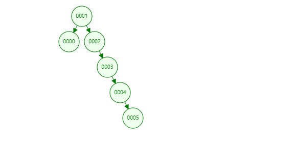
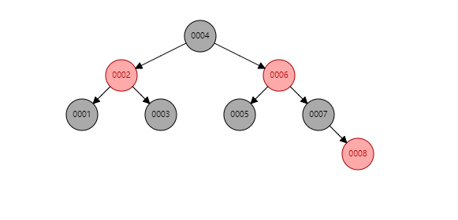
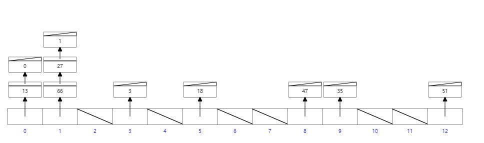
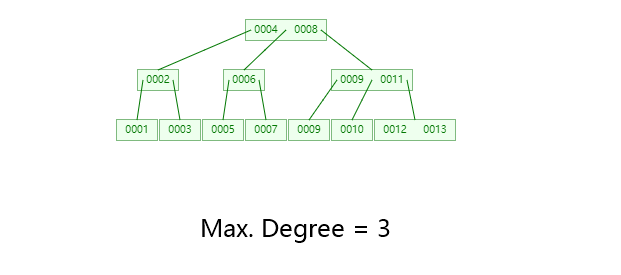
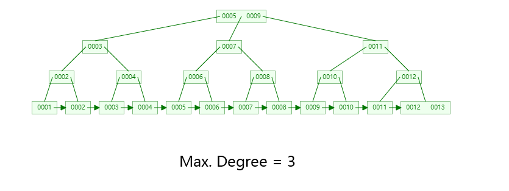

# **Mysql 底层数据结构的选择**

- [**Mysql 底层数据结构的选择**](#mysql-底层数据结构的选择)
  - [常见的数据结构](#常见的数据结构)
      - [- 二叉树](#--二叉树)
      - [- 红黑树（自平衡二叉查找树）](#--红黑树自平衡二叉查找树)
      - [- HASH](#--hash)
      - [- B-tree](#--b-tree)
      - [- B+ tree](#--b-tree-1)
  - [存储引擎](#存储引擎)
      - [MyISAM： 非聚集、拥有较高的插入，查询速度，但不支持事务](#myisam-非聚集拥有较高的插入查询速度但不支持事务)
      - [InnoDB ：聚集、5.5版本后Mysql的默认数据库，事务型数据库的首选引擎，支持ACID事务，支持行级锁定](#innodb-聚集55版本后mysql的默认数据库事务型数据库的首选引擎支持acid事务支持行级锁定)

## 常见的数据结构

#### - 二叉树

**二叉树（binary tree）** 是指树中节点的度不大于 2 的有序树，它是一种最简单且最重要的树。二叉树的递归定义为：**二叉树是一棵空树，或者是一棵由一个根节点和两棵互不相交的，分别称作根的左子树和右子树组成的非空树；左子树和右子树又同样都是二叉树** 。

#### - 红黑树（自平衡二叉查找树）

**红黑树（Red Black Tree）** 是一种自平衡二叉查找树，红黑树是一种特化的AVL树（平衡二叉树），都是在进行插入和删除操作时通过特定操作保持二叉查找树的平衡，从而获得较高的查找性能。可以在O(log n)时间内做查找，插入和删除，这里的 n 是树中元素的数目。

#### - HASH

Hash 算法可以将一个数据转换为一个标志，这个标志和源数据的每一个字节都有十分紧密的关系。Hash 算法还具有一个特点，就是很难找到逆向规律。Hash 算法是一个广义的算法，也可以认为是一种思想，使用 Hash 算法可以提高存储空间的利用率，可以提高数据的查询效率，也可以做数字签名来保障数据传递的安全性。所以 Hash 算法被广泛地应用在互联网应用中。

**Hash 算法也被称为散列算法** ，Hash 算法虽然被称为算法，但实际上它更像是一种思想。Hash 算法没有一个固定的公式，只要符合散列思想的算法都可以被称为是 Hash 算法。 [2] 

若 HASH 结构中存在和关键字K相等的记录，则必定在 f(K) 的存储位置上。由此，不需比较便可直接取得所查记录。称这个对应关系 f 为 **散列函数（Hash function）** ，按这个事先建立的表为 **散列表** 。

*对不同的关键字可能得到同一散列地址，即 key1 ≠ key2，而 f(key1) = f(key2)* ，这种现象称 **碰撞** 。具有相同函数值的关键字对该散列函数来说称做同义词。综上所述，根据散列函数 H(key) 和处理冲突的方法将一组关键字映射到一个有限的连续的地址集（区间）上，并以关键字在地址集中的“象” 作为记录在表中的存储位置，这种表便称为散列表，这一映象过程称为散列造表或散列，所得的存储位置称散列地址。

若对于关键字集合中的任一个关键字，经散列函数映象到地址集合中任何一个地址的概率是相等的，则称此类散列函数为 **均匀散列函数（Uniform Hash function）** ，这就是使关键字经过散列函数得到一个“随机的地址”，从而减少冲突。

#### - B-tree

B-tree（多路搜索树，并不是二叉的）是一种常见的数据结构。使用 B-tree 结构可以显著减少定位记录时所经历的中间过程，从而加快存取速度。按照翻译，B 通常认为是 Balance 的简称。这个数据结构一般用于数据库的索引，综合效率较高。

#### - B+ tree

B+ 树在节点访问时间远远超过节点内部访问时间的时候，比可作为替代的实现有着实在的优势。这通常在多数节点在次级存储比如硬盘中的时候出现。**通过最大化在每个内部节点内的子节点的数目减少树的高度，平衡操作不经常发生，而且效率增加了** 。这种价值得以确立通常需要每个节点在次级存储中占据完整的磁盘块或近似的大小。

B+ 背后的想法是内部节点可以有在预定范围内的可变数目的子节点。因此，B+ 树不需要象其他自平衡二叉查找树那样经常的重新平衡。对于特定的实现在子节点数目上的低和高边界是固定的。

## 存储引擎

MySQL 中的数据用各种不同的技术存储在文件（或者内存）中。这些技术中的每一种技术都使用不同的存储机制、索引技巧、锁定水平并且最终提供广泛的不同的功能和能力。通过选择不同的技术，你能够获得额外的速度或者功能，从而改善你的应用的整体功能。在 MySQL 中，存储引擎最终作用的是表而不是数据库。

#### MyISAM： 非聚集、拥有较高的插入，查询速度，但不支持事务

每个 MyISAM 数据表，皆由存储在硬盘上的 3 个文件所组成，每个文件都以数据表名称为文件主名，并搭配不同扩展名区分文件类型：
- .frm:存储数据表定义，此文件非 MyISAM 引擎的一部分。
- .MYD:存放真正的数据。
- .MYI:存储索引信息。 

#### InnoDB ：聚集、5.5版本后Mysql的默认数据库，事务型数据库的首选引擎，支持ACID事务，支持行级锁定

事务型数据库的首选引擎，支持 ACID 事务，支持行级锁定。InnoDB 是为处理巨大数据量时的最大性能设计。InnoDB 存储引擎完全与 MySQL 服务器整合，InnoDB 存储引擎为在主内存中缓存数据和索引而维持它自己的缓冲池。InnoDB 存储它的表&索引在一个表空间中，表空间可以包含数个文件（或原始磁盘分区）。这与 MyISAM 表不同，比如在 MyISAM 表中每个表被存在分离的文件中。InnoDB 表可以是任何尺寸，即使在文件尺寸被限制为 2GB 的操作系统上。

InnoDB 给 MySQL 提供了具有 *事务(transaction)、回滚(rollback)和崩溃修复能力(crash recovery capabilities)、多版本并发控制(multi-versioned concurrency control)的事务安全(transaction-safe (ACID compliant))型表。* InnoDB 提供了行级锁(locking on row level)，提供与 Oracle 类似的不加锁读取(non-locking read in SELECTs)。InnoDB 锁定在行级并且也在 SELECT 语句提供一个 Oracle 风格一致的非锁定读。这些特色增加了多用户部署和性能。

- 数据文件本身就是索引文件。
- 表数据文件本身就是按 B+Tree 组织的一个索引结构文件。
- 聚集索引 - 叶节点包含了完整的数据记录

