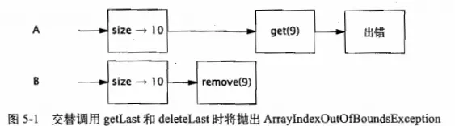
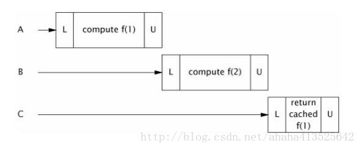
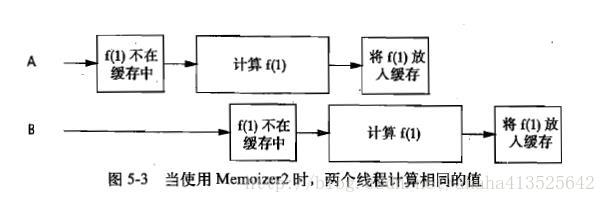
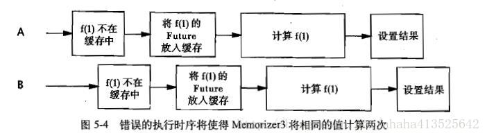

# ***基础知识：基础构建模块***

 [***基础知识：基础构建模块***](#基础知识基础构建模块)
  - [同步容器类](#同步容器类)
          - [同步容器类的问题](#同步容器类的问题)
          - [迭代器与 ConcurrentModificationException](#迭代器与-concurrentmodificationexception)
          - [隐藏迭代器](#隐藏迭代器)
  - [并发容器](#并发容器)
          - [ConcurrentHashMap](#concurrenthashmap)
          - [额外的原子 Map 操作](#额外的原子-map-操作)
          - [CopyOnWriteArrayList](#copyonwritearraylist)
  - [阻塞队列和生产者-消费者模式](#阻塞队列和生产者-消费者模式)
          - [示例：桌面搜索](#示例桌面搜索)
          - [串行线程封闭](#串行线程封闭)
          - [双端队列与工作密取](#双端队列与工作密取)
  - [阻塞方法和中断方法](#阻塞方法和中断方法)
  - [同步工具类](#同步工具类)
          - [闭锁](#闭锁)
          - [FutureTask](#futuretask)
          - [信号量](#信号量)
          - [栅栏](#栅栏)
  - [构建高效且可伸缩的结果缓存](#构建高效且可伸缩的结果缓存)
  - [小结](#小结)
----

在对象的组合中介绍了构造线程安全类时采用的一些技术，例如将线程安全性委托给现有的线程安全类。委托是创建线程安全类的一个最有效的策略：只需让现有的线程安全类管理所有的状态即可。

在本章中将介绍一些比较有用的并发构建模块，特别是在 Java 5.0 和 Java 6.0 中引入的一些新模块，以及在使用这些模块来构造应用程序时的一些常用模式。

## 同步容器类

同步容器类包括 Vector 和 Hashtable，二者是早期 JDK 的一部分，此外还包括 JDK1.2 中添加的一些功能相似的类，这些同步的封装器类是由 Collections.synchronizedXxx等工厂方法创建的。这些类实现线程安全的方式是：将它们的状态封装起来，并对每个公有方法都进行同步，使得每次只有一个线程能访问容器的状态。

###### 同步容器类的问题

同步容器类都是线程安全的，但在某些情况下可能需要额外的客户端加锁来保护复合操作。容器上常见的复合操作包括：迭代、跳转以及条件运算，例如 “若没有则添加”。在同步容器类中，这些复合操作在没有客户端加锁的情况下仍然是线程安全的，但是在其他线程并发的修改容器时，它们可能会表现出意料之外的行为。

```java
// Vector 上可能导致混乱结果的复合操作
public static Object getLast(Vector list){
    int lastIndex = list.size() - 1;
    return list.get(lastIndex);
}

public static void deleteLast(Vector list){
    int lastIndex = list.size() - 1;
    list.remove(lastIndex);
}
```

这些方法看似没有问题，从某种程度上来看也确实如此————无论多少个线程同时调用它们，也不会破坏 Vector。但从这些方法的调用者角度来看，情况就不同了。



由于同步容器类要遵守同步策略，即支持客户端加锁，因此可能会创建一些新的操作，只要我们知道应该使用哪一个锁，那么这些新操作就与容器的其他操作一样都是原子操作。同步容器类通过其自身的锁来保护它的每个方法。

```java
// 在使用客户端加锁的 Vector 上的符合操作
 public static Object getLast(Vector list){
    synchronized(list){
        int lastIndex = list.size() - 1;
        return list.get(lastIndex);
    }
 }

 public static void deleteLast(Vector list){
    synchronized(list){
        int lastIndex = list.size() - 1;
        list.remove(lastIndex);
    }
 }
```

在调用 size 和相应的 get 之间，Vector 的长度可能会发生变化，这种风险对 Vector 中的元素进行迭代时仍会出现。

```java
// 可能会抛出 ArrayIndexOutOfBoundsException 的迭代操作
for(int i = 0; i< vector.size(); i++ )
    doSomething(vector.get(i))
```
这种迭代操作的正确性要依赖于运气，即在调用 size 和 get 之间没有线程会修改 Vector。

即便在 Vector 的迭代操作中可能会抛出异常，但并不意味着 Vector 就不是线程安全的， Vector 的状态依旧是有效的，而抛出的异常也与其规范保持一致。然而，像在读取最后一个元素或者迭代等这样的简单操作中抛出异常显然不是人们所期望的。

我们可以通过在客户端加锁的方式来解决不可靠迭代的问题，但要牺牲一些伸缩性。

```java
// 客户端加锁的迭代
synchronized(vector){
    for(int i = 0; i< vector.size(); i++ )
        doSomething(vector.get(i))
}
```

###### 迭代器与 ConcurrentModificationException

许多 “现代” 的容器类也并没有消除复合操作中的问题。无论在直接迭代还是在 Java5 中引入的 for-each 循环语法中，对容器类进行复合操作的标准方法都是使用 Interator。

在设计同步容器类的迭代器时并没有考虑到并发修改的问题，并且它们表现出的行为是 “及时失败（fail-fast）” 的。 这意味着，当他们发现容器在迭代过程中被修改时，就会抛出———— ConcurrentModificationException 异常。

这种 “及时失败” 的迭代器并不是一种完备的处理机制，而只是 “善意地” 捕获并发错误，因此只能作为并发问题的预警指示器。它们采用的实现方式是，将计数器的变化与容器关联起来：如果在迭代期间计数器被修改，那么 hasNext 或 next 将抛出 ConcurrentModificationException。然而，这种检查是在没有同步的情况下进行的，因此可能会看到失效的计数值，而迭代器可能并没有意识待已经发生了修改，这是一种设计上的权衡，从而降低并发修改操作的检测代码对程序性能带来的影响。

即使在不存在饥饿或者死锁等风险，长时间对容器加锁也会降低程序的可伸缩性。如果不希望在迭代期间对容器加锁，那么一种替代方式就是 “克隆” 容器，并在副本上进行迭代。

###### 隐藏迭代器

虽然加锁可以防止迭代器抛出 ConcurrentModificationException，但实际情况要更为复杂，因为在某些情况下，迭代器会隐藏起来。

```java
// 隐藏在字符串连接中的迭代操作
public class HiddenIterator{
    private final Set<Integer> set = new Hashset<Integer>();

    public synchronized void add(Integer i){ set.add(i); }
    public synchronized void remove(Integer i){ set.remove(i); }

    public void addTenThings(){
        Random r = new Random();
        for (itn i = 0; i < 10; i ++)
            add(r.nextInt());
        // 进行了隐式地迭代
        System.out.println("DEBUG: added ten elements to " + set);
    }
}
```

addTenThings 方法可能会抛出 ConcurrentModificationException，因为在生成调试消息的过程中，toString 对容器进行了迭代。如果状态与保护它的同步代码之间相隔越远，那么开发人员就越容易忘记在访问状态时使用争取的同步。

**正如封装对象的状态有助于维持不变性一样，封装对象的同步机制同样有助于确保实施同步策略。**

容器的 hashCode 和 equals 等方法也会间接地执行迭代操作，当容器作为另一个容器的元素或键值时，就会出现这种操作。

## 并发容器

Java5 提供了多种并发容器类来改进同步容器的性能。同步容器将对容器状态的访问都串行化，以实现它们的线程安全性。这种方法的代价是严重降低并发性，当多个线程竞争容器的锁时，吞吐量将严重降低。

并发容器是针对多个线程并发访问设计的。

**通过并发容器来代替同步容器，可以极大地提高伸缩性并降低风险。**

Java5 增加了两种新的容器类型：Queue 和 BlockingQueue。

Queue 用来临时保存一组等待处理的元素，它提供了几种实现，包括：
>- ConcurrentlinkedQueue:传统先入先出的队列。
>- PriorityQueue：优先队列（非并发）。

Queue 上的操作不会阻塞，如果队列为空，那么获取元素的操作将返回空值。虽然可以用 List 来模拟 Queue 的行为————事实上，正是通过 LinkedList 来实现 Queue 的，但还需要一个 Queue 的类，因为它能去掉 List 的随机访问需求，从而实现更高效的并发。

BlockingQueue 扩展了 Queue，增加了可阻塞的插入和获取等操作。

###### ConcurrentHashMap

同步容器类在执行每个操作期间都持有一个锁，使得其他线程在这段时间内都不能访问该容器。而并发容器则与之不同，与 HashMap 一样，ConcurrentHashMap 也是一个基于散列的 Map，但它使用了一种完全不同的加锁策略来提供更高的并发行和伸缩性。ConcurrentHashMap 并不是将每个方法都在同一个锁上同步并使得每次只能有一个线程访问容器，而是使用一种粒度更细的加锁机制来实现更大程度的共享，这种机制被称为 **分段锁（Lock Striping）** 。在这种机制中，任意数量的读取线程可以并发地访问 Map，执行读取操作的线程和执行写入操作的线程可以并发地访问 Map，并且一定数量的写入线程可以并发的修改 Map。ConcurrentHashMap 带来的结果是，在并发环境下实现更高的吞吐量，而在单线程环境中只损失
非常小的性能。

ConcurrentHashMap 与其他并发容器一起增强了同步容器类：它们提供的迭代器不会抛出 ConcurrentModificationException，因此不需要在迭代过程中对容器加锁。ConcurrentHashMap 返回的的迭代器具有**弱一致性（Weakly Consistant）** ，而并非 “及时失败”。弱一致性的迭代器可以容忍并发的修改，当创建迭代器时会遍历已有的元素，并可以（但是不保证）在迭代器被构造后将修改操作反映给容器。

大多数情况下，我们通常选取ConcurrentHashMap。只有当应用程序需要加锁 Map 以进行独占访问时，才应该放弃使用 ConcurrentHashMap。

###### 额外的原子 Map 操作

由于 ConcurrentHashMap 不能被加锁来执行独占访问，因此我们无法使用客户端加锁的方式来创建新的原子操作。但 ConcurrentHashMap 提供了一些 “额外的原子Map操作”。

```java
public interface ConcurrentHashMap<k,V> extends Map<K,V>{
    //仅当K没有相应的映射值时才插入
    V putIfAbsent(K key, V value);
    //仅当K被映射到V时才移除
    boolean remove(K key, V value);
    //仅当K被映射到oldValue时才被替换
    boolean replace(K key, V oldValue, V newValue);
    //仅当K被映射到某个值时，才替换为newValue
    boolean replace(K key, V newValue);
}
```

###### CopyOnWriteArrayList

CopyOnWriteArrayList 用于替代同步 List，在某些情况下它提供了更好的并发性能，并且在迭代期间不需要对容器进行加锁或复制。

“写入时复制(Copy-On-Write)” 容器的线程安全性在于，只要正确地发布一个事实不可变对象， 那么在访问该对象时就不需要进一步的同步。在每次修改时，都会创建并重新发布一个新的容器副本，从而实现可变性。容器的迭代器保留一个指向底层的基础数组引用，这个数组当前位于迭代器的起始位置，由于它不会被修改，因此在对其进行同步时只需确保数组内容的可见性。因此，多个线程可以同时对这个容器进行迭代，而不会彼此干扰或者与修改容器的线程相互干扰。“写入时复制” 容器返回的迭代器不会抛出 ConcurrentModificationException，并且返回的元素与迭代器创建时的元素完全一致，而不必考虑之后修改操作所带来的影响。

显然，每当修改容器时都需要复制底层数组，这需要一定的开销。因此，仅当迭代器操作远远大于修改操作时，才应该用 CopyOnWriteArrayList 容器。例如，我们常见的通知系统：在分发通知时需要迭代已注册监听器链表，并调用每个监听器。

## 阻塞队列和生产者-消费者模式

阻塞队列提供了可阻塞的 put 和 take 方法，以及支持定时的 offer 和 poll 方法。如果队列已经满了，那么 put 方法会阻塞直到有空间可用；如果队列为空，那么 take 方法会阻塞直到有元素可用。队列可以是有界的也可以是无界的，无界队列永远都不会充满，因此无界队列上的 put 方法也永远不会阻塞。

阻塞队列支持生产者-消费者这种设计模式。

阻塞队列简化了消费者程序的编码，因为 take 操作会一直阻塞直到有可用的数据。如果生产者不能尽快地产生工作使消费者保持忙碌，那么消费者就只能一直等待，直到有工作可做。在某些情况下，这种方式是合适的（例如，在服务器应用程序中，没有任何客户请求服务)。但在其他另一些情况下，这也表示需要调整生产者线程数量和消费者线程数量之间的比率，从而实现更高的资源利用率。

如果生产者生成的速率比消费者处理工作的速率快，那么工作项会在队列中累积起来，最终耗尽内存。同样，put 方法的阻塞特性也极大地简化了生产者的编码。如果使用有界队列，那么当队列充满时，生产者将阻塞并且不能继续生成工作，而消费者就有时间来赶上工作处理进度。

阻塞队列提供了offer方法，如果数据项不能被添加到队列中，那么会返回一个失败状态。这样我们就可以创建更多灵活的策略来处理负荷过载的情况。比如将数据项写入磁盘，或者减少生产者线程的数量。

**在构建高可靠的应用程序时，有界队列是一种强大的资源管理工具：它们能抑制并防止产生过多的工作项，使应用程序在负荷过载的情况下变得更加健壮。**

虽然生产者 —— 消费者模式能够将生产者和消费者的代码彼此解耦开来，但它们的行为依然会通过共享工作队列间件间接地耦合在一起。

在许多情况下，阻塞队列能使工作更加简单，如果阻塞队列并不完全符合设计需求，那么还可以通过信号量（Semaphore）来创建其他的阻塞数据结构。

在类库中包含了 BlockingQueue 的多种实现
>- LinkedBlockingQueue 和 ArrayBlocking-Queue 是 FIFO 队列，两者分别与 LinkedList 和 ArrayList 类似，但比同步 List 有着更好的并发性能。
>- PriorityBlockingQueue 是一个按优先级排序的队列，其内既可以按照元素的资源顺序来排序也可以使用 Comparater 来比较。
>- SynchronizedQueue 实际上不是一个真正的队列，因为它不会为队列中元素维护存储空间，与其他队列不同的是，它维护一组线程，这些线程在等待着把元素移入或移出队列。这种实现队列的方式看似很奇怪，但由于可以直接交付工作，从而降低了将数据从生产者移动到消费者的延迟。仅当有足够多的消费者，并且总是有一个消费者准备好获取交付的工作时，才适合使用同步队列。

###### 示例：桌面搜索

```java
// 桌面搜索应用程序中的生产者任务和消费者任务
public class FileCrawler implements Runnable {
    private final BlockingQueue<File> fileQueue;
    private final FileFilter fileFilter;
    private final File root;
    ...
    public void run() {
        try {
            crawl(root);
        } catch (InterruptedException e) {
            Thread.currentThread().interrupt();
        }
    }

    private void crawl(File root) throws  InterruptedException {
        File[] entries = root.listFiles(fileFilter);
        if (entries!=null){
            for (File entry : entries) 
                if (entry.isDirectory())
                    crawl(entry);
                else if (!alreadyIndexed(entry))
                    fileQueue.put(entry);
        }
    }
}

public class Indexer implements Runnable{
    private final BlockingQueue<File> queue;
 
    Indexer(BlockingQueue<File> queue) {
        this.queue = queue;
    }

    public void run() {
        try {
            while (true){
                indexFile(queue.take());
            }
        }catch (InterruptedException e){
            Thread.currentThread().interrupt();
        }
    }
}
```

生产者 —— 消费者模式提供了一种适合线程的方法将桌面搜索问题分解为更简单的组件。将文件遍历与建立索引等功能分解为独立的操作，比如将所有功能都放到一个操作中实现有着更高的代码可读性和可重用性：每个操作只需完成一个任务，并且阻塞队列将负责所有的控制流，因此每个功能的代码都更加简单和清晰。

```java
// 启动桌面搜索
public static void startIndexing(File[] roots){
    BlockingQueue<File> queue = new LinkedBlockingDeque<>(BOUND);
    FileFilter fileFilter = new FileFilter() {
        @Override
        public boolean accept(File pathname) {
            return true;
        }
    };
    for (File root:roots) {
        new Thread(new FileCrawler(queue,fileFilter,root)).start();
    }
    for (int i = 0; i < N_CONSUMERS; i++) {
        new Thread(new Indexer(queue)).start();
    }
}
```


###### 串行线程封闭

在 java.util.concurrent 中实现的各种阻塞队列都包括了足够的内部同步机制，从而安全地将对象从生产者线程发布到消费者线程。

对于可变对象，生产者 —— 消费者 这种设计模式与阻塞队列一起，促进了串行线程封闭，从而将对象所有权从生产者交付给消费者。在转移所有权之后，也只有另一个线程能获得这个对象的访问权限，并且发布对象的线程不会再访问它。这种安全的发布确保了对象状态对于新的所有者来讲是可见的，并且由于最初的所有者不会再访问它，因此对象将被封闭在新的线程中。

对象池利用了串行线程封闭，将对象 “借给” 一个请求线程。只要对象池包含足够的内部同步来安全地发布池中的对象，并且只有客户代码本身不会发布池中的对象，或者在将对象返回给对象池后就不再使用它，那么就可以安全地在线程之间传递所有权。

###### 双端队列与工作密取

Java6 增加了两种容器类型 Deque 和 BlockingDeque，他们分别对 Queue 和 BlockingQueue 进行扩展。Deque 是一个双端队列，实现了队列在队列头和队列尾的高效插入和移除。具体实现包括 ArrayQueue 和 LinkedBlockingQueue 。

双端队列适用于另一种相关模式，即 **工作密取（Work Stealing）** 。

在工作密取中，每个消费者都有各自的双端队列。如果一个消费者完成了自己双端队列中的全部工作，那么它可以从其他消费者双端队列末尾秘密地获取工作。工作密取模式比传统的生产者——消费者模式具有更高的可伸缩性。这是因为工作者线程不会在单个共享的任务队列上发生竞争。在大多数情况下，它们都只是访问自己的双端队列，从而极大地减少了竞争，并且当它需要访问另一个队列时，它会从队列的尾部而不是头部获取工作，因此进一步降低了队列上的竞争程度。

工作密取非常适用于既是消费者也是生产者问题 ———— 当执行某个工作时可能导致出现更多的工作（例如网页爬虫）。

## 阻塞方法和中断方法

线程可能会阻塞或暂停执行，原因有多种：等待 I/O 操作结束，等待获得一个锁，等待从 Thread.sleep 方法中醒来，或是等待另一个线程的计算结果。当线程阻塞时，它通常被挂起，并处于某种阻塞状态（BLOCKED、WAITING 或 TIMED_WAITING）。阻塞操作与执行时间很长的普通操作的差别在于，被阻塞的线程必须等待某个不受它控制的事件发生后才能继续执行，例如等待 I/O 操作完成，等待某个锁变成可用，或者等待外部计算的结束。当某个外部事件发生时，线程被置回 RUNNABLE 状态，并可以再次被调度执行。

**中断是一种协作机制** 。一个线程不能强制其他线程停止正在执行的操作而去执行其他的操作。当线程 A 中断 B时，A 仅仅是要求 B 在执行到某个可以暂停的地方停止正在执行的动作 ———— 前提是如果线程 B 愿意停止下来。**方法对中断请求的响应度越高，就越容易即使取消那些执行时间很长的操作** 。

当代码中调用了一个可能 抛出InterruptedException的方法时，你自己的代码也变成了阻塞方法，并且必须要处理对中断的响应。响应的方式有两种:
>- 传递 InterruptedException。避开这个异常通常是最明智的策略 ———— 只需把 InterruptedException 传递给方法的调用者。传递的方法包括：根本不捕获该异常，或者捕获该异常，然后再执行某种简单的清理工作后再次抛出这个异常。
>- 恢复中断。有时不能直接抛出该异常，比如当代码是 Runnable 的一部分时。在这些情况下，必须捕获该异常，并通过调用当前线程上的 interrupt 方法恢复中断状态，这样在调用栈中的更高层代码将看到引发了一个中断。

```java
public void run(){
    try {
        queue.take();
    } catch {
        Thread.currentThread().interrupt();
    }
}
```

在出现 InterruptedException 时不应该做的事情是：捕获它但不做出任何响应。这将使调用栈上更高层的代码无法对中断采取处理措施，因为线程被中断的证据已经丢失。只有在一种特殊的情况中才能屏蔽中断，即对 Thread 进行扩展，并且能控制调用栈上所有更高层的代码。

## 同步工具类

同步工具类可以是任何一个对象，只要它根据其自身的状态来协调现成的控制流。阻塞队列可以作为同步工具类，其他类型的同步工具类还包括信号量（Semaphore）、栅栏（Barrier）以及闭锁（Latch）。

**所有的同步工具类都包括一些特定的结构化属性：它们封装了一些状态，这些状态将决定执行同步工具类的线程是继续执行还是等待，此外还提供了一些方法对状态进行操作，以及另一些方法用于高效地等待同步工具类进入到预期状态。**

###### 闭锁

闭锁是一种同步工具类，可以延迟线程的进度直到其到达终止状态[CPJ 3.4.2]。闭锁的作用相当于一扇门: 在闭锁到达结束状态之前，这扇门一直是关闭的，并且没有任何线程能通过，当到达结束状态时，这扇门会打开并允许所有的线程通过。当闭锁到达结束状态后，将不会再改变状态，因此这扇门将永远保持打开状态。

闭锁可以用来确保某些活动直到其他活动都完成后才继续执行，例如:
>- 确保某个计算在其需要的所有资源都被初始化之后才继续执行。二元闭锁(包括两个状态)可以用来表示 “资源 R 已经被初始化”，而所有需要 R 的操作都必须先在这个闭锁上等待。
>- 确保某个服务在其依赖的所有其他服务都已经启动之后才启动。每个服务都有一个相关的二元闭锁。当启动服务 S 时，将首先在 S 依赖的其他服务的闭锁上等待，在所有依赖的服务都启动后会释放闭锁 S ,这样其他依赖 S 的服务才能继续执行。
>- 等待直到某个操作的所有参与者(例如，在多玩家游戏中的所有玩家)都就绪再继续执行。在这种情况中，当所有玩家都准备就绪时，闭锁将到达结束状态。

CountDownLatch 是一种灵活的闭锁实现，可以在上述各种情况中使用，它可以使一个或多个线程等待一组事件发生。闭锁状态包括一个计数器，该计数器被初始化为一个正数，表示需要等待的事件数量。countDown 方法递减计数器，表示有一个事件已经发生了，而 await 方法等待计数器达到零，这表示所有需要等待的事件都已经发生。如果计数器的值非零，那 await 会一直阻塞直到计数器为零，或者等待中的线程中断，或者等待超时。

```java
// 在计时测试中使用 CountDownLatch 来启动和停止线程
public class CountLatchTest {
    
    public long timeTask(int threadNumbers, Runnable task) throws InterruptedException {
        CountDownLatch startGate = new CountDownLatch(1);
        CountDownLatch endGate = new CountDownLatch(threadNumbers);

        for (int i = 0; i < threadNumbers; i++) {
            new Thread() {
                public void run() {
                    try {
                        startGate.await();
                        try{
                            task.run();
                        } finally{
                            endGate.countDown();
                        }
                        endGate.countDown();
                    } catch (InterruptedException e) { }
                }
            }.start();
        }
        long start = System.nanoTime();
        startGate.countDown();
        endGate.await();
        long end = System.nanoTime();
        return end - start;
    }

}
```

启动门将使得主线程能够同时释放所有工作线程，而结束门则使主线程能够等待最后一个线程执行完成，而不是顺序地等待每个线程执行完成。

###### FutureTask

FutureTask 也可以用做闭锁。(FutureTaskh 实现了 Future 语义，表示一种抽象的 可生成结果的计算[CPJ 4.3.31)。FutureTask 表示的计算是通过Callable 来实现的，相当于一种可生成结果的 Runnable,并且可以处于以下3种状态:**等待运行(Waiting to run)** ，**正在运行(Running)** 和**运行完成(Completed)** 。“执行完成”表示计算的所有可能结束方式，包括正常结束、由于取消而结束和由于异常而结束等。当FutureTask进入完成状态后，它会永远停止在这个状态上。

Future.get 的行为取决于任务的状态。如果任务已经完成，那么 get 会立即返回结果，否则 get 将阻塞直到任务进入完成状态，然后返回结果或者抛出异常。FutureTask 将计算结果从执行计算的线程传递到获取这个结果的线程，而 FutureTask 的规范确保了这种传递过程能实现结果的安全发布。

```java
// 使用 FutureTask 来提前加载稍后需要的数据
public class Preloader {
    private final FutureTask<Integer> future = new FutureTask<>(new Callable() {
        public Integer call() throws DataloadException {
            return loadProductInfo();
        }
    });
    private final Thread thread = new Thread(future);

    public void start() { thread.start(); }

    public Integer get() throws DataloadException, InterruptedException {
        try {
            return future.get();
        } catch (ExecutionException e) {
            Throwable cause = e.getCause();
            if(cause instanceof DataloadException)
                throw (DataloadException)cause;
            else
                throw launderThrowable(cause);
        }
    }
}
```

```java
// 强制将未检查的 Throwable 转换为 RuntimeException
private static Exception launderThrowable(Throwable cause) {
    if (cause instanceof RuntimeException)
        return (RuntimeException) cause;
    else if (cause instanceof Error)
        throw (Error) cause;
    else
        throw new IllegalStateException("Not Checked", cause);
}
```

###### 信号量
 
计数信号量(Counting Semaphore) 用来控制同时访问某个特定资源的操作数量，或者同时执行某个指定操作的数量[CPJ 34.1]。计数信号量还可以用来实现某种资源池，或者对容器施加边界。

Semaphore 中管理着一组虚拟的许可(permit),许可的初始数量可通过构造函数来指定。在执行操作时可以首先获得许可(只要还有剩余的许可)，并在使用以后释放许可。如果没有许可，那么 acquire 将阻塞直到有许可(或者直到被中断或者操作超时)。release 方法将返回一个许可给信号量。计算信号量的一种简化形式是二值信号量，即初始值为 1 的 Semaphore。二值信号量可以用做互斥体(mutex)，并具备不可重入的加锁语义:谁拥有这个唯一的许可，谁就拥有了互斥锁。

Semaphore 可以用于实现资源池，例如数据库连接池。我们可以构造一个固定长度的资源池，当池为空时，请求资源将会失败，但你真正希望看到的行为是阻塞而不是失败，并且当池非空时解除阻塞。如果将 Semaphore 的计数值初始化为池的大小，并在从池中获取一个资源之前首先调用 acquire 方法获取一个许可，在将资源返回给池之后调用 release 释放许可，那么 acquire 将直阻塞直到资源池不为空。

```java
// 使用 Semaphore 为容器设置边界
public class BoundedHashSet<T> {  
  
    private final Set<T> set;  
    private final Semaphore sem;  
  
    public BoundedHashSet(int bound) {  
        this.set = Collections.synchronizedSet(new LinkedSet<T>());  
        sem = new Semaphore(bound);  
    }  
  
    public boolean add(T obj) throws InterruptedException {  
        sem.acquire();  
        boolean wasAdded = false;  
        try {  
            wasAdded = set.add(obj);  
            return wasAdded;
        }  
        finally {  
            if (!wasAdded) 
                sem.release();  
        }  
    }  
  
    public boolean remove(Object obj) {  
        boolean wasRemoved = set.remove(obj);  
        if (wasRemoved) {  
            sem.release();  
        }  
        return wasRemoved;  
    }
}
```


###### 栅栏

我们已经看到通过闭锁来启动一组相关的操作，或者等待一组相关的操作结束。闭锁是一次性对象，一旦进入终止状态，就不能被重置。

栅栏(Barrier) 类似于闭锁，它能阻塞一组线程直到某个事件发生[CPJ 4,4.3]。栅栏与闭锁的关键区别在于，所有线程必须同时到达栅栏位置，才能继续执行。闭锁用于等待事件，而栅栏用于等待其他线程。栅栏用于实现一些协议，例如几个家庭决定在某个地方集合:“所有人6:00在麦当劳碰头，到了以后要等其他人，之后再讨论下一步要做的事情。”

CyclicBarrier 可以使一定数量的参与方反复地在栅栏位置汇集，它在并行迭代算法中非常有用:这种算法通常将一个问题拆分成一系列相互独立的子问题。当线程到达栅栏位置时将调用 await 方法，这个方法将阻塞直到所有线程都到达栅栏位置。如果所有线程都到达了栅栏位置，那么栅栏将打开，此时所有线程都被释放，而栅栏将被重置以便下次使用。如果对 await 的调用超时，或者 await 阻塞的线程被中断，那么栅栏就被认为是打破了，所有阻塞的 await 调用都将终止并抛出 BrokenBarrierException 。如果成功地通过栅栏，那么 await 将为每个线程返回一个唯一的到达索引号，我们可以利用这些索引来 “选举” 产生一个领导线程，并在下一次迭代中由该领导线程执行一些特殊的工作。CyclicBarrier 还可以使你将一个栅栏操作传递给构造函数，这是一个Runnable, 当成功通过栅栏时会(在一个子任务线程中)执行它，但在阻塞线程被释放之前是不能执行的。

在模拟程序中通常需要使用栅栏，例如某个步骤中的计算可以并行执行，但必须等到该步骤中的所有计算都执行完毕才能进入下一个步骤。例如，在 n-body 粒子模拟系统中，每个步骤都根据其他粒子的位置和属性来计算各个粒子的新位置。通过在每两次更新之间等待栅栏，能够确保在第 k 步中的所有更新操作都已经计算完毕，才进入第 k+1 步。

```java
// 通过 CyclicBarrier 协调细胞自动衍生系统中的计算
public class CellularAutomata {
    private final Board mainBoard;
    private final CyclicBarrier barrier;
    private final Worker[] workers;

    public CellularAutomata(Board board) {
        this.mainBoard = board;
        int count = Runtime.getRuntime().availableProcessors();

        this.barrier = new CyclicBarrier(count, new Runnable() {
            public void run() {
                mainBoard.commitNewValues();
            }
        });
        this.workers = new Worker[count];
        for (int i = 0; i < count; i++)
            workers[i] = new Worker(mainBoard.getSubBoard(count, i));
    }

    public class Worker implements Runnable {
        private final Board board;
        public Worker(Board board) { this.board = board; }

        public void run() {         
            while (!board.hasConverged()) {
                for (int x = 0; x < board.getMaxX(); x++)
                    for (int y = 0; y < board.getMaxY(); y++)
                        board.setNewValue(x, y, computeValue(x, y));
                try {
                    barrier.await();
                } catch (InterruptedException e) {
                    return;
                } catch (BrokenBarrierException e) {
                    return;
                }
            }
        }
    }

    public void start() {
        for (int i = 0; i < workers.length; i++)
            new Thread(workers[i]).start(); //为每个子问题分配一个线程
        mainBoard.waitForConvergence();//进行下一步
    }
}
```

另一种形式的栅栏是 Exchanger，它是一种两方（Two-Party）栅栏，各方在栅栏位置上交换数据。当两方执行不对称的操作时，Exchanger 会非常有用，例如当一个线程向缓冲区写入数据，而另一个线程从缓冲区中读取数据。这些线程可以使用 Exchanger 来汇合，并将满的缓冲区与空的缓冲区交换。当两个线程通过 Exchanger 交换对象时，这种交换就把这两个对象安全地发布给另一方。

数据交换的时机取决与应用程序的响应需求。最简单的方案是，当缓冲区被填满时，由填充任务进行交换 。当缓冲区为空时，由清空任务进行交换。这样会把需要交换的次数降至最低。但如果新数据的到达率不可预测，那么一些数据的处理过程就将延迟。另一个方法是，不仅当缓冲被填满时进行交换，并且当缓冲被填充到一定程度并保持一定时间后，也进行交换。

## 构建高效且可伸缩的结果缓存

几乎所有的服务器应用程序都会使用某种形式的缓存。重用之前的计算结果能降低延迟，提高吞吐量，但却需要消耗更多内存。

本节我们尝试开发一个高效且可伸缩的缓存，用于改进一个高计算开销的函数。我们首先从简单的 HashMap 开始，然后分析它的并发性缺陷，并讨论如何修复它们。

我们将创建一个 Computable 包装器，帮助记住之前的计算结果，并将缓存过程封装起来（这项技术被称为“记忆【Memoization】”）

```java
// 使用 HashMap 和同步机制来初始化缓存
public interface Computable<A,V>{
    V compute(A arg) throws InterruptedException;
}

public class ExpensiveFunction implements Computable<String, BigInteger>{
    public BigInteger compute(String arg) {
        // 在经过长时间的计算
        return new BigInteger(arg);
    }
}

public class Memoizer1<A, V> implements Computable<A, V> {
    private final Map<A, V> cache = new HashMap<A, V>();
    private final Computable<A, V> c;

    public Memoizer1(Computable<A, V> c) {
        this.c = c;
    }

    public synchronized V compute(A arg) throws InterruptedException {
        V result = cache.get(arg);     //得到缓存
        if (result == null) {            //缓存为空，则缓存计算后的结果
            result = c.compute(arg);
            cache.put(arg, result);
        }
        return result;      //返回结果
    }
}
```

第一种尝试：使用 HashMap 来保存之前计算的结果。compute 方法将首先检查需要的结果是否在缓存中，如果存在则返回之前计算的值。否则，将计算结果缓存在 HashMap 中，然后再返回。

HashMap 不是线程安全的，因此要确保两个线程不会同时访问 HashMap ，Memoizer1 对整个 compute 方法进行同步。这种方法能确保线程安全性，但会带来一种明显的可伸缩性：每次只有一个线程能执行 compute。如果另一个线程正在计算结果，那么其他调用 compute 的线程可能被阻塞很长时间。如果有多个线程爱排队等待还未计算出的结果，那么 compute 方法的计算方法可能比没有“记忆”操作的时间更长。下面是多个线程调用这种方法中的“记忆”操作的情况，显然不是我们希望通过缓存获得的性能提升结果。



下面的 Memoizer2 用 ConcurrentHashMap 代替 HashMap 来改进。由于 ConcurrentHashMap 是线程安全的，因此在访问底层 Map 时就不需要进行同步，因此避免了对 Memoizer1 中的 compute 方法进行同步时带来的串行性。

Memoizer2 比 Memoizer1 有着更好的并发行为：多线程可以并发地使用它。但它在作为缓存时仍然存在不足————当两个线程同时调用 compute 时存在一个漏洞，可能会导致计算得到两个相同的值（而我们只需要缓存一个）。在使用 memoization 的情况下，这只会带来低效，因为缓存的作用是避免相同的结果被计算多次。但对于更通用的缓存机制来说，这种情况将更为糟糕。对于只提供单次初始化的对象缓存来说，这个漏洞就会带来安全风险。

```java
// 用 ConcurrentHashMap 替换 HashMap
public class Memoizer2<A, V> implements Computable<A, V> {
    private final Map<A, V> cache = new ConcurrentHashMap<A, V>();
    private final Computable<A, V> c;   

    public Memoizer2(Computable<A, V> c) {
        this.c = c;
    }

    public V compute(A arg) throws InterruptedException {
        V result = cache.get(arg);
        if (result == null) {
            result = c.compute(arg);
            result = cache.put(arg, result);
        }
        return result;
    }
}
```

Memoizer2 的问题在于，如果某个线程启动了一个开销很大的计算，而其他线程并不知道这个计算正在计算，那么可能会重复这个计算。



我们希望通过某种方法来表达 “线程 X 正在计算`f(27)`” 这种情况，这样当另一个线程查找`f(27)`时它能够知道最高效的方法是等待线程 X 计算结束，然后再去查询缓存 “`f(27)`的结果是多少？”。


我们可以使用：FutureTask 来实现这个功能。FutureTask 表示一个计算的过程，这个过程可能已经计算完成，也可能正在进行。如果有结果可用，那么FutureTask.get 将立即返回结果，否则它会一直等待，知道结果计算出来再将其返回。


```java
// 基于 FutureTask 的 Memoizing 封装器
public class Memoizer3<A, V> implements Computable<A, V> {
    private final Map<A, Future<V>> cache = new ConcurrentHashMap<A, Future<V>>();
    private final Computable<A, V> c;

    public Memoizer3(Computable<A, V> c) { this.c = c; }

    public V compute(final A arg) throws InterruptedException { 
        Future<V> f = cache.get(arg);
        if (f == null) {
            Callable<V> eval = new Callable<V>() {
                public V call() throws InterruptedException {
                    return c.compute(arg);
                }
            };
            FutureTask<V> ft = new FutureTask<V>(eval);
            f = ft;
            cache.put(arg, ft);
            ft.run(); // 在这里调用 c.compute
        }
        try {
            return f.get();  
        } catch (ExecutionException e) {
            throw LaunderThrowable.launderThrowable(e.getCause());
        }
    }
}
```
Memoizer3 变现出了很好的并发性（基本上是源于 ConcurrentHashMap 高效的并发性）。若结果已经计算出来，那么将立刻返回。如果其他线程正在计算该结果，那么信道的线程将一直等待这个结果被计算出来。

但仍然存在两个线程计算出相同值的漏洞，这个概率比 Memoizer2 要小，但由于 compute 方法中的 if 代码块仍然是非原子的（nonatomic）的“先检查在执行”操作，因此两个线程仍有可能在同一个时间内调用 compute 来计算相同的值，即两者都没有在缓存中找到期望的值，因此都开始计算，这个错误的执行时序如下：



Memoizer3 存在这个问题的原因是，复合操作（“若没有则添加”）是在底层的Map对象上执行，而这个对象无法通过加锁来确保原子性。

下面的 Memoizer 使用 ConcurrentMap 中的原子方法 putIfAbsent，避免了 Memoizer3 的漏洞。

```java
// Memoizer最终实现
public class Memoizer<A, V> implements Computable<A, V> {//继承Computable，其中有compute方法
    private final ConcurrentMap<A, Future<V>> cache = new ConcurrentHashMap<A, Future<V>>();
    private final Computable<A, V> c;

    public Memoizer(Computable<A, V> c) { this.c = c; }

    public V compute(final A arg) throws InterruptedException {
        while (true) {     
            Future<V> f = cache.get(arg);
            if (f == null) {
                Callable<V> eval = new Callable<V>() {
                    public V call() throws InterruptedException {
                        return c.compute(arg);
                    }
                };
                FutureTask<V> ft = new FutureTask<V>(eval);
                f = cache.putIfAbsent(arg, ft);
                if (f == null) { 
                    f = ft;
                    ft.run();
                }
            }
            try {
                return f.get();
            } catch (CancellationException e) {
                cache.remove(arg, f);  
            } catch (ExecutionException e) {
                throw LaunderThrowable.launderThrowable(e.getCause());
            }
        }
    }
}
```

当缓存的是 Future 而不是值时，将导致**缓存污染（Cache Pollution）** 问题：如果某个计算被取消或失败，那么在计算这个结果时将指明计算过程被取消或失败。为了避免这种情况，如果 Memoizer 发现计算被取消，那么将 Future 从缓存中移除。如果检查到 RuntimeException，也会移除 Future，这样将来的计算才可能成功。

Memoizer 同样没有解决缓存逾期的问题，但它可以通过使用 FutureTask 的子类来解决，在子类中为每个结果制定一个逾期时间，并定期扫描缓存中逾期的元素(同样，它也没有解决缓存清理的问题，即移除旧的计算结果以为新的计算结果腾出空间，从而使缓存不会消耗过多的内存)。

```java
// 在因数分解 servlet 中使用 Memoizer 来缓存结果
@ThreadSafe
public class Factorizer extends GenericServlet implements Servlet {
    private final Computable<BigInteger, BigInteger[]> c = new Computable<BigInteger, BigInteger[]>() {
        public BigInteger[] compute(BigInteger arg) {
            return factor(arg);
        }
    };
    private final Computable<BigInteger, BigInteger[]> cache = new Memoizer<BigInteger, BigInteger[]>(c);

    public void service(ServletRequest req, ServletResponse resp) {
        try {
            BigInteger i = extractFromRequest(req);
            encodeIntoResponse(resp, cache.compute(i));
        } catch (InterruptedException e) {
            encodeError(resp, "factorization interrupted");
        }
    }
}
```

## 小结

>- 可变状态是至关重要的(It's the mutable state, stupid)。所有的并发问题都可以归结为如何协调对并发状态的访问。可变状态越少，就越容易确保线程安全性。
>- 尽量将域声明为final 类型，除非需要它们是可变的。
>- 不可变对象一定是线程安全的。不可变对象能极大地降低并发编程的复杂性。它们更为简单而且安全，可以任意共享而无须使用加锁或保护性复制等机制。
>- 封装有助于管理复杂性。在编写线程安全的程序时，虽然可以将所有数据都保存在全局变量中，但为什么要这样做？将数据封装在对象中，更易于维持不变性条件:将同步机制封装在对象中，更易于遵循同步策略。
>- 用锁来保护每个可变变量。
>- 当保护同一个不变性条件中的所有变量时，要使用同一个锁。
>- 在执行复合操作期间，要持有锁。
>- 如果从多个线程中访问同一个可变变量时没有同步机制，那么程序会出现问题。
>- 不要故作聪明地推断出不需要使用同步。
>- 在设计过程中考虑线程安全，或者在文档中明确地指出它不是线程安全的。
>- 将同步策略文档化。


