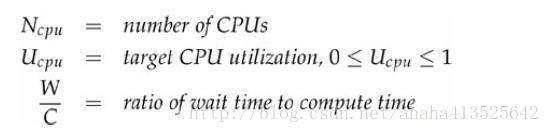
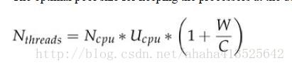

# ***结构化并发应用程序：线程使用***

## 在任务与执行策略之间的隐形耦合

Executor 框架可以将任务的提交与任务的执行策略解耦开来。就像许多对复杂过程的解耦操作那样，这种论断多少言过其实了。虽然 Executor 框架为制定和修改执行策略都提供了相当大的灵活性，但并非所有的任务都能适用所有的执行策略。有些类型的任务需要明确地指定执行策略，包括：
>- **依赖性任务：** 大多数行为正确的任务都是独立的，它们不依赖其他任务的执行时序，执行结果或其他结果。当在线程池种执行独立的任务时，可以随意地改变线程池的大小与配置，这些修改只会对执行性能产生影响。然而，如果提交给线程池的任务需要依赖其他的任务，那么就隐含地给执行策略带来了约束，此时必须小心地维持这些执行策略以避免产生活跃性问题。
>- **使用线程封闭机制的任务：** 与线程池相比，单线程的 Executor 能能够对并发性做出更强的承诺。它们能确保任务不会并发地执行，使你能够放宽代码对线程安全的要求。对象可以封闭在任务线程中，使得在该线程中执行的任务在访问该对象时不需要同步，即使这些资源不是线程安全的。这种情形将在任务与执行策略之间形成隐式的耦合—————任务要求其执行所在的 Executor 是单线程的（这个要求并不需要这么严格，只要确保任务不会并发执行，并提供足够的并发机制，使得一个任务对内存的作用对于下一个任务一定是可见的————这正是 newSingleThreadExecutor 提供的保证）。如果将 Executor 从单线程环境改为线程池环境，那么将失去线程安全性。
>- **对响应时间敏感的任务：** GUI 应用程序对于响应时间是敏感的：如果用户在点击按钮后需要很长延迟才能得到可见的反馈，那么他们会感到不满。如果将一个运行时间较长的任务提交到单线程的 Executor 中，或者将多个运行时间较长的任务提交到一个只包含少量线程的线程池中，那么将降低由该 Executor 管理的服务的响应性。
>- **使用ThreadLocal的任务：** ThreadLocal 使每个线程都可以拥有某个变量的一个私有“版本”。然而只要条件允许，Executor 可以自由地重用这些线程。在标准的 Executor 实现中，当执行需求较低时将回收空闲线程，而当需求增加时将添加新的线程，并且如果从任务中抛出了一个未检查异常，那么将用一个新的工作者线程来代替抛出异常的线程。只有当线程本地值的生命周期受限于任务的生命周期时，在线程池的线程中使用 ThreadLocal 才有意义，而在线程池的线程中不应该使用 ThreadLocal 在任务之间传递值。 

只有当任务都是同类型的并且互相独立时，线程池的性能才能达到最佳。如果将运行时间较长和运行时间较短的任务混合在一起，除非线程池很大，否则将可能造成“拥塞”。如果提交的任务依赖于其他任务，除非线程池无限大，否则可能造成死锁。

**在一些任务中，需要拥有或排除某种特定的执行策略。如果某些任务依赖与其他的任务，那么会要求线程池足够大，从而确保它们的依赖任务不会内放入等待队列中或被拒绝，而采用线程封闭机制的任务需要串行执行。通过将这些需求写入文档，将来的代码维护人员就不会由于使用了某种不合适的执行策略而破坏了安全性或活跃性。**

- ###### 线程饥饿死锁
在线程池中，如果任务依赖与其他任务，那么可能产生死锁。在单线程的 Executor 中，如果一个任务将另一个任务提交到同一个 Executor，并且等待这个被提交任务的结果，那么通常会引发死锁。第二个任务停留在工作队列中，并等待第一个任务完成，而第一个任务又无法完成，因为它在等待第二个任务的完成。在更大的线程池中，如果所有正在执行的任务的线程都由于等待其他仍处于工作队列的任务而阻塞，那么会发生同样的问题，这个现象被称为线程饥饿死锁（Thread Starvation Deadlock）。只要线程池中的任务需要无限期等待一些必须由线程池中其他任务才能提供的资源或条件，例如某个任务等待另一个任务的返回值或执行结果，那么除非线程池足够大，否则将发生线程饥饿死锁。

```java
// 8-1.在单线程Executor中任务发生死锁（不要这样做）
public class ThreadDeadlock {
    ExecutorService exec = Executors.newSingleThreadExecutor();

    public class RenderPageTask implements Callable<String> {
        public String call() throws Exception{
            Future<String> header,footer;
            header = exec.submit(new LoadFileTask("header.html"));
            footer = exec.submit(new LoadFileTask("footer.html"));
            String page=renderBody();  
            //将发生死锁 ———— 由于任务在等待子任务的结果
            return header.get()+page+footer.get();
        }
    }
}
``` 
在 8-1 中给出了线程饥饿死锁的示例。RenderPageTask 向 Executor 提交了两个任务来获取网页的页眉和页脚。绘制页面，等待获取页眉和页脚任务的结果，然后将页脚，页面主题和页眉组合起来并形成最终的页面。当使用单线程的 Executor，那么ThreadDeadlock会经常发生死锁。同样，如果线程池不够大，那么当多个任务通过栅栏机制来彼此协调时，将导致线程饥饿死锁。同样，如果线程池不够大，那么当多个任务通过栅栏（Barrier）机制来彼此协调时，将导致线程饥饿死锁。

**每当提交了一个有依赖性的Executor任务时，要清楚地知道可能会出现线程饥饿死锁，因此需要在代码或者配置 Executor 的配置文件中记录线程池的大小限制或配置限制。**

除了在线程池大小的显式限制外，还可能由于其他资源上的约束而存在一些隐式限制。如果应用程序使用一个包含 10 个连接的 JDBC 连接池，并且每个任务需要一个数据库连接，那么线程池就好像只有10个线程，因为任务超过10个时，新的任务需要等待其他任务释放连接。

- ###### 运行时间较长的任务
如果任务阻塞的时间过长，那么即使不出现死锁，线程池的响应性也会变得糟糕。执行时间较长的任务不仅会造成线程池堵塞，还会增加执行时间较短任务的服务时间。如果线程池中线程的数量远小于在稳定状态下执行时间较长任务的数量，那么到最后可能所有的线程都会运行这些执行时间较长的任务，从而影响整体的响应性。

有一项技术可以缓解执行时间较长任务造成的影响，即限定任务等待资源的时间，而不要无限制的等待。在平台类库的大多数可阻塞方法中，都同时定义了限时版本和无限时版本,例如`Thread.join`,`BlockingQueue.put`,`CountDownLatch.await`以及`Selector.select`等。如果等待超时，那么可以把任务标识为失败，然后中止任务或将任务重新放回队列中以便随后执行。这样，无论人物的最终结果是否成功，这种办法都能确保任务总能继续执行下去，并将线程释放出来以执行一些能更快完成的任务。如果在线程池中总是充满了被阻塞的任务，那么也可能表明线程池的规模过小。

## 设置线程池的大小

线程池的理想大小取决于被提交任务的类型以及所部署系统的特性。在代码中通常不会固定线程池的大小，而应该通过某种配置机制来提供，或者根据 `Runtime.availableProcessors`来动态计算。

要设置线程池的大小并不困难，只需要避免“过大”和“过小”这两种极端情况。如果线程池过大，那么大量的线程将在相对较少的 CPU 和内存资源上发生竞争，这不仅会导致更高的内存使用量，而且还可能耗尽资源。如果线程池过小，那么将导致许多空闲的处理器无法执行工作，从而降低吞吐率。

要想正确地设置线程池的大小，必须分析计算环境、资源预算和任务的特性。在部署的系统中有多少个CPU? 多大的内存? 任务是计算密集型、I/O密集型还是二者皆可? 它们是否需要像 JDBC 连接这样的稀缺资源? 如果需要执行不同类别的任务，并且它们之间的行为相差很大，那么应该考虑使用多个线程池，从而使每个线程池可以根据各自的工作负载来调整。

对于计算密集型的任务，在拥有 N 个处理器的系统上，当线程池的大小为 N+1 时，通常能实现最优的利用率。(即使当计算密集型的线程偶尔由于页缺失故障或者其他原因而暂停时，这个“额外”的线程也能确保 CPU 的时钟周期不会被浪费。)对于包含 IO操作 或者其他阻塞操作的任务，由于线程并不会一直执行，因此线程池的规模应该更大。要正确地设置线程池的大小，你必须估算出任务的等待时间与计算时间的比值。这种估算不需要很精确，并且可以通过一些分析或监控工具来获得。你还可以通过另种方法来调节线程池的大小:在某个基准负载下，分别设置不同大小的线程池来运行应用程序，并观察 CPU 利用率的水平。

给定下列定义：


要使处理器到达期望的使用率，线程池的最优大小等于：


可以通过 Runtime 来获得 CPU 的数目：

`int N_CPUS = Runtime.getRuntime().availableProcessors();`

当然，CPU 周期并不是唯一影响线程池大小的资源，还包括内存、文件句柄、套接字句柄和数据库连接等。计算这些资源对线程池的约束条件是更容易的:计算每个任务对该资源的需求量，然后用该资源的可用总量除以每个任务的需求量，所得结果就是线程池大小的上限。

当任务需要某种通过资源池来管理的资源时，例如数据库连接，那么线程池和资源池的大小将会相互影响。如果每个任务都需要一个数据库连接，那么连接池的大小就限制了线程池的大小。同样，当线程池中的任务是数据库连接的唯一使用者时，那么线程池的大小又将限制连接池的大小。


## 配置 ThreadPoolExecutor

ThreadPoolExecutor 为一些 Executor 提供了基本的实现，这些 Executor 是由 Executors 中的 newCachedThreadPool、newFixedThreadPool 和 newScheduledThreadPool等工厂方法返回的。ThreadPoolExecutor是一个灵活的，稳定的线程池，允许进行各种定制。

如果默认的执行策略不能满足需求，那么可以通过 ThreadPoolExecutor 的构造函数来实例化一个对象，并根据自己的需求来定制，并且可以参考 Executors 的源代码来了解默认配置下的执行策略，然后再以这些执行策略为基础进行修改。

```java
// ThreadPoolExecutor 的通用构造函数
public ThreadPoolExecutor(int corePoolSize,
   int maximumPoolSize,
   long keepAliveTime,
   TimeUnit unit,
   BlockingQueue<Runnable> workQueue,
   ThreadFactory threadFactory,
   RejectedExecutionHandler handler) { ... }
```

- ###### 线程的创建与销毁

线程池的基本大小(Core Pool Size)，最大大小(Maxumum Pool Size)以及存活时间等因素共同负责线程的创建与销毁。基本大小就是线程池的目标大小，即在没有任务执行时线程池的大小，并且只有在工作队列满了的情况下才会创建超出这个数量的线程。线程池的最大大小表示可同时活动的线程数量的上限。如果某个线程的空闲时间超过了存活时间，那么将被标记为可回收的，并且当线程池的当前大小超过了基本大小时，这个线程将被终止。

通过调节线程池的基本大小和存活时间，可以帮助线程池回收空闲线程占有的资源，从而使得这些资源可以用于执行其他工作。(显然，这是一种折衷:回收空闲线程会产生额外的延迟，因为当需求增加时，必须创建新的线程来满足需求。)

newFixedThreadPool 工厂方法将线程池的基本大小和最大大小设置为参数中指定的值，而且创建的线程池不会超时。newCachedThreadPool 工厂方法将线程池的最大大小设置为`Integ.MAX_VALUE`,而且将基本大小设置为0，并将超时设置为 1分钟，这种方法创建的线程池可以被无限扩展，并且当需求降低时会自动收缩。其他形式的线程池可以通过显式的 ThreadPoolExecutor 构造函数来构造。

- ###### 管理队列任务

在有限的线程池中会限制可并发的任务数量（单线程的 Executor 是一种值得注意的特例：它们能确保不会有任务并发执行，因为它们通过线程封闭来实现线程安全性。）

如果无限制地创建线程，那么将导致不稳定性，并通过采用固定大小的线程池（而不是每收到一个请求就创建一个新线程）来解决这个问题。然而，在高负载情况下，应用程序仍可能耗尽资源，只是出现问题的概率较小。如果新请求的到达速率超过了线程池的处理速率，那么新到来的请求将累积起来。在线程池中，这些请求会在一个由 Executor 管理的 Runnable 队列中等待，而不会像线程那样去竞争 CPU资源。通过一个 Runnable 和一个链表节点来表现一个等待中的任务，比使用线程来表示的开销低很多，但如果客户提交给服务器请求的速率超过了服务器的处理速率，仍可能会耗尽资源。

即便请求的平均到达速率很稳定，也仍然会出现请求突增的情况。尽管队列有助于缓解任务的突增问题，但如果任务持续高速地到来，那么最终还是会抑制请求的到达率以避免耗尽内存，甚至在内存耗尽之前，相应性能也将随着队列任务的堆积而变得越来越糟。

ThreadPoolExecutor 允许提供一个 BlockingQueue 来保存等待执行的任务。基本的任务排队方法有 3 种：无界队列（Unbounded Queue），有界队列（Bounded Queue）和同步移交（Synchronous Handoff）。队列的选择与其他的配置参数有关，例如线程池的大小等。

newFixedThreadPool 和 newSingleThreadExecutor 在默认情况下将使用一个无界的 LinkedBlockingQueue。如果所有工作者线程都处于忙碌状态，那么任务将在队列中等候。如果任务持续快速地达到，并且超过了线程池处理它们的速度，那么队列将无限制地增加。

一种更稳妥的资源管理策略是使用有界队列，例如`ArrayBlockingQueue`,有界的`LinkedBlockingQueue`,`PriorityBlockingQueue`。有界队列有助于避免资源耗尽的情况发生，但队列填满后，新的任务怎么办（有许多饱和策略[Saturation Policy]可以解决）.
在使用有界队列的时，队列的大小与线程池的大小必须一起调节。如果线程池较小而队列较大，有助于减少内存使用量，减低 CPU的使用率，同时还可以减少上下文切换，但代价是可能限制吞吐量。

对于非常大的或者无界的线程池，可以通过使用 SynchronousQueue 来避免任务排队，以及直接将任务从生产者移交给工作者线程。SynchronousQueue 不是一个真正的队列，而是一种在线程之间移交的机制。要将一个元素放入 SynchronousQueue 中，必须有另一个线程正在等待接受这个元素。如果没有线程正在等待，并且线程池的当前大小小于最大值，那么 ThreadPoolExecutor 将创建一个新的线程，否则根据饱和策略，这个任务将被拒绝。使用直接移交将更高效，因为任务会直接移交给执行它的线程，而不是首先放在队列中，然后有工作者线程从队列中提取该任务。只有当线程池是无界的或者可以拒绝任务时，SynchronousQueue 才有实际价值。在 newCachedThreadPool 工厂方法中就使用了 SynchronousQueue。

当使用像 LinkedBlockingQueue 或 ArrayBlockingQueue 这样的FIFO队列时，任务的执行顺序与到达顺序相同。如果想进一步控制任务执行顺序，可以使用 PriorityBlockingQueue，这个队列将根据优先级来安排任务。任务的优先级时通过自然顺序或 Comparator (如果任务实现了Comparable)来定义的。

**对于 Executor，newCachedThreadPool 工厂方法是一种很好的默认选择，他能提供比固定大小的线程更好的排队性能（由于使用了SynchronousQueue而不是LinkedBlockingQueue）。当需要限制当前任务的数量以满足资源管理需求时，那么可以选择固定大小的线程池，就像在接受网络用户请求的服务器应用程序中，如果不进行限制，容易发生过载问题。**

只有任务相互独立时，为线程池或工作队列设置界限才是合理的。如果任务之间存在依赖关系，那么有界的线程池或队列可能导致线程饥饿死锁问题。此时应该使用无界的线程池如 newCachedThreadPool。

- ###### 饱和策略

当有界队列被填满后，饱和策略开始发挥作用。ThreadPoolExecutor 的饱和策略可以通过调用 `setRejectedExecutionHandler` 来修改。（如果某个任务被提交到一个已被关闭的 Executor 时，也会用到饱和策略）JDK 提供了几种不同的`setRejectedExecutionHandler`实现，每种实现都包含有不同的饱和策略：`AbortPolicy`, `CallerRunsPolicy`, `DiscardPolicy`和`DiscardOldestPolicy`。

>- **“中止（Abort）策略”是默认的饱和策略** :该策略将抛出未检查的 RejectedExecution-Exception。调用者可以捕获这个异常，然后根据需求编写自己的处理代码。
>- **当新提交的任务无法保存到队列中等待执行时，“抛弃（Discard）策略”会悄悄抛弃该任务。** 
>- **“抛弃最旧的（Discard-Oldest）“则会抛弃下个将被执行任务，然后尝试重新提交新的任务。**（如果工作队列是一个优先队列，那么“抛弃最旧的”策略将导致抛弃优先级最高的任务，因此最好不要将“抛弃最旧的”饱和策略和优先级队列一起使用）。
>- **“调用者运行（Caller-Runs）”策略实现了一种调节机制。** 该策略不会抛弃任务，也不会抛出异常，而是将某些任务回退到调用者，从而减低新任务的流量。它不会在线程池的某个线程中执行新提交的任务，而是在一个调用了 execute 的线程中执行该任务。

我们可以将 WebServer 示例修改为使用有界队列和“调用者运行”饱和策略，当线程池中的所有线程都被占用，并且工作队列被填满后，下一个任务会在调用 execute 时在主线程中执行。由于执行任务需要一定时间，因此主线程至少在一段时间内不能提交任何任务，从而使得工作者线程有时间来处理正在执行的任务。在这期间，主线程不会调用 accpet，因此到达的请求将被保存在 TCP层的队列中而不是在应用程序的队列中。如果持续过载，TCP层将发现它的请求队列被填满，因此同样会开始抛弃请求。当服务器过载时，这种过载情况会逐渐向外蔓延开来————从线程池到工作队列到应用程序再到TCP层，最终到达客户端，导致服务器在高负载下实现一种平缓的性能降低。

当创建Executor时，可以选择饱和策略或者对执行策略进行修改。

```java
// 创建一个固定大小的线程池，并采用有界队列以及“调用者运行”饱和策略
ThreadPoolExecutor executor = new ThreadPoolExecutor(N_THREADS, N_THREADS,
            0L, TimeUnit.MILLISECONDS,
            new LinkedBlockingQueue<Runnable>(CAPACITY));
     executor.setRejectedExecutionHandler(new ThreadPoolExecutor.CallerRunsPolicy());
```

当工作队列被填满后，没有预定义的饱和策略来阻塞 execute。然而，通过使用 Semaphore（信号量）来限制任务的到达率，就可以实现这个功能。BoundedExecutor 使用了一个无界队列（因为不能限制队列的大小和任务的达到率），并设置信号量的上界设置为线程池的大小加上可排队任务的数量，这是因为信号量需要控制正在执行的和等待执行的任务数量。

```java
// 使用Semaphore来控制任务的提交速率
@ThreadSafe
public class BoundedExecutor {
    private final Executor exec;
    private final Semaphore semaphore;

    public BoundedExecutor(Executor exec, int bound) {
        this.exec = exec;
        this.semaphore = new Semaphore(bound); 
    }

    public void submitTask(final Runnable command) throws InterruptedException {
        semaphore.acquire();   
        try {
            exec.execute(new Runnable() {             
                public void run() {
                    try {
                        command.run();
                    } finally {
                        semaphore.release();
                    }
                }
            });
        } catch (RejectedExecutionException e) {
            semaphore.release();        
        }
    }
}
```

- ###### 线程工厂

每当线程池需要创建一个线程时，都是通过线程工厂方法来完成的。默认的线程工厂方法将创建一个新的、非守护的线程，并且不包含特殊的配置信息。通过指定一个线程工厂方法，可以定制线程池的配置信息。在 ThreadFactory 中只定义了一个方法 newThread，每当线程池需要创建一个新线程都会调用这个方法。

然而，在许多情况下需要使用定制的线程工厂方法。例如，你需要为线程池中的线程指定一个 UncaughtExceptionHandler，或者实例化一个定制的 Thread 类用于执行调试信息的记录。你可能还希望修改线程的优先级（这通常不是一个好主意）或者守护状态（同样，这也不是一个好主意）。或许你只是希望给线程取一个更有意义的名称，用来解释线程的转储信息和错误日志。

```java
public interface ThreadFactory {
    Thread newThread(Runnable r);
}
```

MyThreadFactory 中给出了一个自定义的线程工厂。它创建了一个新的 MyAppThread 实例，并将一个特定于线程池中的名字传递给MyAppThread 的构造函数，从而可以在线程转储和错误日志信息中区分来自不同线程池的功能。在应用程序的其他地方也可以使用 MyAppThread，以便所有线程都能使用它的调试功能。

```java
// 自定义的线程工厂
public class MyThreadFactory implements ThreadFactory {
    private final String poolName;  

    public MyThreadFactory(String poolName) { this.poolName = poolName; 

    public Thread newThread(Runnable runnable) { return new MyAppThread(runnable, poolName); }
}
```

在 MyAppThread 中还可以定制其他行为，包括：为线程指定名字，设置自定义 UncaughtException-Handler 向 Logger 中写入信息，维护一些统计信息（包括有多少个线程被创建和销毁），以及在线程被创建或终止时把调试信息写入日志。

```java
// 定制Thread基类
public class MyAppThread extends Thread {
    public static final String DEFAULT_NAME = "MyAppThread";
    private static volatile boolean debugLifecycle = false;
    private static final AtomicInteger created = new AtomicInteger();   
    private static final AtomicInteger alive = new AtomicInteger();     
    private static final Logger log = Logger.getAnonymousLogger();  

    public MyAppThread(Runnable r) { this(r, DEFAULT_NAME); }

    public MyAppThread(Runnable runnable, String name) {
        super(runnable, name + "-" + created.incrementAndGet()); 
        setUncaughtExceptionHandler(
            new Thread.UncaughtExceptionHandler() {     
                @Override
                public void uncaughtException(Thread t, Throwable e) {
                    log.log(Level.SEVERE, "UNCAUGHT in thread" + t.getName(), e);
                }
            });
    }

    public void run() {
        // 复制debug标志以确保一致的值
        boolean debug = debugLifecycle;
        if (debug) log.log(Level.FINE, "Created" + getName()); 
        try {
            alive.incrementAndGet();
            super.run();
        } finally {
            alive.decrementAndGet(); 
            if (debug) log.log(Level.FINE, "Exiting" + getName());  
        }
    }

    public static int getThreadsCreated() {  return created.get(); }

    public static int getThreadsAlive() { return alive.get(); }

    public static boolean getDebug() { return debugLifecycle; }

    public static void setDebug(boolean b) { debugLifecycle = b; }
}
```

如果在应用程序中需要利用安全策略来控制对某些特殊代码库的访问权限，那么可以通过 Executor 中的 privilegedThreadFactory 工厂方法（privileged，享有特权的）来定制自己的线程工厂。通过这种方式创建出来的线程，将与创建 privilegedThreadFactory 的线程拥有相同的访问权限（permissions），AccessControlContext和contextClassLoader。 如果不使用 privilegedThreadFactory，线程池创建的线程将从在需要新线程调用 execute 或 submit 的客户程序中继承访问权限，从而导致令人困惑的安全性异常。


- ###### 在调用构造函数后再定制 ThreadPoolExecutor

在调用完 ThreadPoolExecutor 的构造函数后，仍然可以通过设置函数（Setter）来修改大多数传递给它的构造函数的参数(例如线程池的基本大小，最大大小，存活时间，线程工厂以及拒绝执行处理器(Rejected Execution Handler))。如果 Executor 是通过 Executors 中的某个（newSingleThreadExecutor除外）工厂方法创建的，那么可以将结果的类型转换为 ThreadPoolExecutor 以访问设置器。

```java
// 对通过标准方法创建的Executor进行修改
ExecutorService exec = Executors.newCachedThreadPool();
   if (exec instanceof ThreadPoolExecutor)
       ((ThreadPoolExecutor) exec).setCorePoolSize(10);
   else
       throw new AssertionError("Oops, bad assumption");
```

在 Executors 中包含一个 unconfigurableExecutorService 工厂方法，该方法对一个现有的 ExecutorService，使其只暴露出ExecutorService 的方法，因此不能对它进行配置。newSingleThreadExecutor 返回按这种方法包装的 ExecutorService，而不是最初的ThreadPoolExecutor。虽然单线程的 Executor 实际上被实现为一个只包含唯一线程线程池，但它同样确保了不会并发地执行任务。如果在代码中增加单线程 Executor 的线程池大小，将破坏它的执行语义。

你可以在自己的 Executor 中使用这项技术以防止执行策略被修改。如果将 ExecutorService 暴露给不信任的代码，又不希望对其进行修改，就可以通过 unconfigurableExecutorService 来包装它。

## 扩展 ThreadPoolExecutor

ThreadPoolExecutor 是可扩展的，它提供了几个可以在子类化中改写的方法：`beforeExecute`，`afterExecute` 和 `terminated`，这些方法可以用于扩展 ThreadPoolExecutor 的行为。

在执行任务的线程中将调用`beforeExecute`和`afterExecute`等方法，在这些方法中还可以添加日志、计时、监视或统计信息收集的功能。
无论是从`run`中正常返回，还是抛出一个异常而返回，`afterExecute`都会被调用。（如果任务在完成后带有一个Error，那么就不会调用`afterExecute`）如果`beforeExecute`抛出一个`RuntimeException`，那么任务将不被执行，并且`afterExecute`也不会被调用。

在线程池完成关闭时调用`terminated`，也就是在所有任务都已经完成并且所有工作者线程也已经关闭后。`terminated`可以用来释放 Executor 在其生命周期里分配的各种资源，此外还可以执行发送通知，记录日志或收集`finalize`统计信息等操作。

- ###### 给线程池添加统计信息

TimingThreadPool 中给出了一个自定义的线程池，它通过`beforeExecute`，`afterExecute`和`terminated`等方法来添加日志记录和统计信息收集。
为了测量任务的运行时间，`beforeExecute`必须记录开始时间并把它保存到一个`afterExecute`可以访问的地方。因为这些方法将在执行任务的线程中调用，因此`beforeExecute`可以把值保存到一个`ThreadLocal`变量中，然后由`afterExecute`来读取。在`TimingThreadPool`中使用了两个`AtomicLong`变量，分别用于记录已处理的任务数和总的处理时间，并通过`terminated`来输出包含平均任务的日志消息。

```java
// 增加了日志和计时等功能的线程池
public class TimingThreadPool extends ThreadPoolExecutor {
    private final ThreadLocal<Long> startTime = new ThreadLocal<Long>();              
    private final Logger log = Logger.getLogger("TimingThreadPool");
    private final AtomicLong numTasks = new AtomicLong();    //记录有多少个任务执行完成了
    private final AtomicLong totalTime = new AtomicLong();   //记录总时间

    public TimingThreadPool() { super(1, 1, 0L, TimeUnit.SECONDS, null); }

    protected void beforeExecute(Thread t, Runnable r) {
        super.beforeExecute(t, r);
        log.fine(String.format("Thread %s:start %s", t, r)); 
        startTime.set(System.nanoTime());   
    }

    protected void afterExecute(Runnable r, Throwable t) {
        try {
            long endTime = System.nanoTime();
            long taskTime = endTime - startTime.get();
            numTasks.incrementAndGet();   
            totalTime.addAndGet(taskTime);   
            log.fine(String.format("Thread %s: end %s,time=%dns", t, r, taskTime));
        } finally {   
            super.afterExecute(r, t);
        }
    }

    protected void terminated() {   
        try {
            log.info(String.format("Terminated: avg time=%dns", totalTime.get() / numTasks.get())); 
        } finally {
            super.terminated();
        }
    }
}
```

## 递归算法的并行化

如果在循环中包含了一些密集计算，或者需要执行可能阻塞的 I/O 操作，那么只要每次迭代是独立的，都可以对其进行并行化。

如果循环中的迭代操作都是独立的，并且不需要等待所有的迭代操作都完成在继续执行，那么就可以使用 Executor 将串行循环转化为并行循环，在 processSequentially 和 processInParallel 中给出了这种方法。

```java
// 将串行执行转换为并行执行(迭代操作)
void processSequentially(List<Element> elements) {  //串行
  for (Element e : elements)
  process(e);
}

void processInParallel(Executor exec, List<Element> elements) { //并行
  for (final Element e : elements)
  exec.execute(
    new Runnable() {
        public void run() { process(e); }
    }
  );
}
```
调用 processInParallel 比 processSequentially 能更快地返回，因为 processInParallel 会在所有下载任务都进入了 Executor 的队列后就立即返回，而不会等待这些任务全部完成。如果需要提交一个任务集并等待它们完成，那么可以使用 ExecutorService.invokeAll,并且在所有任务都执行完成后调用 CompletionService 来获取结果。

当串行循环中的各个迭代操作之间彼此独立，并且每个迭代操作执行的工作量比管理一个新任务时带来的开销更多，那么这个串行循环就适合并行化。

在一些递归设计中同样可以采用循环并行化的方法。在递归算法中通常都会存在串行循环，而且这些循环可以并行化。一种简单的情况是：在每个迭代操作中都不需要来自于后续递归迭代的结果。例如 sequentialRecursive 用深度优先算法遍历一棵树，在每个节点上执行计算并将结果放入一个集合。修改后的 parallel 同样执行深度优先遍历，但它并不是在访问节点时进行计算，而是为每个节点提交一个任务来完成计算。

```java
    // 将串行递归转换为并行递归

    public <T> void sequentialRecursive(List<Node<T>> nodes, Collection<T> results) {  
        for (Node<T> n : nodes) {
            results.add(n.compute());
            sequentialRecursive(n.getChildren(), results);
        }
    }

    public <T> void parallelRecursive(final Executor exec, List<Node<T>> nodes, final Collection<T> results) { 
        for (final Node<T> n : nodes) {
            exec.execute(new Runnable() {
                public void run() {
                    results.add(n.compute());
                }
            });
            parallelRecursive(exec, n.getChildren(), results);
        }
    }
```

当 parallelRecursive 返回时，树中的各个节点都已经访问过了（但是遍历过程仍然是串行，只有compute是并行执行的），并且每个节点的计算也已经放入 Executor 的工作队列。parallelRecursive 的调用者可以通过以下方式等待所有的结果：创建一个特定于遍历过程的Executor，并使用`shutdown`和`awaitTermination`等方法，如下：

```java
    // 等待通过并行方式计算的结果
    public <T> Collection<T> getParallelResults(List<Node<T>> nodes) throws InterruptedException {
        ExecutorService exec = Executors.newCachedThreadPool();
        Queue<T> resultQueue = new ConcurrentLinkedQueue<T>();
        parallelRecursive(exec, nodes, resultQueue);
        exec.shutdown();
        exec.awaitTermination(Long.MAX_VALUE, TimeUnit.SECONDS);
        return resultQueue;
    }
```

- ###### 示例：谜题框架

递归算法的并行化的一种引用就是解决一些谜题，这些谜题都需要找出一系列的操作从初始状态转换到目标状态，例如类似与“搬箱子”、“Hi-Q”、“四色方柱（Instant Insanity）”和其他棋牌谜题。

我们将谜题定义为：包含了一个初始位置，一个目标位置，以及用于判断是否是有效移动的规则集。规则集包含两个部分：计算从指定位置开始的所有合法移动，以及每次移动的结果位置。

下例给出了表示谜题的抽象类，其中的类型 参数P和M表示位置类和移动类。根据这个接口，我们可以写一个简单的串行求解程序，该程序将在谜题空间（Puzzle Space）中查找，直到找到一个解答或者找遍了整个空间都没有发现答案。

```java
// 表示“搬箱子”之类谜题的抽象类
public interface Puzzle <P, M> {
    P initialPosition();            //设置初始位置
    boolean isGoal(P position);     //判断是否目标位置
    Set<M> legalMoves(P position);  //判断是否有效移动的规则集
    P move(P position, M move);     //移动位置
}
```

下例程序中的 PuzzleNode 代表通过一系列的移动到达的一个位置，其中保存了到达该位置的移动以及前一个 PuzzleNode，只要沿着PuzzleNode 链接逐步回溯，就可以重新构建出到达当前位置的移动序列。
```java
// 用于谜题解决框架的链表节点
@Immutable
static class PuzzleNode<P, M> {
    final P pos;   //当前位置
    final M move;  //记录了前一个Node到这个Node的移动
    final PuzzleNode<P, M> prev;   //前一个Node

    PuzzleNode(P pos, M move, PuzzleNode<P, M> prev) {...}

    List<M> asMoveList() {   
        List<M> solution = new LinkedList<M>();
        for (PuzzleNode<P, M> n = this; n.move != null; n = n.prev)
            solution.add(0, n.move);
        return solution;
   }
}
```

下例 8-15 中给出了谜题框架的串行解决方案，它在谜题空间中执行一个深度优先搜索，当找到解答方案（不一定是最短的解决方案）后结束搜索。

```java
// 8-15  串行的谜题解答器
public class SequentialPuzzleSolver<P, M> {
    private final Puzzle<P, M> puzzle;
    private final Set<P> seen = new HashSet<P>();  //已遍历位置的集合

    public SequentialPuzzleSolver(Puzzle<P, M> puzzle) {
        this.puzzle = puzzle;
    }

    public List<M> solve() {
        P pos = puzzle.initialPosition();                      //设置初始位置
        return search(new PuzzleNode<P, M>(pos, null, null));   //返回回溯后的路径
    }

    private List<M> search(PuzzleNode<P, M> node) {
        if (!seen.contains(node.pos)) {                //如果没走过则加入，走过则返回null
            seen.add(node.pos);
            if (puzzle.isGoal(node.pos))
                return node.asMoveList();             //如果是目标位置，则返回路径
            for (M move : puzzle.legalMoves(node.pos)) {  //legalMoves是存放该位置所有有效的移动
                P pos = puzzle.move(node.pos, move);    //pos记录移动后的位置
                PuzzleNode<P, M> child = new PuzzleNode<P, M>(pos, move, node);
                List<M> result = search(child);         //深度优先算法
                if (result != null)
                    return result;      //只要不是找到目标位置都返回null
            }
        }
        return null;
    }
}
```

通过修改解决方案以利用并发性，可以以并发方式来计算下一步移动以及目标条件，因为计算某次移动的过程很大程度上与计算其他移动的过程是相互独立的。（之所以是很大程度上，是因为在各个任务之间会共享一些可变状态，例如已遍历位置的集合）如果有多个处理器可用，这将减少寻找解决方案所花费的时间。

在下例 8-16 中使用了一个内部类 SolverTask，这个类继承了 PuzzleNode 并实现了 Runnable，大多数工作都是在 run 方法中完成的：首先计算下一步可能到达的所有位置，并去掉已经到达的所有位置，然后判断（这个任务或者其他某个任务）是否已经成功地完成，最后将尚未搜索过的位置提交给 Executor。

```java
// 8-16 并发的谜题解答题
public class ConcurrentPuzzleSolver<P, M> {
    private final Puzzle<P, M> puzzle;
    private final ExecutorService exec;
    private final ConcurrentMap<P, Boolean> seen;        
    protected final ValueLatch<PuzzleNode<P, M>> solution = new ValueLatch<PuzzleNode<P, M>>();
    
    ···
    public List<M> solve() throws InterruptedException {
        try {
            P p = puzzle.initialPosition();
            exec.execute(newTask(p, null, null));
            //阻塞直到找到解答
            PuzzleNode<P, M> solnPuzzleNode = solution.getValue();
            return (solnPuzzleNode == null) ? null : solnPuzzleNode.asMoveList();  
        } finally {
            exec.shutdown();   
        }
    }

    protected Runnable newTask(P p, M m, PuzzleNode<P, M> n) {
        return new SolverTask(p, m, n);
    }

    protected class SolverTask extends PuzzleNode<P, M> implements Runnable {  
        ···
        public void run() {
            if (solution.isSet() || seen.putIfAbsent(pos, true) != null)         
                return; //已经找到了解答或者已经遍历了这个位置
            if (puzzle.isGoal(pos))
                solution.setValue(this);           
            else
                for (M m : puzzle.legalMoves(pos))
                    //将任务提交到工作者线程中
                    exec.execute(newTask(puzzle.move(pos, m), m, this));
        }
    }
}
```

为了避免无限循环，在串行版本中引入了一个 Set 对象，其中保存了之前已经搜索过的所有位置。在 ConcurrentPuzzleSolver 使用了 ConcurrentHashMap 来实现相同的功能。这种做法不仅提供了线程安全性，还避免了在更新共享集合时存在的竞态条件，因为 putIfAbsent 只有在之前没有遍历过的某个位置才会通过原子方式添加到集合中。ConcurrentPuzzleSolver 使用线程池内工作队列而不是调用栈来保存搜索的状态。

这种并发方法引入了一种新形式的限制并去掉了一种原有的限制，新的限制在这个问题域中更合适。串行版本的程序执行深度优先搜索，因此搜索过程将受限与栈的大小。并发版本的程序执行广度优先搜索，因此不会受到栈大小的限制（但如果待搜索的或者已搜索的位置集合的大小超过了可用的内存总量，那么仍可能耗尽内存）。

为了在找到某个解答后停止搜索，需要通过某种方式来检查是否有线程已经找到了一个解答。如果需要第一个找到的解答，那么还需要在其他任务都没有找到解答时更新解答。这些需求描述的一种闭锁（Latch）机制(5.5.1中)，具体的说，是一种包含结果的闭锁。在8-17的 ValueLatch 中使用 CountDownLatch 来实现所需的闭锁行为，并且使用锁定机制来确保解答只会被设置一次。

```java
// 由ConcurrentPuzzleSolver使用的携带结果的闭锁
public class ValueLatch<T> {
    @GrardeBy("this") private T value = null;
    private final CountDownLatch done = new CountDownLatch(1);   //这里表示只要解答出现一个即可

    public boolean isSet() {  
        return (done.getCount() == 0);
    }

    public synchronized void setValue(T newValue) {
        if (!isSet()) {
            value = newValue;
            done.countDown(); 
        }
    }

    public T getValue() throws InterruptedException {
        done.await();  
        synchronized (this) {
            return value;
        }
    }
}
```

每个任务首先查询 solution 闭锁，找到一个解答就停止。而在此之前，主线程需要等待，ValueLatch 提供了一种方式来保存这个值，只有第一次调用才会设置它。调用者能够判断这个值是否已经被设置，以及阻塞等待它被设置。在第一次调用 setValue 时，将更新解答方案，并且 CountDownLatch 会递减，从 getValue 中释放主线程。

第一个找到解答的线程还会关闭 Executor，从而阻止接受新的任务。要避免处理 RejectedExecutionException，需要将拒绝处理器设置为“抛弃已提交的任务”。然后，所有未完成的任务最终将执行完成，并且在执行任何新任务时都会失败，从而使 Executor 结束。（如果任务运行的时间过长，那么可以中断它们而不是等它们完成）。

如果不存在解答，那么 ConcurrentPuzzleSolver 就不能很好地处理这种情况：如果已经遍历了所有的移动和位置都没有找到答案，那么在 getSolution 调用中将永远等待下去。当遍历了整个所有空间时，串行版本将结束，但要结束并发程序会更困难。其中一种方法是：记录活动任务的数量，当该值为 0 时将解答设置为 null，如程序 8-18

```java
// 8-18  在解决器中找不到解答
public class PuzzleSolver<P, M> extends ConcurrentPuzzleSolver<P, M> {
    ··· 
    private final AtomicInteger taskCount = new AtomicInteger(0);

    protected Runnable newTask(P p, M m, PuzzleNode<P, M> n) {
        return new CountingSolverTask(p, m, n);
    }

    class CountingSolverTask extends SolverTask {
        CountingSolverTask(P pos, M move, PuzzleNode<P, M> prev) {
            super(pos, move, prev);
            taskCount.incrementAndGet();    //开始一个任务递增
        }

        public void run() {
            try {
                super.run();
            } finally {
                if (taskCount.decrementAndGet() == 0)   //结束一个任务递减，最后值为0则解答为null
                    solution.setValue(null);
            }
        }
    }
}
```

对于并发执行的任务，Executor 框架是一种强大且灵活的框架。它提供了大量可调节的选项，例如创建线程和关闭线程的策略，处理任务队列的策略，处理过多任务的策略，并且提供了几个钩子方法来扩展它的行为。然而，与大多数功能强大的框架一样，其中有些参数并不能很好地工作，某些类型的任务需要特定的执行策略，而一些参数组合则可能会产生奇怪的结果。
