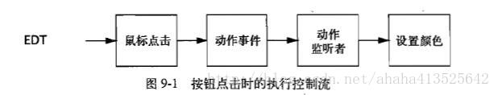
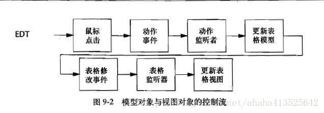

# ***结构化并发应用程序：图形用户界面应用程序***

几乎所有的 GUI 工具包（包括Swing和SWT）都被实现为单线程子系统，这意味着所有的 GUI 操作都被限制在单个程序中。如果你不打算编写一个单线程程序，那么就会有部分操作在一个应用程序线程中执行，而其他操作则在事件线程中执行。与其他线程错误一样，即使在这种操作分解中出现了错误，也会导致应用程序立即崩溃，而且程序将在一些难以确定的条件下表现出奇怪的行为。虽然 GUI 框架本身是单线程子系统，但应用程序可能不是单线程的，因此在编写 GUI 代码时仍然需要谨慎地考虑线程问题。

## 为什么 GUI 是单线程的

早期的 GUI 应用程序都是单线程的，并且 GUI 事件在“主事件循环”进行处理。**当前的 GUI 框架则使用了一种略有不同的模型:在该模型中创建一个专门事件分发线程(Event Dispatch Thread, EDT) 来处理 GUI 事件。**

单线程的 GUI 框架并不仅限于在 Java 中，在 Qt、NexiStep、MacOS Cocoa、X Windows以及其他环境中的 GUI 框架都是单线程的。许多人曾经尝试过编写多线程的 GUI 框架，但最终都由于竞态条件和死锁导致的稳定性问题而又重新回到单线程的事件队列模型:采用一个专门的线程从队列中抽取事件，并将它们转发到应用程序定义的事件处理器。(AWT 最初尝试在更大程度上支持多线程访问，而正是基于在 AWT 中得到的经验和教训，Swing 在实现时决定采用单线程模型。)

在多线程的 GUI 框架中更容易发生死锁问题，其部分原因在于，在输入事件的处理过程与 GUI 组件的面向对象模型之间会存在错误的交互。用户引发的动作将通过一种类似于“气泡上升”的方式从操作系统传递给应用程序————操作系统首先检测到一次鼠标点击，然后通过工具包将其转化为“鼠标点击”事件，该事件最终被转换为一个更高层事件( 例如“鼠标键被按下”事件)转发给应用程序的监听器。另一方面，应用程序引发的动作又会以“气泡下沉"的方式从应用程序返回到操作系统。例如，在应用程序中引发修改某个组件背景色的请求，该请求将被转发给某个特定的组件类，并最终转发给操作系统进行绘制。因此，一方面这组操作将以完全相反的顺序来访问相同的GUI对象;另方面又要确保每个对象都是线程安全的，从而导致了不一致的锁定顺序，并引发死锁。这种问题几乎在每次开发 GUI 工具包时都会重现。

另一个在多线程 GUI 框架中导致死锁的原因就是“模型一视图一控制(MVC)”这种设计模式的广泛使用。通过将用户的交互分解到模型、视图和控制等模块中，能极大地简化 GUI 应用程序的实现，但这却进一步增加了出现不一致锁定顺序的风险。 “控制”模块将调用“模型”模块，而“模型”模块将发生的变化通知给“视图”模块。“控制”模块同样可以调用“视图” 模块，并调用“模型”模块来查询模型的状态。这将再次导致不一致的锁定顺序并出现死锁。

Sun 公司的前副总裁 Graham Hamilton 在其博客中日总结了这些问题，详细阐述了为什么多线程的 GUI 工具包会成为计算机科学史上的又一个“失败的梦想”。

> *不过，我相信你还是可以成功地编写出多线程的 GUI 工具包，只要做到:非常谨慎地设计多线程 GUI 工具包，详尽无遗地公开工具包的锁定方法，以及你非常聪明，非常仔细，并且对工具包的整体结构有着全局理解。然而，如果在上述某个方面稍有偏差，那么即使程序在大多数时候都能正确运行，但在偶尔情况下仍会出现(死锁引起的)挂起或者(竞争引起的)运行故障。只有那些深入参与工具包设计的人们才能够正确地使用这种多线程的 GUI 框架。*
>
> *然而，我并不认为这些特性能够在商业产品中得到广泛使用。可能出现的情况是:大多数普通的程序员发现应用程序无法可靠地运行，而又找不出其中的原因。于是，这些程序员将感到非常不满，并诅咒这些无辜的工具包。*

单线程的 GUI 框架通过线程封闭机制来实现线程安全性。所有 GUI 对象，包括可视化组件和数据模型等，都只能在事件线程中访问。 当然，这只是将确保线程安全性的部分工作交给应用程序的开发人员来负责，他们必须确保这些对象被正确地封闭在事件线程中。

- ###### 串行事件处理

GUI 应用程序需要处理一些细粒度的事件，例如点击鼠标、按下键盘或定时器超时等。事件是另一种类型的任务，而 AWT 和 Swing 提供的事件处理机制在结构上也类似于 Executor。

因为只有单个线程来处理所有的 GUI 任务，因此会采用依次处理的方式————处理完一个任务后再开始处理下一个任务，在两个任务的处理过程之间不会重叠。清楚了这一点， 就可以更容易地编写任务代码，而无须担心其他任务会产生干扰。

串行任务处理不利之处在于，如果某个任务的执行时间很长，那么其他任务必须等到该任务执行结束。如果这些任务的工作是响应用户输人或者提供可视化的界面反馈，那么应用程序看似会失去响应。如果在事件线程中执行时间较长的任务，那么用户甚至无法点击“取消”按钮，因为在该这个任务完成之前，将无法调用“取消”按钮的监听器。因此，在事件线程中执 行的任务必须尽快地把控制权交还给事件线程。要启动些执行时间较长的任务， 例如对某个大型文档执行拼写检查，在文件系统中执行搜索，或者通过网络获取资源等，必须在另一个线程中执行这些任务，从而尽快地将控制权交换给事件线程。如果要在执行某个时间较长的任务时更新进度标识，或者在任务完成后提供一个可视化的反馈，那么需要再次执行事件线程中的代码。这也很快会使程序变得更复杂。

- ###### Swing中的线程封闭机制

所有 Swing 组件（例如 JButton 和 JTable）和数据模型对象都被封闭在事件线程中，因此任何访问它们的代码都必须在事件线程中运行。
**GUI 对象并非通过同步来确保一致性，而是通过线程封闭机制。** 好处是当访问表现对象（Presentation Object）时在事件线程中运行的任务无需担心同步问题，坏处在于，无法从事件线程之外的线程中访问表现对象。

**Swing 的单线程规则是：Swing 中的组件以及模型只能在这个事件分发线程中进行创建，修改以及查询。**

与所有的规则相同，这个规则也存在一些例外情况。Swing 中只有少数方法可以安全地从其他线程中调用，而在 Javadoc 中已经很清楚地说明了这些方法的线程安全性。单线程规则的其他一些例外情况包括：
>1. `SwingUtilities.isEventDispatchThread`，用于判断当前线程是否是事件线程
>2. `SwingUtilities.invokeLater`,该方法可以将一个 Runnable 任务调度到事件线程中执行（可以从任意线程中调用）
>3. `SwingUtilities.invokeAndWait`，该方法可以将一个 Runnable 任务调度到事件线程中执行，并阻塞当前线程直到任务完成（只能从非 GUI 线程中调用）
>4. 所有将重绘（Repaint）请求或重生效（revalidation）请求插入队列的方法（可以从任意线程中调用）
>5. 所有添加或移除监听器的方法（这些方法可以从任务线程中调用，但监听器本身一定要在事件线程中调用）

`invokeLater`和`invokeAndWait`两个方法的作用酷似 Executor。事实上，用单线程 Executor 来实现 SwingUtilities 中与线程相关的方法是容易的，如程序 9-1。**这并非 SwingUtilities 的真正实现，因为 Swing 的框架要比 Executor 框架出现得早，但如果现在来实现Swing，或许应该采用这种方式。**

```java
// 9-1 使用Executor来实现SwingUtilities
public class SwingUtilities {
    private static final ExecutorService exec = Executors.newSingleThreadExecutor(new SwingThreadFactory());
    private static volatile Thread swingThread;

    private static class SwingThreadFactory implements ThreadFactory {
        public Thread newThread(Runnable r) {
            swingThread = new Thread(r);
            return swingThread;
        }
    }

    public static boolean isEventDispatchThread() {
        return Thread.currentThread() == swingThread;
    }

    public static void invokeLater(Runnable task) {
        exec.execute(task);
    }

    public static void invokeAndWait(Runnable task)
            throws InterruptedException, InvocationTargetException {
        Future f = exec.submit(task);
        try {
            f.get();
        } catch (ExecutionException e) {
            throw new InvocationTargetException(e);
        }
    }
}
```

可以将 Swing 的事件线程视为一个单线程的 Executor，它处理来自事件队列的任务。如果所有任务的执行时间都很短，或者任务调度的可预见性并不重要，又或者任务不能被并发执行，那么应该采用串行的和单线程的执行策略。

程序 9-2 中的 GuiExecutor 是一个 Executor，它将任务委托给 SwingUtilities 来执行，也可以采用其他的 GUI 框架来实现它，例如 SWT 提供的 Display.asyncExec 方法，它类似与 Swing 中的 invokeLater。

```java
//  9-2 基于SwingUtilities 构建的 Executor
public class GuiExecutor extends AbstractExecutorService {
    //采用"单件(Singleton)"模式，有一个私有构造函数和一个公有的工厂方法
    private static final GuiExecutor instance = new GuiExecutor();

    //构造方法是私有的，所以在类外不能new出多个实例
    private GuiExecutor() { }

    public static GuiExecutor instance() { return instance; }

    public void execute(Runnable r) {
        if (SwingUtilities.isEventDispatchThread())
            r.run();
        else
            SwingUtilities.invokeLater(r);
    }
    //其他生命周期方法的实现
}
```

## 短时间的 GUI 任务

在GUI应用程序中，事件在事件线程中产生，并通过“气泡上升”的方式传递给应用程序提供的监听器，而监听器则根据收到的时间执行一些计算来修改表现对象。为了简便，短时间的任务可以把整个操作都放到事件线程中执行，而长时间的任务，则应该将某些操作放到另一个线程中执行。

在这种情况下，表现对象封闭在事件线程中。


```java
//    9-3  简单的事件监听器
final Random random = new Random();
final JButton button = new JButton("Change Color");
...
button.addActionListener(new ActionListener() {
  public void actionPerformed(ActionEvent e) {
      button.setBackground(new Color(random.nextInt()));
  }
});
```

这个示例揭示了应用程序和 GUI 工具包之间的主要交互。只要任务是短期的，并且只访问 GUI 对象（或者其他线程封闭或线程安全的应用程序对象），那么就可以基本忽略与线程相关的问题，而在事件线程中执行任何操作都不会出问题。

图 9-2 给出了一个略微复杂的版本，其中使用了正式的数据模型，例如 TableModel 或 TreeModel。Swing 将大多数可视化组件都分为两个对象，即模型对象与视图对象。在模型对象中保存的的是将被显示的数据，而在视图对象中则保存了控制显示方式的规则。模型对象可以通过引发事件来表示模型数据发生了变化，而视图对象则通过“订阅”来接收这些事件。当视图对象收到表示模型数据已发生变化的事件时，将向模型对象查询新的数据，并更新页面显示。因此，在一个修改表格内容的按钮监听器中，事件监听器将更新模型并调用其中的一个 `fireXxx`方法，这个方法会依次调用视图对象中表格模型监听器，从而更新视图的显示。同样，执行控制权仍然不会离开事件线程。（Swing 数据模型的`fireXxx`方法通常会直接调用模型监听器，而不会向线程队列中提交新的事件，因此`fireXxx`方法只能从事件线程中调用）




## 长时间的 GUI 任务

如果所有任务的执行时间都较短(并且应用程序中不包含执行时间较长的非 GUI 部分)，那么整个应用程序都可以在事件线程内部运行，并且完全不用关心线程。然而，在复杂的 GUI 应用程序中可能包含一些执行时间较长的任务，并且可能超过了用户可以等待的时间，例如排写检查、后台编辑或者获取远程资源等。这些任务必须在另一个线程中运行，才能使得 GUI 在运行时保持高响应性。

Swing 使得在事件线程中运行任务更容易，但(在 Java6 之前)并没有提供任何机制来帮助 GUI 任务执行其他线程中的代码。然而在这里不需要借助于 Swing:可以创建自己的 Executor 来执行长时间的任务。对于长时间的任务，可以使用缓存线程池。只有 GUI 应用程序很少会发起大量的长时间任务，因此即使线程池可以无限制地增长也不会有太大的风险。

首先来看一个简单的任务，该任务不支持取消操作和进度指示，也不会在完成后更新 GUI,我们之后再将这些功能依次添加进来。在程序清单9-4中给出了一个与某个可视化组件绑定的监听器，它将一个长时间的任务提交给一个 Executor。尽管有两个层次的内部类，但通过这种方式使某个 GUI 任务启动另一个任务还是很简单的:在事件线程中调用 UI动作监听器，然后将一个 Runnable 提交到线程池中执行。

这个示例通过 "Fire and Forger" 方式将长时间任务从事件线程中分离出来，这种方式可能并不是非常有用。在执行完个长时间的任务后，通常会产生某种可视化的反馈。但你并不能从后台线程中坊问这些表现对象，因此任务在完成时必须向事件线程提交另一个任务来更新用户界面。

```java
//      9-4  将一个长时间任务绑定到一个可视化组件
ExecutorService backgroundExec = Executors.newCachedThreadPool();
...
    button.addActionListener(new ActionListener() {
        public void actionPerformed(ActionEvent e) {
            backgroundExec.execute(new Runnable() {
                public void run() { doBigComputation(); }
            });
        }   
    });
```

程序清单 9-5 给出了如何实现这个功能的方式，有了三层的内部类。动作监听器首先使按钮无效，并设置一个标签表示正在进行某个计算，然后将一个任务提交给后台的 Executor。当任务完成时，它会在事件线程中添加另一个任务，该任务将重新激活按钮并恢复标签文本。

```java
    // 支持用户反馈的长时间任务
    public static void main(String[] args) {
        SysUser sysUser = new SysUser();
        aaa(sysUser);
        System.out.println(sysUser.getUsername());
        button.addActionListener(new ActionListener() {
            public void actionPerformed(ActionEvent e) {
                button.setEnabled(false);     //动作监听器首先使按钮无效，因为是长时间任务避免用户再按添加任务
                label.setText("busy");        //设置一个标签表示正在进行某个计算
                backgroundExec.execute(new Runnable() { //将一个任务提交给后台的Executor
                    public void run() {
                        try {
                            doBigComputation();   //进行计算
                        } finally {     //在事件线程中添加另一个任务
                            GuiExecutor.instance().execute(new Runnable() {
                                public void run() {
                                    button.setEnabled(true);  //重新激活按钮
                                    label.setText("idle");    //恢复标签文本
                                }
                            });
                        }
                    }
                });
            }
        });
    }
```

在按下按钮时触发的任务中包含 3 个连续的子任务，它们将在事件线程与后台线程之间交替运行。第一个子任务更新用户界面，表示一个长时间的操作已经开始，然后在后台线程中启动第二个子任务。当第二个子任务完成时，它把第三个任务再次提交到事件线程中运行，第三个子任务更新用户界面表示操作已经结束。在 GUI 应用程序中，这种“线程接力”时处理长时间任务的典型方法。

- ###### 取消

当某个任务在线程中运行了过长时间还没有结束时，用户可能希望取消它。你可以直接通过线程中断来实现取消操作。但是一种更简单的方法是使用 Future，专门来管理可取消的任务。

如果调用 Future 的 cancel 方法，并将参数`mayInterruptIfRunning`设置为 true，那么这个 Future 可以中断正在执行任务的线程。如果你编写的任务能够响应中断，那么当它被取消时就可提前返回。在程序清单 9-6 中，将轮询线程的中断状态，并且在发现中断时提前返回。

```java
    // 9-6 取消一个长时间任务
    Future<?> runningTask = null; // 线程封闭
    ...
    startButton.addActionListener(new ActionListener() {
        public void actionPerformed (ActionEvent e){
            if (runningTask != null) {   //确保每次只有一个后台任务在运行
                runningTask = backgroundExec.submit(new Runnable() {
                    public void run() {
                        while (moreWork()) {  //轮询线程的中断状态
                            if (Thread.currentThread().isInterrupted()) {
                                cleanUpPartialWork();
                                break;     //发现中断时提前返回
                            }
                            doSomeWork();
                        }
                    }
                });
            }
            ;
        }
    });
    cancelButton.addActionListener(new ActionListener() {
        public void actionPerformed (ActionEvent event){
            if (runningTask != null)
                runningTask.cancel(true);
        }
    });
```

由于 FutureTask 被封闭在事件线程中，因此对它进行设置或检查时不需要同步，并且“开始”按钮监听器可以确保每次只有一个后台任务在运行。然而，当任务完成时最好能通知按钮监听器，例如可以禁用“取消”按钮。

- ###### 进度标识和完成标识

通过 Future 来表示一个长时间的任务，可以极大地简化取消操作的实现。在 FutureTask 中也有一个`done`方法同样有助于实现完成通知。当后台的 Callable 完成后，将调用`done`。通过`done`方法在事件线程中触发一个完成任务，我们能构造一个 BackGroundTask类，这个类将提供一个在事件线程中调用的 onCompletion 方法，如程序清单 9-7 所示。

```java
// 9-7  支持取消，完成通知以及进度通知的后台类
public abstract class BackgroundTask<V> implements Runnable, Future<V> {
    private final FutureTask<V> computation = new Computation();

    private class Computation extends FutureTask<V> {     //创建一个计算的类
        public Computation() {
            super(new Callable<V>() {
                public V call() throws Exception {
                    return BackgroundTask.this.compute();  //调用BackgroundTask中的compute方法
                }
            });
        }

        //当后台的Callable完成后，将调用done。
        protected final void done() {
            //在事件线程中触发一个完成任务
            GuiExecutor.instance().execute(new Runnable() {  //GuiExecutor使用单件模式创建构造函数，提交任务
                public void run() {
                    V value = null;
                    Throwable thrown = null;
                    boolean cancelled = false;
                    try {
                        value = get();
                    } catch (ExecutionException e) {
                        thrown = e.getCause();
                    } catch (CancellationException e) {
                        cancelled = true;   //将取消标志设为true
                    } catch (InterruptedException consumed) {
                    } finally {
                        onCompletion(value, thrown, cancelled);
                    }
                }
            });
        }
    }

    //setProgress方法以数字形式来指示进度
    protected void setProgress(final int current, final int max) {
        GuiExecutor.instance().execute(new Runnable() {
            public void run() {
                onProgress(current, max);  //因而在事件线程中调用onProgress，从而更新用户界面以显示可视化的进度消息
            }
        });
    }

    // 在后台线程中被取消
    protected abstract V compute() throws Exception;

    // 在事件线程中被取消
    protected void onCompletion(V result, Throwable exception, boolean cancelled) { }

    protected void onProgress(int current, int max) { }

    // Future的其他方法
}
```

BackgroundTask 还支持进度标识。compute 方法可以调用 setProgress 方法以数字形式来指示进度。因而在事件线程中调用 onProgress，从而更新用户界面以显示可视化的进度消息。

要想实现 BackgroundTask，你只需要实现 compute，该方法将在后台线程中调用。也可以改写 onCompletion 和 onProgress，这两个方法也会在事件线程中调用。

基于 FutureTask 构造的 Background 还能简化取消操作。Compute 不会检查线程的中断状态，而是调用`Future.isCancelled`。程序清单 9-8 通过 BackgroundTask 重新实现了程序清单 9-6 中的示例。

```java
// 程序清单 9-8 通过BackgroundTask来执行长时间的并且可取消的任务
public void runInBackground(final Runnable task){
    startButton.addActionListener(new ActionListener() {
        public void actionPerformed(ActionEvent e) {
            class CancelListener implements ActionListener { 
                BackgroundTask<?> task;   
                public void actionPerformed(ActionEvent event) {
                    if (task != null) task.cancel(true);
                }
            }
            final CancelListener listener = new CancelListener();
            listener.task = new BackgroundTask<Void>() {
                public Void compute() {
                    while (moreWork() && !isCancelled())
                        doSomeWork();  
                    return null;
                }

                public void onCompletion(boolean cancelled, String s, Throwable exception) {
                    cancelButton.removeActionListener(listener);
                    label.setText("done");
                }
            };
            cancelButton.addActionListener(listener); 
            backgroundExec.execute(task);
        }
    });
}
```

## 共享数据模型

Swing 的表现对象(包括 TableModel 和 TreeMoel 等数据模型)都被封闭在事件线程中。在简单的 GUI 程序中，所有的可变状态都被保存在表现对象中，并且除了事件线程之外，唯一的线程就是主线程。要在这些程序中强制实施单线程规则是很容易的:不要从主线程中访问数据模型或表现组件。在一些更复杂的程序中，可能会使用其他线程对持久化的存储(例如文件系统、数据库等)进行读写操作以免降低系统的响应性。

最简单的情况是，数据模型中的数据由用户来输人或者由应用程序在启动时静态地从文件或其他数据源加载。在这种情况下，除了事件线程之外的任何线程都不可能访问到数据。但在某些情况下，表现模型对象只是一个数据源(例如数据库、文件系统或远程服务等)的视图对象。这时，当数据在应用程序中进出时，有多个线程都可以访问这些数据。

例如，你可以使用一个树形控件来显示远程文件系统的内容。在显示树形控件之前，并不需要枚举整个文件系统————那样做会消耗大量的时间和内存。 正确的做法是，当树节点被展开时才读取相应的内容。即使只枚举远程卷上的单个目录也可能花费很长的时间，因此你可以考地在后台任务中执行枚举操作。当后台任务完成后，必须通过某种方式将数据填充到树形模型中。可以使用线程安全的树形模型来实现这个功能:通过 invokeLater 提交一个任务，将数据从后台任务中“推入”事件线程，或者让事件线程池通过轮询来查看是否有数据可用。

- ###### 线程安全的数据模型

只要阻塞操作不会过度地影响响应性，那么多个线程操作同一份数据的问题都可以通过线程安全的数据模型来解决。如果数据模型支持细粒度的并发，那么事件线程和后台线程就能共享该数据模型，而不会发生响应性问题。例如，第5章的 DelegatingVehicleTracker 在底层使用了一个 ConcurrentHashMap 来提供高度并发的读写操作。这种方法的缺点在于， ConcurrentHashMap 无法提供一致的数据快照，而这可能是需求的一部分。线程安全的数据模型必须在更新模板时产生事件，这样视图才能在数据发生变化后进行更新。

有时候，在使用版本化数据模型时，例如 CopyOnWriteArrayList,可能要同时获得线程安全性、一致性以及良好的响应性。当获取一个“写时拷贝(Copy-On-Write)” 容器的迭代器时，这个迭代器将遍历整个容器。然而，只有在遍历操作远远多于修改操作时，“写时拷贝”容器才能提供更好的性能，例如在车辆追踪应用程序中就不适合采用这种方法。一些特定的数据结构或许可以避免这种限制，但要构建一个既能提供高效的并发访问又能在旧数据无效后不再维护它们的数据结构却并不容易，因此只有其他方法都行不通后才应该考虑使用它。

- ###### 分解数据模型

从 GUI 的角度看，Swing 的表格模型类，例如 TableModel 和 TreeModel,都是保存将要显示的数据的正式方法。然而，这些模型对象本身通常都是应用程序中其他对象的“视图”。如果在程序中既包含用于表示的数据模型，又包含应用程序特定的数据模型，那么这种应用程序就被称为拥有一种分解模型设计(Fowler, 2005)。

在分解模型设计中，表现模型被封闭在事件线程中，而其他模型，即共享模型，是线程安全的，因此既可以由事件线程方法，也可以由应用程序线程访问。表现模型会注册共享模型的监听器，从而在更新时得到通知。然后，表示模型可以在共享模型中得到更新:通过将相关状态的快照嵌入到更新消息中，或者由表现模型在收到更新事件时直接从共享模型中获取数据。

快照这种方法虽然简单，但却存在着一些局限。当数据模型很小，更新频率不高，并且这两个模型的结构相似时，它可以工作得良好。如果数据模型很大，或者更新频率极高，在分解 模型包含的信息中有一方或双方对另一方不可见，那么更高效的方式是发送增量更新信息而不是发送一个完整的快照。这种方法将共享模型上的更新操作序列化，并在事件线程中重现。增量更新的另一个好处是，细粒度的变化信息可以提高显示的视觉效果————如果只有一辆车移动，那么只需更新发生变化的区域，而不用重绘整个显示图形。

**如果一个数据模型必须被多个线程共享，而且由于阻塞、一致性或复杂度等原因而无法实现一个线程安全的模型时，可以考虑使用分解模型设计。**

## 其它形式的单线程子系统

线程封闭不仅仅可以在 GUI 中使用，每当某个工具需要被实现为单线程子系统时，都可以使用这项技术。有时候，当程序员无法避免同步或死锁等问题时，也将不得不使用线程封闭。 例如，一些原生库(Native Library)要求: 所有对库的访问，甚至当通过`System.loadLibrary`来加载库时，都必须放在同一个线程中执行。

借鉴在 GUI 框架中采用的方法，可以很容易创建一个专门的线程或个单线程的 Executor 来访问这些库，并提供一个代理对象来拦截所有对线程封闭对象的调用，并将这些调用作为一个任务来提交这个专门的线程。将 Future 和 newSingleThreadExecutor 一起使用，可以简化这项工作。在代理方法中可以调用 submit 提交任务，然后立即调用`Future.get`来等待结果。(如果在线程封闭的类中实现了一个接口，那么每次可以自动地让方法将一个 Callable 提交给后台线程并通过动态的代理来等待结果。)

所有 GUI 框架基本上都实现为单线程的子系统，其中所有与表现相关的代码都作为任务在事件线程中运行。由于只有一个事件线程，因此运行时间较长的任务会降低 GUI 程序的响应性，所以应该放在后台线程中运行。在一些辅助类( 例如SwingWorker以及在本章中构建的BackgroundTask)中提供了对取消、进度指示以及完成指示的支持，因此对于执行时间较长的任务来说，无论在任务中包含了 GUI 组件还是非 GUI 组件，在开发时都可以得到简化。


