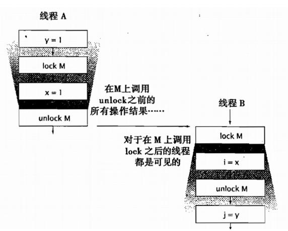

# ***对象的共享***

要编写争取的并发程序，关键问题在于：访问共享的可变状态时需要进行正确的管理。

同步代码块和同步方法可以确保以原子的方式执行操作，但一种常见的误解是，认为关键字 Synchronized 只能用于实现原子性或者确定“临界区（Critical Section）”。同步还有另一个重要的方面：内存可见性（Memory Visibility）。

---
## 可见性

可见性是一种复杂的属性，因为可见性中的错误总是会违背我们的直觉。单线程环境与多线程环境下的情况并不一致，我们无法确保执行读操作的线程能适时地看到其他线程写入的值，有时甚至是根本不可能的事情。**为了确保多个线程之间对内存写入操作的可见性，必须使用同步机制** 。

```java
// NoVisibility 可能会持续循环下去，因为读线程可能永远看不到 ready 的值。
// NoVisibility 还有可能输出 0 ，因为读线程可能看到了写入 ready 的值，但却没有看到之后写入的 number。
public class NoVisibility {
    private static boolean ready;
    private static int number;

    private static class ReaderThread extends Thread {
        public void run() {
            while (!ready)
                Thread.yield();
            System.out.println(number);
        }
    }
    
    public static void main(String[] args){
        new ReaderThread().start();
        number = 42;
        ready = true;
    }
}
```

在没有同步的情况下，编译器、处理器以及运行时等都可能对操作的执行顺序进行一些意想不到的调整。在缺乏足够同步的多线程程序中，想要对内存操作的执行顺序进行判断，几乎无法得出正确的结论。

NoVisbility 只包含两个线程和两个共享变量，但即便如此，在判断程序的执行结果以及是否会结束时仍然很容易得出错误结论要对那些缺乏足够同步的并发程序的执行情况进行推断是十分困难的。
有一种简单的方法能避免这些复杂的问题：**只要数据在多个线程之间共享，就是用正确的同步** 。

- ###### 失效数据

在缺乏同步的程序中可能产生错误结果的一种情况：失效数据。当读线程查看变量时，可能会得到一个已经失效的值。除非在每次访问变量时都是用同步，否则很可能获得该变量的一个失效值。更糟糕的是，失效值可能不会同时出现：一个线程可能获得某个变量的最新值，而获得另一个变量的失效值。

- ###### 非原子的64位操作

当线程在没有同步的情况下读取变量时，可能会得到一个失效值，但至少这个值是由之前某个线程设置的值，而不是一个随机值，这种安全性保证也被称为最低安全性（out-of-thin-airsafety）。

最低安全性适用于绝大多数变量，但是存在一个例外：非 volatile 类型的 64 位数值变量（double 与 long）。Java 内存模型要求，变量的读取操作与写入操作都必须时原子操作，但对于非 volatile 类型的 long 和 double 变量，JVM 允许将 64 位的读操作或写操作分解为两个 32 位的操作。当读取一个非 volatile 类型的 long 变量时，如果对该变量的读操作和写操作在不同的线程中执行，那么很可能会读取到某个值的高 32 位和另一个值的低 32 位。因此，即使不考虑实现数据问题，在多线程程序中使用共享且可变的 long 和 double 等类型的变量也是不安全的，除非关键字 volatile 来声明它们，或者用锁保护起来。

- ###### 加锁与可见性
  
内置锁可以用于确保某个线程以一种可预测的方式来查看另一个线程的执行结果。


加锁的含义不仅仅局限于互斥行为，还包括内存可见性，为了确保所有线程都能看到共享变量的最新值，所有执行读操作或者写操作的线程都必须在同一个锁上同步。

- ###### volatile 变量

Java 语言提供了一种稍弱的同步机制，即 volitile 变量，用来确保将变量的更新操作通知到其他线程。当把变量声明为 volatile 类型后，编译器与运行时都会注意到这个变量时共享的，因此不会将该变量上的操作与其他内存操作一起重排序。volatile 变量不会被缓存在寄存器或者对其他处理器不可见的地方，因此在读取 volatile 类型的变量时总会返回最新写入的值。

在访问 volatile 变量时不会执行加锁操作，因此也就不会使执行线程阻塞，因此 volatile 变量是一种比 sychronized 关键字更轻量级的同步操作。

volatile 变量对可见性的影响比 volatile 变量本身更为重要，从内存可见性的角度来讲，写入 volatile 变量相当于退出同步代码块，而读取 volatile 变量就相当于进入同步代码块

仅当 volatile 变量能简化代码的实现以及对同步策略的验证时，才应该使用它们。如果在验证正确性时需要对可见性进行复杂的判断，那么就不要使用 volatile 变量。**volatile 变量的正确使用方式包括：确保他们自身状态的可见性，确保他们所引用对象的状态的可见性，以及标识一些重要的程序生命周期事件的发生（例如，初始化或关闭）** 。

volatile 变量的一种典型用法：检查某个状态标记以判断是否退出循环：

```java
volatile boolean asleep;
...
    while (!asleep)
        countSomeSheep();
```

虽然 volatile 变量很方便，但也存在一些局限性。volatile 变量通常用作某个操作完成、发生中断或者状态的标记。尽管 volatile 变量也可以用于表示其他的状态信息，但在使用时要非常小心。例如，volatile 的语义不足以确保递增操作（count++）的原子性，除非你能确保只有一个线程对变量执行写操作。

**加锁机制即可以确保可见性又可以确保原子性，而 volatile 变量只能确保可见性** 。

仅当满足以下条件时，才应该使用 volatile  变量：   
>   1. 对变量的写入操作不依赖变量的当前值，或者你能确保只有单个线程更新变量的值。
>   2. 该变量不会与其他状态变量一起纳入不变性条件。
>   3. 在访问变量时不需要加锁。

## 发布与溢出

"发布（publish）" 一个对象的意思是指，是对象能够在当前作用域之外的代码中使用。

在很多情况中，我们要确保多线程及其内部状态不被发布。而在某些情况下，我们又需要发布某个对象，但如果在发布时要确保线程安全性，则可能需要同步。发布内部状态可能会破坏封装性，并使得程序难以维持不变性条件，当某个不应该发布的对象被发布时，这种情况就被称为逸出（Escape）。

```java
// 发布一个对象
public static Set<Secret> knowSecrets;

public void initialize() {
    knowSecrets = new HashSet<Secret>();
}
```

使内部的可变状态逸出(本该是私有的变量已经被发布了):

```java
class UnsafeStates {
    private String[] states = new String[]{
        "AK", "AL" ...
    };

    public String[] getStates() {
        return states;
    }
}
```

**在发布一个对象时，在该对象的非私有域中引用的所有对象同样会被发布** 。一般来说，如果一个已经发布的对象能够通过非私有的变量引用和方法调用到他其他的对象，那么这些对象也都会被发布。

无论其他线程会对已发布的引用执行何种操作，其实都不重要，因为误用该引用的风险始终存在。当某个对象逸出后，你必须假设有某个类或线程可能会误用该对象。这正是需要使用封装的最主要原因：**封装能够使得对程序的正确性进行分析变得可能，并使得无意中破坏约束条件变得更难** 。  

```java
// 隐式地使this引用逸出
public class ThisEscape {
    public ThisEscape(EventSource source) {
        source.registerListener(new EventListener() {
            public void onEvent(Event e) {
                doSomething(e);
            }
        });
    }
}
```
ThisEscape 中出给了逸出的一个特殊示例，即 this 引用在构造函数中逸出。当内部的 EventListener 实例发布时，在外部封装的 ThisEscape 实例也逸出了。当且仅当对象的构造函数返回时，对象才可处于可预测和一致的状态。因此，当对象的构造函数中发布对象时，只是发布了一个尚未构造完成的对象。及时发布对象的语句位于构造函数的最后一行也是如此。**如果 this 引用在构造过程中逸出，那么这种对象就被认为是不正确的构造** 。

在构造过程中使 this 引用逸出的一个常见错误是，在构造函数中启动一个线程。当对象在构造函数中创建一个线程时，无论是显示创建（通过将它传给构造函数）还是隐式创建（由于 Thread 或 Runnable 是该对象得一个内部类），this 指针引用都会被新创建的线程共享。在对象未完全构造之前，新的线程就可以看见它。

在构造方法中调用一个可改写的实例方法时（既不是私有方法，也不是终结方法），同样会导致this引用在构造过程中逸出。

如果想在构造函数中注册一个事件监听器或者启动线程，那么可以使用一个私有的构造函数和一个公共的工厂方法（Factory Method）,从而避免不正确的构造过程：
```java
public class SafeListener {
    private final EventListener listener;

    private SafeListener() {
        listener = new EventListener() {
            public void onEvent(Event e) {
                doSomething(e);
            }
        };
    }

    public static SafeListener newInstance(EventSource source) {
        SafeListener safe = new SafeListener();
        source.registerListener(safe.listener);
        return safe;
    }
}
```

## 线程封闭

当访问共享的可变数据时，通常需要使用同步。一种避免使用同步的方式就是不共享数据。如果仅在单线程内访问数据，那就不需要同步。这种技术被称为**线程封闭（Thread Confinement）** ,它是实现线程安全性的最简单方式之一。当某个对象封闭在一个线程中，这种用法将自动实现线程安全性，即使被封闭的对象本身不是线程安全的[CPJ2.3.2]。
  
在 Java 语言中并没有强调规定某个变量必须由锁来保护，同样在Java语言中也无法强制将对象封闭在某个线程中。线程封闭是在程序设计中实现。

- ###### Ad-hoc 线程封闭

Ad-hoc 线程封闭是指，维护线程封闭性的职责完全由程序实现来承担。Ad-hoc 线程封闭是非常脆弱，因为没有任何一种语言特性，例如可见性修饰符或局部变量，能将对象封闭到目标线程上。事实上，对线程封闭对象的引用通常保存在共有变量种。

当决定使用线程封闭技术时，通常是因为要将某个特定的子系统实现为一个单线程子系统。在某些情况下，单线程子系统提供的简便性要胜过 Ad-hoc 线程封闭技术的脆弱性。

**由于 Ad-hoc 线程封闭技术的脆弱性，因此在程序中尽量少用它，在可能的情况下，应该使用更强的线程封闭技术（例如：栈封闭或 ThreadLocal 类）** 。

- ###### 栈封闭

栈封闭是线程封闭的一种特例，在栈封闭中，只能通过局部变量才能访问对象。正如封装能使得代码更容易维持不变性条件那样，同步变量也能使对象更易于封闭在线程中。

局部变量的固有属性就是封闭在执行线程中，它们位于执行线程的栈中，其他线程无法访问这个栈。栈封闭（也被称为线程内部使用或线程局部使用，不要与核心类库中的 ThreadLocal 混淆）比 Ad-hoc 线程封闭更易于维护，也更加健壮。

```java
public int loadTheArk(Collection<Animal> candidates) {
    SortedSet<Animal> animals;
    int numPairs = 0;
    Animal candidate = null;

    // animals confined to method, don't let them escape!
    animals = new TreeSet<Animal>(new SpeciesGenderComparator());
    animals.addAll(candidates);
    for (Animal a : animals) {
        if (candidate == null || !candidate.isPotentialMate(a))
            candidate = a;
        else {
            ark.load(new AnimalPair(candidate, a));
            ++numPairs;
            candidate = null;
        }
    }
    return numPairs;
}
```

如果在线程内部（Within-Thread）上下文中使用非线程安全的对象，那么该对象应然是线程安全的。然而，要小心的是，只有编写代码的开发人员才知道哪些对象需要被封闭到执行线程中，以及被封闭的对象是否是线程安全的。如果没有明确地说明这些需求，那么后续的维护人员很容易错误地使对象逸出。

- ###### ThreadLocal 类

维持线程封闭性的一种更规范方法是使用 ThreadLocal，这个类能使线程中的某个值与保存的对象关联起来。

ThreadLocal 对象通常用于防止对可变的单实例对象（Singleton）或全局变量进行共享。
```java
private ThreadLocal<Connection> connectionHolder = new ThreadLocal<Connection>() {
    public Connection initialValue() {
        return DriverManager.getConnection(DB_URL);
    }
};

public Connection getConnection() {
    return connectionHolder.get();
}
```

当某个线程初次调用 `ThreadLocal.get` 方法时，就会调用 initialValue 来获取初始值。从概念上看，你可以将 `ThreadLocal<T>`视为包含了 Map<Thread,T>对象，其中保存了特定于该线程的值，但 ThreadLocal 的实现并非如此。这些特定于线程的值保存在 Thread 对象中，当线程终止后，这些值会作为垃圾回收。

假设你需要将一个单线程应用移植到多线程环境中，通过将共享的全局变量转换为 ThreadLocal 对象（如果全局变量的语义允许），可以维持线程安全性。然而，如果将应用程序范围内的缓存转换位线程局部的缓存，就不会有太大作用。

ThreadLocal 变量类似于全局变量，它能降低代码的可重用性，并在类之间引入隐含的耦合性，因此在使用时要格外小心。

## 不变性

满足同步需求的另一种方法是使用不可变对象（Immutable Object）[EJ iTEM 13]。

如果某个对象在被创建后其状态就不能被修改，那么这个对象就被称为不可变对象。线程安全性是不可变对象的固有属性之一，它们的不变性条件是由构造函数创建的，只要它们的状态不改变，那么这些不变性条件就能得以维持。

**不可变对象一定是线程安全的** 。

虽然在 Java 语言规范和 Java 内存模型中都没有给出不可变性的正式定义，**但不可变性并不等于将对象中所有的域都声明为 final 类型，即使对象中所有的域都是 final 类型的，这个对象也仍然是可变的，因为在 final 类型的域中可以保存对可变对象的引用** 。

当满足以下条件时，对象才是不可变的
>- 对象创建以后其状态就不能修改。
>- 对象的所有域都是 final 类型。
>- 对象是正确创建的（在对象的创建期间，this 引用没有逸出）。

在不可变对象中仍可以使用可变对象来管理它们的状态。
```java
@Immutable
public final class ThreeStooges {
    private final Set<String> stooges = new HashSet<String>();

    public ThreeStooges() {
        stooges.add("Moe");
        stooges.add("Larry");
        stooges.add("Curly");
    }

    public boolean isStooge(String name) {
        return stooges.contains(name);
    }
}
```

在 “不可变的对象” 与 “不可变的对象引用” 之间存在差异。保存在不可变对象中的程序状态依然可以更新，即通过将一个保存新状态的实例来 “替换” 原有的不可变对象。

## Final 域

关键字 final 可以视为 C++ 中 const 机制的一种受限版本，用于构建不可变性对象。final 类型的域是不能修改的（但如果 final 域所引用的对象是可变的，那么这些被引用的对象是可以修改的）。然而，**在 Java 内存模型中，final 域还有特殊的语义。final 域能够确保初始化过程的安全性，从而可以不受限制的访问不可变对象，并在共享这些对象时无需同步** 。

即使对象是可变的，通过将对象的某些域声明为 final 类型，仍然可以简化对状态的判断，因此限制对象的可变性也就相当于限制了该对象可能的状态集合。仅包含一个或两个可变状态的“基本不可变”对象仍然比包含多个可变状态的对象简单。

正如“除非需要更高的可见性，否则应将所有的域都声明为私有域”是一个良好的编程习惯，“除非需要某个域是可变的，否则应将其声明为 final 域”也是一个良好的编程习惯。

```java 
// 对数值及其因数分解结果进行缓存的不可变容器类
@Immutable
public class OneValueCache {
    private final BigInteger lastNumber;
    private final BigInteger[] lastFactors;

    public OneValueCache(BigInteger i, BigInteger[] factors) {
        lastNumber = i;
        lastFactors = Arrays.copyOf(factors, factors.length);
    }

    public BigInteger[] getFactors(BigInteger i) {
        if (lastNumber == null || !lastNumber.equals(i))
            return null;
        else
            return Arrays.copyOf(lastFactors, lastFactors.length);
    }
}
```


```java
@ThreadSafe
public class VolatileCachedFactorizer extends GenericServlet implements Servlet {
    private volatile OneValueCache cache = new OneValueCache(null, null);

    public void service(ServletRequest req, ServletResponse resp) {
        BigInteger i = extractFromRequest(req);
        BigInteger[] factors = cache.getFactors(i);
        if (factors == null) {
            factors = factor(i);
            cache = new OneValueCache(i, factors);
        }
        encodeIntoResponse(resp, factors);
    }
}
```

## 安全发布

在某些情况下我们希望在多个线程间共享对象，此时必须确保安全地进行共享。  


在没有足够同步的情况下发布对象（不要这样做）
```java
// 不安全的发布
public Holder holder;

public void initialize(){
    holder = new Holder(42);
}
```

由于存在可见性问题，其他线程看到的 Holder 对象将处于不一致的状态，即使在该对象的构造函数中已经正确地构建了不变性条件。这种不正确的发布导致其他线程看到尚未创建完成的对象。


- ###### 不正确的发布：正确的对象被破坏

你不能指望一个尚未被完全创建的对象拥有完整性。

> 由于未被正确发布，因此这个类可能会出现故障
```java
public class Holder(){
    private int n;
    public Holder(int n){ this.n = n; }
    public void assertSanity(){
        if(n != n)
            throw new AssertionError("this statement is false.");
    }
}
```
由于没有使用同步来确保 Holder 对象对其他线程可见，因此将 Holder 称为“未被正确发布”。在未被正确发布的对象中存在两个问题。

除了发布对象的线程外，其他线程可以看到的 Holder 域是一个失效值，因此将看到一个空引用或者之前的旧值。

更糟糕的情况是，线程看到 Holder 引用的值是最新的，但 Holder 状态的值却是失效的。情况变得不可预测的是，某个线程在第一次读取域时得到失效值，而再次读取这个域时会得到一个更新值，这也就是 assertSanity 抛出 AssertionError 的原因。

**如果没有足够的同步，那么当在多个线程间共享数据将会发生一些非常奇怪的事情** 。


- ###### 不可变对象域初始化安全性
  
由于不可变对象是一种非常重要的对象，因此 Java 内存模型为不可变对象的共享提供了一种特殊的初始化安全性保证。我们已经知道，即使某个对象的引用对其他线程是可见的，也并不意味着对象状态对于使用该对象的线程来说一定是可见的。为了确保对象状态能呈现出一致的视图，就必须使用同步。

即使在发布不可变对象的引用时没有使用同步，也仍然可以安全地访问该对象。为了维持这种初始化安全性的保证，必须满足不可变性的所有需求：状态不可修改，所有的域都是 final 类型，以及正确的构造过程（如果 Holder 对象是不可变的，那么即使 Holder 没有被正确的发布，在 assertSanity 中也不会抛出 AssertionError）。

**任何线程都可以在不需要额外同步的情况下安全地访问不可变对象，即使在发布这些对象时没有使用同步** 。

这些保证还将延伸到被正确创建对象中所有 final 类型的域。在没有额外同步的情况下，也可以安全地访问 final 类型的域。然而，**如果 final 类型的域所指向的是可变对象，那么在访问这些域所指向的对象的状态时仍然需要同步** 。


- ###### 安全发布的常用模式
  
可变对象必须通过安全的方式来发布，这通常意味着在发布和使用该对象的线程时都必须使用同步。

要安全的发布一个对象，对象的引用以及对象的状态都必须同时对其他的线程可见。一个正确构建的对象可以通过以下方式来安全地发布：
>- 在静态初始化函数中初始化一个对象引用。
>- 将对象的引用保存在 volatile 类型的域或者 AtomicReference 对象中。
>- 将对象的引用保存在某个正确构造对象的 final 类型域中。
>- 将对象的引用保存到一个有所保护的域中。

在线程安全容器内部的同步意味着，在将对象放入到某个容器，例如 Vector 或 synchronizedList 时，将满足上述最后一条需求。如果线程`A`将对象`X`放入一个线程安全的容器，随后线程`B`读取这个对象，那么可以确保`B`看到`A`设置的`X`对象，即使在这段 读/写 `X`的应用程序代码中没有包含显式的同步。

线程安全库中的容器类提供了以下的安全发布保证：
>- 通过将一个键或者值放入`Hashtable`、`synchronizedMap`或者`ConcurrentMap`中，可以安全地将它发布给任何从这些容器中访问它的线程。
>- 通过将某个元素放入`Vector`、`CopyOnWriteArrayList`、`CopyOnWriteArraySet`、`synchronizedList`或`synchronizedSet`中，可以将该元素安全地发布到任何从这些容器中访问该元素的线程。
>- 通过将某个元素放入`BlockingQueue`或者`ConcurrentLinkedQueue`中，可以将该元素安全地发布到任何从这些队列中访问该元素的线程。

通常，要发布一个静态构造的对象，最简单和最安全的方式是使用静态的初始化器。

`public static Holder holder = new Holder(42)`

静态初始化器由 JVM 在类的初始化阶段执行。由于在 JVM 内部存在着同步机制，因此通过这种方式初始化的任何对象都可以被安全地发布[JLS 12.4.2]。

- ###### 事实不可变对象

如果对象在发布后不会被修改，那么对于其他在没有额外同步的情况下安全地访问这些对象的线程来说，安全发布是足够的。所有的安全发布机制都能够确保，当对象的引用对所有访问该对象的线程可见时，对象发布时的状态对于所有线程也将是可见的，并且如果对象状态不会再改变，那么就足以确保任何访问都是安全的。

如果对象从技术上来看是可变的，但其状态再发布后不会再改变，那么把这种对象称为 “事实上的不可变对象（Effectively Immutable Object）”。

在没有额外同步的情况下，任何线程都可以安全的使用被安全发布的事实不可变对象。

- ###### 可变对象

如果对象在构造后可以修改，那么安全发布只能确保"发布当时"状态的可见性。对于可变对象，不仅发布时要同步，而且在每次访问时同样需要使用同步来确保后续修改操作的可见性。要安全地共享可变对象，必须安全地发布，并且必须是线程安全的或者由某个锁保护起来。

对象的发布需求取决于它的可变性：
>- 不可变对象可以通过任意机制来发布。
>- 事实不可变对象必须通过安全方式来发布。
>- 可变对象必须通过安全方式来发布，并且必须是线程安全的或者由某个锁保护起来。

- ###### 安全地共享对象

在我们获得一个对象的引用的时候，你需要知道和了解我们的会在这个引用上执行哪些操作。是否需要获得一个锁？是否可以修改它状态，或者只能读取它？许多并发错误都是由于没有理解共享对象的这些规则锁导致的。

在并发程序中使用和共享对象时， 一些使用策略：
>- **线程封闭** ：线程封闭的对象只能由一个线程所拥有,对象被封闭在该线程中，并且只能由这个线程修改。
>- **只读共享** ：在没有额外同步的情况下，共享的只读对象可以由多个线程并发访问，但任何线程都不能修改它，共享的只读对象包括不可变对象和事实不可变对象。
>- **线程安全共享** ：线程安全的对象在其内部实现同步，因此多个线程可以通过对象的公用接口来进行访问而不需要进一步同步。
>- **保护对象** ：被保护的对象只能通过持有特定的锁来访问。保护对象包括封装在其他线程安全对象中的对象，以及已发布的并且由某个特定锁保护的对象。

