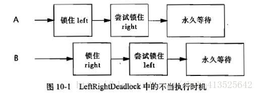

# ***活跃性、性能与测试：避免活跃性危险***

 [***活跃性、性能与测试：避免活跃性危险***](#活跃性性能与测试避免活跃性危险)
  - [死锁](#死锁)
          - [锁顺序死锁](#锁顺序死锁)
          - [动态的锁顺序死锁](#动态的锁顺序死锁)
          - [在协作对象之间发生的死锁](#在协作对象之间发生的死锁)
          - [开放调用](#开放调用)
          - [资源死锁](#资源死锁)
  - [死锁的避免与诊断](#死锁的避免与诊断)
          - [支持定时的锁](#支持定时的锁)
          - [通过线程转储信息来分析死锁](#通过线程转储信息来分析死锁)
  - [其他活跃性危险](#其他活跃性危险)
          - [饥饿](#饥饿)
          - [糟糕的响应性](#糟糕的响应性)
          - [活锁](#活锁)

----

在安全性和活跃性之间通常存在某种制衡。我们使用加锁机制来确保线程安全，但如果过度使用加锁，则可能导致锁顺序死锁（Lock-Ordering Deadlock）。同样，使用线程池和信号量来限制对资源的使用，但这些被限制的行为可能会导致资源死锁（Resource Deadlock）。Java 应用程序无法从死锁中恢复过来，因此在设计使一定要排除那些可能导致死锁出现的条件。

## 死锁

经典的“哲学家进餐”问题很好地描述了死锁状况。5个哲学家去吃中餐，坐在一张圆桌旁。他们有5根筷子(而不是5双)，并且每两个人中间放一根筷子。哲学家们时而思考，时而进餐。每个人都需要一双筷子才能吃到东西， 并在吃完后将筷子放回原处继续思考。有些筷子管理算法能够使每个人都能相对及时地吃到东西(例如一个饥饿的哲学家会尝试获得两根邻近的筷子，但如果其中一根正在被另一个哲学家使用，那么他将放弃已经得到的那根筷子，并等待几分钟之后再次尝试)，但有些算法却可能导致一些或者所有哲学家都“饿死”(每个人都立即抓住自己左边的筷子，然后等待自己右边的筷子空出来，但同时又不放下已经拿到的筷子)。后一种情况将产生死锁:每个人都拥有其他人需要的资源，同时又等待其他人已经拥有的资源，并且每个人在获得所有需要的资源之前都不会放弃已经拥有的资源。

当一个线程永远地持有一个锁，并且其他线程都尝试获得这个锁时，那么它们将永远被阻塞。在线程A持有锁L并想获得锁M的同时，线程B持有锁M并尝试获得锁L，那么这两个线程将永远地等待下去。这种情况就是最简单的死锁形式(或者称为“抱死[Deadly Embrace]”)，其中多个线程由于存在环路的锁依赖关系而永远地等待下去。(把每个线程假想为有向图中的一个节点，图中每条边表示的关系是:“线程A等待线程B所占有的资源”。如果在图中形成了一条环路，那么就存在一个死锁。)

在数据库系统的设计中考虑了监测死锁以及从死锁中恢复。在执行一个事务(Transaction) 时可能需要获取多个锁，并一直持有这些锁直到事务提交。 因此在两个事务之间很可能发生死锁，但事实上这种情况并不多见。如果没有外部干涉，那么这些事务将永远等待下去(在某个事务中持有的锁可能在其他事务中也需要)。但数据库服务器不会让这种情况发生。当它检测到一组事务发生了死锁时(通过在表示等待关系的有向图中搜索循环)，将选择一个牺牲者并放弃这个事务。作为牺牲者的事务会释放它所持有的资源，从而使其他事务继续进行。应用程序可以重新执行被强行中止的事务，而这个事务现在可以成功完成，因为所有跟它竞争资源的事务都已经完成了。

JVM 在解决死锁问题方面并没有数据库服务那样强大。当一组 Java 线程发生死锁时，“游戏”将到此结束————这些线程永远不能再使用了。根据线程完成工作的不同，可能造成应用程序完全停止，或者某个特定的子系统停止，或者是性能降低。恢复应用程序的唯一方式就是中止并重启它，并希望不要再发生同样的事情。

与许多其他的并发危险一样，死锁造成的影响很少会立即显现出来。如果一个类可能发生死锁，那么并不意味着每次都会发生死锁，而只是表示有可能。当死锁出现时，往往是在最糟糕的时候————在高负载情况下。

###### 锁顺序死锁

```java
// 程序清单10-1 简单的锁顺序死锁（不要这样做）
public class LeftRightDeadlock {
    private final Object left = new Object();
    private final Object right = new Object();

    public void leftRight() {
        synchronized (left) {
            synchronized (right) {
                doSomething();
            }
        }
    }

    public void rightLeft() {
        synchronized (right) {
            synchronized (left) {
                doSomethingElse();
            }
        }
    }
}
```

LeftRightDeadlock 存在死锁风险。leftRight 和 rightLeft 这两个方法分别获得 left 锁和 right 锁。如果一个线程调用了 leftRight,而另一个线程调用了 rightLeft ,并且这两个线程的操作是交错执行，如图10-1所示，那么它们会发生死锁。



在 LeftRightDeadlock 中发生死锁的原因是:两个线程试图以不同的顺序来获得相同的锁。如果按照相同的顺序来请求锁，那么就不会出现循环的加锁依赖性，因此也就不会产生死锁。如果每个需要锁L和锁M的线程都以相同的顺序来获取L和M,那么就不会发生死锁了。

**如果所有线程以固定的顺序来获得锁，那么在程序中就不会出现锁顺序死锁问题。**

求要想验证锁顺序的一致性，需要对程序中的加锁行为进行全局分析。如果只是单独地分析每条获取多个锁的代码路径，那是不够的: leftRight 和rightLleft 都采用了“合理的”方式来获得锁，它们只是不能相互兼容。当需要加锁时，它们需要知道彼此正在执行什么操作。

###### 动态的锁顺序死锁

有时候，并不能清楚地知道是否在锁顺序上有足够的控制权来避免死锁的发生。考虑程序清单10-2中看似无害的代码，它将资金从一个账户转入另一个账户。在开始转账之前，首先要获得这两个Account对象的锁，以确保通过原子方式来更新两个账户中的余额，同时又不破坏一些不变性条件，例如“账户的余额不能为负数”。

```java
// 程序清单10-2 动态的锁顺序死锁
// 注意：容易发生死锁
public void transferMoney(Account fromAccount, Account toAccount, DollarAmount amount) throws  InsufficientFundsException {
    synchronized (fromAccount) {
        synchronized (toAccount) {
            if (fromAccount.getBalance().compareTo(amount) < 0)
                throw new InsufficientFundsException();
            else {
                fromAccount.debit(amount);
                toAccount.credit(amount);
            }
        }
    }
}
```

在 transferMoney 中如何发生死锁?所有的线程似乎都是按照相同的顺序来获得锁，但事实上锁的顺序取决于传递给 transferMoney 的参数顺序，而这些参数顺序又取决于外部输入。如果两个线程同时调用 transferMoney,其中一个线程从X向Y转账，另一个线程从Y向X转账，那么就会发生死锁:

> A: transferMoney (myAccount, yourAccount, 10) ;

> B: transferMoney (yourAccount, myAccount, 20) ;

如果执行时序不当，那么 A 可能获得 myAccount 的锁并等待 yourAccount 的锁，然而 B 此时持有 yourAccount 的锁，并正在等待 myAccount 的锁。

这种死锁可以采用程序清单10-1中的方法来检查————查看是否存在嵌套的锁获取操作。由于我们无法控制参数的顺序，因此要解决这个问题，必须定义锁的顺序，并在整个应用程序中都按照这个顺序来获取锁。

在制定锁的顺序时，可以使用`System.identityHashCode`方法，该方法将返回由`Object. hashCode`返回的值。程序清单10-3 给出了另一个版本的`transferMoney`,在该版本中使用了`System.identityHashCode`来定义锁的顺序。虽然增加了一 些新的代码，但却消除了发生死锁的可能性。

```java
    // 程序清单10-3  通过锁顺序来避免死锁
    private static final Object tieLock = new Object();

    public void transferMoney(final Account fromAcct, final Account toAcct, final DollarAmount amount)
            throws InsufficientFundsException {

        class Helper {
            public void transfer() throws InsufficientFundsException {
                if (fromAcct.getBalance().compareTo(amount) < 0)
                    throw new InsufficientFundsException();
                else {
                    fromAcct.debit(amount);   
                    toAcct.credit(amount);   
                }
            }
        }
        int fromHash = System.identityHashCode(fromAcct);
        int toHash = System.identityHashCode(toAcct);

        if (fromHash < toHash) {
            synchronized (fromAcct) {
                synchronized (toAcct) { new Helper().transfer(); }
            }
        } else if (fromHash > toHash) {
            synchronized (toAcct) {
                synchronized (fromAcct) { new Helper().transfer(); }
            }
        } else {   
            synchronized (tieLock) {
                synchronized (fromAcct) {
                    synchronized (toAcct) { new Helper().transfer(); }
                }
            }
        }
    }
```

在极少数情况下。两个对象可能拥有相同的散列值，此时必须通过某种任意的方法来决定锁的顺序，而这可能又会重新引入死锁。 为了避免这种情况，可以使用“加时赛(Tie-Breaking)”锁。在获得两个 Account 锁之前，首先获得这个“加时赛”锁，从而保证每次只有一个线程以未知的顺序获得这两个锁，从而消除了死锁发生的可能性(只要一致地使用这种机制)。如果经常会出现散列冲突的情况，那么这种技术可能会成为并发性的一个瓶颈(这类似于在整个程序中只有一个锁的情况)，但由于`System.identityHashCode`中出现散列冲突的频率非常低，因此这项技术以最小的代价，换来了最大的安全性。

如果在 Account 中包含一个唯一的、不可变的，并且具备可比性的键值， 例如账号，那么要制定锁的顺序就更加容易了:通过键值对对象进行排序，因而不需要使用“加时赛”锁。

你或许认为我有些夸大了死锁的风险，因为锁被持有的时间通常很短暂，然而在真实系统中，死锁往往都是很严重的问题。作为商业产品的应用程序每天可能要执行数十亿次获取锁 - 释放锁的操作。只要在这数十亿次操作中有一次发生了错误，就可能导致程序发生死锁，并且即使应用程序通过了压力测试也不可能找出所有潜在的死锁。在程序清单10-49 中的 DemonstrateDeadlock 在大多数系统下都会很快发生死锁。

```java
// 程序清单 10-4  在典型条件下会发生死锁的循环
public class DemonstrateDeadlock {
    private static final int NUM_THREADS = 20;
    private static final int NUM_ACCOUNTS = 5;
    private static final int NUM_ITERATIONS = 1000000;   

    public static void main(String[] args) {
        final Random rnd = new Random();
        final Account[] accounts = new Account[NUM_ACCOUNTS];

        for (int i = 0; i < accounts.length; i++)
            accounts[i] = new Account();

        class TransferThread extends Thread {
            public void run() {
                for (int i = 0; i < NUM_ITERATIONS; i++) {
                    int fromAcct = rnd.nextInt(NUM_ACCOUNTS);
                    int toAcct = rnd.nextInt(NUM_ACCOUNTS);  
                    DollarAmount amount = new DollarAmount(rnd.nextInt(1000));
                    try {
                        DynamicOrderDeadlock.transferMoney(accounts[fromAcct], accounts[toAcct], amount);
                    } catch (DynamicOrderDeadlock.InsufficientFundsException ignored) {
                    }
                }
            }
        }
        for (int i = 0; i < NUM_THREADS; i++)
            new TransferThread().start();
    }
}
```

###### 在协作对象之间发生的死锁

某些获取多个锁的操作并不像在 LeftRightDeadlock 或 transferMoney 中那么明显，这两个锁不一定在同一个方法中被获取。考虑程序清单 10-5 中两个互相协作的类，在出租车调度系统中可能会用到它们。Taxi 代表一个出租车对象，包含位置和目的地两个属性，Dispatcher 代表一个出租车车队。

```java
// 程序清单 10-5:在互相协作对象之间的锁顺序死锁（不要这样做）  
// 容易发生死锁
class Taxi {
    private Point location, destination;  
    private final Dispatcher dispatcher; 

    public Taxi(Dispatcher dispatcher) { this.dispatcher = dispatcher; }

    public synchronized Point getLocation() {  return location; }

    public synchronized void setLocation(Point location) {
        this.location = location;
        if (location.equals(destination)) dispatcher.notifyAvailable(this);
    }
}

class Dispatcher {
    private final Set<Taxi> taxis;
    private final Set<Taxi> availableTaxis;

    public Dispatcher() {
        taxis = new HashSet<Taxi>();
        availableTaxis = new HashSet<Taxi>();
    }

    public synchronized void notifyAvailable(Taxi taxi) { availableTaxis.add(taxi); }

    public synchronized Image getImage() {
        Image image = new Image();
        for (Taxi t : taxis)
            image.drawMarker(t.getLocation());
        return image;
    }
}
```

尽管没有任何方法显式地获取两个锁，但`setLocation`和`getImage`等方法的调用者都会获得两个锁。如果一个线程在收到 GPS 接收器的更新事件时调用`setLocation`，那么它将首先更新出租车的位置，然后判断它是否到达了目的地。如果到达了，它会通知 Dispatcher:它需要一个新目的地。因为`setLocation`和`notifyAvailable`都是同步方法，因此调用`setLocation`的线程将首先获得 Taxi 的锁，然后再获得 Dispatcher 的锁。同样，调用 getImage 的线程将首先获取 Dispatcher 锁，然后再获取每一个 Taxi 的锁（每次获取一个）。这与 LeftRightDeadlock 中的情况相同，两个线程按照不同的顺序来获取两个锁，因此可能产生死锁。

在 LeftRightDeadlock 和 transferMoney 中，要查找死锁时比较简单的：只需要找出那些需要获取两个锁的方法。然而要在 Taxi 和 Dispatcher 中查找死锁是比较困难的：如果在持有锁的情况下需要调用某个外部方法，就需要警惕死锁。

**如果在持有锁时调用某个外部方法，那么将出现活跃性问题。在这个外部方法中可能或获取其他锁（这可能产生死锁），或者阻塞时间过长，导致其他线程无法及时获得当前被持有的锁。**

###### 开放调用

当然，Taxi 和 Dispatcher 并不知道它们将要陷入死锁，说且它们本来就不应该知道。方法调用相当干一种抽象屏障，因而你无须了解在被调用方法中所执行的操作。但也正是由于不知道在被调用方法中执行的操作，因此在持有锁的时候对调用某个外部方法将难以进行分析，从而可能出现死锁。

**如果在调用某个方法时不需要持有锁，那么这种调用被称为开放调用(OpenCall)[CPJ2.4.1.3]。** 依赖于开放调用的类通常能表现出更好的行为，并且与那些在调用方法时需要持有锁的类相比，也更易于编写。这种通过开放调用来避免死锁的方法，类似于采用封装机制来提供线程安全的方法:虽然在没有封装的情况下也能确保构建线程安全的程序，但对个使用了封装的程序进行线程安全分析，要比分析没有使用封装的程序容易得多。同理，分析一个完全依赖于开放调用的程序的活跃性，要比分析那些不依赖开放调用的程序的活跃性简单。通过尽可能地使用开放调用，将更易于找出那些需要获取多个锁的代码路径，因此也就更容易确保采用一致的顺序来获得锁。

可以很容易地将程序清单10-5中的 Taxi 和 Dispatcher 修改为使用开放调用，从而消除发生死锁的风险。这需要使同步代码块仅被用于保护那些涉及共享状态的操作，如程序清单10-6所示。通常，如果只是为了语法紧凑或简单性(而不是因为整个方法必须通过一个锁来保护)而使用同步方法(而不是同步代码块)，那么就会导致程序清单10-5中的问题。(此外，收缩同步代码块的保护范围还可以提高可伸缩性)

```java
// 程序清单 10-6 通过公开调用来避免在互相协作的对象之间产生死锁
class Taxi {
    private Point location, destination;  
    private final Dispatcher dispatcher; 

    public Taxi(Dispatcher dispatcher) { this.dispatcher = dispatcher; }

    public synchronized Point getLocation() { return location; }

    public void setLocation(Point location) {
        boolean reachedDestination;
        synchronized (this) {
            this.location = location;
            reachedDestination = location.equals(destination);
        }
        if (reachedDestination) dispatcher.notifyAvailable(this);
    }
}

class Dispatcher {   
    private final Set<Taxi> taxis;
    private final Set<Taxi> availableTaxis;

    public Dispatcher() {
        taxis = new HashSet<Taxi>();
        availableTaxis = new HashSet<Taxi>();
    }

    public synchronized void notifyAvailable(Taxi taxi) { availableTaxis.add(taxi); }

    public Image getImage() {
        Set<Taxi> copy;
        synchronized (this) { copy = new HashSet<Taxi>(taxis); }
        Image image = new Image();
        for (Taxi t : copy)
            image.drawMarker(t.getLocation());
        return image;
    }
}
```

**在程序中应尽量使用开放调用，与那些在持有锁时调用外部方法的程序相比，更容易对依赖于开放调用的程序进行死锁分析。**

有时候，在重新编写同步代码块以使用开放放调用时会产生意想不到的结果，因为这会使得某个原干操作交为非原子操作。在许多情况下，使某个操作失去原子性起可以接受的。例如，对于两个操作:更新出租车位置以及通知调度程序这辆出租车已准备好出发去一个新的目的地，这两个操作并不需要实现为一个原子操作。在其他情况中，虽然去掉原子性可能会出现一些值得注意的结果，但这种语义变化仍然是可以接受的。在容易产生死锁的版本中，gelmage 会生成某个时刻下的整个车队位置的完整快照，而在重新改写的版本中，getlmage 将获得每辆出租车不同时刻的位置。

然而，在某些情况下，丢失原子性会引发错误，此时需要通过另一种技术来实现原子性。例如，在构造一个并发对象时，使得每次只有单个线程执行使用了开放调用的代码路径。例如，在关闭某个服务时，你可能希望所有正在运行的操作执行完成以后，再释放这些服务占用的资源。如果在等待操作完成的同时持有该服务的锁，那么将很容易导致死锁，但如果在服务关闭之前就释放服务的锁，则可能导致其他线程开始新的操作。这个问题的解决方法是，在将服务的状态更新为"关闭”之前一直持有锁，这样其他想要开始新操作的线程，包括想关闭该服务的其他线程，会发现服务已经不可用，因此也就不会试图开始新的操作。然后，你可以等待关闭操作结束，并且知道当开放调用完成后，只有执行关闭操作的线程才能访问服务的状态。因此，这项技术依赖于构造一些协议(而不是通过加锁)来防止其他线程进入代码的临界区。

###### 资源死锁

正如当多个线程相互持有彼此正在等待的锁而又不释放自己已持有的锁时会发生死锁，当它们在相同的资源集合上等待时，也会发生死锁。

假设有两个资源池，例如两个不同数据库的连接池。资源池通常采用信号量来实现当资源池为空时的阻塞行为。如果一个任务需要连接两个数据库，并且在请求这两个资源时不会始终遵循相同的顺序，那么线程A可能持有与数据库D的连接，并等待与数据库D2的连接，而线程B则持有与D2的连接并等待与D的连接。(资源池越大，出现这种情况的可能性就越小。如果每个资源池都有N个连接，那么在发生死锁时不仅需要N个循环等待的线程，而且还需要大量不恰当的执行时序。)

另一种基于资源的死锁形式就是线程饥饿死锁(Thread-Starvation Deadlock)。8.1.1 节给出了这种危害的一个示例:一个任务提交另个任务， 并等待被提交任务在单线程的 Executor 中执行完成。这种情况下，第一个任务将永远等待下去，并使得另一个任务以及在这个 Executor 中执行的所有其他任务都停止执行。如果某些任务需要等待其他任务的结果，那么这些任务往往是产生线程饥饿死锁的主要来源，有界线程池/资源池与互相依赖的任务不能一起使用。

## 死锁的避免与诊断

如果一个程序每次至多只能获得一个锁，那么就不会产生锁顺序死锁。当然，这种情况通常并不现实，但如果能够避免这种情况，那么就能省去很多工作。如果必须获取多个锁，那么在设计时必须考虑锁的顺序:尽量减少潜在的加锁交互数量，将获取锁时需要遵循的协议写入正式文档并始终遵循这些协议。

在使用细粒度锁的程序中，可以通过使用一种两阶段策略(Two-Part Strategy)来检查代码中的死锁:首先，找出在什么地方将获取多个锁(使这个集合尽量小)，然后对所有这些实例进行全局分析，从而确保它们在整个程序中获取锁的顺序都保持一致。尽可能地使用开放调用，这能极大地简化分析过程。如果所有的调用都是开放调用，那么要发现获取多个锁的实例是非常简单的，可以通过代码审查，或者借助自动化的源代码分析工具。

###### 支持定时的锁

还有一项技术可以检测死锁和从死锁中恢复过来，即显式使用 Lock 类中的定时 tryLock 功能来代替内置锁机制。当使用内置锁时，只要没有获得锁，就会永远等待下去，而显式锁则可以指定一个超时时限(Timeout), 在等待超过该时间后 tryLock 会返回一个失败信息。如果超时时限比获取锁的时间要长很多，那么就可以在发生某个意外情况后重新获得控制权。

当定时锁失败时，你并不需要知道失败的原因。或许是因为发生了死锁，或许某个线程在持有锁时错误地进入了无限循环，还可能是某个操作的执行时间远远超过了你的预期。然而，至少你能记录所发生的失败，以及关于这次操作的其他有用信息，并通过一种更平缓的方式来重新启动计算，而不是关闭整个进程。

即使在整个系统中没有始终使用定时锁，使用定时锁来获取多个锁也能有效地应对死锁问题。如果在获取锁时超时，那么可以释放这个锁，然后后退并在一段时间后再次尝试，从而消除了死锁发生的条件，使程序恢复过来。(这项技术只有在同时获取两个锁时才有效，如果在嵌套的方法调用中请求多个锁，那么即使你知道已经持有了外层的锁，也无法释放它。)

###### 通过线程转储信息来分析死锁

虽然防止死锁的主要责任在于你自己，但 JVM 仍然通过线程转储(Thread Dump)来帮助识别死锁的发生。线程转储包括各个运行中的线程的栈追踪信息，这类似于发生异常时的栈追踪信息。线程转储还包含加锁信息，例如每个线程持有了哪些锁，在哪些栈帧中获得这些锁，以及被阻塞的线程正在等待获取哪一个锁。在生成线程转储之前，JVM 将在等待关系图中通过搜索循环来找出死锁。如果发现了一个死锁，则获取相应的死锁信息，例如在死锁中涉及哪些锁和线程，以及这个锁的获取操作位于程序的哪些位置。

要在 UNIX 平台上触发线程转储操作，可以通过向 JVM 的进程发送 SIGQUIT 信号(kill-3),或者在 UNIX 平台中按下 Ctrl-\ 键，在Windows 平台中按下 Ctrl-Break键。在许多 IDE (集成开发环境)中都可以请求线程转储。

如果使用显式的 Lock 类而不是内部锁，那么 Java5.0 并不支持与 Lock 相关的转储信息，在线程转储中不会出现显式的 Lock。虽然 Java6 中包含对显式 Lock 的线程转储和死锁检测等的支持，但在这些锁上获得的信息比在内置锁上获得的信息精确度低。内置锁与获得它们所在的线程栈帧是相关联的，而显式的 Lock 只与获得它的线程相关联。

程序清单10-7给出了一个 J2EE 应用程序中获取的部分线程转储信息。在导致死锁的故障中包括3个组件:一个J2EB应用程序，一个J2EE容器，以及一个JDBC驱动程序，分别由不同的生产商提供。这3个组件都是商业产品，并经过了大量的测试，但每一个组件中都存在一个错误，并且这个错误只有当它们进行交互时才会显现出来，并导致服务器出现一个严重的故障。

```java
// 程序清单 10-7 在发生死锁后的部分线程转储信息
Found one Java-level deadlock:
=============================
"ApplicationServerThread":
   waiting to lock monitor 0x080f0cdc (a MumbleDBConnection),
   which is held by "ApplicationServerThread"
"ApplicationServerThread":
   waiting to lock monitor 0x080f0ed4 (a MumbleDBCallableStatement),
   which is held by "ApplicationServerThread"
Java stack information for the threads listed above:
"ApplicationServerThread":
      at MumbleDBConnection.remove_statement
      - waiting to lock <0x650f7f30> (a MumbleDBConnection)
      at MumbleDBStatement.close
      - locked <0x6024ffb0> (a MumbleDBCallableStatement)
    ...
"ApplicationServerThread":
      at MumbleDBCallableStatement.sendBatch
      - waiting to lock <0x6024ffb0> (a MumbleDBCallableStatement)
      at MumbleDBConnection.commit
      - locked <0x650f7f30> (a MumbleDBConnection)
    ...
```

我们只给出了查找死锁相关的部分线程转储信息。当诊断死锁时，JVM 可以帮我们做许多工作——哪些锁导致了问题，涉及哪些线程，它们持有哪些其他的锁，以及是否间接地给其他线程带了不利影响。其中一个线程持有 MumbleDBConnection 上的锁，并等待获得 MumbleDBCallableStatement 上的锁，而另一个线程则持有 MumbleDBCallableStatement 上的锁，并等待 MumbleDBConnection 上的锁。

在这里使用的 JDBC驱动程序中明显存在一个锁顺序问题:不同的调用链通过 JDBC驱动程序以不同的顺序获取多个锁。如果不是由于另一个错误，这个问题永远不会显现出来:多个线程试图同时使用同一个JDBC连接。这并不是应用程序的设计初衷————开发人员惊讶地发现同一个 Connection 被两个线程并发使用。在 JDBC规范中并没有要求 Connection 必须是线程安全的，以及 Connection 通常被封闭在单个线程中使用，而在这里就采用了这种假设。这个生产商试图提供一个线程安全的 JDBC驱动，因此在驱动程序代码内部对多个 JDBC对象施加了同步机制。然而，生产商却没有考虑锁的顺序，因而驱动程序很容易发生死锁，而正是由于这个存在死锁风险的驱动程序与错误共享 Connection 的应用程序发生了交互，才使得这个问题暴露出来。因为单个错误并不会产生死锁，只有这两个错误同时发生时才会产生，即使它们分别进行了大量测试。


## 其他活跃性危险

尽管死锁是最常见的活跃性危险，但在并发程序中还存在一些其他的活跃性危险，包括:饥饿、丢失信号和活锁等。

###### 饥饿

当线程由于无法访问它所需要的资源而不能继续执行时，就发生了“饥饿(Starvation)”。引发饥饿的最常见资源就是 CPU 时钟周期。如果在 Java 应用程序中对线程的优先级使用不当，或者在持有锁时执行一些无法结束的结构(例如无限循环，或者无限制地等待某个资源)，那么也可能导致饥饿，因为其他需要这个锁的线程将无法得到它。

在 ThreadAPI 中定义的线程优先级只是作为线程调度的参考。在 ThreadAPI 中定义了 10 个优先级，JVM 根据需要将它们映射到操作系统的调度优先级。这种映射是与特定平台相关的，因此在某个操作系统中两个不同的 Java 优先级可能被映射到同一个优先级，而在另一个操作系统中则可能被映射到另一个不同的优先级。在某些操作系统中，如果优先级的数量少于 10 个，那么有多个 Java 优先级会被映射到同一个优先级。

操作系统的线程调度器会尽力提供公平的、活跃性良好的调度，甚至超出 Java 语言规范的需求范围。在大多数 Java 应用程序中，所有线程都具有相同的优先级 Thread.NORM_PRIORITY 。线程优先级并不是一种直观的机制，而通过修改线程优先级所带来的效果通常也不明显。当提高某个线程的优先级时，可能不会起到任何作用，或者也可能使得某个线程的调度优先级高于其他线程，从而导致饥饿。

通常，我们尽量不要改变线程的优先级。只要改变了线程的优先级，程序的行为就将与平台相关，并且会导致发生饥饿问题的风险。你经常能发现某个程序会在一些奇怪的地方调用`Thread.sleep`或`Thread.yield`,这是因为该程序试图克服优先级调整问题或响应性问题，并试图让低优先级的线程执行更多的时间。

**要避免使用线程优先级，因为这会增加平台依赖性，并可能导致活跃性问题。在大多数并发应用程序中，都可以使用默认的线程优先级。**


###### 糟糕的响应性

除饥饿以外的另一个问题是糟糕的响应性，如果在 GUI 应用程序中使用了后台线程，那么这种问题是很常见的。不仅如此，CPU 密集型的后台任务仍然可能对响应性造成影响，因为它们会与事件线程共同竞争 CPU 的时钟周期。在这种情况下就可以发挥线程优先级的作用，此时计算密集型的后台任务将对响应性造成影响。如果由其他线程完成的工作都是后台任务，那么应该降低它们的优先级，从而提高前台程序的响应性。

不良的锁管理也可能导致糟糕的响应性。如果某个线程长时间占有一一个锁(或许正在对一个大容器进行迭代，并且对每个元素进行计算密集的处理)，而其他想要访问这个容器的线程就必须等待很长时间。

###### 活锁

活锁(Livelock)是另一种形式的活跃性问题，该问题尽管不会阻塞线程，但也不能继续执行，因为线程将不断重复执行相同的操作，而且，总会失败。活锁通常发生在处理事务消息的应用程序中:如果不能成功地处理某个消息，那么消息处理机制将回滚整个事务，并将它重新放到队列的开头。如果消息处理器在处理某种特定类型的消息时存在错误并导致它失败，那么每当这个消息从队列中取出并传递到存在错误的处理器时，都会发生事务回滚。由于这条消息又被放回到队列开头，因此处理器将被反复调用，并返回相同的结果。(有时候也被称为毒药消息，Poison Message)。虽然处理消息的线程并没有阻塞，但也无法继续执行下去。这种形式的活锁通常是由过度的错误恢复代码造成的，因为它错误地将不可修复的错误作为可修复的错误。

当多个相互协作的线程都对彼此进行响应从而修改各自的状态，并使得任何一个线程都无法继续执行时，就发生了活锁。这就像两个过于礼貌的人在半路上面对面地相遇:他们彼此都让出对方的路，然而又在另一条路上相遇了。因此他们就这样反复地避让下去。

要解决这种活锁问题，需要在重试机制中引入随机性。例如，在网络上，如果两台机器尝试使用相同的载波来发送数据包，那么这些数据包就会发生冲突。这两台机器都检查到了冲突，并都在稍后再次重发。如果二者都选择了在 1 秒钟后重试，那么它们又会发生冲突，并且不断地冲突下去，因而即使有大量闲置的带宽，也无法使数据包发送出去。为了避免这种情况发生，需要让它们分别等待一段随机的时间。(以太协议定义了在重复发生冲突时采用指数方式回退机制，从而降低在多台存在冲突的机器之间发生拥塞和反复失败的风险。)在并发应用程序中，通过等待随机长度的时间和回退可以有效地避免活锁的发生。

活跃性故障是一个非常严重的问题，因为当出现活跃性故障时，除了中止应用程序之外没有其他任何机制可以帮助从这种故障时恢复过来。最常见的活跃性故障就是锁顺序死锁。在设计时应该避免产生锁顺序死锁:确保线程在获取多个锁时采用一致的顺序。最好的解决方法是在程序中始终使用开放调用。这将大大减少需要同时持有多个锁的地方，也更容易发现这些地方。


