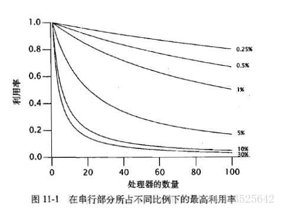
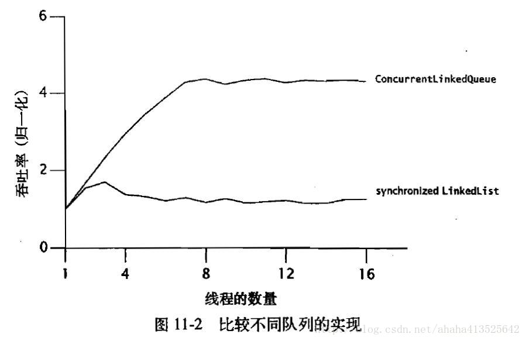
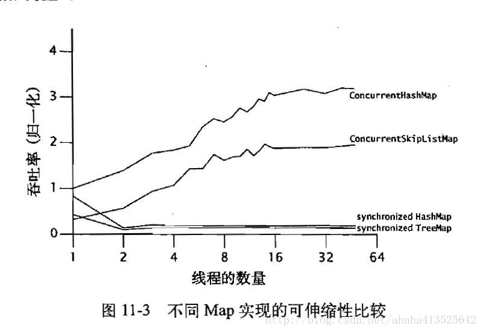

# ***活跃性、性能与测试：性能与可伸缩性***

线程的最主要目的是提高程序的运行性能。线程可以使程序更加充分地发挥系统的可用处理能力，从而提高系统的资源利用率。此外，线程还可以在使程序在运行现有任务的情况下立即开始处理新的任务，从而提高系统的响应性。

本章将介绍各种分析、监测以及提升并发程序性能的技术。然而，许多提升性能的技术同样会增加复杂性，因此也就增加了在安全性和活跃性上发生失败的风险。更糟糕的是，虽然某些技术的初衷是提升性能，但事实上却与最初的目标背道而驰，或者又带来了其他新的性能问题。虽然我们希望获得更好的性能————提升性能总会令人满意，但始终要把安全性放在第一位。首先要保证程序能正确运行，然后仅当程序的性能需求和测试结果要求程序执行得更快时，才应该设法提高它的运行速度。在设计并发的应用程序时，最重要的考虑因素通常并不是将程序的性能提升至极限。

## 对性能的思考

提升性能意味着用更少的资源做更多的事情。“资源”的含义很广。对于一个给定的操作， 通常会觖乏某种特定的资源，例如 CPU时钟周期、内存、网络带宽、I/O 带宽、数据库请求、磁盘空间以及其他资源。当操作性能由于某种特定的资源而受到限制时，我们通常将该操作称为资源密集型的操作，例如，CPU密集型、数据库密集型等。

尽管使用多个线程的目标是提升整体性能，但与单线程的方法相比，使用多个线程总会引入一些额外的性能开销。造成这些开销的操作包括:线程之间的协调(例如加锁、触发信号以及内存同步等),增加的上下文切换，线程的创建和销毁，以及线程的调度等。如果过度地使用线程，那么这些开销甚至会超过由于提高吞吐量、响应性或者计算能力所带来的性能提升。另一方面，一个并发设计很糟糕的应用程序，其性能甚至比实现相同功能的串行程序的性能还要差。

要想通过并发来获得更好的性能，需要努力做好两件事情:更有效地利用现有处理资源，以及在出现新的处理资源时使程序尽可能地利用这些新资源。

- ###### 性能与可伸缩性

应用程序的性能可以用多个指标来衡量，例如服务时间，延迟时间，吞吐率，效率，可伸缩性以及容量等。其中一些指标（服务时间，等待时间）用于衡量程序的“运行速度（多快）”，另一些指标（生产量，吞吐量）衡量程序的“处理能力（多少）”。

**可伸缩性指的是：当增加计算资源时（例如CPU，内存，存储容量或 I/O带宽），程序的吞吐量或处理能力能相应地增加。**

性能的这两个方面————“多快”和“多少”，是完全独立的，有时候甚至是相互矛盾的。要实现更高的可伸缩性或硬件利用率，通常会增加各个任务所要处理的工作量，例如把任务分解为多个“流水线”子任务时。具有讽刺意味的是，大多数提高单线程程序性能的技术，往往都会破坏可伸缩性。

单一的系统到达自身处理能力的极限时，会遇到一个严重的问题:要进一步提升它的处理能力将非常困难。因此，我们通常会接受每个工作单元执行更长的时间或消耗更多的计算资源，以换取应用程序在增加更多资源的情况下处理更高的负载。

对于服务器应用程序来说，“多少”这个方面一可 伸缩性、吞吐量和生产量，往往比“多快”这个方面更受重视。

- ###### 评估各种性能权衡因素

**避免不成熟的优化。首先使程序正确，然后再提高运行速度————如果它还运行得不够快。**

进行决策时，有时候会通过增加某种形式的成本来降低另一种形式的开销 (例如。增加内存使用量以降低服务时间)，也会通过增加开销来换取安全性。安全性并不定就是指对人身安全的威胁，例如桥梁设计的示例。很多性能优化措施通常都是以牺牲可读性或可维护性为代价————代码越“聪明”或越“晦涩”,就越难以理解和维护。有时候，优化措施会破坏面向对象的设计原则，例如需要打破封装，有时候，它们又会带来更高的错误风险，因为通常越快的算法就越复杂。(如果你无法找出其中的代价或风险，那么或许还没有对这些优化措施进行彻底的思考和分析。)

在大多数性能决策中都包含有多个变量，并且非常依赖于运行环境。在使某个方案比其他方案“更快”之前，首先问自己一些问题:
>- “更快”的含义是什么?
>- 该方法在什么条件下运行得更快?在低负载还是高负载的情况下?大数据集还是小数据集?能否通过测试结果来验证你的答案了？
>- 这些条件在运行环境的发生频率?能否通过测试结果来验证你的答案?
>- 在其他不同条件的环境中能否使用这里的代码?
>- 在实现这种性能提升时需要付出哪些隐含的代价，例如增加开发风险或维护开销?这种权衡是否合适?

在进行任何与性能相关的决策时，都应该考虑这些问题。

我们为什么要推荐这种保守的优化方法?对性能的提升可能是并发错误的最大来源。有人认为同步机制“太慢”，因而采用一些看似聪明实则危险的方法来减少同步的使用(例如双重检查锁)，这也通常作为不遵守同步规则的一个常见借口。然而，由于并发错误是最难追踪和消除的错误，因此对于任何可能会引入这类错误的措施，都需要谨慎实施。

**以测试为基准，不要猜测。**

## Amdahl 定律

在有些问题中，如果可用资源越多问题的解决速度就越快，例如，如果参与收割庄稼的工人越多，那么就能越快地完成收割工作。但有些任务本质上是串行的，例如，即使工人再多也无法加快庄稼的生长速度。 **如果使用线程主要是为了发挥多个处理器的处理能力，那么就必须对问题进行合理的并行分解，并使得程序能有效地使用这种潜在的并行能力。**

与农业耕作类似，大多数并发程序都是由一系列的并发工作和串行工作组成的。

Amdahl定律描述的是：在增加计算资源的情况下，程序在理论上能够实现最高加速比，这个值取决与程序中可并行组件与串行组件所占的比重。假定F时必须被串行执行的部分，那么根据Amdahl定律。在包含N个处理器的机器中，最高的加速比为：

*Speedup $\leq$ $\frac{1}{F+\frac{(1-F)}{N}}$*

当 N 趋近无穷大时，最大的加速比趋近与 $\frac{1}{F}$。



随着处理器数量的增加，可以很明显地看到，即使串行部分所占的百分比很小，也会极大地限制当增加计算资源时能够提升的吞吐率。

假设应用程序中N个线程正在执行程序清单 11-1 中的 doWork，这些线程都是从一个共享的工作队列中取出任务进行处理，而且这里的任务都不依赖于其他任务的执行结果或影响。

初看上去，这个程序似乎能完成并行化：各个任务之间不会互相等待，因此处理器越多，能够并发处理的任务也越多。然而，这个过程中包含了一个串行部分————从队列中获取任务。所有的工作者线程都共享一个工作队列，因此在对该线程进行并发访问时需要采用某种同步机制来维持队列的完整性。如果通过加锁来保护队列的状态，那么当一个线程从队列中取出任务时，其他需要获取下一个任务的线程就必须等待，这就是任务处理过程中的串行部分。

```java
// 11-1  对任务队列的串行访问
public class WorkerThread extends Thread {
    private final BlockingQueue<Runnable> queue;

    public WorkerThread(BlockingQueue<Runnable> queue) { this.queue = queue; }

    public void run() {
        while (true) {
            try {
                Runnable task = queue.take();
                task.run();
            } catch (InterruptedException e) {
                break; /*允许线程退出 */
            }
        }
    }
}
```

**在所有的并发程序都包含一些串行部分。如果你认为在你的程序中不存在串行部分，那么可以再仔细检查一遍。**

## 示例：在各种框架中隐藏的串行部分

下图给出了一个简单的应用程序，其中多个线程反复地从一个共享的Queue中取出元素进行处理。在访问共享队列的过程中显然存在着一定程度的串行操作，但处理步骤完全可以并行执行，因为它不会访问共享数据。


图11-2 的两个曲线对两个线程安全的Queue的吞吐量进行了比较，其中一个采用 synchroni-zedList 包装的 LinkedList，另一个是 ConcurrentLinkedQueue。尽管每次运行都表示相同的“工作量”，但我们可以看到，只需改变队列的实现方式，就能对可伸缩性产生明显的影响。

**吞吐量的差异来源于两个队列中不同比例的串行部分。**同步的 LinkedList 采用单个锁来保护整个队列的状态，并在`offer`和`remove`等方法的调用期间都将持有这个锁。ConcurrentLinkedQueue 采用了一种更复杂的非阻塞队列算法，该算法使用原子引用来更新各个链接指针。
在第一个队列中，整个的插入或删除操作都将串行执行，而在第二个队列中，只有对指针的更新操作需要串行执行。

## 线程引入的开销

单线程程序既不存在线程调度，也不存在同步开销，而且不需要使用锁来保证数据结构的一致性。在多个线程的调度和协调过程中都需要一定的性能开销：对于为了提升性能而引入的线程来说，并行带来的性能提升必须超过并发导致的开销。

- ###### 上下文切换

如果主线程是唯一的线程，那么它基本不会被调度出去。另一方面，如果可运行的线程大于 CPU 的数量，那么操作系统最终会将某个正在运行的线程调度出来，从而使其他线程能够使用CPU。这将导致一次上下文切换，在这个过程中将保存当前运行线程的执行上下文，并将新调度进来的线程的执行上下文设置为当前上下文。

切换上下文需要一定的开销，而在线程调度过程中需要访问由操作系统和 JVM共享的数据结构。应用程序，操作系统以及 JVM都使用一组相同的CPU。在 JVM 和操作系统的代码中消耗越多的 CPU时钟周期，应用程序的可用 CPU时钟周期就越少。但上下文切换的开销并不只是包含 JVM和操作系统的开销。当一个新的线程被切换进来时，它所需要的数据可能不在当前处理器的本地缓存中，因此上下文切换将导致一些缓存缺失，因而线程在首次调度运行时会更加缓慢。这就是为什么调度器会为每个可运行的线程分配一个最小执行时间，即使有很多其他线程正在等待执行：它将上下文切换的开销分摊到更多不会中断的执行时间上，从而提高整体的吞吐量（以损失响应性为代价）。

当线程由于等待某个发生竞争的锁而被阻塞时，JVM 通常会将这个线程挂起，并允许它被交换出去。如果线程频繁地发生阻塞，那么它们将无法使用完整的调度时间片。在程序中发生越多的阻塞，与CPU密集型的程序就会发生越多的上下文切换，从而增加调度开销，并因此降低吞吐量。

- ###### 内存同步

同步操作的性能开销包括多个方面，在 synchronized 和 volatile 提供的可见性保证中可能会使用一些特殊指令，即内存栅栏（Memory Barrier）。内存栅栏可以刷新缓存，使缓存无效，刷新硬件的写缓冲，以及停止执行管道。内存栅栏可能同样会对性能带来间接的影响，因为它们将抑制一些编译器优化操作。在内存栅栏中，大多数操作都是不能被重排序的。

JVM 能通过优化来去掉一些不会发生竞争的锁，从而减少不必要的同步开销。如果一个锁对象只能由当前线程访问，那么 JVM 就可以通过优化来去掉这个锁获取操作，因为另一个线程无法与当前线程在这个锁发生同步。

一些更完备的 JVM 能通过逸出分析（Escape Analysis）来找出不会发布到堆的本地对象引用（因此这个引用是线程本地的）。

在程序清单 11-3 中，对 List的唯一引用（reference）就是局部变量 stooges，并且所有封闭在栈中的变量都会自动称为线程本地变量。在`getStoogeNames`的执行过程中，至少会将 Vector 上的锁获取/释放4次，每次调用`add`或`toString`时都会执行一次。
JVM 通常会分析这些调用，从而使 stooge s及其内部状态不会逸出，因此可以去掉这 4 次锁获取操作。

```java
// 11-3 可通过锁消除优化去掉锁的获取操作
public String getStoogeNames() {
   List<String> stooges = new Vector<String>();
   stooges.add("Moe");
   stooges.add("Larry");
   stooges.add("Curly");
   return stooges.toString();
}
```

即使不进行逸出分析，编译器也可以执行锁粒度粗化（Lock Coarsening）操作，即将临近的同步代码块用同一个锁合并起来。在`getStoogeNames`中，如果 JVM 进行锁粒度粗化，那么可能会把3个`add`和一个`toString`合并为单个锁获取/释放操作，并采用启发方式来评估同步代码块中采用同步操作以及指令之间的相对开销。这不仅减少了同步的开销，同时还能使优化器处理更大的代码块，从而可能实现进一步的优化。

**不要过度担心非竞争同步带来的开销。这个基本的机制已经非常快了，并且 JVM 还能进行额外的优化以进一步降低或消除开销。因此，我们应该将优化重点放在那些发生锁竞争的地方。**

某个线程中的同步可能会影响其他线程的性能。同步会增加共享内存总线上的通信量，总线的带宽是有限的，并且所有的处理器都共享这条总线。如果有多个线程竞争同步带宽，那么所有使用了同步的线程都会受到影响。

- ###### 阻塞

非竞争的同步可以完全在 JVM 中进行处理，而竞争的同步可能需要操作系统的介入，从而增加开销。当在锁上发生竞争时，竞争失败的线程肯定会阻塞。JVM 出现阻塞行为时，可以采用自旋等待（Spin-Waiting，指通过循环不断地尝试获取锁，直到成功），或者通过操作系统挂起被阻塞的线程。

当线程无法获取某个锁或者由于在某个条件等待或在 I/O操作上阻塞时，需要被挂起，在这个过程中将包含两次额外的上下文切换，以及所有必要的操作系统操作和缓存操作：被阻塞的线程在其执行时间片还未用完之前就被交换出去，而在随后当要获取的锁或者其他资源可用时，又再次被切换回来。（由于锁竞争而导致阻塞时，线程在持有锁时将存在一定的开销：当它释放锁时，必须告诉操作系统恢复运行阻塞的线程）

## 减少锁的竞争

串行操作会降低可伸缩性，并且上下文切换也会降低性能。在锁上发生竞争时将同时导致这两种问题，因此减少锁的竞争能够提高性能和可伸缩性。

在对某个独占锁保护的资源进行访问时，将采用串行方式————每次只有一个线程能访问它。当然，我们有很好的理由来使用锁，例如避免数据被破坏，但获得这种安全性是需要付出代价的。如果在锁上持续发生竞争，那么将限制代码的可伸缩性。

**在并发程序中，对可伸缩性的最主要威胁就是独占方式的资源锁。**

有三种方式可以降低锁的竞争程度：
>- 减少锁的持有时间。
>- 降低锁的请求频率。
>- 使用带有协调机制的独占锁，这些机制运行更高的并发性。

- ###### 缩小锁的范围（“快进快出”）

降低发生竞争可能性的一种有效方式就是尽可能缩短锁的持有时间。例如，可以将一些无关的代码移出同步代码块，尤其是那些开销较大的操作，以及可能被阻塞的操作，例如 I/O操作。

如果将一个 “高度竞争” 的锁持有过长的时间，那么会限制可伸缩性。

代码清单11-4 中，其中锁被持有过长的时间。`userLocationMatches`方法在一个 Map 对象中查找用户的位置，并使用正则表达式进行匹配以判断结果值是否匹配所提供的模式。
整个`userLocationMatches`方法都是用`synchronized`来修饰，但只有`Map.get`这个方法才真正需要锁。

```java
// 程序清单 11-4 将一个锁不必要地持有过长时间
@ThreadSafe
public class AttributeStore {
    @GuardedBy("this") private final Map<String, String> attributes = new HashMap<String, String>();

    public synchronized boolean userLocationMatches(String name, String regexp) {
        String key = "users." + name + ".location";
        String location = attributes.get(key);
        if (location == null)
            return false;
        else
            return Pattern.matches(regexp, location);
    }
}
```
程序清单 11-5 重写了 AttributeStore，从而大大减少了锁的持有时间。第一个步骤是构建Map中与用户位置相关联的键值，这是一个字符串，形式为 users.name.location。这个步骤包括实例化一个 StringBuilder 对象，向其添加几个字符串，并将结果实例化为一个 String 类型对象。在获得位置后，就可以将正则表达式与位置字符串进行匹配。由于在构建键值以及处理正则表达式等过程中都不需要访问共享状态，因此在执行时不需要持有锁。通过在 BetterAttributeStore 中将这些步骤提取出来放到同步代码块之外，从而减少了锁被持有的时间。

```java
// 程序清单 11-5 减少锁的持有时间
@ThreadSafe
public class BetterAttributeStore {
    @GuardedBy("this") private final Map<String, String> attributes = new HashMap<String, String>();

    public boolean userLocationMatches(String name, String regexp) {
        String key = "users." + name + ".location";
        String location;
        synchronized (this) {
            location = attributes.get(key);
        }
        if (location == null)
            return false;
        else
            return Pattern.matches(regexp, location);
    }
}
```
通过缩小`userLocationMatches`方法中锁的作用范围，能极大地减少在持有锁时需要执行的指令数量。根据 Amdahl 定律，这样消除了限制可伸缩性的一个因素，因为串行代码的总量减少了。

尽管缩小同步代码块能提升可伸缩性，但同步代码块也不能过小————一些需要采用原子方式执行的操作（例如对某个不变性条件中的多个变量进行更新）必须包含在一个同步块中。此外，同步需要一定的开销，当把一个同步代码块分解为多个同步代码块时，反而会对性能提升产生负面影响。

- ###### 减少锁的粒度

另一中减少锁的持有时间的方式是降低线程请求锁的频率（从而减小发生竞争的可能性）。这可以通过**锁分解** 和**锁分段** 等技术来实现，在这些技术中将采用多个互相独立的锁来保护独立的状态变量，从而改变这些变量在之前由单个锁来保护的情况。这些技术能减小锁操作的粒度，并能实现更高的可伸缩性，然而，锁越多，发生死锁的风险就越高。

如果一个锁需要保护多个互相独立的状态变量，那么可以将这个分解为多个锁，并且每个锁只保护一个变量，从而提高可伸缩性，并最终降低每个锁被请求的频率。

程序清单 11-6 的 ServerStatus 给出了某个数据库服务器的部分监视接口，该数据库维护了当前已登录的用户以及正在执行的请求。当一个用户登录，注销，开始查询和结束查询时，都会调用相依的`add`和`remove`等方法来更新ServerStates对象。这两种类型的信息是完全独立的，ServerStates 甚至还可以被分为两个类，同时确保不会丢失功能。

```java
// 程序清单 11-6 对锁进行分解
@ThreadSafe
public class ServerStatusBeforeSplit {
    @GuardedBy("this") public final Set<String> users;
    @GuardedBy("this") public final Set<String> queries;

    public synchronized void addUser(String u) { users.add(u); }
    public synchronized void addQuery(String q) { queries.add(q); }
    public synchronized void removeUser(String u) { users.remove(u); }
    public synchronized void removeQuery(String q) { queries.remove(q); }
}
```

程序清单 11-7 中不是用 ServerStatus 锁来保护用户状态和查询状态，而是每个状态都通过一个锁来保护。在对锁进行分解后，每个新的细粒度锁上的访问量将比最初的访问量少（通过将用户状态和查询状态委托给一个线程安全的Set，而不是使用显式的同步，能隐含地对锁进行分解，因为每个Set都会使用一个不同的锁来保护其状态）

```java
@ThreadSafe
public class ServerStatusAfterSplit {
    @GuardedBy("users") public final Set<String> users;
    @GuardedBy("queries") public final Set<String> queries;

    public ServerStatusAfterSplit() {
        users = new HashSet<String>();
        queries = new HashSet<String>();
    }

    public void addUser(String u) {
        synchronized (users) { users.add(u);}
    }

    public void addQuery(String q) {
        synchronized (queries) { queries.add(q);}
    }
    // 去掉同样被改写为使用被分解锁的方法 
}
```

如果对竞争并不激烈的锁进行分解，那么在性能和吞吐量等方法带来的提升将非常有限，但是也会提高性能随着竞争提高而下降的拐点值。对竞争适中的锁分解时，实际上时把这些锁转变为非竞争的锁，从而有效地提高性能和可伸缩性。

- ###### 锁分段

把一个竞争激烈的锁分解为两个锁时，这两个锁可能都存在激烈的竞争。虽然采用两个线程并发执行能提高一部分可伸缩性，但是在一个拥有多个处理器的系统中，仍然无法给可伸缩性带来极大的提高。

在某些情况下，可以将锁分解技术进一步扩展为对一组独立对象上的锁进行分解，这种情况被称为锁分段。例如，在`ConcurrentHashMap`的实现中使用额一个包含 16个锁 的数组，每个锁保护所有散列桶（hash buckets）的 1/16，其中第N个散列桶由第（N mod 16）个锁来保护。
假设散列函数具有合理的分布性，并且关键字能实现均匀分布，那么这大约能把对锁的请求减少到原来的 1/16。这项技术使得`ConcurrentHashMap`能够支持多达16个并发的写入器。（要使得拥有大量处理器的系统在高访问量的情况下实现更高的并发性，还可以进一步增加锁的数量，但仅当你能证明并发写入线程的竞争足够激烈并需要突破这个限制时，才能将锁分段的数量超过默认的16个。）

锁分段的一个劣势在于：**与采用单个锁来实现独占访问相比，要获取多个锁来实现独占访问将更加困难并且开销更高。** 通常，在执行一个操作时最多只需获取一个锁，但在某些情况下需要加锁整个容器，例如当`ConcurrentHashMap`需要扩展映射范围，以及重新计算键值的散列值分布到更大桶集合中时，就需要获取分段锁集合中所有的锁。（要获取内置锁的一个集合，能采用的唯一方式是递归）

程序清单 11-8 的`StripedMap`给出了基于散列的 Map 实现，其中使用了锁分段技术。它拥有 N_LOCKS 个锁，并且每个锁保护散列桶的一个子集。大多数方法，例如`get`，都只需要获得一个锁，而有些方法则需要获得所有的锁，但并不要求同时获得，例如`clear`方法的实现（这种清除 Ma p的方式并不是原子操作，要使该操作变成一个原子操作，必须同时获得所有的锁）。

```java
// 程序清单 11-8 在基于散列的Map中使用锁分段技术
@ThreadSafe
public class StripedMap {
    // 同步策略: buckets[n] 由 locks[n%N_LOCKS]来保护
    private static final int N_LOCKS = 16;
    private final Node[] buckets;
    private final Object[] locks;

    private static class Node {...}

    public StripedMap(int numBuckets) {
        buckets = new Node[numBuckets];
        locks = new Object[N_LOCKS];
        for (int i = 0; i < N_LOCKS; i++)
            locks[i] = new Object();
    }

    private final int hash(Object key) {
        return Math.abs(key.hashCode() % buckets.length);
    }

    public Object get(Object key) {
        int hash = hash(key);
        synchronized (locks[hash % N_LOCKS]) {       
            for (Node m = buckets[hash]; m != null; m = m.next)
                if (m.key.equals(key))
                    return m.value;
        }
        return null;
    }

    public void clear() {
        for (int i = 0; i < buckets.length; i++) {
            synchronized (locks[i % N_LOCKS]) {        
                buckets[i] = null;
            }
        }
    }
}
```

- ###### 避免热点域

锁分解和锁分段技术都能提高可伸缩性，因为它们都能使不同的线程在不同的数据（或者同一个数据的不同部分）上操作，而不会互相干扰。**如果程序采用锁分段技术，那么一定要表现在锁上的竞争频率高于在锁保护的数据上发生竞争的频率。**

当每个操作都请求多个变量时，锁的粒度很难降低。这是在性能与可伸缩性之间相互制衡的另一个方面，一些常见的优化措施，例如将一些反复计算的结果缓存起来，都会引入一些“热点域（Hot Field）”，而这些热点域往往会限制可伸缩性。

当实现 HashMap 时，你需要考虑如何在 size 方法中计算 Map 中的元素数量，最简单的方法就是，在每次调用时都统计一次元素的数量。
一种常见的优化措施时，在插入和移除元素时更新一个计数器，虽然增加了一些开销，但把 size 方法的开销从 O(n 降低到 O(1)。

在单线程或采用完全同步的方法中，使用一个独立的计数器能很好地提高类似 size 和 isEmpty 这些方法的执行速度，但却导致更难以提升实现的可伸缩性，因为每个修改 map 的操作都需要更新这个共享的计数器。一个看似性能优化的措施————缓存 size 操作的结果，已经变成了一个可伸缩性问题，在这种情况下，计数器也被称为热点域，因为每个导致元素发生变化的操作都需要访问它。

为了避免这个问题，ConcurrentHashMap 中的 size 将对每个分段进行枚举并将每个分段中的元素数量相加，而不是维护一个全局计数。
为了避免枚举每个元素，ConcurrentHashMap 为每个分段都维护了一个独立计数，并通过每个分段的锁来维护这个值。

- ###### 一些替代独占锁的方法。

第三种降低竞争锁的影响的技术就是放弃使用独占锁，从而有助于使用一种友好并发的方式来管理共享状态。例如，使用并发容器，读 - 写锁，不可变对象以及原子变量。

ReadWriteLock 实现了一种在多个读取操作以及单个写入操作情况下的加锁规则：如果多个读取操作不会修改共享资源，那么这些读取操作可以同时访问该共享资源，但在执行写入操作时必须以独占方式来获取锁。对于读取操作占多数的数据结构，ReadWriteLock 能提供比独占锁更高的并发性。而对于只读的数据结构，其中包含的不变性可以完全不需要加锁操作。

原子变量提供了一种方式来降低更新 “热点域” 时的开销，例如静态计数器，序列计数器，或者对链表数据结构中头节点的引用。原子变量类提供了在整数或对象引用上的细粒度原子操作（因此可伸缩性更高），并使用了现在处理器中提供的底层并发原语（例如比较交换[compare-and-swap]）。如果在类中只包含少量的热点域，并且这些域不会与其他变量参与到不变性条件中，那么用原子变量来替换它们能提高可伸缩性。（通过减少算法中的热点域，可以提高可伸缩性————虽然原子变量能减低热点域的更新开销，但并不能完全消除。）

- ###### 监测CPU的利用率

当测试可伸缩性时，通常要确保处理器得到充分利用。如果 CPU 没有得到充分利用，通常有以下几种原因：
>- 负载不充足
>- I/O密集
>- 外部限制
>- 

- ###### 不使用对象池

在 JVM 的早期版本，对象分配和垃圾回收等操作的执行速度非常慢，但在后续的版本中，这些操作的性能得到了极大提高。事实上，现在 Java 的分配操作已经比 C语言的 Malloc 调用更快：在 HotSpot 1.4.x 和 5.0 中，“new Object”的代码只包含十条机器指令。

为了解决 “缓慢的” 对象生命周期问题，许多开发人员都选择使用对象池技术，在对象池中，对象能被循环使用，而不是由垃圾收集器回收并在需要时重新分配。在单线程程序中（Click，2005），尽管对象池技术能降低垃圾收集操作的开销，但对于高开销对象以外的其他对象来说，仍然存在性能缺失（对于轻量级和中量级的对象来说，这种损失将更为严重，抛去损失CPU的指令周期之外，最大的问题就是如何正确的设定对象池的大小）。

在并发应用程序中，对象池的表现更糟糕。当线程分配新的对象时，基本上不需要在线程之间进行协调，因为对象分配器通常会使用线程本地的内存块，所以不需要在堆数据结构上进行同步。然而，如果这些线程从对象池中请求一个对象，那么就需要通过某种同步来协调对象池数据结构的访问，从而可能使某个线程被阻塞。如果某个线程由于锁竞争而被阻塞，那么这种阻塞的开销将是内存分配操作开销的数百倍，因此即使对象池带来的竞争很小，也可能形成一个可伸缩性瓶颈。（即使是一个非竞争的同步，所导致的开销也会比分配一个对象的开销大。）虽然这看似是一种性能优化技术，但实际上却会导致可伸缩性问题。对象池有其特定的用途，但对于性能优化来说，用途是有限的。

**通常，对象分配操作的开销比同步的开销更低。**

## 示例：比较MAP的性能

在单线程环境下，ConcurrentHashMap 的性能比同步的 HashMap 的性能略好一些，但在并发环境中则好得多。

在同步 Map 的实现中，可伸缩性的最主要阻碍在于整个 Map 中只有一个锁，因此每次只有一个线程可以访问这个 Map。而 ConcurrentHashMap 对于大多数读操作并不会加锁，并且在写入操作以及其他需要锁的读的操作中使用了锁分段技术。因此，多个线程能并发访问这个 Map 而不会发生阻塞。

下图给出了几种Map实现可伸缩性上的差异：ConcurrentHashMap，ConcurrentSkipListMap以及通过synchronizedMap来包装的HashMap和TreeMap。前两种 Map 是线程安全的，而后两个 Map 则通过同步封装器来确保线程安全性。



ConcurrentHashMap，ConcurrentSkipListMap 的数据显示，它们在线程数量增加时能表现出很好的可伸缩性，并且吞吐量会随着线程数量的增加而增加。

同步容器（如synchronized HashMap）的数量并非越多越好。单线程情况下的性能与 ConcurrentHashMap 的性能基本相当，但当负载情况由非竞争性转变成竞争性时————这里是两个线程，同步容器的性能将变得糟糕。在伸缩性受到锁竞争限制的代码中，这是一种常见的行为。只要竞争程度不高，那么每个操作消耗的时间基本上就是实际执行工作的时间，并且吞吐量会因为线程数的增加而增加。当竞争变得激烈时，每个操作消耗的时间大部分都用于上下文切换和调度延迟，而再加入更多的线程也不会提高太多的吞吐量。

## 减少上下文切换的开销

当任务在运行和阻塞这两个状态之间转换时，就相当于一次上下文切换。

请求服务的时间不应该过长。服务时间将影响服务质量：服务时间越长，就意味这有程序在获得结果时需要等待更长的时间，更重要的是，服务时间越长，意味着存在越多的锁竞争。如果在大多数的锁获取操作上不存在竞争，那么并发系统能执行得更好，因为在锁获取操作发生竞争时将导致更多的上下文切换，上下文切换次数越多，吞吐量越低。

通过将I/O操作从处理请求的线程分离出来，可以缩短处理请求的平均服务时间。


## 小结

由于使用线程常常是为了充分利用多个处理器的计算能力，因此在并发程序性能的讨论中，通常更多地将侧重点放在吞吐量和可伸缩性上，而不是服务器时间，Amdahl 定律告诉我们，程序的可伸缩性取决于在所有代码中必须被串行执行的代码比例。因为 Java 程序中串行操作的主要来源是独占方式的资源锁，因此通常可以通过以下方式来提升可伸缩性：减少锁的持有时间，减低锁的粒度，以及采用非独占的锁或非阻塞锁来替代独占锁。


