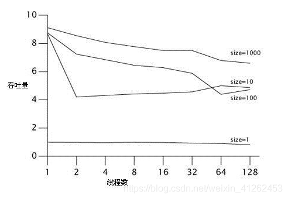
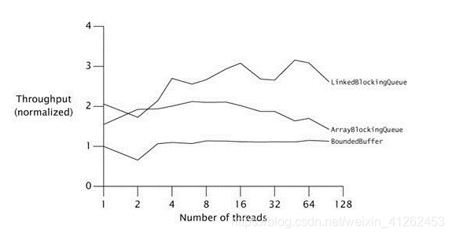
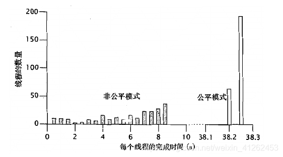

# ***活跃性、性能与测试：并发程序的测试***

在编写并发程序时，可以采用与编写串行程序时相同的设计原则与设计模式。两者的差异在于，并发程序存在一定程度的不确定性，而在串行程序中不存在这个问题。

在测试并发程序时，所面临的主要挑战在于：潜在错误的发生并不具有确定性，而是随机的。要在测试中将这些故障暴露出来，就需要比普通的串行程序测试覆盖更广的的范围并且执行更长的时间。

并发测试大致分为两类，即安全性测试与活跃性测试。我们将安全性定义为 “不发生任何错误的行为” ，而将活跃性定义为 “某个良好的行为终究会发生”。

在进行安全性测试时，通常会采用不变性条件的形式，即判断某个类的行为是否与其规范保持一致。

而测试活跃性本身就存在问题。活跃性测试包括进展测试和无进展测试两方面，这些都是很难量化的————如何验证某个方法是被阻塞了，而不只是运行缓慢？同样，如何测试某个算法不会发生死锁？要等待多久才能宣告它发生了故障？

与活跃性测试相关的是性能测试。性能可以通过多个方面来衡量，包括：
>- **吞吐量：** 指一组并发任务中已完成任务所占的比例。
>- **响应性：** 指请求从出来到完成之间的时间（也称为延迟）
>- **可伸缩性：** 指在增加更多资源的情况下（通常指CPU），吞吐量（或缓解短缺）的提升情况。

## 正确性测试

在为某个并发类设计单元测试时，首先需要执行与测试串行类时相同的设计————找出需要检查的不变性条件和后验条件。

为了进一步说明，我们将构建一组测试用例来测试一个有界缓存。程序清单 12-1 给出了 BoundedBuffer 的实现，其中使用 Semaphore 来实现缓存的有界属性和阻塞行为。

```java
//  12-1    基于信号量的有界缓存
@ThreadSafe
public class BoundedBuffer<E> {
    private final Semaphore availableItems, availableSpaces;
    private final E[] items;    //缓存
    private int putPosition = 0, takePosition = 0;

    public BoundedBuffer(int capacity) {   //capacity 容量
        availableItems = new Semaphore(0);
        availableSpaces = new Semaphore(capacity);
        items = (E[]) new Object[capacity];
    }

    public boolean isEmpty() { return availableItems.availablePermits() == 0; }

    public boolean isFull() { return availableSpaces.availablePermits() == 0; }

    public void put(E x) throws InterruptedException {
        availableSpaces.acquire();      
        doInsert(x);
        availableItems.release();    
    }

    public E take() throws InterruptedException {
        availableItems.acquire();  
        E item = doExtract();  
        availableSpaces.release();
        return item;
    }

    private synchronized void doInsert(E x) {
        int i = putPosition;
        items[i] = x;
        putPosition = (++i == items.length) ? 0 : i;  
    }

    private synchronized E doExtract() {
        int i = takePosition;
        E x = items[i];
        items[i] = null;     //取出后清空
        takePosition = (++i == items.length) ? 0 : i; 
        return x;
    }
}
```

BoundedBuffer 实现了一个固定长度的队列，其中定义了可阻塞的`put`和`take`方法，并通过两个计数信号量进行控制。信号量`availableItems`表示可以从缓存中删除的元素个数，它的初始值为零（因为缓存的初始状态为空）。信号量`availableSpace`表示可插入到缓存的元素个数，它的初始值等于缓存的大小。

`take`操作会首先请求从`availableItems`中获得一个许可（Permit）。如果缓存不为空，那么这个请求会立即成功，否则请求将阻塞直到缓存不为空。在获得一个许可后，`take`方法将删除缓存中的下一个元素，并返回一个许可到`availableSpaces`信号量。

- ###### 基本的单元测试

BoundedBuffer 的最基本单元测试类似与在串行上下文中执行的测试。首先创建一个有界缓存，然后调用它的各个方法，并验证它的不变性条件和后验条件。我们很快会想到一些不变性条件：新建立的缓存应该是空的，而不是满的。另一个略显复杂的安全测试是，将 N 个元素插入到容量为 N 的缓存中，然后测试缓存是否已经填满（不为空）。 程序清单 12-2 给出了这些属性的 JUnit 测试方法。

```java
// 12-2    BoundedBuffer的基本单元测试
public class BoundedBufferTest extends TestCase { 

    void testIsEmptyWhenConstructed() {
        BoundedBuffer<Integer> bb = new BoundedBuffer<Integer>(10);
        assertTrue(bb.isEmpty());   
        assertFalse(bb.isFull());
    }

    void testIsFullAfterPuts() throws InterruptedException {
        BoundedBuffer<Integer> bb = new BoundedBuffer<Integer>(10);
        for (int i = 0; i < 10; i++)
            bb.put(i);
        assertTrue(bb.isFull());
        assertFalse(bb.isEmpty());
    }
}
```

这些简单的测试方法都是串行的。在测试集中包含一组串行测试通常是有帮助的，因为它们有助于在开始分析数据竞争之前就找出与并发性无关的问题。

- ###### 对阻塞操作的测试

在测试并发的基本属性时，需要引入多个线程。

在`java.util.concurrent`的一致性测试中，一定要将各种故障与特定的测试明确关联起来。TestCase 中定义了一些方法可以在`testDown`期间传递和报告失败信息，并遵循一个约定：**每个测试必须等待它所创建的全部线程结束以后才能完成。**

如果某方法需要在某些特定条件下阻塞，那么当测试这种行为时，只有当线程不再继续执行时，测试才是成功的。要测试一个方法的阻塞行为，类似于测试一个抛出异常的方法：如果这个方法可以正常返回，那么就意味着测试失败。

在测试方法的阻塞行为时，将引入额外的复杂性：当方法被成功地阻塞后，还必须使方法解除阻塞。实现这个功能的一种简单方式是使用中断————在一个单独的线程中启动一个阻塞操作，等到线程阻塞后再中断它，然后宣告阻塞操作成功。这要求阻塞方法通过提前返回或抛出`InterruptedException`来响应中断。**“等待并直到线程阻塞后”，这句话看似简单，实际上，你必须估计执行这些指令可能需要多长的时间，并且等待的时间会更长。如果估计的时间不准确（可能会出现伪测试失败），那么应该增大这个值！**

程序清单 12-3 给出了一种测试阻塞操作的方法。这种方法会创建一个“获取”线程，该线程将尝试从空缓存中获取一个元素。如果`take`方法成功，则表示测试失败。执行测试的线程启动“获取”线程，等待一段时间，然后中断该线程。如果“获取”线程正确地在`take`方法中阻塞，将抛出`InterruptedException`，而捕获到这个异常的`catch`块将这个异常视为测试成功，并让线程退出。然后，主测试线程尝试与“获取”线程合并，通过调用`Thread.isAlive`来验证`join`方法是否成功返回，如果“获取”线程可以响应中断，那么`join`能很快完成。

```java
// 12-3 测试阻塞行为以及对中断的响应性
void testTakeBlocksWhenEmpty() {
    final BoundedBuffer<Integer> bb = new BoundedBuffer<Integer>(10);
    Thread taker = new Thread() {   
        public void run() {
            try {
                int unused = bb.take();
                fail();    //如果执行到这里，那么表示出现了一个异常
            } catch (InterruptedException success) { }
        }
    };
    try {
        taker.start();    
        Thread.sleep(LOCKUP_DETECT_TIMEOUT);  
        taker.interrupt();   
        taker.join(LOCKUP_DETECT_TIMEOUT);  
        assertFalse(taker.isAlive());    //测试线程是否存活   
    } catch (Exception unexpected) {
        fail();   
    }
}
```

如果`take`操作由于某种意料之外的原因停滞了，那么支持限时的`join`方法能确保测试最终完成。这个测试方法测试了`take`的多种属性————不仅能阻塞，而且在中断后还能抛出`InterruptedException`。在这种情况下，最好是对`Thread`进行子类化而不是使用线程池中的`Runnable`，即通过`join`来正确地结束测试。当主线程将一个元素放入队列后，“获取”线程应该解除阻塞状态，要测试这种行为，也可以使用相同的方法。

- ###### 安全性测试

程序清单 12-2 和程序清单 12-3 的测试用例测试了有界缓存的一些重要属性，但它们无法发现由于数据竞争而引来的错误。要想测试一个并发类在不可预测的并发访问情况下能否正确执行，需要创建多个线程来分别执行`put`和`take`操作，并在执行一段时间后判断在测试中是否会出现问题。

**在构建对并发类的安全性测试中，需要解决的关键问题在于，要找出那些容易检查的属性，这些属性在发生错误的情况下极有可能失败，同时又不会使得错误检查代码人为地限制并发性。理想情况时，在测试属性中不需要任何同步**

要测试在生产者————消费者模式中存在一种比较好的方法：通过一个对顺序敏感的校验和计算函数来计算所有入列元素以及出列元素的校验和，并进行比较，如果二者相等，那么测试就是成功的。如果只有一个生产者将元素放入缓存，同时也只有一个消费者从中取出元素，那么这种方法就能发挥最大的作用，因为它不仅能测试出是否取出了正确的元素，而且还能测试出元素被取出的顺序是否正确。

如果要将这种方法扩展到多生产者————多消费者的模式，就需要一个对元素入列/出列顺序不敏感的校验和函数，从而在测试程序运行完毕以后，可以将多个校验和以不同的顺序组合起来。如果不是这样，多个线程就需要访问同一个共享的校验和变量，因此就需要同步，这将成为一个并发的瓶颈或者破坏测试的执行时序。

要确保测试程序能正确地测试所有要点，就一定不能让编译器可以预先猜测到校验和的值。要避免这个问题，应该采用随机方式生成的数据。使用连续的整数作为测试数据并不是一个好方法，因为得到的结果总是相同的，而一个智能的编译器通常可以预先计算出这个结果。要避免这个问题，应该采用随机方式生成的数据，但如果选择了一种不合适的随机数生成器（RNG,Random Number Generator），那么会对许多其他的测试造成影响。由于大多数生成器都是线程安全的，并且会带来额外的同步开销，因此在随机数生成过程中，可能会在这些类与执行时序之间产生耦合关系。如果每个线程都拥有自己的 RNG，那么这些 RNG 就可以不是线程安全的。

与其使用一个通用的 RNG，还不如使用一些简单的伪随机函数。例如程序清单 12-4 的`xorShift`，该函数基于`hashCode`和`nanoTime`来生成随机数，所得的结果既是不可预测的，而且基本上每次运行都不相同。
```java
// 12-4  适合在测试中使用的随机数生成器
static int xorShift(int y) {
    y ^= (y << 6);
    y ^= (y >>> 21);
    y ^= (y << 7);
    return y;
}
```

程序清单 12-5 和程序清单 12-6 的 PutTakeTest 中启动了N个生产者线程来生成元素并把它们插入到队列，同时还启动了N个消费者线程从队列中取出元素。当元素进出队列时，每个线程都会更新对这些元素计算得到的校验和，每个线程都拥有一个校验和，并在测试结束后将它们合并起来，从而在测试缓存时不会引入过多的同步或竞争。

```java
// 12-5  测试BoundedBuffer的生产者————消费者程序
public class PutTakeTest extends TestCase {
    protected static final ExecutorService pool = Executors.newCachedThreadPool();
    protected final AtomicInteger putSum = new AtomicInteger(0);
    protected final AtomicInteger takeSum = new AtomicInteger(0);
    protected CyclicBarrier barrier;
    protected final BoundedBuffer<Integer> bb;
    protected final int nTrials, nPairs; 
    
    public static void main(String[] args) throws Exception {
        new PutTakeTest(10, 10, 100000).test();  //示例参数
        pool.shutdown();
    }

    public PutTakeTest(int capacity, int npairs, int ntrials) {
        this.bb = new SemaphoreBoundedBuffer<Integer>(capacity);
        this.nTrials = ntrials;
        this.nPairs = npairs;
        this.barrier = new CyclicBarrier(npairs * 2 + 1);
    }

    void test() {
        try {
            for (int i = 0; i < nPairs; i++) {
                pool.execute(new Producer());
                pool.execute(new Consumer());
            }
            barrier.await();           //等待所有线程就绪
            barrier.await();           //等待所有的线程执行完成
            assertEquals(putSum.get(), takeSum.get());  //假设这两个值是相等的，如果不相等会返回一个Assert Error
        } catch (Exception e) {
            throw new RuntimeException(e);
        }
    }

    // 在 PutTakeTest 中使用的 Producer 和 Consumer 类
    class Producer implements Runnable {
        public void run() {
            try {
                int seed = (this.hashCode() ^ (int) System.nanoTime());
                int sum = 0;
                barrier.await();
                for (int i = nTrials; i > 0; --i) {
                    bb.put(seed);
                    sum += seed;
                    seed = xorShift(seed);    
                }
                putSum.getAndAdd(sum);
                barrier.await();
            } catch (Exception e) {
                throw new RuntimeException(e);
            }
        }
    }

    class Consumer implements Runnable {
        public void run() {
            try {
                barrier.await();
                int sum = 0;
                for (int i = nTrials; i > 0; --i) {
                    sum += bb.take();
                }
                takeSum.getAndAdd(sum);
                barrier.await();
            } catch (Exception e) {
                throw new RuntimeException(e);
            }
        }
    }
}
```

根据系统平台的不同，创建线程与启动线程等操作可能需要较大开销，如果线程执行时间很短，并在循环中启动了大量的这种线程，那么最坏情况是，这些线程将会串行执行而不是并发执行。使用 CountDownLatch 能确保所有线程在开始执行任何工作之前，都首先执行到同一个位置。PutTakeTest 使用这项技术来协调工作者线程的启动和停止，从而产生更多的并发交替操作。虽然我们仍无法确保调度器不会采用串行方式来执行每个线程，但只要这些线程的执行时间足够长，就能降低调度机制对结果的不利影响。

PutTakeTest 使用了一个确定性的结束条件，从而判断测试何时完成时就不需要在线程之间执行额外的协调。`test`方法将启动相同数量的生产者线程和消费者线程，它们将分别插入（put）和取出（take）相同数量的元素，因为添加和删除的总数相同。

像 PutTakeTest 这种测试能很好地发现安全性问题。例如，在实现由信号量控制的缓存时，一个常见的错误就是在执行插入和取出的代码中忘记实现互斥行为（可以使用`synchronized`或`ReentranLock`）。如果在 BoundedBuffer 中忘记将`doInsert`和`doExtract`声明为`synchronized`，那么在运行 PutTakeTest 时会立即失败。

**这些测试应该放在多处理器的系统上运行，从而进一步测试更多形式的交替运行。然而，CPU 的数量越多并不一定会使测试更高效。要最大程度地检测出一些对执行时序敏感的数据竞争，那么测试中的线程数量应该多于 CPU 的数量，这样在任意时刻都会有一些线程在运行，而另一些被交换出去，从而可以检查线程间交替行为的可预测性。**

- ###### 资源管理的测试

测试程序除了要测试类与它的设计规范的一直程度外，另一个方面就是要判断类中是否没有做它不应该做的事情，例如资源泄漏。对于任何持有或管理其他对象的对象，都应该在不需要这些对象时销毁对它们的引用。这种存储资源泄漏不仅会妨碍垃圾回收期回收内存，而且还会导致资源耗尽以及应用程序失败。

对于 BoundedBuffer 来说，资源管理的问题尤为重要。之所以要限制缓存的大小，其原因就是要防止由于资源耗尽而导致应用程序发生故障。

通过一些测量应用程序中内存使用的堆检查工具，可以容易地测试出内存的不合理占用，许多商业和开源的堆分析工具中都支持这种功能。程序清单 12-7 中的 testLeak 方法中包含了一写堆分析工具用于抓取堆的快照，这将强制执行一次垃圾回收（System.gc 只是建议 JVM 在合适时刻执行垃圾回收）,然后记录堆大小和内存用量的信息。

```java
// 12-7 测试资源泄漏
class Big {  double[] data = new double[100000]; }

//testLeak方法将多个大型对象插入到一个有界缓存中，然后再将它们移除。
void testLeak() throws InterruptedException {
    BoundedBuffer<Big> bb = new BoundedBuffer<Big>(CAPACITY);
    int heapSize1 = //生成堆的快照
    for (int i = 0; i < CAPACITY; i++)
        bb.put(new Big());
    for (int i = 0; i < CAPACITY; i++)
        bb.take();
    int heapSize2 = //生成堆的快照
        assertTrue(Math.abs(heapSize1 - heapSize2) < THRESHOLD);
}
```
`testLeak`方法将多个大型对象插入到一个有界缓存中，然后再将它们移除。第2个堆快照中的内存用量应该与第1个堆快照中的内存用量基本相同。然而，doExtract 如果忘记将返回元素的引用置为空（items[i]=null）,那么在两次快照中报告的内存用量将明显不同。

- ###### 使用回调

在构造测试案例时，对客户提供的代码进行回调是非常有帮助的。回调函数的执行通常是在对象生命周期的一些已知位置上，并且在这些位置上非常适合判断不变性条件是否被破坏。例如，在 ThreadPoolExecutor 中将调用任务的 Runnable 和 ThreadFactory。
  
在测试线程池时，需要测试执行策略的多个方面：在需要更多的线程时创建新线程，在不需要时不创建，以及当需要回收空闲线程时需要执行回收操作灯。要构造一个全面的测试方案是很困难的，但其中许多方面得测试都可以单独进行。

通过使用自定义的线程工厂，可以对线程的创建过程进行控制。程序清单 12-8 的 TestingThreadFactory 中将记录已创建线程的数量。这样，在测试过程中，测试方案可以验证已创建线程的数量。我们还可以对 TestingThreadFactory 进行扩展，使其返回一个自定义的 Thread，并且该对象可以记录自己在何时结束，从而在测试方案中验证线程与被回收时是否于执行策略一致。

```java
// 12-8 测试ThreadPoolExecutor的线程工厂类
class TestingThreadFactory implements ThreadFactory {
    public final AtomicInteger numCreated = new AtomicInteger(); 
    private final ThreadFactory factory = Executors.defaultThreadFactory();

    public Thread newThread(Runnable r) {
        numCreated.incrementAndGet();
        return factory.newThread(r);
    }
}
```

如果线程池的基本大小小于最大大小，那么线程池会根据执行需求相应增长。当把一些运行时间较长的任务提交给线程池时，线程池中的任务数量在长时间内都不会变化，这就可以进行一些判断，例如测试线程池是否能够按照预期的方式扩展。

```java
// 12-9  验证线程池扩展能力的测试方法
public void testPoolExpansion() throws InterruptedException {
    int MAX_SIZE = 10;
    ExecutorService exec = Executors.newFixedThreadPool(MAX_SIZE);

    for (int i = 0; i < 10 * MAX_SIZE; i++) {
        exec.execute(new Runnable() {
            public void run() {
                try {
                    Thread.sleep(Long.MAX_VALUE);  //运行时间较长的任务提交给线程池
                } catch (InterruptedException e) {
                    Thread.currentThread().interrupt();
                }
            }
        });
    }
    for (int i = 0; i < 20 && threadFactory.numCreated.get() < MAX_SIZE; i++)
        Thread.sleep(100);
    assertEquals(threadFactory.numCreated.get(), MAX_SIZE);
    exec.shutdown();
}
```

- ###### 产生更多的交替操作

由于并发代码中的大多数错误都是一些低概率事件，因此在测试并发错误时需要反复地执行许多次，但有些方法可以提高发现这些错误的概率。

有一种有用的方法可以提高交替操作的数量，以便能更有效地收缩程序的状态空间：在访问共享状态的操作中，使用`Thread.yield`将产生更多的上下文切换（这项技术的有效性与具体的平台相关，因为 JVM 可以将 `Thread.yield` 作为一个空操作（no-op）） 。如果使用一个睡眠时间较短的 sleep，那么虽然更慢些，但却更可靠。

例如程序清单 12-10 中的方法在两个账户之间执行转账操作，在两次更新操作之间，像“所有账户的总和应等于零”这样的一些不变性条件可能会被破坏。当代码在访问状态时没有使用足够的同步，将存在一些对执行时序敏感的错误，通过在某个操作的执行过程中调用 yield 方法，可以将这些错误暴露出来。

```java
// 使用 Thread.yield 来产生更多的交替操作
public synchronized void transferCredits(Account from, Account to, int amount){
    from.setBalance(from.getBalance() - amount);
    if(random.nextInt(1000) > THRESHOLD)
        Thread.yield();
    to.setBalance(to.getBalance() + amount);
}
```

## 性能测试

性能测试通常是功能测试的延伸，事实上，在性能测试中应该包含一些基本的功能测试，从而确保不会对错误的代码进行性能测试。

虽然在性能测试和功能测试之间肯定会存在重叠之处，但他们的目标是不同的。性能测试将衡量典型测试用例中的端到端性能。

性能测试的第二个目标时根据经验来调整不同的限值，例如线程数量、缓存容量等。这些限值可能以来于具体平台的特性，因此需要动态地进行配置。

- ###### 使用 cyclicBarrier 测试并发执行时间与吞吐率

程序清单 12-11 ：记录 PutTakeTest 整个运行过程的时间，并得到每次操作的运行时间。

```java
this. timer = new BarrierTimer();
this.barrier = new CyclicBarrier(nPairs * 2 + 1, timer);

static class BarrierTimer implements Runnable {
    private boolean started; //是否是第一次执行关卡活动
    private long startTime, endTime;

    public synchronized void run() {
        long t = System.nanoTime();
        if (!started) {//第一次关卡活动走该分支
                started = true;
                startTime = t;
        } else //第二次关卡活动走该分支
                endTime = t;
    }

    public synchronized void clear() {
        started = false;
    }
    
    public synchronized long getTime() {//任务所耗时间
        return endTime - startTime;
    }
}
```
我们可以将栅栏的初始化过程修改为使用这种栅栏动作，即使用能接受栅栏动作的 CyclicBarrier 构造函数。

修改后的 test 方法中使用了基于栅栏的定时器，如程序清单 12-12 所示。


```java
// 12-12 采用基于栅栏的定时器进行测试
public void test() {
    try {
        timer.clear();
        for (int i = 0; i < nPairs; i++) {
                pool.execute(new PutTakeTest.Producer());
                pool.execute(new PutTakeTest.Consumer());
        }
        barrier.await();
        barrier.await();
        //每个元素完成处理所需要的时间
        long nsPerItem = timer.getTime() / (nPairs * (long) nTrials);
        System.out.print("Throughput: " + nsPerItem + " ns/item");
        assertEquals(putSum.get(), takeSum.get());
    } catch (Exception e) {
        throw new RuntimeException(e);
    }
}
```

主驱动程序：

```java
// 12-13 使用 TimedPutTakeTest 的程序
public static void main(String[] args) throws Exception {
    int tpt = 100000; // 每对线程中的测试次数
    //测试缓存容量分别为1、10、100、1000的情况
    for (int cap = 1; cap <= 1000; cap *= 10) {
        System.out.println("Capacity: " + cap);
        //测试工作线程数1、2、4、8、16、32、64、128的情况
        for (int pairs = 1; pairs <= 128; pairs *= 2) {
            TimedPutTakeTest t = new TimedPutTakeTest(cap, pairs, tpt);
            System.out.print("Pairs: " + pairs + "\t");
            t.test();//第一次
            System.out.print("\t");
            Thread.sleep(1000);
            t.test();//第二次
            System.out.println();
            Thread.sleep(1000);
        }
    }
        PutTakeTest.pool.shutdown();
}
```


当增加更多线程时，性能却略有下降。其中的原因很难从数据中看出来，但可以在运行测试时使用 CPU 的性能工具（例如 perfbar）：虽然有许多的线程，但却没有足够多的计算量，并且大部分时间都消耗在线程的阻塞和解除阻塞等操作上。线程有足够多的 CPU 空闲时间周期来做相同的事情，因此不会过多的降低性能。

- ###### 多种算法的比较

BoundedBuffer 是一种相当可靠的实现，它的运行机制也非常合理，但是它还不足以和 ArrayBlockingQueue 与 LinkedBlockingQueue 相提并论，这也解释了为什么这种缓存算法没有被选入类库中。并发类库中的算法已经被选择并调整到最佳性能状态了。BoundedBuffer 性能不高的主要原因：`put`和`take`操作分别都有多个操作可能遇到竞争————获取一个信号量，获取一个锁、释放信号量。

在测试的过程中发现 LinkedBlockingQueue 的伸缩性好于 ArrayBlockingQueue，乍一看这个测试结果有些奇怪：链表队列在每次插入元素时，都必须分配一个链表节点，这似乎比基于数组的队列执行了更多的工作。而然，这主要是因为链表队列的`put`和`take`操作允许有比基于数组的队列更好的并发访问，好的链表队列算法允许队列的头和尾彼此独立地更新。由于内存分配操作通常是线程本地的，因此如果算法能通过执行一些内存分配操作来降低竞争程度，那么这种算法通常具有更高的可伸缩性。这种情况再次证明了，基于传统的性能调优直觉与提升可伸缩性的实际需求是背道而驰的。



- ###### 响应性衡量

响应性通过任务完成的时间来衡量。除非线程由于密集的同步需求而被持续的阻塞，否则非公平的信号量通常能实现更好的吞吐量，而公平的信号量则实现更低的变动性,这些结果之间的差异通常都非常大，需要根据客户要求进行选择。


下图为 TimePutTakeTest 中使用1000个缓存，256个并发任务中每个任务完成时间，其中每个任务都是用非公平信号量(隐蔽栅栏，Shaded Bars)和公平的信号量(开放栅栏，open bars)来迭代1000个元素，其中非公平信号量完成时间从104毫秒到8714毫米，相差80倍。若采用同步控制实现更高的公平性，能缩小任务完成时间变动范围(变动性)，但是会极大的降低吞吐率。


## 避免性能测试的陷阱

在实际情况中，你必须提防多种编码陷阱，它们会使得性能测试变得毫无意义。

- ###### 垃圾回收

垃圾回收的执行时序是无法预测的，可能发生在任何时刻，如果在测试程序时，恰巧触发的垃圾回收操作，那么在最终测试的时间上会带来很大但虚假的影响。
  
两种策略方式垃圾回收操作对测试结果产生偏差：
>- 保证垃圾回收在执行测试程序期间不被执行，可通过调用JVM时指定-verbose:gc查看是否有垃圾回收信息。
>- 保证垃圾回收在执行测试程序期间执行多次，可以充分反映出运行期间的内存分配和垃圾回收等开销。
  
通常而言，第二种更好，更能反映实际环境下的性能。

- ###### 动态编译

相比静态的编译语言（C或者C++），Java 动态编译语言的性能基准测试变得困难的多。在 JVM 中将字节码的解释和动态编译结合起来。当某个类第一次被加载，JVM 会通过解释字节码方式执行它，然而某个时刻，如果某个方法运行测试足够多，那么动态编译器会将其编译为机器代码，某个方法的执行方法从解释执行变成直接执行。这种编译的执行实际无法预测，如果编译器可以在测试期间运行，那么将在两个方面给测试结果带来偏差：
>- 编译过程消耗CPU资源
>- 测量的代码中既包含解释执行代码，又包含编译执行代码，测试结果是混合代码的性能指标没有太大的意义。

解决办法：
>- 可以让测试程序运行足够长时间，防止动态编译对测试结果产生的偏差。
>- 在 HotSpot 运行程序时设置-xx：+PrintCompilation，在动态编译时输出一条信息，可以通过这条消息验证动态编译是测试运行前，而不是运行过程中执行

- ###### 对代码路径的不真实采样

动态编译可能会让不同地方调用的同一方法编译出的代码不同。测试程序不仅要大致判断某个典型应用程序的使用模式，还要尽量覆盖在该应用程序中将执行的代码路径集合。否则，动态编译器可能会针对一个单线程测试程序进行一些专门优化，但只要在真实的应用程序中略微包含一些并行，都会使这些优化不复存在。

- ###### 不真实的竞争程度

并发的应用程序可以交替执行两种不同类型的工作：访问共享数据以及执行线程本地的计算。根据两种不同类型工作的相关程度，在应用程序中将出现不同程度的竞争，并表现出不同的性能与可伸缩性。

要获得有实际意义的结果，在并发性能测试中应该尽量模拟典型应用程序中的线程本地计算量以及并发协调开销。如果在真实应用程序的各个任务中执行的工作，与测试程序中执行的工作截然不同，那么测试出的性能瓶颈位置将是不准确的。

- ###### 无用代码的消除

无论是何种语言编写优秀的基准测试程序，一个需要面对的挑战是：优化编译能找出并消除那些对输出结果不会产生任何影响的无用代码。由于基准测试代码通常不会执行任何技术，因此很容易在编译器的优化过程中被消除，因此测试的内容变得更少。在动态编译语言中，要检测编译器是否消除了测试基准是很困难的。

**要编写有效的性能测试程序，就需要告诉优化器不要将基准测试当作无用代码而优化掉，这就要求在程序中对每个计算结果都要通过某种方式来使用，这种方式不需要同步或大量计算。**

例如在 PutTakeTest 中，我们计算了在队列中添加删除了所有元素的校验和，如果在程序中没有用到这个校验和，那么计算校验和操作很有可能被优化掉，但是幸好`assertEquals(putSum.get(), takeSum.get());`在程序中使用了校验和来验证算法的正确性。上诉中要尽量采用某种方法使用计算结果避免被优化掉，有个简单的方法可不会引入过高的开销，将计算结果与`System.nanoTime`比较，若相等输出一个无用的消息即可。

```java
if(fo.hashCode() == System.nanoTime()) 
    System.out.print(" ");
```

另外要注意的是：**测试的目标不是更多地发现错误，而是提高代码能够按照预期方式工作的可信度。找出所有的错误是不切实际的，所以质量保证（Quality Assurance，QA）的目标应该是在给定的测试资源下实现最高的可信度。**


要测试并发程序的正确性可能非常困难，因为并发程序的许多故障模式都是一些低概率事件，它们对于执行时序、负载情况以及其他难以重现的条件都非常敏感。而且，在测试程序中还会引入额外的同步或执行时序限制，这些因素将掩盖被测试代码中的一些并发问题。要测试并发程序的性能同样非常困难，与使用静态编译语言（例如C）编写的程序相比，用 Java 编写的程序在测试起来更加困难，因为动态编译、垃圾回收以及自动化等操作都会影响与时间相关的测试结果。

要想尽可能地发现潜在的错误以及避免它们在正式产品中暴露出来，我们需要将传统的测试技术（要谨慎地避免在这里讨论的各种陷阱）与代码审查和自动化分析工具结合起来，每项技术都可以找出其他技术忽略的问题。


