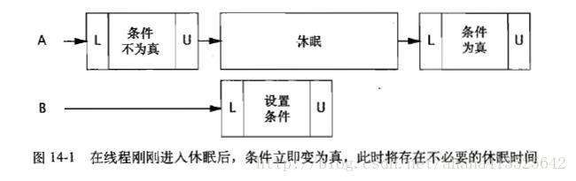

# ***高级主题：构建自定义的同步工具***

 [***高级主题：构建自定义的同步工具***](#高级主题构建自定义的同步工具-)
  - [状态依赖性的管理](#状态依赖性的管理)
          - [示例：将前提条件的失败传递给调用者](#示例将前提条件的失败传递给调用者)
          - [通过轮询与休眠来实现简单的阻塞](#通过轮询与休眠来实现简单的阻塞)
          - [条件队列](#条件队列)
  - [使用条件队列](#使用条件队列)
          - [条件谓词](#条件谓词)
          - [过早唤醒](#过早唤醒)
          - [丢失的信号](#丢失的信号)
          - [通知](#通知)
          - [示例：阀门类](#示例阀门类)
          - [子类的安全问题](#子类的安全问题)
          - [封装条件队列](#封装条件队列)
          - [入口协议与出口协议](#入口协议与出口协议)
  - [显式的 Condition 对象](#显式的-condition-对象)
  - [Synchronizer 剖析](#synchronizer-剖析)
  - [AbstractQueuedSynchronizer](#abstractqueuedsynchronizer)
          - [一个简单的闭锁](#一个简单的闭锁)
  - [java.util.concurrent 同步器类中的 AQS](#javautilconcurrent-同步器类中的-aqs)
          - [ReentrantLock](#reentrantlock)
          - [Semaphore 与 CountDownLatch](#semaphore-与-countdownlatch)
          - [FutureTask](#futuretask)
          - [ReentrantReadWriteLock](#reentrantreadwritelock)

----

类库中包含了许多存在状态依赖性的类，如 FutureTask，Semaphore 和 BlockingQueue 等。在这些类的一些操作中有基于状态的前提条件，例如，不能从一个空的队列中删除元素，或者获取一个未结束的任务的计算结果，在这些操作可以执行之前，必须等到队列进入“非空”状态，或者任务进入“已完成”状态。

创建状态依赖性类的最简单方法通常是在类库中现有状态依赖类的基础上进行构造。如果类库没有提供你需要的功能，那么还可以使用 Java 语言和类库提供的底层机制来构造自己的同步机制，包括内置的条件队列、显式的 Condition 对象以及 AbstractQueuedSynchronizer 框架。

## 状态依赖性的管理

对于并发对象上依赖状态的方法，虽然有时候在前提条件不满足的情况下不会失败，但通常有一种更好的选择，即等待前提条件变为真。依赖状态的操作可以一直阻塞直到可以继续执行，这比使它们先失败再实现起来更为方便且更不易出错。内置的条件队列可以使线程一直阻塞，直到对象进入某个进程可以继续执行的状态，并且当被阻塞的线程可以执行时再唤醒它们。

可阻塞的状态依赖操作的形式如 程序清单14-1 所示，这种加锁模式有些不同，因为锁是在操作的执行过程中被释放与重新获取的。构成前提条件的状态变量必须由对象的锁来保护，从而使它们在测试前提条件的同时保持不变。如果前提条件尚未满足，就必须释放锁，以便其他线程可以修改对象的状态，否则，前期条件就永远无法变成真。在再次测试前提条件之前，必须重新获得锁。

```java
// 程序清单 14-1 可阻塞的状态依赖操作的结构
acquire lock on object state
while (precodition does not hold) {
    release lock
    wait until precodition might hold
    optionally fail if interrupted or timeout expires
    reacquire lock
}
perform action
    release lock
```

在 生产者 — 消费者 的设计中经常会使用像 ArrayBlockingQueue 这样的有界缓存。在有界缓存提供的`put`和`take`操作中都包含一个前提条件：不能从空缓存中获取元素，也不能将元素放入已满的缓存中。当前提条件未满足时，依赖状态的操作可以抛出一个异常或者返回一个错误状态，也可以保持阻塞直到对象进入正确的状态。

前提条件失败可以用不同的办法来处理，程序清单14-2 中的 BaseBoundedBuffer，这个类中实现了一个基于数组的循环缓存，其中各个缓存状态变量（buf，head,tail和count）均由缓存的内置锁来保护。它还提供了同步的`doPut`和`doTake`方法，并在子类中通过这些方法来实现`put`和`take`操作，底层的状态将对子类隐藏。
```java
// 14-2 有界缓存实现的基类
@ThreadSafe
public class BaseBoundedBuffer<V> {
    @GuardedBy("this") private final V[] buf;
    @GuardedBy("this") private int tail;
    @GuardedBy("this") private int head;
    @GuardedBy("this") private int count;

    protected BaseBoundedBuffer(int capacity) {
        this.buf = (V[]) new Object[capacity];
    }

    protected synchronized final void doPut(V v) {
        buf[tail] = v;
        if (++tail == buf.length)
            tail = 0;
        ++count;
    }

    protected synchronized final V doTake() {
        V v = buf[head];
        buf[head] = null;
        if (++head == buf.length)
            head = 0;
        --count;
        return v;
    }

    public synchronized final boolean isFull() {
        return count == buf.length;
    }

    public synchronized final boolean isEmpty() {
        return count == 0;
    }
}
```

###### 示例：将前提条件的失败传递给调用者

程序清单 14-3 的 GrumpyBoundedBuffer 是一个简单的有界缓存实现。`put`和`take`都进行了同步以确保实现对缓存状态的独占访问，因为这两个方法在访问缓存时都采用“先检查再运行”的逻辑策略。

```java
// 14-3 当不满足前提条件时，有界缓存不会执行相应的操作
public class GrumpyBoundedBuffer<V> extends BaseBoundedBuffer<V> {
    public GrumpyBoundedBuffer(int size){ super(size); }

    public synchronized void put(V v)throws BufferFullException{
        if(isFull())
            throw new BufferFullException();
        doPut(v);
    }
    public synchronized V take()throws BufferEmptyException{
        if(isEmpty())
            throw new BufferEmptyException();
        return doTake();
    }
}
```

尽管这种方法实现起来很简单，但使用起来却并非如此。异常应该用于发生异常条件的情况中。

这种方法的一种变化形式是：当缓存处于某个错误的状态时返回一个错误值。这是一种改进，因为并没有放弃异常机制，但这种方法并没有解决根本问题：调用者必须自行处理前提条件失败的情况（Queue，poll在队列为空时返回null，而remove方法则抛出一个异常，Queue并不适合生产者-消费者模式，BlockingQueue只有当队列处于正确状态时才会进行处理，否则将阻塞，因此才是更好的选择）。

程序清单 14-4 给出了对 take 的调用————并不是很漂亮，尤其是当程序中有许多地方都调用 put 和 take 方法时。

```java
while(true){
    try{
        String item=buffer.take();
        //对item执行一些操作
        break;
    }catch (BufferEmptyException e) {
        Thread.sleep(SLEEP_GRANULARITY);
    }
}
```

而在 程序清单14-4 中，调用者可以不进入休眠状态，而直接重新调用`take`，这种方法被称为忙等待或自旋等待。忙等待可能导致 CPU 时钟周期浪费，休眠可能导致低响应性。除了忙等待与休眠，还可以使用`Thread.yield`,这相当于给调度器一个提示：现在需要让出一定的时间使另一个线程运行。假如正在等待另一个线程执行工作，那么如果选择让出处理器而不是消耗完整个 CPU 调度时间片，那么可以使整体的执行过程变快。

###### 通过轮询与休眠来实现简单的阻塞

程序清单14-5 中的 SleepyBoundedBuffer 尝试通过`put`和`take`方法来实现一种简单的“轮询与休眠”重试机制，从而使调用者无需在每次调用时都实现重试逻辑。如果缓存为空，那么`take`将休眠并直到另一个线程往缓存中放入一些数据；如果缓存为满，那么`put`将休眠并直到另一个线程从缓存中移除一些数据。这种方法将前提条件的管理操作封装起来，并简化了对缓存的使用————这朝着正确的改进方法迈出了一步。

```java
//     14-5   使用简单阻塞实现的有界缓存（并不好）
public class SleepyBoundedBuffer<V> extends BaseBoundedBuffer<V> {
    public SleepyBoundedBuffer(int size) { super(size); }

    public void put(V v) throws InterruptedException {
        while (true) {
            synchronized (this) {
                if (!isFull()) {
                    doPut(v);
                    return;
                }
            }//如果测试失败，那么当前执行的线程将首先释放锁并休眠一段时间，从而使其他线程能够访问缓存
            Thread.sleep(SLEEP_GRANULARITY);
        }
    }

    public V take() throws InterruptedException {
        while (true) {
            synchronized (this) {
                if (!isEmpty())
                    return doTake();
            }//如果测试失败，那么当前执行的线程将首先释放锁并休眠一段时间，从而使其他线程能够访问缓存
            Thread.sleep(SLEEP_GRANULARITY);
        }
    }
}
```

SleepyBoundedBuffer 的实现远比之前的实现复杂，缓存代码必须在持有缓存锁的时候才能测试相应的状态条件，因为表示状态条件的变量是由缓存锁保护的。如果测试失败，那么当前执行的线程将首先释放锁并休眠一段时间，从而使其他线程能够访问缓存。当线程醒来时，它将重新请求锁并再次尝试执行操作，因而线程将反复地在休眠以及测试状态条件等过程之间进行切换，直到可以执行操作为止。

但是需要在响应性与 CPU 使用率之间进行权衡：休眠的间隔越小，响应性就越高，但消耗的CPU资源也就越大。



###### 条件队列

条件队列名字来源于：它使得一组线程（称之为等待线程集合）能够通过某种方式来等待特定的条件变成真。传统队列的元素是一个个数据，而条件队列中的元素时一个个正在等待相关条件的线程。

每个对象可以作为一个条件队列，并且 Object 中的`wait`，`notify`和`notifyAll`方法构成了内部条件队列的 API。对象的内置锁与其内部条件队列是相互关联的，要调用对象 X 中条件队列中任一方法，都必须持有对象 X 的锁。这是因为 “等待由状态构成的条件” 与 “维护状态一致性” 这两种机制被紧密地绑定到一起：只有能对状态进行检查时，才能在某个条件上等待，并且只有能修改状态时，才能从条件等待中释放另一个线程。

`Object.wait`会自动释放锁，并请求操作系统挂起当前线程，从而使其他线程能获得这个锁并修改对象的状态。当被挂起的线程醒来时，它将在返回之前重新获取锁。可以这样来理解：调用`wait`意味着 “我要去休息了，但发生特定的事情时唤醒我”，而调用通知方法就意味着 “特定的事情发生了”。

程序清单14-6 使用了`wait`和`notifyAll`来实现一个有界缓存。这比使用休眠更简单，更高效，响应性更高。 **如果某个功能无法通过“轮询与休眠”来实现，那么使用条件队列也无法实现，但条件队列使得在表达和管理状态依赖性时更简单高效。**

```java
//           使用条件队列实现的有界缓存
public class BoundedBuffer<V> extends BaseBoundedBuffer<V> {
    //条件谓词：not-full(!isFull())
    //条件谓词:not-empty(!isEmpty())

    public BoundedBuffer(int size) { super(size); }

    //阻塞直到:not-full
    public synchronized void put(V v) throws InterruptedException {
        while (isFull())
            wait();
        doPut(v);
        notifyAll();
    }

    //阻塞直到:not-empty
    public synchronized V take() throws InterruptedException {
        while (isEmpty())
            wait();
        V v = doTake();
        notifyAll();
        return v;
    }
}
```

## 使用条件队列

条件队列使构建高效以及高可响应性的状态依赖类变得更容易，但同时也容易被不正确地使用。

###### 条件谓词

**要想正确地使用条件队列，关键是要找出在哪个条件谓词上等待。**

条件谓词是指使某个操作成为状态依赖操作的前提条件。在有界缓存中，只有当缓存不为空时，take 方法才能执行，否则必须等待。对 take 方法来说，它的条件谓词就是“缓存不为空”。同样，put 的条件谓词就是“缓存不满”。

在条件等待中存在一种重要的三元关系，包括加锁，wait 方法和一个条件谓词。在条件谓词中包含多个状态变量，而状态变量由一个锁来保护，因此在测试条件之前必须先持有这个锁。锁对象和条件队列对象（即调用 wait 和 notify 等方法所在的对象）必须是同一个对象。

在 BoundedBuffer 中，缓存的状态是由缓存锁保护的，并且缓存对象被用作条件队列。

如果条件谓词不为真，take 将在缓存的内置条件队列上调用 wait 方法。 wait 方法将释放锁，阻塞当前线程，并等待直到超时，然后线程被中断或通过一个通知被唤醒。在唤醒进程后，wait 在返回前还要重新获取锁，当线程从 wait 方法中被唤醒时，它在重新请求锁时不具有任何特殊的优先级，而要与其他尝试进入同步代码块的线程一起正常地在锁上进行竞争。

**每一次 wait 调用都会隐式地与特定的条件谓词关联起来。当调用某个特定条件谓词的 wait 时，调用者必须以及持有与条件队列相关的锁，并且这个锁必须保护着构成条件谓词的状态变量**

###### 过早唤醒

虽然在锁、条件谓词和条件队列之间的三元关系并不复杂，但 wait 方法的返回并不一定意味着线程正在等待的条件变成真了。

内置条件队列可以与多个条件谓词一起使用。当一个线程由于调用 notifyAll 而醒来时，并不意味者正在等待的条件谓词已变成真了。另外，wait 方法还可以 “假装” 返回，而不是由于某个线程调用了 notify。

当执行控制重新进入调用 wait 的代码时，它已经重新获取了与条件队列相关的锁。但是现在条件谓词可能并不为真！因为在发出通知的线程调用 notifyAll 时，条件谓词可能已经变成真，但在重新获得锁时再次变成假。在线程被唤醒到 wait 重新获取锁的这段时间内，可能有其他线程已经获取了这个锁，并修改了对象的状态。或者，条件谓词从调用 wait 起根本就没有变真，你并不知道另一个线程为什么调用 notify 或 notifyAll, 也许因为与同一条件队列相关的另一个谓词变成了真。“一个条件队列与多个条件谓词相关” 时一种常见的情况————在 BoundedBuffer 中使用的条件队列与 “非满” 和 “非空” 两个条件谓词相关。（线程可能同时在非空、非满这两个条件谓词上等待。当生产者/消费者的数量超过缓存的容量时，就会出现这种情况。）

基于所有这些原因，每当线程从 wait 中唤醒时，必须再次测试条件谓词，如果条件谓词不为真，就继续等待（或者失败）。由于线程在条件谓词不为真的情况下也可反复醒来，因此必须在一个循环中调用 wait，并在每次迭代中测试条件谓词。

```java
//  14-7  状态依赖方法的标准形式
void stateDependentMethod() throws InterruptedException {
   // 必须通过一个锁来保护条件谓词
   synchronized(lock) {
        while (!conditionPredicate())
            lock.wait();
        // 现在对象处于合适的状态
    }
}
```

当使用条件等待时（例如 Object.wait 和 Condition.wait）:
>- 通常有一个条件谓词 ———— 包括一些对象状态的测试，线程在执行前必须通过这些测试。
>- 在调用 wait 之前测试条件谓词，并且从 wait 中返回时再次进行测试。
>- 在一个循环中调用 wait
>- 确保使用与条件队列相关的锁来保护构成条件谓词的各个状态变量
>- 当调用 wait，notify，notifyAll 等方法时，一定要持有与条件队列相关的锁。
>- 在检查条件谓词之后以及开始执行相应的操作之前，不要释放锁


###### 丢失的信号

活跃性故障包括死锁和活锁，还包括丢失的信号。丢失的信号是指：线程必须等待一个已经成真的条件，但在开始等待之前没有检查条件谓词。（好比你等烤面包机的过程中去拿报纸，而途中铃声响了，你并不知道，还会继续等待）例如，没有在调用 wait 之前检查条件谓词就会导致信号的丢失。

###### 通知

在有界缓存中，如果缓存为空，那么调用 take 时将阻塞。当缓存变非空时，为了使 take 解除阻塞，必须确保在每条使缓存变为非空的代码路径中都发出一个通知。在 BoundedBuffer 中，只有一条代码路径即在 put 方法之后。因此，put 在成功地将一个元素添加到缓存后，将调用 notifyAll。同样，take 在移除一个元素后也调用 notifyAll，向任何正在等待“不满”条件的线程发出通知。

**每在等待一个条件时，一定要确保在条件谓词变成真时通过某种方式发出通知。**

在条件队列 API 中有两种发出通知的方法：notify 和 notifyAll。这两种方法都必须获得与条件队列对象相关联的锁。
>- 调用 notify 时，JVM 会从这个条件队列上等待的多个线程中选择一个来唤醒。
>- 调用 notifyAll 时则唤醒所有在这个条件队列上等待的线程。
>- 发出通知的线程应尽快地释放锁，从而确保正在等待的线程尽快地解除阻塞。

由于多个线程可以基于不同的条件谓词在同一个条件队列上等待，如果使用 notify，将是危险的，因为单一的通知可能导致类似信号丢失的问题：线程正在等待一个已经（或者本应该）发生过的信号。

只有同时满足以下两个条件时，才能使用单一的 notify 而不是 notifyAll：
>- **所有等待线程的类型都相同**:只有一个条件谓词与条件队列相关，并且每个线程在从 wait 返回后将执行相同的操作。
>- **单进单出**:在条件变量上的每次通知，最多只能唤醒一个线程来执行。

BoundedBuffer 满足 “单进单出”，但不满足第一点，因为它的条件队列有两个不同的条件谓词：“非空” 和 “非满”。而第五章中的 TestHarness 使用的 “开始阀门” 闭锁（单个事件释放一组线程）并不满足 “单进单出” 的需求，因为这个 “开始阀门” 将使得多个线程开始执行。

由于大多数类并不满足这些需求，因此普遍认可的做法是优先使用 notifyAll 而不是 notify。虽然 notifyAll 可能比 notify 更低效，但却更容易确保类的行为是正确的。

在 BoundedBuffer 的 put 和 take 方法中采用的通知机制时保守的：每当将一个对象放入缓存或者从缓存中移走一个对象时，就执行一次通知。
我们可以进行优化：首先，仅当缓存从空变为非空，或者从满转为非满时，才需要释放一个线程（等到状态转换了才唤醒线程，其他新进来线程正常执行）。并且，仅当 put 或 take 影响到这些状态转换时，才发出通知，这被称为 “条件通知（Conditional Notification）”。

```java
// 14-8 在BoundedBuffer中使用条件通知
public synchronized void put(V v) throws InterruptedException {
    while (isFull())
        wait();
    boolean wasEmpty = isEmpty();
    doPut(v);
    if (wasEmpty)
        notifyAll();
}
```

单次通知和条件通知都属于优化措施。通常，在使用这些优化措施的时候，应该遵循 “首选使程序正确地执行，然后才使其运行得更快” 这个原则。

###### 示例：阀门类

第5章使用的 “开始阀门闭锁” 在初始化指定的参数为 1，从而创建一个二元闭锁：它只有两种状态：即初始状态和结束状态。闭锁能阻止线程通过开始阀门，并直到阀门被打开，此时所有的线程都可以通过该阀门。闭锁机制在某些情况下存在一个缺陷：按照这种方式构造的阀门在打开后无法重新关闭。

通过使用条件等待，创建一个可重新关闭的 ThreadGate 类。它可以打开和关闭阀门，并提供一个 await 方法，该方法能一直阻塞直到阀门被打开。在 open 方法中使用了 notifyAll，因为这个类的语义不满足 “单进单出”。

```java
// 14-9 适应wait和notifyAll来实现可重新关闭的阀门
@ThreadSafe
public class ThreadGate {
    //条件谓词：opened-since(n)(isopen||generation>n)
    @GuardedBy("this") private boolean isOpen;
    @GuardedBy("this") private int generation;

    public synchronized void close() {
        isOpen = false;
    }

    public synchronized void open() {
        ++generation;
        isOpen = true;
        notifyAll();
    }

    //  阻塞直到：opened-since{generation on entry}
    public synchronized void await() throws InterruptedException {
        int arrivalGeneration = generation;
        //当有线程调用了open，isOpen为true，generation增加，此时才不阻塞
        while (!isOpen && arrivalGeneration == generation)
            wait();
    }
}
```

在 await 中使用的条件比测试 isOpen 复杂得多，这种条件谓词是必须的，因为如果当阀门打开时有N个线程正在等待它，那么这些线程都应该被允许执行。然而，如果阀门在打开后又非常快速地关闭了，并且 await 方法只检查 isOpen，那么所有线程都可能无法释放：当所有线程收到通知时，将重新请求锁并退出 wait，而此时的阀门可能已经再次关闭了。因此，在 ThreadGate 中使用了一个更复杂的条件谓词：每次阀门关闭后，递增一个 “Generation” 计数器，如果阀门现在是打开的，或者阀门自从该线程达到后一直是打开的，那么线程就可以通过 await。

由于 ThreadGate 只支持等待打开阀门，因此它直到 open 中执行通知。要想支持 “等待打开” 又支持 “等待关闭”，必须在 open 和 close 中都进行通知。这就说明了在维护状态依赖的类时时非常困难的 ———— 当增加一个新的状态依赖操作时，可能需要对多条修改对象的代码路径进行改动，才能正确地执行通知。

###### 子类的安全问题

对于状态依赖的类，要么将其等待和通知等协议完全向子类公开，要么完全阻止子类参与到等待和通知等过程中。另一选择就是完全禁止子类化，例如将类型声明为 final，或者将条件队列，锁和状态变量等隐藏起来，使子类看不见它们。

###### 封装条件队列

通常，我们应该把条件队列封装起来，因而除了使用条件队列的类，就不能在其他地方访问它。否则，调用者会采用一种违背设计的方式来使用条件队列。然而，将条件队列对象封装起来，与线程安全类的最常见设计模式并不一致，在这种模式中建议使用对象的内置锁来保护对象自身的状态。在 BoundedBuffer 中给出了这种常见的模式，即缓存对象自身既是锁，又是条件队列。我们可以容易地将 BoundedBuffer 重新设计为使用私有的锁对象和条件队列，唯一不同之处在于：新的 BoundedBuffer 不再支持任何形式的客户端加锁。

###### 入口协议与出口协议

对于每个依赖状态的操作，以及每个操作其他操作依赖状态的操作，都应该定义一个入口协议和出口协议。入口协议就是该操作的条件谓词，出口协议则包括，检查被该操作修改的所有状态变量，并确定它们是否使某个其他的条件谓词成真，如果是，则通知相关的条件队列。

在 AbstractQueuedSynchronizer 中使用出口协议。这个类并不是由同步器执行自己的通知，而是要求同步器方法返回一个值来表示该类的操作是否已经解除了一个或多个等待线程的阻塞。这种明确的 API 调用需求使得更难以 “忘记” 在某些状态转换发生时进行通知。

## 显式的 Condition 对象 

正如 Lock 是一种广义的内置锁，Condition 也是一种广义的内置条件队列。

```java
// Condition 接口
public interface Condition {
    void await() throws InterruptedException;
    void awaitUninterruptibly();
    long awaitNanos(long var1) throws InterruptedException;
    boolean await(long var1, TimeUnit var3) throws InterruptedException;
    boolean awaitUntil(Date var1) throws InterruptedException;
    void signal();
    void signalAll();
}
```

内置条件队列有一些缺陷。每个内置锁只能有一个与之相关联的条件队列,这意味着多个线程可能在同一个条件队列上等待不同的条件谓词,并且在最常见的加锁模式下公开条件队列对象。这些因素都无法满足在使用 notifyAll 时所有等待线程为同一类型的需求。

如果你想编写一个含有多个条件谓词的并发对象,或者你想获得比条件队列的可见性之外更多的控制权,那么显式的 Lock 和 Condition 的实现类提供了一个比内置锁和条件队列更加灵活的选择。

一个 Condition 和一个 Lock 关联在一起，就像一个条件队列和一个内置锁相关联一样，要创建一个 Condition,可以在相关联的 Lock 上调用`Lock.newCondition`方法。正如 Lock 比内置加锁提供了更为丰富的功能，Condition 同样比内置条件队列提供了更丰富的功能：在每个锁上可存在多个等待、条件等待可以是可中断的或不可中断的、基于时限的等待，以及公平的或非公平的队列操作。

与内置条件队列不同的是，对于每个 Lock,可以有任意数量的 Condition 对象。Condition 对象继承了相关的 Lock 对象的公平性，对于公平的锁，线程会依照 FIFO 顺序从`Condition.await`中释放。

**特别注意：在 Condition 对象中，与 wait、notify 和 notifyAll 方法对应的分别是 await、signal 和 signalAll。但是，Condition 对 Object 进行了扩展，因而它也包含 wait 和 notify 方法。一定要确保使用正确的版本 ———— await 和 signal。**

程序清单 14-11 给出了有界缓存的另一种实现，即使用两个 Condition，分别为 notFull 和 notEmpty，用于表示 “非满” 与 “非空” 两个条件谓词。

```java
public class ConditionBoundedBuffer<T> {
    protected final Lock lock = new ReentrantLock();
    // 条件谓词：notFull（count < items.length）
    private final Condition notFull = lock.newCondition();
    // 条件谓词：notEmpty（count > 0）
    private final Condition notEmpty = lock.newCondition();
 
    @GuardBy("lock") private final T[] items = (T[]) new Object[BUFFER_SIZE];
    @GuardBy("lock") private int tail,head,count;
 
    // 阻塞并直到：notFull
    public void put(T x) throws InterruptedException {
        lock.lock();
        try {
            while(count == items.length){ notFull.await(); }
            items[tail] = x;
            if(++tail == items.length){ tail = 0; }
            ++count;
            notEmpty.signal();
        }finally {
            lock.unlock();
        }
    }
    // 阻塞并直到：notEmpty
    public T take() throws InterruptedException {
        lock.lock();
        try {
            while(count == 0){ notEmpty.await(); }
            T x = items[head];
            items[head] = null;
            if( ++head == items.length){ head = 0; }
            -- count;
            notFull.signal();
            return  x;
        }finally {
            lock.unlock();
        }
    }
}
```

Condition 使用更有效的 signal,而不是 signalAll,这就会减少相当数量的上下文切换与锁请求的次数。

就像内置的锁和条件队列一样,当使用显示的 Lock 和 Condition 时,也必须要满足锁、条件谓词和条件变量之间的三元关系:涉及条件谓词的变量必须由Lock保护,检查条件谓词时以及调用 await 和 signal 时,必须持有 Lock 对象。

在 ReentrantLcok 和 Synchronized 之间进行选择是一样的:**如果你需要使用一些高级特性,比如公平队列或者让每个锁对应多个等待集,这时使用 Condition 要好于使用内置条件队列.(如果你需要使用 ReentrantLock 的高级特性,并已在使用它,那么你已经做出来选择)。**

## Synchronizer 剖析

ReentrantLock 和 Semaphore 这两个接口之间存在许多共同点,都扮演了 “阀门” 的角色,每次只允许一定数量的线程通过，并当线程到达阀门后,可以允许通过(lock 或 acquire 成功返回),也可以等待(lock 或 acquire 阻塞),还可以被取消(tryLock 或 tryAcquire 返回 false,表示在指定的时间内锁是不可用的或者无法获得许可)。而且,这两个接口都支持可中断的、不可中断的以及限时的获取操作,并且也都支持等待线程执行公平、非公平的队列操作。

列出了这种共性后，你或许会认为 Semaphore 是基于 ReentrantLock 实现的，或者认为 ReentrantLock 实际上是带有一个许可的 Semaphore.这些实现方式都是可行的，一个很常见的练习就是，证明可以通过锁来实现计数信号量(如 程序清单14-12 中的 SemaphoreOnLock 所示)，以及可以通过计数信号量来实现锁。

```java
// 并非 java.util.concurrent.Semaphore 的真实实现方式
public class SemaphoreOnLock {
    private Lock lock = new ReentrantLock();
    // 条件谓词：permitsAvailable （permits > 0）
    private final Condition permitsAvailable = lock.newCondition();
    @GuardedBy("lock") private int permits;

    public SemaphoreOnLock(int permit) {
        lock.lock();
        try {
            this.permits = permit;
        } finally {
            lock.unlock();
        }
    }

    public void acquire() throws InterruptedException {
        lock.lock();
        try {
            while (permits <= 0) permitsAvailable.await();
            --permits;
        } finally {
            lock.unlock();
        }
    }

    public void release() {
        lock.lock();
        try {
            ++permit;
            permitsAvailable.signal();
        } finally {
            lock.unlock();
        }
    }
}
```


事实上，它们在实现时都使用了一个共同的基类，即 AbstractQueuedSynchronizer(AQS),这个类也是其他许多同步类的基类。AQS 是一个用于构建锁和同步器的框架，许多同步器都可以通过 AQS 很容易并且高效地构造出来。不仅 ReentrantLock 和 Semaphore 是基于 AQS 构建的，还包括 CountDownLatch、ReentrantReadWriteLock、 SynchronousQueue 和 FutureTask。

AQS 解决了在实现同步器时涉及的大量细节问题，例如等待线程采用 FIFO 队列操作顺序。在不同的同步器中还可以定义一些灵活的标准来判断某个线程是应该通过还是需要等待。

基于 AQS 来构建同步器能带来许多好处。它不仅能极大地减少实现工作，而且也不必处理在多个位置上发生的竞争问题(这是在没有使用 AQS 来构建同步器时的情况)。在 SemaphoreOnLock 中，获取许可的操作可能在两个时刻阻塞————当锁保护信号量状态时，以及当许可不可用时。在基于 AQS 构建的同步器中，只可能在一个时刻发生阻塞，从而降低上下文切换的开销，并提高吞吐量。在设计 AQS 时充分考虑了可伸缩性，因此`java.util.concurrent`中所有基于 AQS 构建的同步器都能获得这个优势。

## AbstractQueuedSynchronizer

大多数开发者都不会直接使用 AQS，标准同步器类的集合能够满足绝大多数情况的需求。但如果能了解标准同步器类的实现方式，那么对于理解它们的的工作原理是非常有帮助的。

在基于 AQS 构建的同步器类中，最基本操作包括各种形式的获取操作(acquire)和释放操作(release)。“获取操作” 是一种依赖状态的操作,并且通常能阻塞:以 Synchronizer 和 semaphore 举例,获取就是获取锁或者许可,并且调用者可能会一直等待直到同步器类处于可被获取的状态。“释放操作” 并不是一个可阻塞的操作，当执行 “释放” 操作时，所有在请求时被阻塞的线程都会开始执行。

如果一个类想成为状态依赖的类，那么它必须拥有一些状态。AQS 负责管理同步器类中的状态，它管理了一个整数状态信息，可以通过`getState`,`setState`和`compareAndSetState`等 protected 类型方法来进行操作。这个整数可以用于表示任意状态。
>- ReentrantLock 用它来表示所有者线程已经重复获取该锁的次数。
>- Semaphore 用它来表现剩余的许可数量。
>- FutureTask用它来表现任务的状态(尚未开始、运行、完成和取消)。

同步器类中还可以自行管理一些额外的状态变量，例如 ReentrantLock 保存了当前锁的所有者的追踪信息,这样它就能区分出是重进入的还是竞争的。

根据同步器的不同，AQS 中的获取操作可以是独占的操作（例如 ReentrantLock），也可以是非独占的,（例如 Semaphore 和 CountDownLatch）。

一个获取分为两部分：
>- 首先，同步器判断当前状态是否允许获得操作，如果是,则允许线程执行,否则获取操作阻塞或失败。这种操作是由同步器语义决定的。例如，对于锁来说，如果它没有被某个线程持有，那么就能被成功地获取，而对于闭锁来说，如果它处于结束状态，那么也能被成功地获取。
>- 其次，就是更新同步器的状态，获取同步器的某个线程可能会对其他线程能否也获取该同步器造成影响。例如，当获取一个锁后，锁的状态将从 “未被持有” 变成 “已被持有”，而从 Semaphore 中获取一个许可后，将把剩余许可的数量减 1.然而，当一个线程获取闭锁时，并不会影响其他线程能否获取它，因此获取闭锁的操作不会改变闭锁的状态。

支持独占获取的同步器应该实现一些保护方法，包括 `tryAcquire`、`tryRelease`和`isHeldExclusively`等。而对于支持共享获取的同步器，则应该实现`tryAcquireShared`和`tryReleaseShared`等方法。

AQS 中的 acquire、AcquireShared、release 和 releaseShared 等方法都将调用这些方法在子类中带有前缀 try 的版本来判断某个操作是否执行。在同步器的子类中，可以根据其获取和释放操作的语义，使用 getState、setState 以及 compareAndSetState 来检查和更新操作，并通过返回的状态值来告知基类 “获取” 或 “释放” 同步器的操作是否成功。

例如，如果 `tryAcquireShared` 返回一个负值，那么表示获取操作失败，返回零值则表示同步器通过独占方式被获取，返回正值则表示同步器通过非独占方式被获取。对于 `tryRelease` 和 `tryReleaseShared` 方法来说，如果释放操作使得所有在获取同步器时被阻塞的线程恢复执行，那么这两个方法应该返回 true。

为了使支持条件队列的锁（例如 ReentrantLock）实现起来更简单，AQS 还提供了一些机制来构造与同步器相关联的条件变量。

###### 一个简单的闭锁

```java
// 使用 AbstractQueuedSynchronizer 实现的二元闭锁
@ThreadSafe
public class OneShotLatch {
    private final Sync sync = new Sync();
    
    public void signal(){ sync.releaseShared(0);}
 
 
    public void await() throws InterruptedException {
        //此方法会请求tryAcquireShared()
        sync.acquireSharedInterruptibly(0);
    }
 
    private class Sync extends AbstractQueuedSynchronizer{

        protected int tryAcquireShared(int ignored){
            // 如果闭锁打开则成功(state == 1),否则失败
            return (getState() == 1) ? 1 : -1;
        }

        protected boolean tryReleaseShared(int ignored){
            //闭锁现在已打开
            setState(1);
            return true;
        }
    }
}
```

在 OneShotLatch 中，AQS 状态用来表示闭锁状态————关闭(0)或者打开(1)。OneShotLatch 也就而已通过扩展 AQS 来实现，而不是将一些功能委托给 AQS，但这种做法并不合理，原因有很多。这样做将破坏 OneShotLatch 接口（只有两个方法）的简洁性，并且虽然 AQS 的公共方法不允许调用者破坏闭锁的状态，但调用者仍可以很容易地误用它们。 java.util.concurrent 中的所有同步器类都没有直接扩展 AQS ，而是都将它们的相应功能委托给私有的 AQS 子类来实现。

## java.util.concurrent 同步器类中的 AQS

###### ReentrantLock

ReentrantLock 只支持独占方式的获取操作，因此它实现了`tryAcquire`、`tryRelease`和`isHeldExclusively`。

ReentrantLock 将同步状态用于保存锁获取的次数,并且还维护一个 owner 变量来保存当前所有者线程的标识符。只有当前线程刚刚获取到锁,或者正要释放锁的时候,才会修改这个变量（由于受保护的状态操作方法具有 volatile 类型的内存读写语义，同时 ReentrantLock 只是在调用 getState 之后才会读取 owner 域，并且只有在调用了 setState 之前才会写入 owner，因此 ReentrantLock 可以拥有同步状态的内存语义，因此避免了进一步的同步）。

```java
// 基于非公平的 ReentrantLock 实现 tryAcquire

protected boolean tryAcquire(int ignored){
    final Thread current = Thread.currentThread();
    int c = getState();
    if(c == 0){
        if(compareAndSetState(0,1)){
            owner = current;
            return true;
        }
    }else if(current == owner){
        setState(c + 1);
        return true;
    }
    return false ;
}
```
ReentrantLock 还利用了 AQS 对多个条件变量和多个等待线程集的内置支持。Lock.newCondition 将返回一个新的 ConditionObject 实例，这是 AQS 的一个内部类。

###### Semaphore 与 CountDownLatch

Semaphore 使用 AQS 类型的同步状态持有当前可用许可的数量,tryAcquireShared 方法首先计算剩余许可的数量，如果没有足够的许可,会返回一个值表示获取操作失败。如果还有充足的许可剩余,tryAcquireShared 会使用 compareAndSetState 以原子方式来降低许可的计数。如果这个操作成功会，那么将返回一个值来表示获取操作成功。在返回值中还包括了表示其他共享获取操作能否成功的信息,如果可以的话,其他等待的线程同样会解除阻塞。

```java
// Semaphore 中的 tryAcquireShared 与 tryReleaseShared
protected int tryAcquireShared(int acquires){
    while(true){
        int available = getState();
        int remaining = available - acquires;
        if(remaining < 0 || compareAndSetState(available, remaining)){
            return remaining;
        }
    }
}
 
protected boolean tryReleaseShared(int releases){
    while(true){
        int p = getState();
        if(compareAndSetState(p, p+releases)){
            return true;
        }
    }
}
```

CountDownLatch 使用 AQS 的方式与 Semaphore 很相似:在同步状态中保存的是当前的计数值。countDown 方法调用 release,从而导致计数器递减,并且当计数器为零时,解除所有等待线程的阻塞,await 调用 acquire,如果计数器已经到达零,acquire 将立即返回,否则将阻塞。

###### FutureTask

初看上去，FutureTask 甚至不像一个同步器，但 Future.get 的语意非常类似于闭锁的语义 ———— 如果发生了某些事件(FutureTask 表现的任务执行完成或被取消),那么线程就可以恢复执行,否则线程会留在队列中直到该事件发生。

FutureTask 使用 AQS 类型的同步状态来保存任务的状态，例如，正在运行、已完成还是已取消。FutureTask 还维护了一些额外的状态变量,来持有计算的结果或者抛出的异常。此外，它还维护了一个引用,指向正在运行计算任务的线程(如果它当前正处于运行状态),如果任务被取消，该线程就会中断。

###### ReentrantReadWriteLock 

ReadWriteLock 接口表示存在两个锁：一个读取锁和一个写入锁。但在基于 AQS 实现的 ReentrantReadWriteLock 中,单个 AQS 子类将同时管理读取加锁和写入加锁。Reentrant-ReadWriteLock 使用一个 16位 的状态表示写入锁的计数,使用另一个 16位 的状态来表示读取锁的计数。在读取锁上的操作将使用共享的获取方法与释放方法，在写入锁的操作将使用独占的获取方法与释放方法.

AQS 在内部维护一个等待线程的队列,其中记录了某个线程请求的是独占访问还是共享访问。在 ReentrantReadWriteLock 中,当锁可用时,如果位于队列头部的线程执行写入操作，那么线程会得到这个锁，如果位于队列头部的线程执行读取访问，那么队列中在首个写入线程之前的所有线程都将获得这个锁。（这种机制并不允许选择读取线程优先或写入线程优先等策略，在某些读写锁中也采用了这种方式。因此，要么 AQS 的等待队列不能是一个 FIFO 队列，要么使用两个队列。然而在实际中很少需要这么严格的排序策列。如果非公平版本的 ReentrantReadWriteLock 无法提供足够的活跃性，那么公平版本的 ReentrantReadWriteLock 通常会提供令人满意的排序保证，并且能保证读取线程和写入线程不会发生饥饿的问题。）
