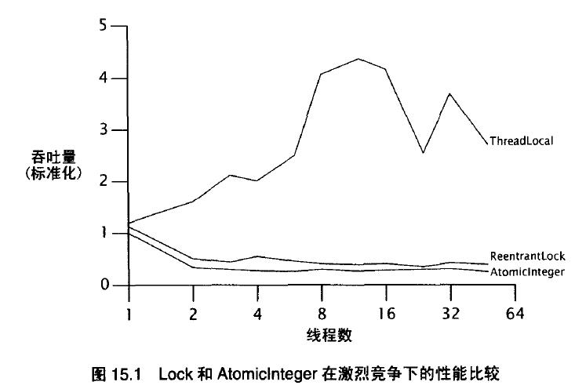
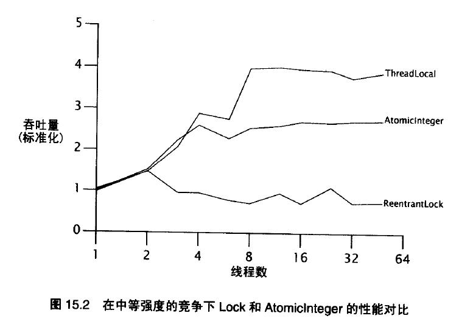
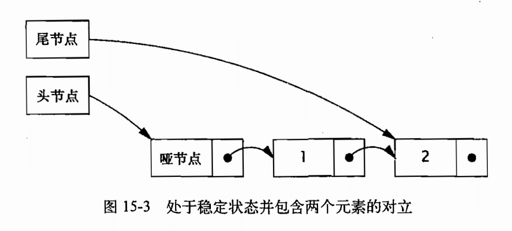
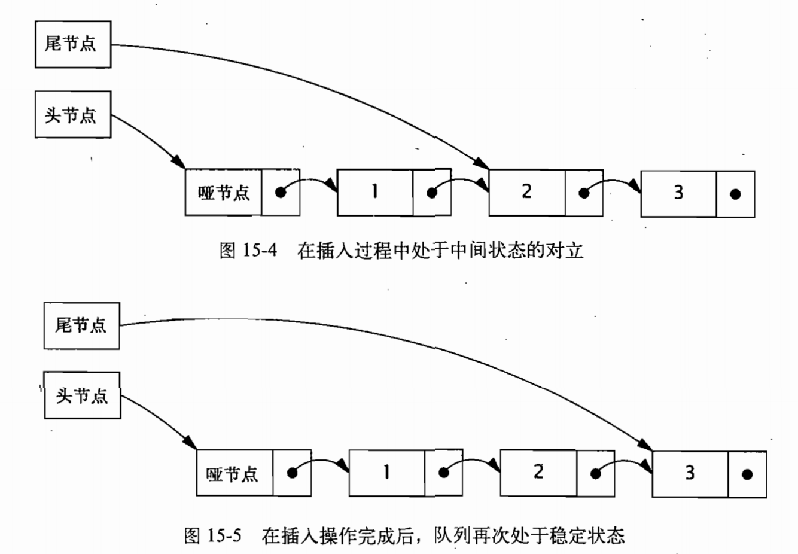

# ***高级主题：原子变量与非阻塞同步机制***

 [***高级主题：原子变量与非阻塞同步机制***](#高级主题原子变量与非阻塞同步机制)
  - [锁的劣势](#锁的劣势)
  - [硬件对并发的支持](#硬件对并发的支持)
          - [比较并交换](#比较并交换)
          - [非阻塞的计数器](#非阻塞的计数器)
          - [JVM 对 CAS 的支持](#jvm-对-cas-的支持)
  - [原子变量类](#原子变量类)
          - [原子变量是一种 “更好的 volatile”](#原子变量是一种-更好的-volatile)
          - [性能比较：锁与原子变量](#性能比较锁与原子变量)
  - [非阻塞算法](#非阻塞算法)
          - [非阻塞的栈](#非阻塞的栈)
          - [非阻塞的链表](#非阻塞的链表)
          - [原子的域更新器](#原子的域更新器)
----

`java.util.concurrent`包中的许多类,比如 Semaphore 和 ConcurrentLinkedQueue,都提供了比使用 Synchronized 更好的性能和可伸缩性.这是因为它们的内部实现使用了原子变量和非阻塞的同步机制。

近年来很多关于并发算法的研究都聚焦在非阻塞算法,这种算法用底层原子机器指令（例如比较并交换）代替锁来确保数据在并发访问下的一致性。非阻塞算法广泛应用于操作系统和 JVM 中的线程/进程调度、垃圾回收以及锁和其他的并发数据结构。

与基于锁的方案相比,非阻塞算法的设计和实现都要复杂得多,但是他们在可伸缩性和活跃度上占有很大的优势。由于非阻塞算法可以让多个线程在竞争相同资源时不会发生阻塞,所以它能在粒度更细的层面上进行协调,并且极大地减少调度开销。

Java5 后，可以使用原子变量类(例如 AtomicInteger 和 AtomicReference)来构建高效的非阻塞算法，原子变量类比锁的粒度更细量级更轻，将发生竞争的范围缩小到单个变量上。即使原子变量没有用于非阻塞算法的开发，他们也可以用做一种 “更好的 volitile 类型变量” 。


##  锁的劣势

锁的缺点：
>- **等待执行：** 如果某一个线程长时间持有锁，将会导致其他的线程的等待。
>- **锁竞争导致的性能降低“** 因为在挂起和恢复线程的过程中存在很大的开销，那么当锁上存在着激烈的竞争时，调度开销与工作开销的比值会非常高。
>- **优先级反转(priority inversion)：** 如果持有锁的线程优先级较低，而被阻塞的线程优先级较高，即便高优先级的线程可以抢先执行，但仍然需要等待锁被释放，从而导致它的优先级会降至低优先级线程的级别。
>- **死锁：** 如果持有锁的线程被永久地阻塞，所有等待这个锁的线程就无法执行下去。

与锁相比，volatile 变量是一种更轻量级的同步机制，因为在使用这些变量时不会发生上下文切换或线程调度等操作。然而，volatile 变量同样存在一些局限：**虽然它们提供了相似的可见性保证，但不能用于构建原子的符合操作**。


## 硬件对并发的支持

独占锁是一项悲观技术，它假设最坏的情况：只有确保其他线程不会造成干扰的情况下才能执行下去。

现在，几乎所有现代的处理器都具有一些形式的 原子读-改-写 指令,例如比较并交换(Compare-and-Swap)和关联加载/条件存储(Load-Linked/Store-Conditional)。操作系统和 JVM 使用这些指令来实现锁和并发的数据结构。

###### 比较并交换

大多数处理器架构（包括 IA32 和 Sparc）中采用的方法是实现一个比较并交换(CAS)指令(在其他处理器中，例如 PowerPC,采用一对指令来实现相同的功能:关联加载/条件存储)。

CAS 有3个操作数 ———— 内存位置V、进行比较的值A 和 拟写入的新值 B。当且仅当 V 的值等于 A 时,CAS 才会通过原子方式用 新值B 来更新 V 的值，否则不会执行任何操作。无论位置 V 的值是否等于 A，都将返回 V 原来的值。

CAS 是一项乐观的技术，他希望能成功地执行更新操作，并且如果有另一个线程在最近一次检查后更新了该变量，那么 CAS 能检测到这个错误。

```java
// 模拟 CAS 操作
@ThreadSafe
public class SimulatedCAS {

    @GuardedBy("this") private int value;

    public synchronized int getValue(){ return value; }

    public synchronized int compareAndSwap(int expectedValue,int newValue){
        int oldValue = value;
        if(oldValue == expectedValue) value = newValue;
        return oldValue;
    }

    public synchronized boolean compareAndSet(int expectedValue,int newValue){
        return (expectedValue == compareAndSwap(expectedValue,newValue));
    }
}
```

当多个线程尝试使用 CAS 同时更新同一个变量时，只有其中一个线程能更新变量的值，而其他线程都将失败。然而，失败的线程并不会被挂起，而是被告知在这次竞争中失败，并可以再次尝试。由于一个线程在竞争 CAS 时失败不会阻塞，因此它可以决定是否重新尝试，或者执行一些恢复操作，也或者不执行任何操作。这种灵活性就大大减少了与锁相关的活跃性风险。

###### 非阻塞的计数器

```java
public class CasCounter {

    private SimulatedCAS value = new SimulatedCAS();

    public int getValue() { return value.get(); }

    public int increment() {
        int v;
        do {
            v = value.get();
        } while (v != value.compareAndSwap(v, v + 1));
        return v + 1;
    }
}
```
CasCounter 不会阻塞，但如果其他线程同时更新计数器，那么会多次执行重试操作。

初看起来，基于 CAS 的计数器似乎比基于锁的计数器在性能上更差一些，因为它需要执行更多的操作和更复杂的控制流，并且还依赖看似复杂的 CAS 操作。但实际上，当竞争程度不高时，基于 CAS 的计数器在性能上远远超过了基于锁的计数器，而在没有竞争时甚至更高。如果要快速获取无竞争的锁，那么至少需要一次 CAS 操作再加上与其他锁相关的操作，因此基于锁的计数器即使在最好的情况下也会比基于 CAS 的计数器在一般情况下能执行更多的操作。由于 CAS 在大多数情况下都能成功执行(假设竞争程度不高)，因此硬件能够正确地预测 while 循环中的分支，从而把复杂控制逻辑的开销降至最低。

虽然 Java 语言的锁定语法比较简洁，但 JVM 和操作在管理锁时需要完成的工作却并不简单。在实现锁定时需要遍历 JVM 中一条非常复杂的代码路径，并可能导致操作系统级的锁定、 线程挂起以及上下文切换等操作。在最好的情况下，在锁定时至少需要一次 CAS,因此虽然在使用锁时没有用到 CAS,但实际上也无法节约任何执行开销。另方面， 在程序内部执行 CAS 时不需要执行 JVM 代码、系统调用或线程调度操作。在应用级上看起来越长的代码路径，如果加上JVM和操作系统中的代码调用，那么事实上却变得更短。**CAS 的主要缺点是，它将使调用者处理竞争问题(通过重试、回退、放弃)，而在锁中能自动处理竞争问题(线程在获得锁之前将一直阻塞)**。

CAS 的性能会随着处理器数量的不同而变化很大。一个很管用的经验法则是：在大多数处理器上，在无竞争的锁获取和释放 “快速代码路径” 上的开销，大概是 CAS 开销的两倍。

###### JVM 对 CAS 的支持

在 Java5 之前，如果不编写明确的代码，那么就无法执行 CAS。如果不支持 CAS 指令，那么 JVM 将使用 自旋锁。


## 原子变量类

原子变量比锁的粒度更细，量级更轻，并且对于在多处理器系统上实现高性能的并发代码来说是非常关键的。原子变量将发生竞争的范围缩小到单个变量上，这是你获得的粒度最细的情况（假设算法能够基于这种细粒度来实现）。更新原子变量的快速（非竞争）路径不会比获取锁的快速路径慢，并且通常会更快，而它的慢速路径肯定比锁的慢速路径快，因为它不需要挂起或重新调度线程。在使用基于原子变量而非锁的算法中，线程在执行时更不易出现延迟，并且如果遇到竞争，也更容易恢复过来。

原子变量类相当于一种泛化的 volatile 变量，能够支持原子的和有条件的 读 - 改 - 写 操作。

共有 12 个原子变量类，可分为 4 组:标量类(Scalar)、更新器类、数组类以及复合变量类。最常用的原子变量就是标量类: AtomicInteger、AtomicLong、 AtomicBoolean 以及 AtomicReference。所有这些类都支持 CAS,此外，AtornicInteger 和 AtomicLong 还支持算术运算。(要想模拟其他基本类型的原子变量，可以将 short 或 byte 等类型与 int 类型进行转换，以及使用 floatToIntBits 或 doubleToLongBits 来转换浮点数。)

原子数组类(只支持 Integer、Long 和 Reference 版本)中的元素可以实现原子更新。原子数组类为数组的元素提供了 volatile 类型的访问语义，这是普通数组所不具备的特性 ———— volatile 类型的数组仅在数组引用上具有 volatile 语义，而在其元素上则没有。

尽管原子的标量类扩展了 Number 类，但并没有扩展一些基本类型的包装类，例如 Integer 或 Long。事实上，它们也不能进行扩展:**基本类型的包装类是不可修改的，而原子变量类是可修改的。在原子变量类中同样没有重新定义 hashCode 或 equals 方法，每个实例都是不同的。与其他可变对象相同，它们也不宜用做基于散列的容器中的键值。**

###### 原子变量是一种 “更好的 volatile”

```java
// 通过 CAS 来维持包含多个变量的不变性条件
public class CasNumberRange {
    @Immutable
    private static class IntPair {
        final int lower; // 不变性条件: lower <= upper
        final int upper;
    }

    private final AtomicReference<IntPair> values = new AtomicReference<IntPair>(new IntPair(0, 0));

    public int getLower() { return values.get().lower; }

    public int getUpper() { return values.get().upper; }

    public void setLower(int i) {
        while (true) {
            IntPair oldv = values.get();
            if (i > oldv.upper) {
                throw new IllegalArgumentException("Cant't set lower to " + i + " > upper");
            }
            IntPair newv = new IntPair(i, oldv.upper);
            if (values.compareAndSet(oldv, newv)) {
                return;
            }
        }
    }
    // 对setUpper采用类似的方法
}
```

###### 性能比较：锁与原子变量

为了说明锁和原子变量之间的可伸缩性差异，我们通过对基于不同实现的随机生成器（PRNG）进行测试基准。

```java
// 基于 ReentrantLock 实现的随机数生成器
public class ReentrantLockPreudoRandom extends PseudoRandom {
    private final Lock lock = new ReentrantLock(false);
    private int seed;

    public ReentrantLockPreudoRandom(int seed) {
        this.seed = seed;
    }

    public int nextInt(int n) {
        lock.lock();
        try {
            int s = seed;
            seed = calculateNext(s);
            int remainder = s % n;
            return remainder > 0 ? remainder : remainder + n;
        } finally {
            lock.unlock();
        }
    }
}
```

```java
// 基于 AtomicIngeter 实现的随机数生成器
@ThredSafe
public class AtomicPseudoRandom extends PseudoRandom {
	private AtomicInteger seed;
	
	public AtomicPseudoRandom(int seed){
		this.seed = new AtomicInteger(seed);
	}
	
	public int nextInt(int n){
		while (true){
			int s = seed.get();
			int nextSeed = calculateNext(s);
			if (seed.compareAndSet(s, nextSeed)){
				int remainder = s % n;
				return remainder > 0 ? remainder: remainder + n;
			}
		}
	}
}
```

图 15-1 和 图 15-2 给出了在每次迭代中工作量较低以及适中情况下的吞吐量。如果线程本地的计算量较少，那么在锁和原子变量上的竞争将非常激烈。如果线程本地的计算量较多，那么在锁和原子变量上的竞争会降低，因为在线程中访问锁和原子变量的频率将降低。





从这些图中可以看出，在高度竞争的情况下，锁的性能将超过原子变量的性能，但在更真实的竞争情况下，原子变量的性能将超过锁的性能。这是因为锁在发生竞争时会挂起线程，从而降低了 CPU 的使用率和共享内存总线上的同步通信量。另一方面，如果使用原子变量，那么发出调用的类负责对竞争进行管理。与大多数基于 CAS 的算法一样，AtomicPseudoRandom 在遇到竞争时将立即重试，这通常是一种正确的方法，但在激烈竞争环境下却导致了更多的竞争。

在批评 AtomicPseudoRandom 写的太糟糕或者原子变量比锁更糟糕之前，应该意识到竞争级别过高有些不切实际：任何一个真实的程序都不会除了竞争锁或原子变量外什么工作都不做。在实际情况中，原子变量在可伸缩性上要高于锁，因为在应对常见的竞争程度时，原子变量的效率会更高。

**我们可以通过提高处理竞争的效率来提高可伸缩性，但只有完全消除竞争，才能实现真正的可伸缩性。**

## 非阻塞算法

在基于锁的算法中可能会发生各种活跃性故障。如果线程在持有锁时由于阻塞 I/O，内存页缺失或其他延迟而导致推迟执行，那么很可能所有线程都不能继续执行下去。如果在某种算法中，一个线程的失败或挂起不会导致其他线程也失败或挂起，那么这种算法就被称为非阻塞算法。如果在算法的每个步骤中都存在某个线程能够执行下去，那么这种算法也被称为无锁(Lock-Free)算法。如果在算法中仅将 CAS 用于协调线程之间的操作，并且能正确地实现，那么它既是一种无阻塞算法，又是一种无锁算法。无竞争的 CAS 通常都能执行成功，并且如果有多个线程竞争同一个 CAS,那么总会有一个线程在竞争中胜出并执行下去。在非阻塞算法中通常不会出现死锁和优先级反转问题(但可能会出现饥饿和活锁问题，因为在算法中会反复地重 试)。到目前为止，我们已经看到了一个非阻塞算法: CasCounter。 在许多常见的数据结构中都 可以使用非阻塞算法，包括栈、队列、优先队列以及散列表等，而要设计一些新的这种数据结构，做好还是由专家们来完成。

###### 非阻塞的栈

在实现相同功能的前提下，非阻塞算法通常比基于锁的算法更为复杂。**创建非阻塞算法的关键在于，找出如何将原子修改的范围缩小到单个变量上，同时还要维护数据的一致性。** 在链式容器类(例如队列)中，有时候无须将状态转换操作表示为对节点链接的修改，也无须使用 AtomicReference 来表示每个必须采用原子操作来更新的链接。

栈是最简单的链式数据结构:每个元素仅指向一个元素，并且每个元素也只被一个元素引用。在程序 ConcurrentStack 中给出了如何通过原子引用来构建栈的示例。栈是由 Node 元素构成的一个链表，其中栈顶作为根节点，并且在每个元素中都包含了一个值以及指 向下一个元素的链接。push 方法创建一个新的节点，该节点的 next 域指向当前的栈顶，然后使用 CAS 把这个新节点放入栈顶。如果在开始插入节点时，位于栈顶的节点没有发生变化，那么 CAS 就会成功，如果栈顶节点发生了变化(例如由于其他线程在本线程开始之前插人或移除了元素)，那么 CAS 将会失败，而 push 方法会根据栈的当前状态来更新节点，并且再次尝试。无论哪种情况，在 CAS 执行完成后，后栈仍会处于一致的状态。

```java
public class ConcurrentStack<E> {

    AtomicReference<Node<E>> top = new AtomicReference<Node<E>>();

    public void push(E item) {
        Node<E> newHead = new Node<E>(item);
        Node<E> oldHead;
        do {
            oldHead = top.get();
            newHead.next = oldHead;
        } while (!top.compareAndSet(oldHead, newHead));
    }

    public E pop() {
        Node<E> oldHead;
        Node<E> newHead;
        do {
            oldHead = top.get();
            if (oldHead == null)
                return null;
            newHead = oldHead.next;
        } while (!top.compareAndSet(oldHead, newHead));
        return oldHead.item;
    }

    private static class Node<E> {
        public final E item;
        public Node<E> next;

        public Node(E item) {
            this.item = item;
        }
    }
}
```

**非阻塞算法的所有特性：某项工作的完成具有不确定性，必须重新执行。**

###### 非阻塞的链表

链接队列比栈更为复杂，因为它必须支持对头节点和尾结点的快速访问。因此，它需要单独维护的头指针和尾指针。有两个指针指向位于尾部的节点:当前最后一个元素的 next 指针，以及尾节点。当成功地插入一个新元素时，这两个指针都需要采用原子操作来更新。初看起来，这个操作无法通过原子变量来实现。在更新这两个指针时需要不同的 CAS 操作，并且 如果第一个 CAS 成功，但第二个 CAS 失败，那么队列将处于不一致的状态。 而且，即使这两个 CAS 都成功了，那么在执行这两个 CAS 之间，仍可能有另一个线程会访问这个队列。因此，在为链接队列构建非阻塞算法时，需要考虑到这两种情况。

我们需要使用一些技巧。第一个技巧是，即使在一个包含多个步骤的更新操作中，也要确保数据结构总是处于一致的状态。 这样，当 线程B 到达时， 如果发现 线程A 正在执行更新， 那么 线程B 就可以知道有一个操作已部分完成，并且不能立即开始执行自己的更新操作。然后， B 可以等待(通过反复检查队列的状态)并直到 A 完成更新，从而使两个线程不会相互干扰。虽然这种方法能够使不同的线程“轮流"访问数据结构，并且不会造成破坏，但如果一个线程在更新操作中失败了，那么其他的线程都无法再访问队列。要使得该算法成为一个非阻塞算法，必须确保当一个线程失败时不会妨碍其他线程继续执行下去。因此，第二个技巧是，如果当 B 到达时发现 A 正在修改数据结构，那么在数据结构中应该有足够多的信息，使得 B 能完成 A 的更新操作。如果 B “帮助” A 完成了更新操作，那么 B 可以执行自己的操作，而不用等待 A 的操作完成。当 A 恢复后再试图完成其操作时，会发现 B 已经替它完成了。

在程序 LinkedQueue 中给出了 Michael-Scott 提出的非阻塞链接队列算法中的 插人部分(Michael and Scott, 1996)， 在 ConcurrentLinkedQueue 中使用的正是该算法。在许多队列算法中，空队列通常都包含一个 “哨兵(Sentinel)节点” 或者 “哑(Dummy)节点”，并且头节点和尾节点在初始化时都指向该哨兵节点。尾节点通常要么指向哨兵节点(如果队列为空)，即队列的最后一个元素，要么(当有操作正在执行更新时)指向倒数第二个元素。

```java
public class LinkedQueue<E> {

    private static class Node<E> {
        final E item;
        final AtomicReference<Node<E>> next;

        public Node(E item, Node<E> next) {
            this.item = item;
            this.next = new AtomicReference<Node<E>>(next);
        }
    }

    private final Node<E> dummy = new Node<E>(null, null);
    private final AtomicReference<Node<E>> head = new AtomicReference<Node<E>>(dummy);
    private final AtomicReference<Node<E>> tail = new AtomicReference<Node<E>>(dummy);

    public boolean put(E item) {
        Node<E> newNode = new Node<E>(item, null);
        while (true) {
            Node<E> curTail = tail.get();
            Node<E> tailNext = curTail.next.get();
            if (curTail == tail.get()) {                                //A
                if (tailNext != null) {
                    tail.compareAndSet(curTail, tailNext);              //B
                } else {
                    if (curTail.next.compareAndSet(null, newNode)) {    //C
                        tail.compareAndSet(curTail, newNode);           //D
                        return true;
                    }
                }
            }
        }
    }
}
```





当插入一个新的元素时，需要更新两个指针。首先更新当前最后一个元素的 next 指针，将新节点链接到列表队尾，然后更新尾结点，将其指向这个新元素。在这两个操作之间，队列处于一种中间状态，如图 15-4 所示。在第二次更新完成后，队列再次处于稳定状态。

实现这两个技巧时的关键点在于：当队列处于稳定状态时，尾结点的 next 域将为空，如果队列处于中间状态，那么尾结点的 next 域将为非空。因此，任何线程都能够通过检查 tail.next 来获取队列当前状态。并且队列处于中间状态时，可以通过将尾结点向前移动一个节点，从而结束其他线程正在执行的插入元素操作，并使得队列恢复为稳定状态。

###### 原子的域更新器

在实际的实现中，ConcurrentLinkedQueue 中没有使用原子引用来表示每个 Node，而是使用普通的 volatile 类型引用，并通过基于反射的  AtomicReferenceFieldUpdater 来进行更新，在 Java 8 中，该类的实现实际使用了 Unsafe 类来进行原子操作。在 Java 8 的包中仅仅有三个类使用到这个原子域更新器类（BufferedInputStream（jdk1.0）、SelectionKey（jdk1.4）、SQLException（jdk版本很早的类））。新的 JDK 版本的类都不再使用该类了。而是直接使用 Unsafe 类。

```java
// 在 ConcurrentLinkedQueue 中使用原子的域更新器
private static class Node<E>{
    private final E item;
    private volatile Node<E> next;

    public Node(E item) { this.item = item; }
}

private static AtomicReferenceFieldUpdater<Node,Node> nextUpdater =
    AtomicReferenceFieldUpdater.newUpdater(Node.class, Node.class, "next");
```

原子域更新器好处是，对于一些频繁分配并且生命周期短暂的对象，例如队列的链接节点，能去掉每个 Node 的 AtomicReference 创建过程，那么将极大地降低插入操作的开销。几乎在所有情况下，普通原子变量的性能都很不错，只有在很少的情况下才需要使用原子的域更新器（如果在执行原子更新的同时还需要维护现有类的串行化形式，那么原子域更新器将非常有用！）。


