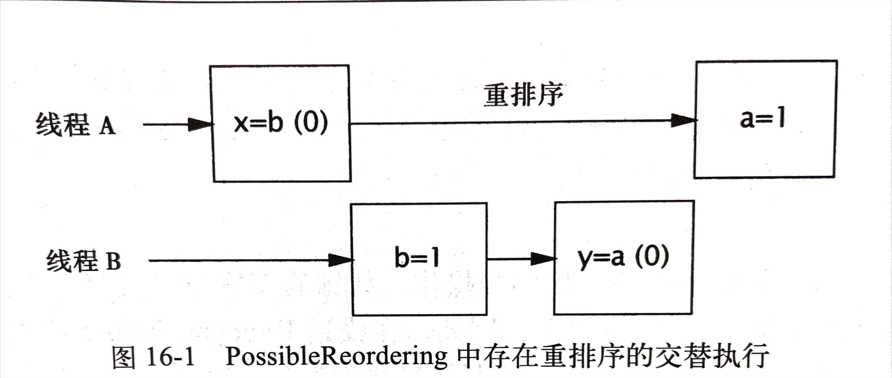

# ***高级主题：Java 内存模型***

[TOC]
----

## Java 内存模型介绍

假设一个线程为变量 aVariable 赋值:

aVariable = 3;

内存模型需要解决这个问题: “在什么条件下，读取 aVariable 的线程将看到这个值为3?” 这听起来似乎是一个愚蠢的问题，但如果缺少同步，那么将会有许多因素使得线程无法立即甚至永远不能得知另一个线程的操作结果。
>- 在编译器中生成的指令顺序，可以与源代码中的顺序不同，此外编译器还会把变量保存在寄存器而不是内存中;
>- 处理器可以采用乱序或并行等方式来执行指令;
>- 缓存可能会改变将写入变量提交到主内存的次序;
>- 而且，保存在处理器本地缓存中的值，对于其他处理器是不可见的。

这些因素都会使得一个线程无法看到变量的最新值，并且会导致其他线程中的内存操作似乎在乱序执行 ———— 如果没有使用正确的同步。

在单线程环境中，我们无法看到所有这些底层技术，它们除了提高程序的执行速度外，不会产生其他影响。Java 语言规范要求 JVM 在线程中维护一种类似串行的语义:**只要程序的最终结果与在严格串行环境中执行的结果相同，那么上述所有操作都是允许的。** 这确实是一件好事情，因为在最近几年中，计算性能的提升在很大程度上要归功于这些重新排序措施。当然，时钟频率的提高同样提升了性能，此外还有不断提升的并行性 ———— 采用流水线的超标量执行单元，动态指令调度，猜测执行以及完备的多级级存。随着处理变得越来越强大，编译器也在不断地改进。通过对指令重新排序来实现优化执行，以及使用成熟的全局寄存器分配算法。由于时钟频率越来越难以提高，因此许多处理器制造厂商都开始转而生产多核处理器，因为能够提高的只有硬件并行性。

JMM规定了JVM必须遵循一组最小保证，这组保证规定了对变量的写入操作在何时将对其他线程可见

###### 平台的内存模型

在共享内存的多处理器体系架构中，每个处理器都拥有自己的缓存，并且定期地与主内存进行协调。在不同的处理器架构中提供了不同级别的缓存一致性(CacheCoherence),其中一部分只提供最小的保证，即允许不同的处理器在任意时刻从同一个存储位置上看到不同的值。操作系统、编译器以及运行时(有时甚至包括应用程序)需要弥合这种在硬件能力与线程安全需求之间的差异。

要想确保每个处理器都能在任意时刻知道其他处理器正在进行的工作，将需要非常大的开销。在大多数时间里，这种信息是不必要的，因此处理器会适当放宽存储一致性保证，以换取性能的提升。在架构定义的内存模型中将告诉应用程序可以从内存系统中获得怎样的保证，此外还定义了一些特殊的指令(称为内存栅栏或栅栏)，当需要共享数据时，这些指令就能实现额外的存储协调保证。为了使 Java 开发人员无须关心不同架构上内存模型之间的差异，Java 还提供了自己的内存模型，并且 JVM 通过在适当的位置上插入内存栅栏来屏蔽在 JMM 与底层平台内存模型之间的差异。

程序执行一种简单假设:想象在程序中只存在唯一的操作执行顺序，而不考虑这些操作在何种处理器上执行，并且在每次读取变量时，都能获得在执行序列中(任何处理器)最近一次写人该变量的值。这种乐观的模型就被称为串行一致性。软件开发人员经常会错误地假设存在串行一致性，但在任何一款现代多处理器架构中都不会提供这种串行一致性，JMM 也是如此。冯.诺伊曼模型这种经典的串行计算模型，只能近似描述现代多处理器的行为。

在现代支持共享内存的多处理器(和编译器)中，当跨线程共享数据时，会出现一些奇怪的情况，除非通过使用内存栅栏来防止这些情况的发生。幸运的是，Java 程序不需要指定内存栅栏的位置，而只需通过正确地使用同步来找出何时将访问共享状态。

###### 重排序

在没有充分同步的程序中，如果调度器采用不恰当的方式来交替执行不同线程的操作，那么将导致不正确的结果。更糟的是，JMM 还使得不同线程看到的操作执行顺序是不同的，从而导致在缺乏同步的情况下，要推断操作的执行顺序将变得更加复杂。各种使操作延迟或者看似乱序执行的不同原因，都可以归为重排序。

```java
public class PossibleReordering {
    static int x = 0, y = 0;
    static int a = 0, b = 0;

    public static void main(String[] args) throws InterruptedException {
        Thread one = new Thread(new Runnable() {
            public void run() {
                a = 1;
                x = b;
            }
        });
        Thread other = new Thread(new Runnable() {
            public void run() {
                b = 1;
                y = b;
            }
        });
    }
    one.start();
    other.start();
    one.join();
    other.join();
    // out：（0，0），（0，1），（1，0），（1，1）
    System.out.println("(" + x + "," + y + ")");
}
```



PossibleReordering 是一个简单程序，但要列举出它所有可能的结果却非常困难。内存级的重排序会使程序的行为变得不可预测。如有没有同步，那么推测出执行顺序将是非常困难的，而要确保在程序中正确地使用同步却是非常容易的。同步将限制编译器、运行时和硬件对内存的操作重排序方式，从而在实施重排序时不会破坏 JMM 提供的可见性保证。

###### Java 内存模型简介

Java 内存模型是通过各种操作来定义的，包括变量的读/写操作，监视器的加锁和释放操作，以及线程的启动和合并操作。JMM 为程序中所有的操作定义了一个偏序关系，称为 Happens-Before，要保证执行操作 B 的线程看到操作 A 的结果，那么 A 和 B 之间必须满足 Happens-Before 关系，如果两个操作之间缺乏 Happens-Before 关系，那么JVM可以对它们任意地重排序。

Happens-Before 详见 <a href="../jvm/4.1 Java内存模型与线程.md">JVM-Java内存模型与线程</a> 章节介绍。

###### 借助同步

由于 Happens-Before 的排序功能很强大，因此有时候可以 “借助（Piggyback）” 现有同步机制的可见性属性。这需要将 Happens-Before 的程序顺序规则与其他某个顺序规则（通常是监视器锁规则或者 volatile 变量规则）结合起来，从而对某个未对锁保护的变量的访问操作进行排序。这项技术对于语句的顺序非常敏感，因此很容易出错。它是一项高级技术，并且只有当需要最大限度地提升某些类（例如 ReentrantLock）的性能时，才应该使用这项技术。

在 FutureTask 的保护方法 AbstractQueuedSynchronizer 中说明了如何使用这种 “借助” 技术。AQS 维护了一个表示同步器状态的整数，FutureTask 用这个整数来保存任务的状态:正在运行，已完成和已取消。但 FutureTask 还维护了其他一些变量，例如计算的结果。当一个线程调用 set 来保存结果并且另一个线程调用 get 来获取该结果时，这两个线程最好按照 Happens-Before 进行排序。这可以通过将执行结果的引用声明为 volatile 类型来实现，但利用现有的同步机制可以更容易地实现相同的功能。

FutureTask 在设计时能够确保，在调用 tryAquireShared 之前总能成功地调用 tryRelease-Shared. tryReleaseShare 会写入一个 volatile 类型的变量，而 tryAquireShared 将读取这个变量。程序清单16-2 给出了 innerSet 和 innerGet 等方法，在保存和获取 result 时将调用这些方法。由于 InnerSet 将在调用 ReleaseShared (这又将调用 tryReleaseShared) 之前写入 result，并且 innerGet 将在调用 acquireShared (这又将调用 tryReleaseShared) 之后读取 result，因此将程序顺序规则与 volatile 变量规则结合在一期，就可以确保 innerSet 的写入操作在 innerGet 中的读取操作之前执行。

```java
// FutureTask 的内部类
private final class Sunc extends AbstractQueuedSynchronizer {
    private static final int RNUNING = 1, RAN = 2, CANCELLED = 4;
    private V result;
    private Exception exception;

    void innerSet(V v){
        while (true) {
            int s = getState();
            if(ranOrCancelled(s)) return;
            if(compareAndSetState(s,RAN)) break;
        }
        result = v;
        releaseShared(0);
        done();
    }

    V innerGet() throws InterruptedException, ExecutionException {
        acquireSharedInterruptibly(0);
        if(getState() == CANCELLED) throw new CannellationException();
        if(exception != null) throw new ExecutionException(exception);
        return result;
    }
}

```

之所以将这项技术称为 “借助”，是因为它使用了一种现有的 Happens-Before 顺序来确保对象 X 的可见性，而不是专门为了发布 X 而创建一种 Happens-Before 顺序。

在 FutureTask 中使用的 “借助” 技术很容易出错，因此要谨慎使用。但在某些情况下，这种 “借助” 技术是非常合理的。例如，当某个类在其规范中规定它的各个方法之间必须遵循一种 Happens-Before 关系，基于 BlockingQueue 实现的安全发布就是种 “借助”。 如果一个线程将对象置入队列并且另一个线程随后获取这个对象，那么这就是一种安全发布，因为在 BlockingQueue 的实现中包含有足够的内部同步来确保入列操作在出列操作之前执行。

在类库中提供的其他 Happens-Before 排序包括:
>- 将一个元素放入一个线程安全容器的操作将在另一个线程从该容器中获得这个元素的操作之前执行。
>- 在 CountDownLatch 上的倒数操作将在线程从闭锁上的 await 方法中返回之前执行。
>- 释放 Semaphore 许可的操作将在从该 Semaphore 上获得一个许可之前执行。
>- Future 表示的任务的所有操作将在从 Future.get 中返回之前执行。
>- 向 Executor 提交一个 Runnable 或 Callable 的操作将在任务开始执行之前执行。
>- 一个线程到达 CyclicBarrier 或 Exchanger 的操作将在其他到达该栅栏或交换点的线程被释放之前执行。如果 CyclicBarrier 使用个栅栏操作，那么到达栅栏的操作将在栅栏操作之前执行，而栅栏操作又会在线程从栅栏中释放之前执行。

## 发布

###### 不安全的发布

当缺少 Happens-Before 关系时，就可能出现重排序问题，这就解释了为什么在没有充分同步的情况下发布一个对象会导致另一个线程看到一个只被部分构造的对象。 在初始化一个新的对象时需要写入多个变量，即新对象中的各个域。同样，在发布一个引用时也需要写入一个变量，即新对象的引用。如果无法确保发布共享引用的操作在另一个线程加载该共享引用之前执行，那么对新对象引用的写入操作将与对象中各个域的写入操作重排序(从使用该对象的线程的角度来看)。在这种情况下，另一个线程可能看到对象引用的最新值，但同时也将看到对象的某些或全部状态中包含的是无效值，即一个被部分构造对象。

```java
// 不安全的延迟初始化
public class UnsafeLazyInitialization {
    private static Resource resource;

    public static Resource getInstance() {
        if (resource == null) resource = new Resource(); // 不安全的发布
        return resource; 
    }
}
```

错误的延迟初始化将导致不正确的发布。**除了不可变对象以外，使用被另一个线程初始化的对象通常都是不安全的，除非对象的发布操作是在使用该对象的线程开始使用之前执行。**

###### 安全的发布

安全发布常用模式可以确保被发布对象对于其他线程是可见的，因为它们保证发布对象的操作将在使用对象的线程开始使用该对象的引用之前执行。如果线程 A 将 X 放入 BlockingQueue (并且随后没有线程修改它)，线程 B 从队列中获取 X,那么可以确保 B 看到的 X 与 A 放入的 X 相同。这是因为在 BlockingQueue 的实现中有足够的内部同步确保了 put 方法在 take 方法之前执行。同样，通过使用一个由锁保护共享变量或者使用共享的 volatile 类型变量，也可以确保对该变量的读取操作和写人操作按照 Happens-Before 关系来排序。

事实上，Happens-Before 比安全发布提供了更强可见性与顺序保证。如果将 X 从 A 安全地发布到 B,那么这种安全发布可以保证 X 状态的可见性，但无法保证 A 访问的其他变量的状态可见性。然而，如果 A 将 X 置入队列的操作在线程 B 从队列中获取 X 的操作之前执行，那么 B 不仅能看到 A 留下的 X 状态(假设线程 A 或其他线程都没有对 X 再进行修改)，而且还能看到 A 在移交 X 之前所做的任何操作(再次注意同样的警告)。

既然 JMM 已经提供了这种更强大的 Happens-Before 关系，那么为什么还要介绍 @GuardedBy 和安全发布呢?与内存写入操作的可见性相比，从转移对象的所有权以及对象公布等角度来看，它们更符合大多数的程序设计。Happens-Before 排序是在内存访问级别上操作的，它是一种 “并发级汇编语言”，而安全发布的运行级别更接近程序设计。

###### 安全初始化模式

有时候，我们需要推迟一些高开销的对象初始化操作，并且只有当使用这些对象时才进行初始化，但我们也看到了在误用延迟初始化时导致的问题。

```java
// 线程安全的延迟初始化
@ThreadSafe
public class SafeLazyInitialization {
    private static Resource resource;

    public synchronized static Resource getInstance() {
        if(resource == null) resource = new Resource();
        return resource;
    }
}
```

在初始器中采用了特殊的方式来处理静态域(或者在静态初始化代码块中初始化的值[JPL 2.2.1和2.5.3])， 并提供了额外的线程安全性保证。静态初始化器是由 JVM 在类的初始化阶即在类被加载后并且被线程使用之前。由于 JVM 将在初始化期间获得一个锁[JLS 12.4.2]，并且每个线程都至少获取一次这个锁以确保这个类已经加载，因此在静态初始化期间，内存写入操作将自动对所有线程可见。因此无论是在被构造期间还是被引用时，静态初始化的对象都不需要显式的同步。然而，这个规则仅适用于在构造时的状态，如果对象是可变的，那么在读线程和写线程之间仍然需要通过同步来确保随后的修改操作是可见的，以及避免数据破坏。

如程序清单16-5 所示，通过使用提前初始化(Eager Initialization),避免了在每次调用 SafeLazyInitialization 中的 getInstance 时所产生的同步开销。通过将这项技术和 JVM 的延迟加载机制结合起来，可以形成一种延迟初始化技术，从而在常见的代码路径中不需要同步。在程序清单16-6 的“延迟初始化占位(Holder) 类模式”[EJ Item 48]中使用了一个专门的类来初始化 Resource。JVM 将推迟 ResourceHolder 的初始化操作，直到开始使用这个类时才初始化[JLS 12.4.1]。 并且由于通过一个静态初始化来初始化 Resource, 因此不需要额外的同步。当任何一个线程第一次调用 getResource 时，都会使 ResourceHolder 被加载和被初始化，此时静态初始化器将执行 Resource 的初始化操作。

```java
// 提前初始化
@ThreadSafe
public class EagerInitialization {
    private static Resource resource = new Resource();
    public static Resource getResource() { return resource; }
}
```


```java
// 延长初始化占位类模式
@ThreadSafe
public class ResourceFactory {
    private static class ResourceHolder{
        public static Object resource = new Object();
    }
    public static Object getInstance(){
        return ResourceHolder.resource;
    }
}
```

###### 双重检查加锁

在早期的JVM中，同步(甚至是无竞争的同步)都存在着巨大的性能开销。因此，人们想出了许多 “聪明的(或者至少看上去聪明)” 技巧来降低同步的影响，有些技巧很好，但也有些技巧是不好的，甚至是糟糕的，DCL就属于 “糟糕” 的一类。

```java
// 双重检查加锁
@NotThreadSafe
public class DoubleCheckedLocking {
    private static volatile Object resource;

    public static Object getInstance(){
        if (resource == null){
            synchronized (DoubleCheckedLocking.class){
                if (resource == null) resource = new Object(); 
            }
        }
        return resource;
    }
}
```

由于早期的 JVM 在性能上存在一些有待优化的地方，因此延迟初始化经常被用来避免不必要的高开销操作，或者降低程序的启动时间。在编写正确的延迟初始化方法中需要使用同步。但在当时，同步不仅执行速度很慢，并且更重要的是，开发人员还没有完全理解同步的含义:虽然人们能很好地理解了 “独占性” 的含义，但却没有很好地理解 “可见性” 的含义。

DCL 声称能实现两全其美一在常见代码路径上的延迟初始化中不存在同步开销。它的工作原理是，首先检查是否在没有同步的情况下需要初始化，如果 resource 引用不为空，那么就直接使用它。否则，就进行同步并再次检查 Resource 是否被初始化，从而保证只有一个线程对共享的 Resource 执行初始化。在常见的代码路径中获取一个已构造好的 Resource 引用，并没有使用同步。这就是问题所在:线程可能看到一个仅被部分构造的 Resource。

DCL 的真正问题在于:当在没有同步的情况下读取一个共享对象时，可能发生的最糟糕事情只是看到一个失效值(在这种情况下是一个空值)，此时 DCL 方法将通过在持有锁的情况下再次尝试来避免这种风险。然而，实际情况远比这种情况糟糕：线程可能看到引用的当前值，但对象的状态值却是失效的，这意味着线程可以看到对象处于无效或错误的状态。

在 JMM 的后续版本(Java 5.0以及更高的版本)中，如果把 resource 声明为 volatile 类型，那么就能启用 DCL，并且这种方式对性能的影响很小，因为 volatile 变量读取操作的性能通常只是略高于非 volatile 变量读取操作的性能。然而，DCL 的这种使用方法已经被广泛地废弃了 ———— 促使该模式出现的驱动力(无竞争同步的执行速度很慢，以及 JVM 启动时很慢)已经不复存在，因而它不是一种高效的优化措施。延迟初始化占位类模式能带来同样的优势，并且更容易理解。

## 初始化过程中的安全性

如果能确保初始化过程的安全性，那么就可以使得被正确构造的不可变对象在没有同步的情况下也能安全地在多个线程之间共享，而不管它们是如何发布的，甚至通过某种数据竞争来发布。(这意味着，如果 Resource 是不可变的，那么 UnsafeLazyInitialization 实际上是安全的。)

如果不能确保初始化的安全性，那么当在发布或线程中没有使用同步时，一些本应为不可变对象(例如String)的值将会发生改变。安全性架构依赖于 String 的不可变性，如果缺少了初始化安全性，那么可能会导致一个安全漏洞，从而使恶意代码绕过安全检查。

**初始化安全性将确保，对于被正确构造的对象，所有线程都能看到由构造函数为对象给各个 final 域设置的正确值，而不管采用何种方式来发布对象。而且，对于可以通过被正确构造对象中某个 final 域到达的任意变量(例如某个 final 数组中的元素，或者由一个 final 域引用的 HashMap 的内容)将同样对于其他线程是可见的。**

对于含有 final 域的对象，初始化安全性可以防止对对象的初始引用被重排序到构造过程之前。当构造函数完成时，构造函数对 final 域的所有写入操作，以及对通过这些域可以到达的任何变量的写入操作，都将被 “冻结”，并且任何获得该对象引用的线程都至少能确保看到被冻结的值。对于通过 final 域可到达的初始变量的写入操作，将不会与构造过程后的操作一起被重排序。

初始化安全性意味着，程序可以安全地发布，即便通过不安全的延迟初始化，或者在没有同步的情况下将对象的引用放到一个公有的静态域，或者没有使用同步以及依赖于非线程安全的 HashSet。

```java
// 不可变对象的初始化安全性
@ThreadSafepublic 
public class SafeStates {    
    private final Map<String, String> states;    
    
    public SafeStates() {
        states = new HashMap<String, String>();
        states.put("alaska", "AK");
        states.put("alabama", "AL");        
        ...
        states.put("wyoming", "WY");
    }    
    
    public String getAbbreviation(String s) {        
        return states.get(s);
    }
}
```

然而，许多对 SafaStates 的细微修改都可能破坏它的线程安全性。如果 states 不是 final 类型，或者存在除构造函数以外的其他方法能修改 states,那么初始化安全性将无法确保在缺少同步的情况下安全地访问 SafeStates。如果在 SafeStates 中还有其他的非 final 域，那么其他线程仍然可能看到这些域上的不正确的值。这也导致了对象在构造过程中逸出，从而使初始化安全性的保证无效。

**初始化安全性只能保证通过 final 域可达的值从构造过程完成时开始的可见性。对于通过非 final 域可达的值，或者在构成过程完成后可能改变的值，必须采用同步来确保可见性。**

