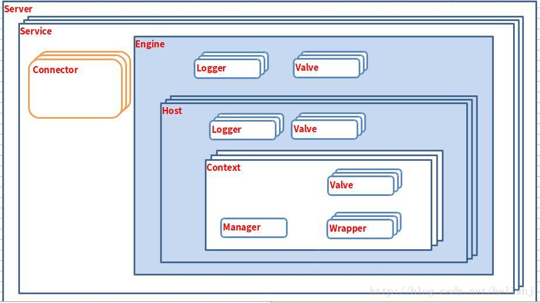
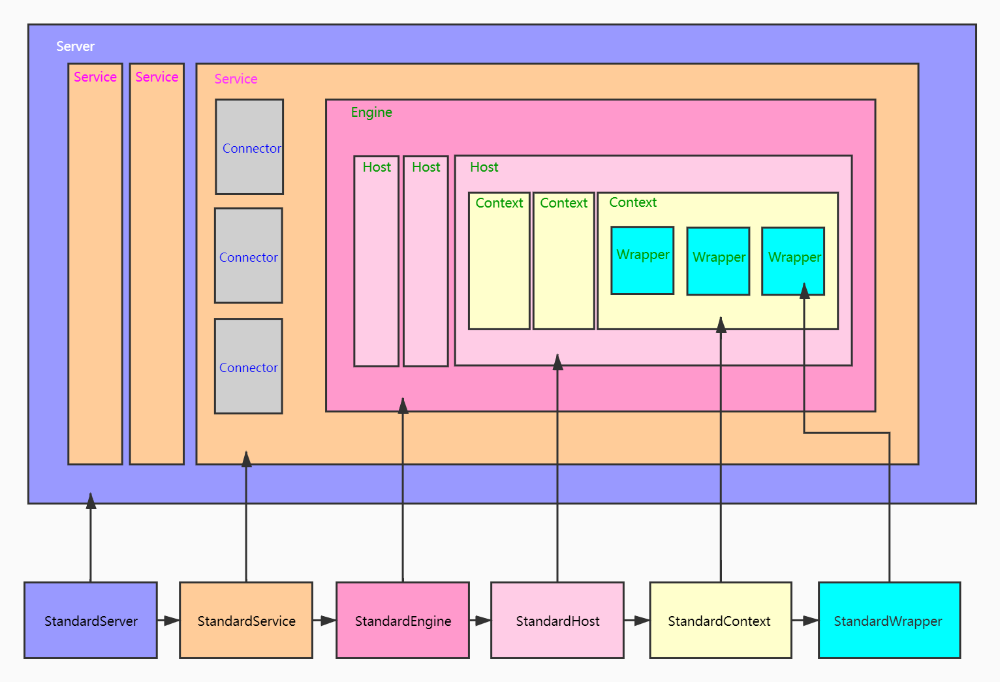
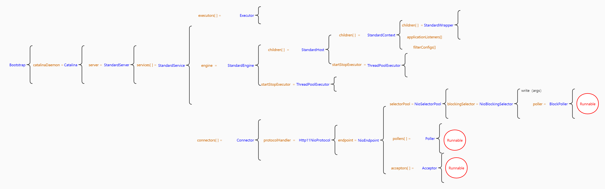
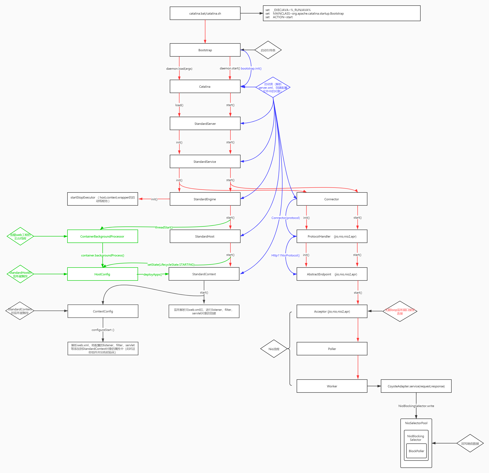
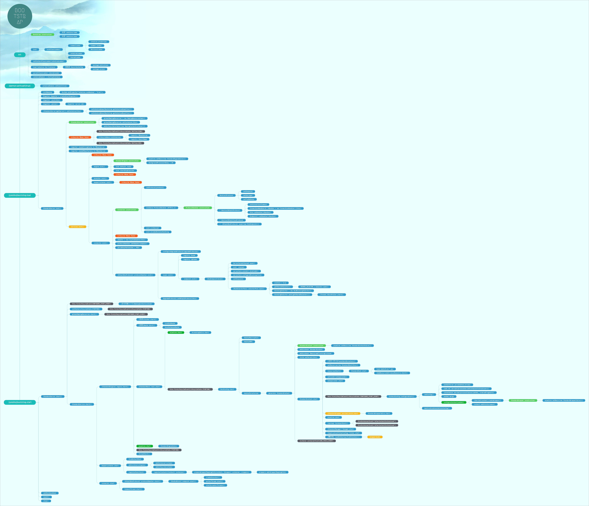

# ***Tomcat 整体结构***

----

## 一、架构关系
&ensp;&ensp;&ensp;&ensp;我们想要了解一个框架，首先要了解它是干什么的，Tomcat 我们都知道，是用于处理连接过来的 Socket 请求的。那么 Tomcat 就会有两个功能：
>1. 对外处理连接，将收到的字节流转化为自己想要的 Request 和 Response 对象。
>2. 对内处理 Servlet，将对应的 Request 请求分发到相应的 Servlet 中。


&ensp;&ensp;&ensp;&ensp;那么我们整体的骨架就出来了，Tomcat其实就分为两大部分，一部分是连接器(Connnector)处理对外连接和容器(Container)管理对内的Servelet。大体的关系图如下：



&ensp;&ensp;&ensp;&ensp;这些对应的关系在 Tomcat 目录配置文件中 server.xml 中也能体现出来：

```java

<Server port="8006" shutdown="SHUTDOWN">  
    <Service name ="Catalina">    
        <Connector port ="8080" protocol="HTTP/1.1" connectionTimeout="20000" redirectPort="8443"/>     
        <Connector port="8010" protocol="AJP/1.3" redirectPort="8443"/>
        <Engine name="Catalina" defaultHost="localhost">
            <Realm className="org.apache.catalina.realm.LockOutRealm">            
                <Realm className="org.apache.catalina.realm.UserDatabaseRealm" resourceName="UserDatabase"/>
            </Realm>          
            <Host name="localhost" appBase="webapps"></Host>
        </Engine>
    </Service>    
</Server>
```


## 二、Tomcat 各个组件对应的实现类





## 三、Tomcat 启动流程

>1. 蓝线部分是各个组件的初始化，在 Catalina 对象中创建了 server.xml 的解析器，一次性创建出大部分的组件。
>2. 红线部分是责任链模式的启动流程。
>3. 绿线部分是热加载和热部署的过程（war包的解压和 web.xml 的解析，解析出 listener、filter、servlet 等）。



## 四、Tomcat 源码启动步骤总览

