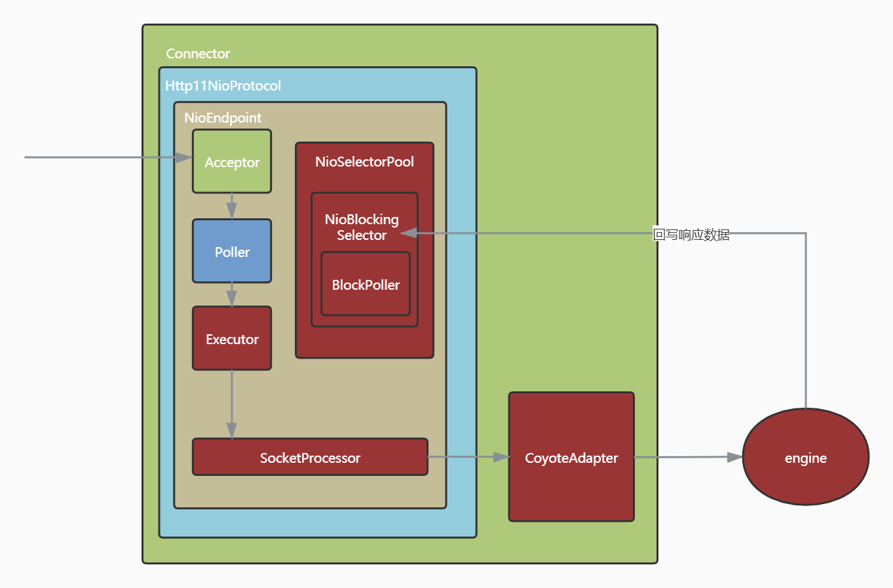
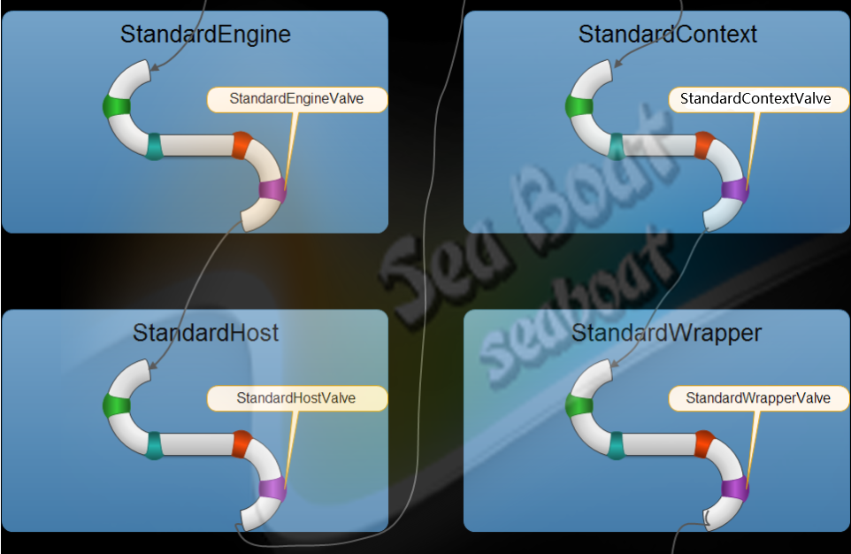
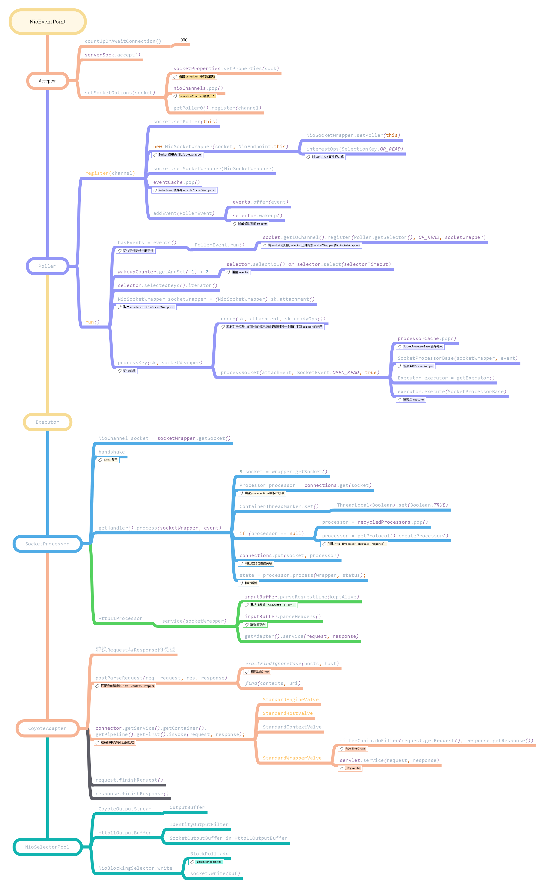
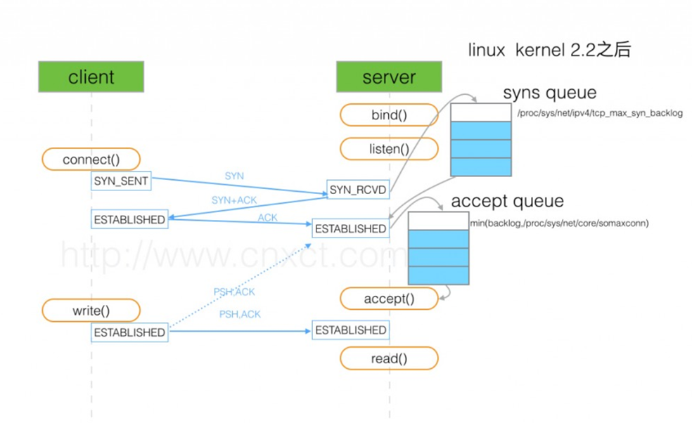
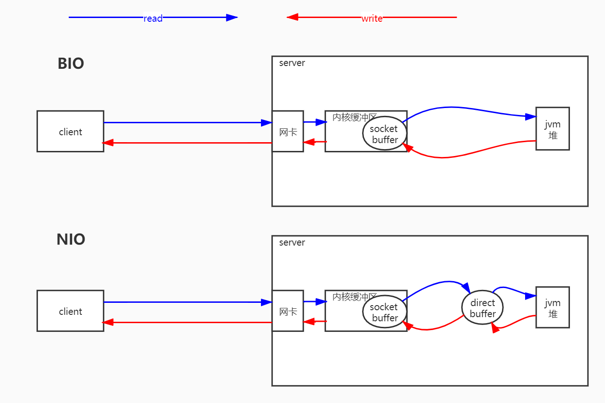
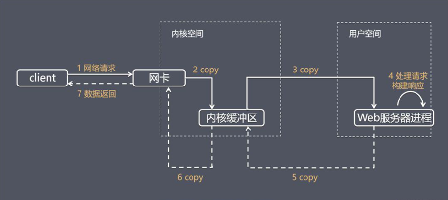
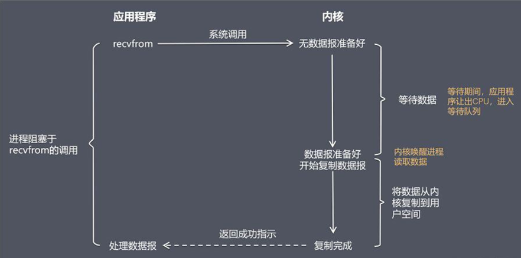
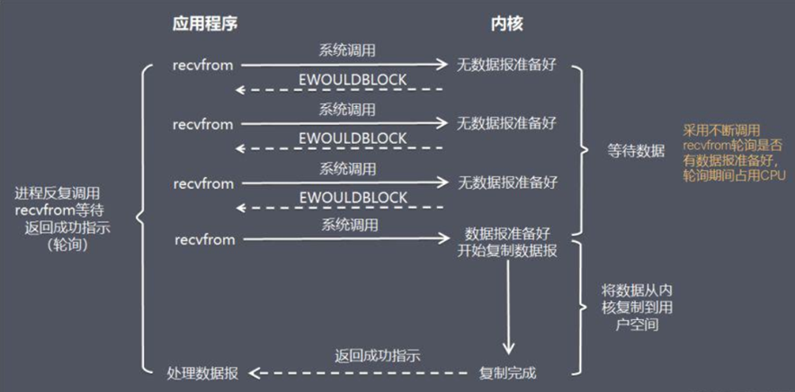
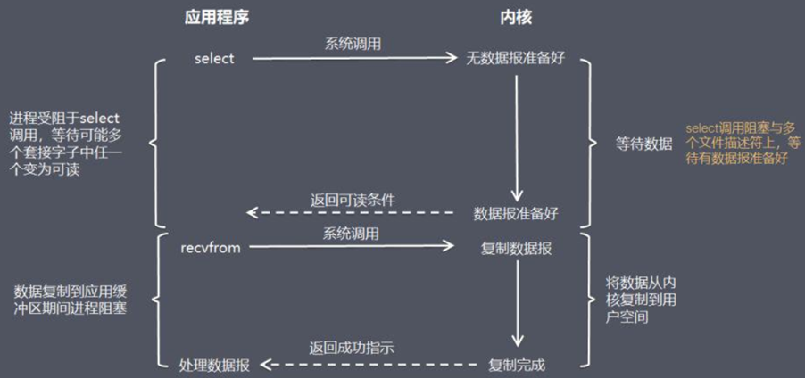
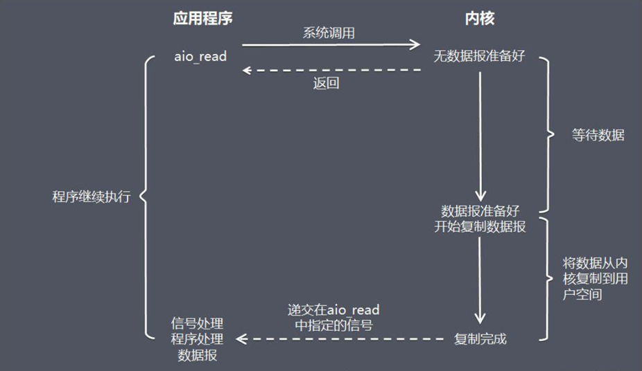

# ***Tomcat 线程模型***

----

## 一、Connector


```java
// 使用指定IO模型的配置方式: 配置 server.xml 文件即可。 
// 默认配置 8.0  protocol=“HTTP/1.1” 
// 8.0 之前是 BIO 8.0 之后是 NIO 
BIO protocol=“org.apache.coyote.http11.Http11Protocol” 
NIO protocol=“org.apache.coyote.http11.Http11NioProtocol” 
AIO protocol=“org.apache.coyote.http11.Http11Nio2Protocol” 
APR protocol=“org.apache.coyote.http11.Http11AprProtocol”
```

| 名称 | 描述 | 
|:----|:----| 
| **`acceptCount`** | 等待最大队列 |
| **`address`** | 绑定客户端特定地址，`127.0.0.1` | 
| **`bufferSize`** | 每个请求的缓冲区大小。`bufferSize × maxThreads` | 
| **`compression`** | 是否启用文档压缩 | 
| **`compressableMimeTypes`** | `text/html,text/xml,text/plain` | 
| **`connectionTimeout`** | 链接最大的等待时间 | 
| **`connectionUploadTimeout`** | `upload` 情况下连接超时时间 | 
| **`disableUploadTimeout`** | `true` 则使用`connectionTimeout` | 
| **`enableLookups`** | 禁用DNS查询 `true` | 
| **`keepAliveTimeout`** | 当长链接闲置指定时间主动关闭 链接`connection: keep-alive` | 
| **`maxKeepAliveRequests`** | 最大的 长连接数 | 
| **`maxHttpHeaderSize`** | 
| **`maxThreads`** | 最大执行线程数（执行线程） | 
| **`minSpareThreads`** |最小线闲置线程数(初始线业务线程 10)

## 二、容器

&ensp;&ensp;&ensp;&ensp;**只有容器才有管道线，其他组件没有。**

&ensp;&ensp;&ensp;&ensp;Tomcat 中有四个容器，分别是`Engine`、`Host`、`Context`、`Wrapper`。级别安排列从大到小的。Context 表示一个 Web 应用程序，Wrapper 表示一个Servlet。一个 Web 应用程序中可能会有多个 Servlet。Host 代表的是一个虚拟主机，就好比你的一个 Tomcat 下面可能有多个 Web 应用程序。同时 Engine 是 Host 的父类，Host 是 Context 的父类,Context 是 Wrapper 的父类。每层的容器都有自己的管道线。



## 三、Tomcat 线程流转



## 备注：

- #### TCP 三次握手



- #### BIO 与 NIO



- #### 网络请求响应



- #### 阻塞式 I/O 模型(blocking I/O）



- #### 非阻塞式 I/O 模型(non-blocking I/O）



- #### I/O模型：I/O 复用模型(I/O multiplexing）



- #### I/O模型：异步 I/O 模型（即AIO，全称asynchronous I/O）



