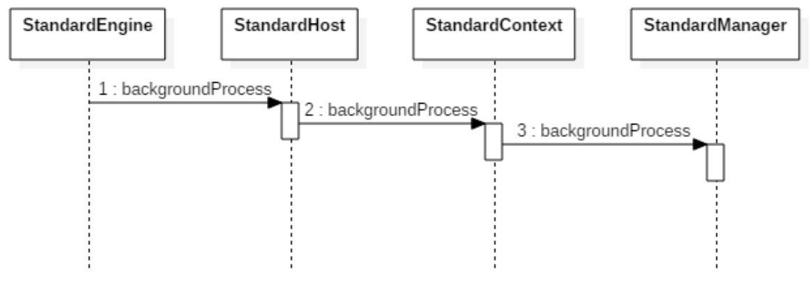
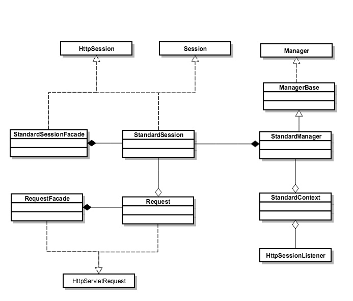

# ***Tomcat 功能刨析***

- [***Tomcat 功能刨析***](#tomcat-功能刨析)
  - [一、Tomcat 热加载与热部署](#一tomcat-热加载与热部署)
      - [Tomcat 热加载](#tomcat-热加载)
      - [Tomcat 热部署](#tomcat-热部署)
  - [二、Tomcat 类加载器](#二tomcat-类加载器)
      - [Java 类加载器](#java-类加载器)
      - [Tomcat 的类加载器](#tomcat-的类加载器)
  - [Session](#session)
      - [Session 的创建](#session-的创建)
      - [Session 事件通知](#session-事件通知)

----

## 一、Tomcat 热加载与热部署

要在运行的过程中升级 Web 应用，如果你不想重启系统，实现的方式有两种：热加载和热部署。

>- 热加载的实现方式是 Web 容器启动一个后台线程，定期检测类文件的变化，如果有变化，就重新加载类，在这个过程中不会清空 Session ，一般用在开发环境。
>
>- 热部署原理类似，也是由后台线程定时检测 Web 应用的变化，但它会重新加载整个 Web 应用。这种方式会清空 Session，比热加载更加干净、彻底，一般用在生产环境。

Tomcat 就是通过开启后台线程实现：

```java
/**
* ContainerBase.java
* Start the background thread that will periodically check for
* session timeouts.
*/
protected void threadStart() {
    if (thread != null) return;
    if (backgroundProcessorDelay <= 0) return;
    threadDone = false;
    String threadName = "ContainerBackgroundProcessor[" + toString() + "]";
    thread = new Thread(new ContainerBackgroundProcessor(), threadName);
    thread.setDaemon(true);
    thread.start();
}
```

任务类 ContainerBackgroundProcessor，它是一个 Runnable，同时也是 ContainerBase 的内部类，ContainerBase 是所有容器组件的基类。

```java
/**
* ContainerBackgroundProcessor.java
* Private runnable class to invoke the backgroundProcess method
* of this container and its children after a fixed delay.
*/
protected class ContainerBackgroundProcessor implements Runnable {

    @Override
    public void run() {
        Throwable t = null;
        String unexpectedDeathMessage = sm.getString( "containerBase.backgroundProcess.unexpectedThreadDeath", Thread.currentThread().getName());
        try {
            while (!threadDone) {
                try {
                    Thread.sleep(backgroundProcessorDelay * 1000L);
                } catch (InterruptedException e) {
                    // Ignore
                }
                if (!threadDone) {
                    processChildren(ContainerBase.this);
                }
            }
        } catch (RuntimeException|Error e) {
            ···
        } finally {
            ···
        }
    }

    protected void processChildren(Container container) {
        ClassLoader originalClassLoader = null;

        try {
            if (container instanceof Context) {
                Loader loader = ((Context) container).getLoader();
                // Loader will be null for FailedContext instances
                if (loader == null) {
                    return;
                }

                // Ensure background processing for Contexts and Wrappers
                // is performed under the web app's class loader
                originalClassLoader = ((Context) container).bind(false, null);
            }
            //1. 调用当前容器的 backgroundProcess 方法。
            container.backgroundProcess();
            //2. 遍历所有的子容器，递归调用 processChildren， 
            Container[] children = container.findChildren();
            for (Container child : children) {
                // 这里请你注意，容器基类有个变量叫做 backgroundProcessorDelay
                // 如果大于0，表明子容器有自己的后台线程，无需父容器来调用它的 processChildren 方法。
                if (child.getBackgroundProcessorDelay() <= 0) {
                    processChildren(child);
                }
            }
        } catch (Throwable t) { ··· } finally {
            if (container instanceof Context) {
                ((Context) container).unbind(false, originalClassLoader);
            }
        }
    }
}
```

```java
/**
* Execute a periodic task, such as reloading, etc. This method will be
* invoked inside the classloading context of this container. Unexpected
* throwables will be caught and logged.
*/
@Override
public void backgroundProcess() {

    if (!getState().isAvailable())
        return;
    
    //1.执行容器中 Cluster 组件的周期性任务
    Cluster cluster = getClusterInternal();
    if (cluster != null) {
        try {
            cluster.backgroundProcess();
        } catch (Exception e) {
            ···
        }
    }
    //2.执行容器中 Realm 组件的周期性任务
    Realm realm = getRealmInternal();
    if (realm != null) {
        try {
            realm.backgroundProcess();
        } catch (Exception e) {
            ···
        }
    }

    //3.执行容器中 Valve 组件的周期性任务
    Valve current = pipeline.getFirst();
    while (current != null) {
        try {
            current.backgroundProcess();
        } catch (Exception e) {
            ···
        }
        current = current.getNext();
    }
    //4. 触发容器的"周期事件"，Host 容器的监听器 HostConfig 就靠它来调用
    fireLifecycleEvent(Lifecycle.PERIODIC_EVENT, null);
}
```

从上面的代码可以看到，不仅每个容器可以有周期性任务，每个容器中的其他通用组件，比如跟集群管理有关的 Cluster 组件、跟安全管理有关的 Realm 组件都可以有自己的周期性任务。

#### Tomcat 热加载

有了 ContainerBase 的周期性任务处理“框架”，作为具体容器子类，只需要实现自己的周期性任务就行。而 Tomcat 的热加载，就是在 Context 容器中实现的。Context 容器的 backgroundProcess 方法是这样实现的：

```java
@Override
public void backgroundProcess() {

    if (!getState().isAvailable()) return;
    
    //WebappLoader 周期性的检查 WEB-INF/classes 和 WEB-INF/lib 目录下的类文件
    Loader loader = getLoader();
    if (loader != null) {
        try {
            loader.backgroundProcess();
        } catch (Exception e) {···}
    }

    //Session 管理器周期性的检查是否有过期的 Session
    Manager manager = getManager();
    if (manager != null) {
        try {
            manager.backgroundProcess();
        } catch (Exception e) {···}
    }

    //周期性的检查静态资源是否有变化
    WebResourceRoot resources = getResources();
    if (resources != null) {
        try {
            resources.backgroundProcess();
        } catch (Exception e) {···}
    }

    //实例管理器，定期清理过期引用
    InstanceManager instanceManager = getInstanceManager();
    if (instanceManager instanceof DefaultInstanceManager) {
        try {
            ((DefaultInstanceManager)instanceManager).backgroundProcess();
        } catch (Exception e) {···}
    }

    //调用父类ContainerBase的backgroundProcess方法
    super.backgroundProcess();
}
```

从上面的代码我们看到 Context 容器通过 WebappLoader 来检查类文件是否有更新，通过 Session 管理器来检查是否有 Session 过期，并且通过资源管理器来检查静态资源是否有更新，最后还调用了父类 ContainerBase 的 backgroundProcess 方法。

WebappLoader 是如何实现热加载的，它主要是调用了 Context 容器的 reload 方法，而 Context 的 reload 方法比较复杂，总结起来，主要完成了下面这些任务：

>- 停止和销毁 Context 容器及其所有子容器，子容器其实就是 Wrapper，也就是说 Wrapper 里面 Servlet 实例也被销毁了（在这里 Context 实例并没有销毁）。
>- 停止和销毁 Context 容器关联的 Listener 和 Filter。
>- 停止和销毁 Context 下的 Pipeline 和各种 Valve。
>- 停止和销毁 Context 的类加载器，以及类加载器加载的类文件资源。
>- 启动 Context 容器，在这个过程中会重新创建前面四步被销毁的资源。
>- 在这个过程中，类加载器发挥着关键作用。一个 Context 容器对应一个类加载器，类加载器在销毁的过程中会把它加载的所有类也全部销毁。Context 容器在启动过程中，会创建一个新的类加载器来加载新的类文件。

在 Context 的 reload 方法里，并没有调用 Session 管理器的 destroy 方法，也就是说这个 Context 关联的 Session 是没有销毁的。你还需要注意的是，Tomcat 的热加载默认是关闭的，你需要在 conf 目录下的 server.xml 文件中设置 reloadable 参数来开启这个功能，像下面这样：
```xml
<Context path="/testweb1" docBase="testweb.war"  reloadbale="true"/>
```

#### Tomcat 热部署

热部署跟热加载的本质区别是，热部署会重新部署 Web 应用，原来的 Context 对象会整个被销毁掉，因此这个 Context 所关联的一切资源都会被销毁，包括 Session。

那么 Tomcat 热部署又是由哪个容器来实现的呢？ 因为热部署过程中 Context 容器被销毁了，那么这个重担就落在 Host 身上了，因为它是 Context 的父容器。

跟 Context 不一样，Host 容器并没有在 backgroundProcess 方法中实现周期性检测的任务，而是通过监听器 HostConfig 来实现的，HostConfig 就是前面提到的“周期事件”的监听器，那“周期事件”达到时，HostConfig 会做什么事呢？

```java
/**
* LifecycleBase.java
* Allow sub classes to fire {@link Lifecycle} events.
*
* @param type  Event type
* @param data  Data associated with event.
*/
protected void fireLifecycleEvent(String type, Object data) {
    LifecycleEvent event = new LifecycleEvent(this, type, data);
    for (LifecycleListener listener : lifecycleListeners) {
        listener.lifecycleEvent(event);
    }
}
```

它执行了 check 方法，我们接着来看 check 方法里做了什么

```java
/**
* HostConfig.java
* Check status of all webapps.
*/
protected void check() {
    if (host.getAutoDeploy()) {
        // Check for resources modification to trigger redeployment
        // 检查这个 Host 下所有已经部署的 Web 应用
        DeployedApplication[] apps = deployed.values().toArray(new DeployedApplication[0]);
        for (DeployedApplication app : apps) {
            if (tryAddServiced(app.name)) {
                //检查Web应用目录是否有变化
                try { checkResources(app, false); } 
                finally { removeServiced(app.name); }
            }
        }
        // Check for old versions of applications that can now be undeployed
        if (host.getUndeployOldVersions()) {
            checkUndeploy();
        }
        // Hot deploy applications
        deployApps();
    }
}
```

其实 HostConfig 会检查 webapps 目录下的所有 Web 应用：

>- 如果原来 Web 应用目录被删掉了，就把相应 Context 容器整个销毁掉。
>- 是否有新的 Web 应用目录放进来了，或者有新的 WAR 包放进来了，就部署相应的 Web 应用。

## 二、Tomcat 类加载器

#### Java 类加载器 

Java 的类加载，就是把字节码格式`.class`文件加载到 JVM 的方法区，并在 JVM 的堆区建立一个 `java.lang.Class` 对象的实例，用来封装 Java 类相关的数据和方法。那 Class 对象又是什么呢？你可以把它理解成业务类的模板，JVM 根据这个模板来创建具体业务类对象实例。

JVM 并不是在启动时就把所有的`.class`文件都加载一遍，而是程序在运行过程中用到了这个类才去加载。JVM 类加载是由类加载器来完成的，JDK 提供一个抽象类 ClassLoader，这个抽象类中定义了三个关键方法，理解清楚它们的作用和关系非常重要。详见：[虚拟机加载机制](../../jvm/2.2%20虚拟机加载机制.md#类加载器)。


#### Tomcat 的类加载器

Tomcat 的自定义类加载器 WebAppClassLoader 打破了双亲委托机制，它首先自己尝试去加载某个类，如果找不到再代理给父类加载器，其目的是优先加载 Web 应用自己定义的类，[相关内容](../../jvm/2.4%20类加载及执行的案例分析.md#Tomcat)。具体实现就是重写 ClassLoader 的两个方法：findClass 和 loadClass。

```java
/**
* WebappClassLoaderBase.java
* Find the specified class in our local repositories, if possible.  If
* not found, throw <code>ClassNotFoundException</code>.
*
* @param name The binary name of the class to be loaded
*
* @exception ClassNotFoundException if the class was not found
*/
@Override
public Class<?> findClass(String name) throws ClassNotFoundException {

    checkStateForClassLoading(name);
    // Ask our superclass to locate this class, if possible
    // (throws ClassNotFoundException if it is not found)
    Class<?> clazz = null;
    
    try {
        //1. 先在Web应用目录下查找类
        clazz = findClassInternal(name);
    } catch(AccessControlException ace) {
        throw new ClassNotFoundException(name, ace);
    } catch (RuntimeException e) {
        throw e;
    }
    if ((clazz == null) && hasExternalRepositories) {
        try {
            // 2. 如果在本地目录没有找到，交给父加载器(AppClassLoader)去查找
            clazz = super.findClass(name);
        } catch(AccessControlException ace) {
            throw new ClassNotFoundException(name, ace);
        } catch (RuntimeException e) {
            throw e;
        }
    }
    if (clazz == null) {
        throw new ClassNotFoundException(name);
    }
    // Return the class we have located
    return clazz;
}
```

在 findClass 方法里，主要有三个步骤：

>- 先在 Web 应用本地目录下查找要加载的类。
>- 如果没有找到，交给父加载器去查找，它的父加载器就是上面提到的系统类加载器 AppClassLoader。
>- 如果父加载器也没找到这个类，抛出 ClassNotFound 异常。

```java
/**
* WebappClassLoaderBase.java
* Load the class with the specified name, searching using the following
* algorithm until it finds and returns the class.  If the class cannot
* be found, returns <code>ClassNotFoundException</code>.
*
* @param name The binary name of the class to be loaded
* @param resolve If <code>true</code> then resolve the class
*
* @exception ClassNotFoundException if the class was not found
*/
@Override
public Class<?> loadClass(String name, boolean resolve) throws ClassNotFoundException {

    synchronized (getClassLoadingLock(name)) {
        
        Class<?> clazz = null;

        // Log access to stopped class loader
        checkStateForClassLoading(name);

        // (0) Check our previously loaded local class cache
        // 1.先在本地 CACHE 中检查该类是否已经加载过
        clazz = findLoadedClass0(name);
        if (clazz != null) {
            if (resolve)
                resolveClass(clazz);
            return clazz;
        }

        // (0.1) Check our previously loaded class cache
        // 2.检查 AppClassLoader 的 cache 中是否已经加载过
        clazz = findLoadedClass(name);
        if (clazz != null) {
            if (resolve)
                resolveClass(clazz);
            return clazz;
        }

        // (0.2) Try loading the class with the system class loader, to prevent
        //       the webapp from overriding Java SE classes. This implements
        //       SRV.10.7.2
        // 3. 尝试使用 ExtClassLoad 进行加载
        String resourceName = binaryNameToPath(name, false);
        ClassLoader javaseLoader = getJavaseClassLoader();
        boolean tryLoadingFromJavaseLoader;
        try {
            // Use getResource as it won't trigger an expensive
            // ClassNotFoundException if the resource is not available from
            // the Java SE class loader. However (see
            // https://bz.apache.org/bugzilla/show_bug.cgi?id=58125 for
            // details) when running under a security manager in rare cases
            // this call may trigger a ClassCircularityError.
            // See https://bz.apache.org/bugzilla/show_bug.cgi?id=61424 for
            // details of how this may trigger a StackOverflowError
            // Given these reported errors, catch Throwable to ensure any
            // other edge cases are also caught
            URL url;
            if (securityManager != null) {
                PrivilegedAction<URL> dp = new PrivilegedJavaseGetResource(resourceName);
                url = AccessController.doPrivileged(dp);
            } else {
                // 先去 ExtClassLoad 中查找 Resource
                url = javaseLoader.getResource(resourceName);
            }
            tryLoadingFromJavaseLoader = (url != null);
        } catch (Throwable t) {
            // Swallow all exceptions apart from those that must be re-thrown
            ExceptionUtils.handleThrowable(t);
            // The getResource() trick won't work for this class. We have to
            // try loading it directly and accept that we might get a
            // ClassNotFoundException.
            tryLoadingFromJavaseLoader = true;
        }
        if (tryLoadingFromJavaseLoader) {
            try {
                // 未查找到，开始使用 ExtClassLoad load
                clazz = javaseLoader.loadClass(name);
                if (clazz != null) {
                    if (resolve) resolveClass(clazz);
                    return clazz;
                }
            } catch (ClassNotFoundException e) {
                // Ignore
            }
        }
        // (1) Delegate to our parent if requested
        // 这里如果指定，会去已知的用户自定义的类加载器中去查找
        if (delegateLoad) {
            try {
                clazz = Class.forName(name, false, parent);
                if (clazz != null) {
                    if (resolve) resolveClass(clazz);
                    return clazz;
                }
            } catch (ClassNotFoundException e) {
                // Ignore
            }
        }

        // (2) Search local repositories
        // 4.尝试在本地查找 Class
        try {
            clazz = findClass(name);
            if (clazz != null) {
                if (resolve) resolveClass(clazz);
                return clazz;
            }
        } catch (ClassNotFoundException e) {
            // Ignore
        }

        // (3) Delegate to parent unconditionally
        // 如果没有用户自定义的类加载器且还未查找到，那么无条件的开始 java se 类加载，也就是 AppClassLoader
        if (!delegateLoad) {
            try {
                clazz = Class.forName(name, false, parent);
                if (clazz != null) {
                    if (resolve) resolveClass(clazz);
                    return clazz;
                }
            } catch (ClassNotFoundException e) {
                // Ignore
            }
        }
    }

    throw new ClassNotFoundException(name);
}

```

loadClass 方法稍微复杂一点，主要有六个步骤：

>1. 先在本地 Cache 查找该类是否已经加载过，也就是说 Tomcat 的类加载器是否已经加载过这个类。
>2. 如果 Tomcat 类加载器没有加载过这个类，再看看系统类加载器是否加载过。
>3. 如果都没有，就让 ExtClassLoader 去加载，这一步比较关键，目的防止 Web 应用自己的类覆盖 JRE 的核心类。因为 Tomcat 需要打破双亲委托机制，假如 Web 应用里自定义了一个叫 Object 的类，如果先加载这个 Object 类，就会覆盖 JRE 里面的那个 Object 类，这就是为什么 Tomcat 的类加载器会优先尝试用 ExtClassLoader 去加载，因为 ExtClassLoader 会委托给 BootstrapClassLoader 去加载，BootstrapClassLoader 发现自己已经加载了 Object 类，直接返回给 Tomcat 的类加载器，这样 Tomcat 的类加载器就不会去加载 Web 应用下的 Object 类了，也就避免了覆盖 JRE 核心类的问题。
>4. 如果 ExtClassLoader 加载器加载失败，也就是说 JRE 核心类中没有这类，那么就在本地 Web 应用目录下查找并加载。
>5. 如果本地目录下没有这个类，说明不是 Web 应用自己定义的类，那么由系统类加载器去加载。这里请你注意，Web 应用是通过`Class.forName`调用交给系统类加载器的，因为`Class.forName`的默认加载器就是系统类加载器。
>6. 如果上述加载过程全部失败，抛出 ClassNotFound 异常。

## Session

#### Session 的创建

Tomcat 中主要由每个 Context 容器内的一个 Manager 对象来管理 Session。默认实现类为 StandardManager。下面我们通过它的接口来了解一下 StandardManager 的功能：

```java
public interface Manager {
    public Context getContext();
    public void setContext(Context context);
    public SessionIdGenerator getSessionIdGenerator();
    public void setSessionIdGenerator(SessionIdGenerator sessionIdGenerator);
    public long getSessionCounter();
    public void setSessionCounter(long sessionCounter);
    public int getMaxActive();
    public void setMaxActive(int maxActive);
    public int getActiveSessions();
    public long getExpiredSessions();
    public void setExpiredSessions(long expiredSessions);
    public int getRejectedSessions();
    public int getSessionMaxAliveTime();
    public void setSessionMaxAliveTime(int sessionMaxAliveTime);
    public int getSessionAverageAliveTime();
    public int getSessionCreateRate();
    public int getSessionExpireRate();
    public void add(Session session);
    public void changeSessionId(Session session);
    public void changeSessionId(Session session, String newId);
    public Session createEmptySession();
    public Session createSession(String sessionId);
    public Session findSession(String id) throws IOException;
    public Session[] findSessions();
    public void load() throws ClassNotFoundException, IOException;
    public void remove(Session session);
    public void remove(Session session, boolean update);
    public void addPropertyChangeListener(PropertyChangeListener listener)
    public void removePropertyChangeListener(PropertyChangeListener listener);
    public void unload() throws IOException;
    public void backgroundProcess();
    public boolean willAttributeDistribute(String name, Object value);
}
```

我们在接口中看到了添加和删除 Session 的方法；另外还有 load 和 unload 方法，它们的作用是分别是将 Session 持久化到存储介质和从存储介质加载 Session。

当我们调用`HttpServletRequest.getSession(true)`时，这个参数 true 的意思是 “如果当前请求还没有 Session，就创建一个新的”。那 Tomcat 在背后为我们做了些什么呢？

HttpServletRequest 是一个接口，Tomcat 实现了这个接口，具体实现类是：`org.apache.catalina.connector.Request`。

但这并不是我们拿到的 Request，Tomcat 为了避免把一些实现细节暴露出来，还有基于安全上的考虑，定义了 Request 的包装类，叫作 RequestFacade，我们可以通过代码来理解一下：

```java
/**
* org.apache.catalina.connector.Request.java
* @return the <code>ServletRequest</code> for which this object
* is the facade.  This method must be implemented by a subclass.
*/
public HttpServletRequest getRequest() {
    if (facade == null) {
        facade = new RequestFacade(this);
    }
    if (applicationRequest == null) {
        applicationRequest = facade;
    }
    return applicationRequest;
}


/**
* RequestFacade.java
*/
public class RequestFacade implements HttpServletRequest {
  protected Request request = null;
  
  public HttpSession getSession(boolean create) {
     return request.getSession(create);
  }
}

```

因此我们拿到的 Request 类其实是 RequestFacade，RequestFacade 的 getSession 方法调用的是 Request 类的 getSession 方法，我们继续来看 Session 具体是如何创建的：

```java
// Request.java
protected Session doGetSession(boolean create) {
    Context context = getContext();
    if (context == null) {
        return null;
    }
    
    Manager manager = context.getManager();
    if (manager == null) {
        return null;      
    }
    
    session = manager.createSession(sessionId);
    session.access();
}
```

从上面的代码可以看出，Request 对象中持有 Context 容器对象，而 Context 容器持有 Session 管理器 Manager，这样通过 Context 组件就能拿到 Manager 组件，最后由 Manager 组件来创建 Session。

因此最后还是到了 StandardManager，StandardManager 的父类叫 ManagerBase，这个 createSession 方法定义在 ManagerBase 中，StandardManager 直接重用这个方法。

接着我们来看 ManagerBase 的 createSession 是如何实现的：

```java
/**
* ManagerBase.java
*
* Construct and return a new session object, based on the default
* settings specified by this Manager's properties.  The session
* id specified will be used as the session id.
*
*/
@Override
public Session createSession(String sessionId) {

    if ((maxActiveSessions >= 0) && (getActiveSessions() >= maxActiveSessions)) {
        rejectedSessions++;
        throw new TooManyActiveSessionsException( sm.getString("managerBase.createSession.ise"), maxActiveSessions);
    }

    // Recycle or create a Session instance
    // 重用或者创建一个新的 Session 对象，请注意在 Tomcat 中就是 StandardSession
    // 它是 HttpSession 的具体实现类，而 HttpSession 是 Servlet 规范中定义的接口
    Session session = createEmptySession();

    // Initialize the properties of the new session and return it
    session.setNew(true);
    session.setValid(true);
    session.setCreationTime(System.currentTimeMillis());
    session.setMaxInactiveInterval(getContext().getSessionTimeout() * 60);
    String id = sessionId;
    if (id == null)  id = generateSessionId();
    // 这里会将 Session 添加到 ConcurrentHashMap 中
    session.setId(id);
    sessionCounter ++;

    // 将创建时间添加到 LinkedList 中，并且把最先添加的时间移除
    // 主要还是方便清理过期 Session
    SessionTiming timing = new SessionTiming(session.getCreationTime(), 0);
    synchronized (sessionCreationTiming) {
        sessionCreationTiming.add(timing);
        sessionCreationTiming.poll();
    }
    return session;
}

```

到此我们明白了 Session 是如何创建出来的，创建出来后 Session 会被保存到一个 ConcurrentHashMap 中：

`protected Map<String, Session> sessions = new ConcurrentHashMap<>();`

请注意 Session 的具体实现类是 StandardSession，StandardSession 同时实现了`javax.servlet.http.HttpSession`和`org.apache.catalina.Session`接口，并且对程序员暴露的是 StandardSessionFacade 外观类，保证了 StandardSession 的安全，避免了程序员调用其内部方法进行不当操作。StandardSession 的核心成员变量如下：

```java
public class StandardSession implements HttpSession, Session, Serializable {
    protected ConcurrentMap<String, Object> attributes = new ConcurrentHashMap<>();
    protected long creationTime = 0L;
    protected transient volatile boolean expiring = false;
    protected transient StandardSessionFacade facade = null;
    protected String id = null;
    protected volatile long lastAccessedTime = creationTime;
    protected transient ArrayList<SessionListener> listeners = new ArrayList<>();
    protected transient Manager manager = null;
    protected volatile int maxInactiveInterval = -1;
    protected volatile boolean isNew = false;
    protected volatile boolean isValid = false;
    protected transient Map<String, Object> notes = new Hashtable<>();
    protected transient Principal principal = null;
}
```

在之前内容中容器组件会开启一个 ContainerBackgroundProcessor 后台线程，调用自己以及子容器的 backgroundProcess 进行一些后台逻辑的处理，和 Lifecycle 一样，这个动作也是具有传递性的，也就是说子容器还会把这个动作传递给自己的子容器。你可以参考下图来理解这个过程。



其中父容器会遍历所有的子容器并调用其 backgroundProcess 方法，而 StandardContext 重写了该方法，它会调用 StandardManager 的 backgroundProcess 进而完成 Session 的清理工作，下面是 StandardManager 的 backgroundProcess 方法的代码：

```java
public void backgroundProcess() {
    // processExpiresFrequency 默认值为 6，而 backgroundProcess 默认每隔 10s 调用一次，
    // 也就是说除了任务执行的耗时，每隔 60s 执行一次
    count = (count + 1) % processExpiresFrequency;
    if (count == 0) // 默认每隔 60s 执行一次 Session 清理
        processExpires();
}
 
/**
 * 单线程处理，不存在线程安全问题
 */
public void processExpires() {
    // 获取所有的 Session
    Session sessions[] = findSessions();   
    int expireHere = 0 ;
    for (int i = 0; i < sessions.length; i++) {
        // Session 的过期是在isValid()方法里处理的
        if (sessions[i]!=null && !sessions[i].isValid()) {
            expireHere++;
        }
    }
}
```

backgroundProcess 由 Tomcat 后台线程调用，默认是每隔 10 秒调用一次，但是 Session 的清理动作不能太频繁，因为需要遍历 Session 列表，会耗费 CPU 资源，所以在 backgroundProcess 方法中做了取模处理，backgroundProcess 调用 6 次，才执行一次 Session 清理，也就是说 Session 清理每 60 秒执行一次。


#### Session 事件通知

按照 Servlet 规范，在 Session 的生命周期过程中，要将事件通知监听者，Servlet 规范定义了 Session 的监听器接口：

```java
public interface HttpSessionListener extends EventListener {
    //Session创建时调用
    public default void sessionCreated(HttpSessionEvent se) {
    }
    
    //Session销毁时调用
    public default void sessionDestroyed(HttpSessionEvent se) {
    }
}
```

注意到这两个方法的参数都是 HttpSessionEvent，所以 Tomcat 需要先创建 HttpSessionEvent 对象，然后遍历 Context 内部的 LifecycleListener，并且判断是否为 HttpSessionListener 实例，如果是的话则调用 HttpSessionListener 的 sessionCreated 方法进行事件通知。这些事情都是在 Session 的 setId 方法中完成的：

```java
// Session.java
@Override
public void setId(String id, boolean notify) {
    //如果这个id已经存在，先从Manager中删除
    if ((this.id != null) && (manager != null))
        manager.remove(this);
 
    this.id = id;
 
    //添加新的Session
    if (manager != null)
        manager.add(this);
 
    //这里面完成了HttpSessionListener事件通知
    if (notify) {
        tellNew();
    }
}
```

从代码我们看到 setId 方法调用了 tellNew 方法，那 tellNew 又是如何实现的呢？

```java

public void tellNew() {
    // 通知 org.apache.catalina.SessionListener
    fireSessionEvent(Session.SESSION_CREATED_EVENT, null);
 
    // 获取 Context 内部的 LifecycleListener 并判断是否为 HttpSessionListener
    Context context = manager.getContext();
    Object listeners[] = context.getApplicationLifecycleListeners();
    if (listeners != null && listeners.length > 0) {
    
        // 创建 HttpSessionEvent
        HttpSessionEvent event = new HttpSessionEvent(getSession());
        for (int i = 0; i < listeners.length; i++) {
            //判断是否是 HttpSessionListener
            if (!(listeners[i] instanceof HttpSessionListener))
                continue;
                
            HttpSessionListener listener = (HttpSessionListener) listeners[i];
            //注意这是容器内部事件
            context.fireContainerEvent("beforeSessionCreated", listener);   
            //触发 Session Created 事件
            listener.sessionCreated(event);
            
            //注意这也是容器内部事件
            context.fireContainerEvent("afterSessionCreated", listener);
        }
    }
}
```

